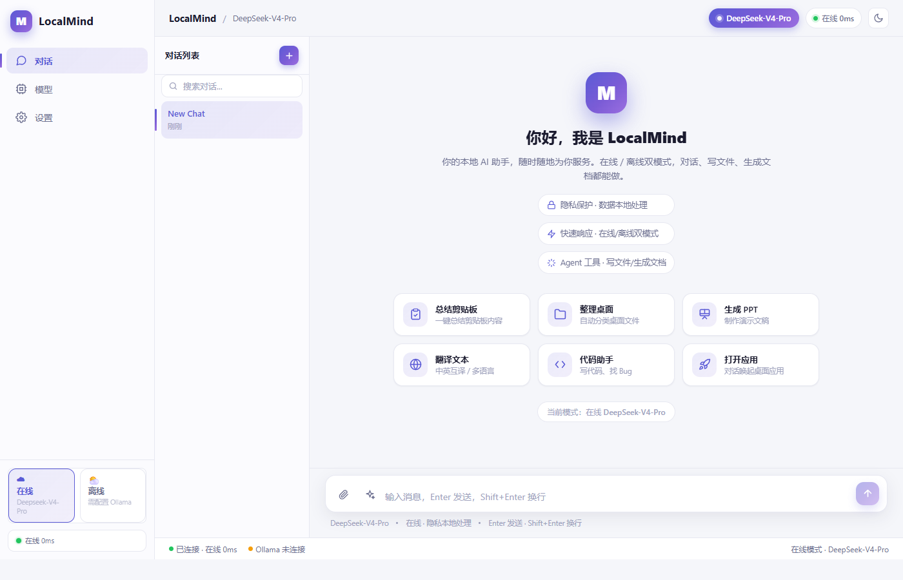
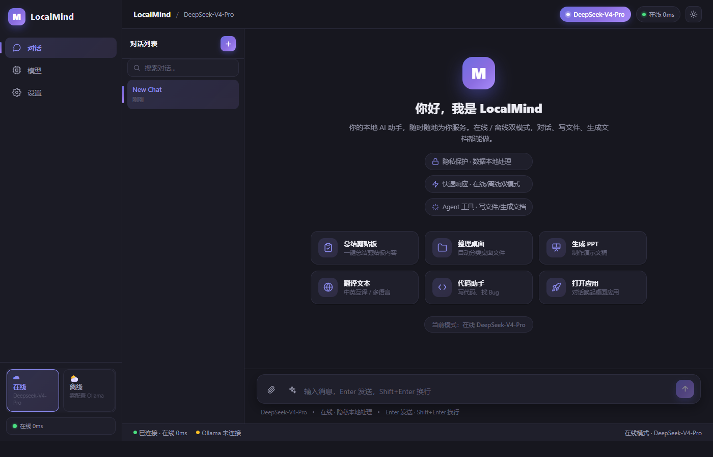

# LocalMind × LocalFile 双端 AI 智能工具

> 一台电脑 + 一部手机，随时随地可调用的个人 AI 助手——在线/离线双模、Agent 自动操作、隐私本地处理。

| 平台 | 定位 | 许可证 |
| --- | --- | --- |
| Windows 桌面 · Android 手机 | 对话、操作电脑、生成文档 | [MIT](LICENSE) |

## ✨ 界面预览

| 浅色主题 | 深色主题 |
| --- | --- |
|  |  |

---

## ✨ 功能特性

- **双端 Agent 循环**：不只是聊天，AI 能调用工具真正完成任务（写文件、读剪贴板、打开应用、生成文档）
- **7 个 Agent 工具**：`write_file` / `read_file` / `list_dir` / `move_file` / `open_app` / `read_clipboard` / `create_doc`
- **在线 / 离线双模**：在线用 DeepSeek 云端大模型；离线用 Ollama 本地推理，断网可用
- **四类文档生成**：PPT / Word / Excel / PDF（内置生成器，无需安装 Office / Python）
- **精美 GUI**：桌面端 Fluent 风（Tauri Web），手机端 Material 3（Jetpack Compose）
- **跨网络 Relay**：Android / Windows 只建立出站 WSS，经自建语义中继实现配对、幂等转发和离线队列，不要求用户安装 Tailscale
- **游客 / 账号双模式（规划中）**：游客无需账号即可本地使用；登录同一账号后用于设备登记和发现，手机控制电脑仍需目标设备本机确认

---

## 🧩 项目组成

| 组件 | 平台 | 技术栈 | 职责 |
| --- | --- | --- | --- |
| **LocalMind** | Windows | Tauri 2 + React + Rust + Python (Pydantic AI) | 桌面 AI 助手：在线/离线双模对话、Agent 工具循环（写文件/读剪贴板/打开应用/生成文档） |
| **LocalFile** | Android | Kotlin + Jetpack Compose + OkHttp | 手机 AI 助手：文件处理、文档生成（Word/PPT/Excel/PDF）、在线对话 |
| **LocalMind Relay** | 公网服务 | Rust + Axum + SQLite | 设备注册、配对码、WSS 转发、幂等、离线队列；不执行命令 |

---

## 🤖 Agent Harness（多步工具调用循环）

两个端都实现了真正的 Agent 循环——AI 不只是聊天，而是能**调用工具完成任务**。

### LocalMind（Pydantic AI）

Agent 循环下沉到 Python 子进程（`localmind/scripts/agent_server.py`），用 Pydantic AI 2.x 的 `run_stream_events()` 实现多步工具调用 + 失败自动重试：

```
[React 前端] --SSE--> http://127.0.0.1:<port>/agent/stream
     ▲                              │
     │ get_agent_config (IPC)       ▼
[Rust 后端] ---- spawn/kill ---> [Python Agent 服务]
                                  Pydantic AI Agent
                                  tools: 7 个工具
```

- **7 个工具**：写文件、读文件、列目录、移动/整理文件、打开应用、读剪贴板、生成文档
- **流式输出**：SSE 逐字返回，UI 实时显示思考轨迹（规划 → 执行 → 完成）
- **失败自动重试**：工具抛异常由框架喂回模型，自动修正重调

### LocalFile（手写 Agent 循环）

规划 → 工具调用 → 反思 的循环，生成四种文档格式。

---

## 🗂️ 目录结构

```text
LocalAITools/
├── localmind/          # Windows 桌面端（Tauri 2 + React + Rust + Python Agent）
│   ├── src/            # React 前端（TS/TSX）
│   ├── src-tauri/      # Rust 后端（IPC / 进程管理）
│   └── scripts/        # Python：agent_server.py（Pydantic AI Harness）、make_doc 文档生成器
├── localfile/          # Android 端（Kotlin + Jetpack Compose）
│   └── app/src/main/java/com/localmind/localfile/
│       ├── chat/       # 聊天 + Agent 循环
│       ├── files/      # 文档生成器（docx/pptx/xlsx/pdf）
│       └── common/     # 配置、网关、工具定义
├── relay-server/       # 自建公网语义中继（Rust + Axum + SQLite）
├── shared-contract/    # 双端共享契约定义
└── 开发计划/            # 架构设计文档（含调研、系统设计、安全设计等）
```

---

## 🚀 快速开始

### 前置要求

- **Node.js + pnpm**（LocalMind 前端）
- **Rust + Cargo**（LocalMind 后端）
- **Python 3.11+**（LocalMind Agent 服务，仅开发）
- **Android Studio / JDK 17**（LocalFile）
- **Ollama**（离线模式，可选）

### LocalMind（桌面端）

```bash
cd localmind
pnpm install
npm run tauri dev          # 开发模式
npm run tauri build        # 生产构建
```

DeepSeek key 通过环境变量传入：

```bash
export LOCALMIND_DEEPSEEK_KEY=sk-your-key
npm run tauri dev
```

### LocalFile（Android）

```bash
cd localfile
JAVA_HOME=/path/to/jdk ./gradlew :app:assembleDebug
```

API key 通过构建参数传入：

```bash
LOCAL_FILE_API_KEY=sk-your-key ./gradlew :app:assembleDebug
```

不传入 key 时构建出的 APK 使用占位符（聊天功能不可用）。

### LocalMind Relay（开发/部署）

```bash
cargo test --manifest-path relay-server/Cargo.toml
docker compose -f relay-server/docker-compose.yml up -d --build
```

部署细节见 `relay-server/deploy/README.md`。Relay 不执行命令、不保存 DeepSeek Key，也不持久化明文文件内容。

---

## 📦 发布产物

| 文件 | 平台 | 说明 |
| --- | --- | --- |
| `LocalMindSetup.exe` | Windows | LocalMind 安装包（NSIS，免安装 Python） |
| `LocalFile.apk` | Android | LocalFile 安装包 |

---

## 📚 文档

- [当前开发路线图](开发计划/开发路线图.md) — 当前唯一权威开发基线，固定阶段顺序、职责边界、安全红线和验收标准。
- [Relay-first ADR](开发计划/ADR-002-relay-first.md) — 同类项目调研、传输方案决策与安全边界。
- [账号与游客模式 ADR](开发计划/ADR-003-account-and-guest-mode.md) — 游客/账号双模式、设备授权、认证与远程控制边界。
- [历史架构设计](开发计划/) — 早期行业调研、高层架构、系统设计和用户故事；其中旧 RelayCloud、云端网关方案仅供历史参考。

---

## 📄 许可证

[MIT](LICENSE) © 2026 Skyworld

---

## ⚠️ 免责声明

本项目为学习用途，文档与说明基于当前代码状态编写，可能随开发演进。
