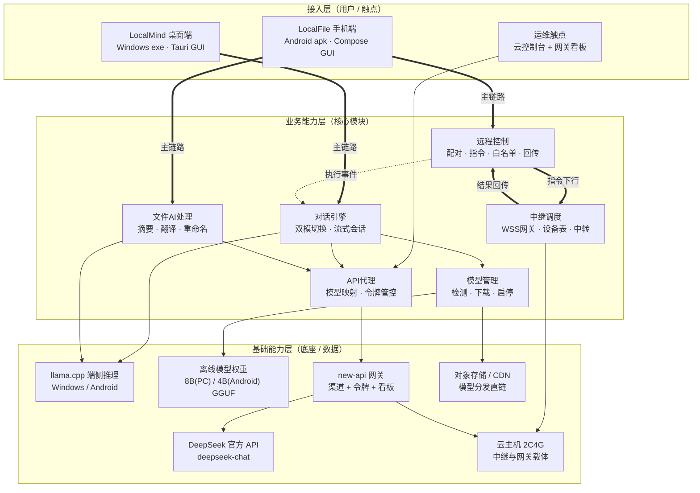
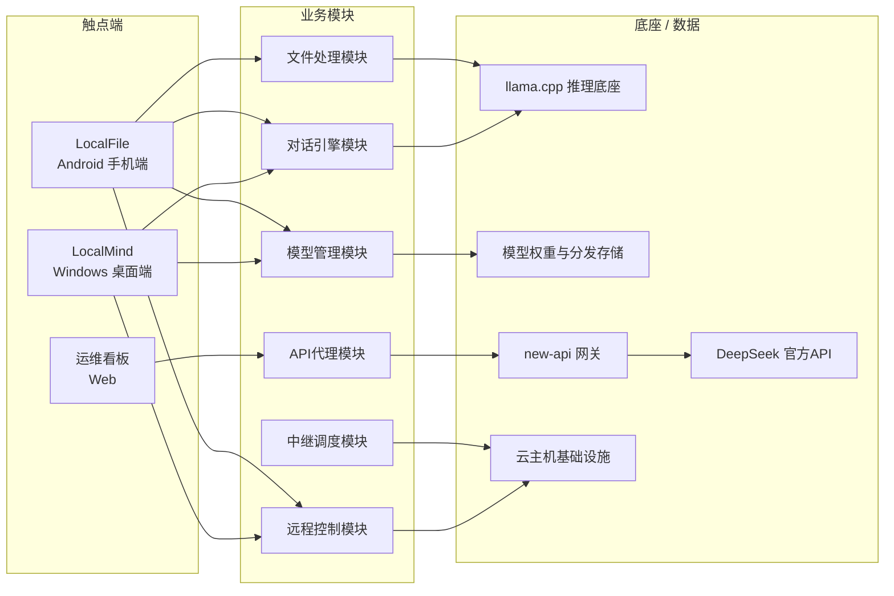

# AICoding 架构设计 · 高层架构设计

> 本文档为《AICoding 架构设计》核心产物之一，对应**高层架构设计模版**。
> 上游输入：业务原始诉求 + 行业调研结论（`.workbuddy/output/research_report.md`，G2 已冻结）；
> 下游输出：驱动《系统设计》《部署设计》《安全设计》《UserStory》四份文档的撰写。

---

## 0. 元信息：修订记录

```yaml
标题: LocalMind × LocalFile 双端协同智能工具 - 高层架构设计 v0.1
版本: v0.1
状态: Draft   # Draft | Reviewing | Approved | Deprecated
创建日期: 2026-07-20
最后更新: 2026-07-20
作者: business-architect（业务架构师 - 许边界）
评审人:
  - team-lead（主理人）
  - 用户（项目委托人，G3 人工审核）

关联文档:
  上游输入:
    - 业务原始诉求: 用户对话原文（Windows LocalMind 桌面助手 + Android LocalFile 文件处理/远程控制器 + 云端中继，在线/离线双模 AI，exe/apk 交付，精美 GUI，校级大学生项目）
    - 行业调研报告: .workbuddy/output/research_report.md（v0.1，G2 已冻结）
    - 现有架构知识库: 无（全新项目，无存量系统）
  下游产出:
    - 系统设计: delivery/AICoding架构设计-2-系统设计.md（Phase 4，system-architect）
    - 部署设计: delivery/AICoding架构设计-3-部署设计.md（Phase 5，platform-architect）
    - 安全设计: delivery/AICoding架构设计-4-安全设计.md（Phase 5，security-architect）
    - UserStory: delivery/AICoding架构设计-5-UserStory.md（Phase 4，product-story-designer）
```

| 版本 | 日期 | 作者 | 变更内容 | 评审状态 |
| --- | --- | --- | --- | --- |
| v0.1 | 2026-07-20 | business-architect（许边界） | 初稿 | Draft |

> **版本管理纪律**：破坏性变更（章节结构调整 / 关键决策反转）升 MAJOR；新增章节、扩充内容升 MINOR。

---

## 1. 需求概要

### 1.1 需求概要说明

本项目为校级大学生项目（课程作业/大创级别），无存量系统与存量用户，从零新建。触发事件为：用户需要一套"电脑做桌面 AI 助手、手机做文件处理器兼远程控制器"的双端协同智能工具，并要求 AI 能力在线（预置云端 API）与离线（端侧本地大模型）双模可用。LocalMind × LocalFile 双端协同智能工具用于解决"个人桌面 AI 助手能力可被手机随时调用、手机文件可被 AI 就地处理、断网环境 AI 不中断"的问题，服务于学生开发者本人及其小范围同学用户，覆盖 Windows 桌面 AI 对话/指令执行、Android 文件 AI 处理、手机远程操控电脑三大核心场景。本系统定位为"端侧优先、云端仅作中继与 API 代理"的轻量双端产品，云端不承载业务数据与重计算（与 §4.2 系统定位澄清呼应）。

### 1.2 关键决策摘要

| 编号 | 决策类别 | 决策内容 | 关联章节 |
| --- | --- | --- | --- |
| D1 | 范围决策 | 本期只覆盖"双端 + 一个轻量云端"三组件：LocalMind（Windows 桌面助手）、LocalFile（Android 文件处理 + 远程控制器）、云端中继与 API 网关；远程控制的画面实时回传（视频流）、多模型市场、账号体系与计费均不在本期范围内 | §6.1 需求边界 |
| D2 | 技术选型决策 | 核心能力采用组合方案：Tauri 2.x + React/TS（Windows 端）+ Kotlin + Jetpack Compose（Android 端）+ llama.cpp（双端共用的端侧推理引擎）+ WSS 云端中继（MVP）+ new-api 网关（隐藏真实 API key、模型名映射显示"Deepseek-V4-Pro"）〔建议，继承自调研报告 §4.3〕 | §3.2 / §4.2 |
| D3 | MVP / 完整版边界 | MVP 覆盖双端在线模式、双端离线模式（一键下载模型）、Android 文件处理基础能力、对话式远程控制最小集（配对 + 指令白名单 + 结果文本回传）、exe/apk 打包；完整版增加 WebRTC P2P 通道、多档模型推荐、桌面截图单帧回传、使用统计 | §4.3 |
| D4 | 复用 vs 新建 | 复用开源组件（llama.cpp MIT、new-api、开源模型权重）；业务应用层（双端 App、中继服务、配对与指令通道）全部新建；无既有企业底座可复用 | §2.4 / §5.2 |
| D5 | 部署形态 | 端侧优先 + 单台轻量云主机：Windows exe 与 Android apk 本地运行 AI 推理；云端仅部署中继服务 + new-api 网关 + 模型文件对象存储/CDN，单台 2C4G 入门云主机支撑 MVP〔假设：用户规模 ≤ 50 人小范围分发〕 | §4.2 / §5.2 |

**硬指标**：≥ 3 条，≤ 5 条；每条决策必须能映射到正文具体章节。✅（5 条，均已映射）

### 1.3 价值主张

| 价值维度 | 量化目标 | 度量指标 | 当前值 | 目标值 | 截止时间 |
| --- | --- | --- | --- | --- | --- |
| 效率 | 手机远程操控电脑执行桌面助手操作的端到端时延可控 | 指令发出到结果回传的端到端时延（WSS 中继链路，P95） | —（无系统） | ≤ 3 s（不含大模型生成耗时） | MVP 上线 |
| 效率 | 断网环境下 AI 对话仍可用且速度可读 | 离线模式端侧推理吞吐（基准设备：16GB 内存无独显 PC / 骁龙 8 系旗舰 Android） | 0 tok/s（断网即不可用） | PC ≥ 5 tok/s；Android ≥ 8 tok/s | MVP 上线 |
| 成本 | 云端月度运行成本控制在学生可负担范围 | 单台云主机 + 对象存储 + DeepSeek API 的月度账单（小范围分发 ≤ 50 用户） | — | ≤ 150 元/月 | MVP 上线后持续度量 |
| 成本 | 端侧推理引擎与模型零授权费 | 推理引擎与离线模型的许可证费用 | — | 0 元（仅使用 MIT/Apache-2.0 许可组件与模型） | MVP 上线 |
| 体验 | 双端核心路径操作步数收敛 | 从启动 App 到完成一次 AI 对话的操作步数；远程控制从打开 App 到首条指令送达的步数 | — | AI 对话 ≤ 3 步；远程控制（已配对）≤ 2 步 | MVP 上线 |

**硬指标**：业务价值 ≥ 2 条 + 技术/成本价值 ≥ 1 条；每条必须可量化，禁止出现"提升 / 优化 / 加强 / 更好"等模糊词。✅（效率 2 条 + 成本 2 条 + 体验 1 条，全部含量化指标）

---

## 2. 需求分析 & 痛点解构

### 2.1 核心角色关注点

| 角色 | 业务身份 | 主要操作 | Top1 角色关注点 | 来源 |
| --- | --- | --- | --- | --- |
| 甲方决策者：项目委托人（用户本人，学生开发者） | 产品 Owner / 开发者 | 定义需求、验收交付物、在课程/大创中演示 | 交付物完整可演示：双端可安装、三大场景可现场跑通，且有详尽开发文档支撑答辩 | 用户诉求原文"先根据以上需求编写开发文档，详细列出双端各功能模块及对应交互控件" |
| 最终用户 A：电脑端使用者（学生本人及同学） | Windows 桌面用户 | 与 LocalMind 对话、让助手执行桌面操作、离线下载模型 | 模型模式切换无感知且可信：在线/离线一键切换，断网时明确知道当前用的是本地模型且速度可接受 | 用户诉求原文"离线模式通过内置下载链接一键安装本地大模型实现断网可用" |
| 最终用户 B：手机端使用者（同一人群的移动场景） | Android 用户 | 用 LocalFile 处理文件、远程向电脑发指令 | 远程控制连接可靠、指令有明确反馈：发出的每条指令都能看到"已送达/已执行/执行结果"，失败有原因提示 | 用户诉求原文"提供对话式远程控制功能，可通过网络连接操控电脑端的 LocalMind 执行桌面助手操作" |
| 受影响方：云端中继/API 服务的运维承担者（学生本人兼任） | 兼职运维 | 部署中继与网关、查看服务是否存活、控制 API 开销 | 云端零运维负担与成本可预期：服务挂了能肉眼发现、API 账单不会失控（额度可封顶） | 调研报告 R-04（云端成本失控风险）+ U-03（单台 2C4G 入门云主机） |
| 受影响方：被控电脑的使用环境（同寝室/同实验室他人） | 被动受影响者 | 无主动操作（电脑被远程指令操作时的在场者） | 危险操作可被本机当场拦截：远程执行打开应用/文件操作前，本机屏幕上有可见确认或日志可查 | 调研报告 R-03（远控通道被滥用风险）+ D-01（指令白名单范围） |

**甲方决策者角色关注**：交付物完整可演示。**最终用户角色关注**：双端体验一致且可信。**受影响方角色关注**：成本可控、危险可拦截。

**硬指标**：≥ 3 类（甲方决策者 / 最终用户 / 受影响方各至少一行）；每行必须有"Top1 角色关注点"，禁止笼统写"使用方便"。✅（5 行，三类全覆盖）

### 2.2 核心痛点

| 编号 | 痛点描述 | 现象 / 数据 | 影响角色 | 影响程度 | 优先级 |
| --- | --- | --- | --- | --- | --- |
| P1 | 桌面 AI 助手断网即瘫：纯云端方案在无网/弱网环境（教室、实验室内网、外出热点）完全不可用 | 行业事实：主流云端 AI 助手断网可用率为 0%；端侧推理已被验证可行——7B 级模型 Q4 量化后约 4~5GB，手机端吞吐 6.8~14.2 tok/s（arXiv 2410.03613 实测，见调研报告 §2.3） | 最终用户 A/B | 高（核心卖点不成立） | P1 |
| P2 | 手机与电脑能力割裂：手机算力闲置时无法调度电脑，电脑上写了一半的内容无法用手机继续处理；跨端协作靠手动传文件 + 第三方远控（TeamViewer 等） | 第三方远控为屏幕级重量级方案，延迟 300~800ms（WebSocket 中继量级，调研报告 SR-19），且面向"看屏幕点鼠标"而非"对话式指令"；对称 NAT 下纯打洞失败率超 40%（SR-17/SR-19），无中继兜底不可用于课程演示 | 最终用户 B | 高（双端协同诉求落空） | P1 |
| P3 | 真实 API key 与模型名暴露：若客户端直连大模型 API，key 随安装包分发即泄露；且业务上要求对用户只显示"Deepseek-V4-Pro" | 分发即泄露为学生项目常见事故；DeepSeek 官方 API 按量计费（输入 2 元/百万 tokens 未命中、输出 8 元/百万 tokens，SR-27），key 泄露意味着账单无上限 | 甲方决策者 / 运维承担者 | 高（财产与合规风险） | P1 |
| P4 | 移动端离线推理机型碎片化：不同 SoC 吞吐差 2 倍以上，中低端机可能 OOM 或吐字过慢 | 实测：骁龙 8Gen2 / 麒麟 9000S / 天玑 9200+ 上 Llama2-7B Q4 吞吐 6.8~14.2 tok/s（SR-10）；Google 端侧 GenAI API 仅旗舰白名单（SR-11），反映行业对中低端机支持不足 | 最终用户 B | 中 | P2 |
| P5 | 学生项目无企业底座：无 SSO、无监控平台、无既有网关，全部需从零搭建但人力仅 1 个小团队 | 团队规模未确认，按校级项目 1~5 人估算〔假设〕；调研报告 U-04 指出若团队为前端背景需切换 Electron+RN 路线 | 甲方决策者 | 中 | P2 |

**优先级标准**：
- **P1**：直接影响业务核心流程或合规底线，不解决无法上线。
- **P2**：影响用户体验或运营效率，可在 MVP 后迭代。
- **P3**：体验型 / 长尾问题，列入完整版或后续版本。

**硬指标**：每条痛点必须有"现象 / 数据"佐证；P1 ≥ 1 条且必须在 §2.3 有对应目标。✅（P1 共 3 条：P1/P2/P3，均有数据佐证）

### 2.3 期待目标

| 编号 | 目标描述 | 对齐痛点 | 度量指标 | 当前值 | 目标值 | 截止时间 |
| --- | --- | --- | --- | --- | --- | --- |
| V1 | 断网环境下双端 AI 对话可用且可读 | P1 | 离线模式端侧推理吞吐（基准设备） | 0 tok/s | PC ≥ 5 tok/s；Android ≥ 8 tok/s；离线模型一键下载安装成功率 ≥ 95% | MVP 上线 |
| V2 | 手机经云端中继对话式操控电脑，链路稳定可演示 | P2 | 配对建立时长；指令端到端时延 P95；演示场景连接成功率 | — | 配对 ≤ 60 s；指令时延 ≤ 3 s（不含模型生成）；演示 10 次连接成功 ≥ 9 次 | MVP 上线 |
| V3 | 真实 API key 与账单零暴露 | P3 | 客户端安装包中可提取的 key 数量；网关侧令牌额度封顶覆盖率 | — | 0 个 key 入包；100% 令牌带额度与速率上限；单令牌月额度可配置 | MVP 上线 |
| V4 | 低端 Android 机离线模式可感知降级而非崩溃 | P4 | 下载前设备检测覆盖率；不达标机型的降级路径触达率 | — | 100% 下载前做 RAM/SoC 检测；不达标机型 100% 被引导至在线模式或更小模型档 | 完整版上线 |
| V5 | 双端安装包体积与启动速度达轻量级标准 | P5 | exe 安装包体积；apk 体积；双端冷启动时长 | — | exe ≤ 80MB（不含模型）；apk ≤ 60MB（不含模型）；冷启动 ≤ 3 s | MVP 上线 |

**硬指标**：每条目标必须**有数字 + 对齐至少 1 条痛点**；P1 痛点必须有对应 V 级目标。✅（P1→V1、P2→V2、P3→V3 全部对齐）

### 2.4 基线复用

本项目为全新校级项目，无企业内部存量底座。可复用基线全部为**开源组件与开源模型权重**（事实，来源见调研报告 §2.3/§4.1）：

| 复用类别 | 现有能力 | 复用方式 | 来源系统 | 备注 |
| --- | --- | --- | --- | --- |
| 核心底座：端侧推理引擎 | llama.cpp（GGUF，1.5~8bit 量化，Windows/Android 双端可编译，lib 嵌入 + llama-server 双形态） | 以库形式嵌入双端 App | 开源社区 ggerganov/llama.cpp | MIT 许可；被 Jan/LM Studio/PocketPal 共同验证（SR-08、SR-05） |
| 核心底座：离线模型权重 | DeepSeek-R1-0528-Qwen3-8B Q4_K_M（约 5.21GB，Windows 默认）；Qwen3-4B / R1-Distill-Qwen-7B Q4（约 4GB，Android 默认） | 打包下载链接 + 应用内一键下载 | HuggingFace 镜像 / ModelScope / 自建对象存储 | MIT / Apache-2.0 许可，允许再分发（SR-20、SR-21、SR-23）；应用内需附许可文本（对应 R-02） |
| 云端 API 网关 | new-api（one-api 系）：多渠道 key 管理、模型映射、令牌额度/速率控制、Docker 一键部署 | Docker 直接部署 + 配置模型映射（显示名 Deepseek-V4-Pro → deepseek-chat） | 开源项目 QuantumNous/new-api | 模型映射能力恰好覆盖"隐藏 key + 品牌化显示名"（SR-25、SR-26） |
| 在线模型供应 | DeepSeek 官方 API（deepseek-chat） | 网关渠道配置 | DeepSeek 官方 | 输入 2 元/百万 tokens、输出 8 元/百万 tokens；错峰 00:30-08:30 五折（SR-27、SR-28） |
| 远程通道架构模式 | RustDesk hbbs/hbbr 模式：信令配对 + 打洞优先 + 中继兜底 + E2E 加密中继零信任 | **仅借鉴架构思想，不引入代码** | 开源项目 RustDesk | AGPL-3.0 与闭源分发冲突，必须重写（SR-06、SR-07） |
| 监控告警 | 无企业级 APM；采用云主机自带监控 + 网关内置数据看板 | 直接使用 | 云厂商控制台 + new-api 看板 | 校级项目量级足够，不引入 Prometheus 体系 |

**硬指标**：必须先盘点再决定新建；凡列入"功能缺口"的能力，必须先在本节确认基线无法覆盖。✅（§2.5 全部缺口均不在本表复用范围内）

### 2.5 功能缺口

分组维度：**双端协同主链路（连接前 / 连接中 / 连接后 / 运营）**。

| 阶段 | 功能缺口 | 必要性 | 优先级 | 对齐目标 |
| --- | --- | --- | --- | --- |
| 连接前（双端各自能力建设） | LocalMind 对话引擎：在线/离线双模切换、会话管理、流式输出 | 必须 | MVP | V1 |
| 连接前 | LocalMind 模型管理：模型一键下载（断点续传 + 校验）、模式切换开关、本地推理启停 | 必须 | MVP | V1 |
| 连接前 | LocalFile 文件处理：SAF 文件浏览/选择、文件摘要/翻译/重命名建议等 AI 处理、处理结果导出 | 必须 | MVP | V1 |
| 连接前 | LocalFile 模型管理：设备检测 + 模型下载 + 端侧推理 | 必须 | MVP（跟随 LocalMind 离线模式后半个迭代，调研建议 R4） | V1、V4 |
| 连接中（双端协同链路） | 云端中继服务：WSS 长连接网关、设备在线状态、指令中转 | 必须 | MVP | V2 |
| 连接中 | 设备配对：配对码/扫码配对、配对码短时有效、设备绑定关系存储 | 必须 | MVP | V2、V3 |
| 连接中 | 远程指令通道：对话式指令解析、指令白名单执行器、危险操作本机二次确认、执行结果回传 | 必须 | MVP | V2、V3 |
| 连接中 | 预置 API 代理链路：客户端 → new-api 网关 → DeepSeek，令牌按设备/用户分发 | 必须 | MVP | V3 |
| 连接后（结果与反馈） | 远程执行结果回传（文本 + 状态）；完整版增加桌面截图单帧回传 | 重要 | MVP 文本回传 / 完整版截图 | V2 |
| 运营 | 云端用量看板（令牌额度、API 调用量、中继在线设备数） | 重要 | MVP（new-api 原生看板即可） | V3 |
| 运营 | 多档模型推荐（按设备 RAM/SoC 自动推荐 1.5B/3B/4B/7B） | 重要 | 完整版 | V4 |
| 运营 | WebRTC DataChannel P2P 通道（卸载中继带宽、降低时延） | 可选 | 完整版 | V2 |

**硬指标**：每条缺口必须对齐 §2.3 至少一条目标；MVP 缺口必须在 §6.3 功能清单中对应有 MVP 范围标记。✅（全部对齐，§6.3 逐一映射 F1~F14）

---

## 3. 行业调研

### 3.1 行业标杆系统分析

以下标杆清单直接继承调研报告 §2.1（事实，B1~B5 全覆盖）：

| 标杆系统 | 厂商 / 来源 | 场景覆盖 | 技术亮点 | 商业模式 | 适用度 |
| --- | --- | --- | --- | --- | --- |
| B1 LM Studio | LM Studio（美国，闭源） | 桌面端本地 LLM 运行、模型浏览下载、OpenAI 兼容 API、MCP、文档 RAG | 内置 HuggingFace 模型搜索下载；llama.cpp/MLX 双运行时；LM Link 跨设备路由 | 免费闭源（个人免费，商用需授权） | 低（仅产品形态参照） |
| B2 Layla | Layla Network（澳大利亚，闭源） | 手机端完全离线 AI 助手：离线聊天、角色卡、图片生成 | 7B 模型手机离线运行（约 4GB 文件）；官网直发 APK；周更 | 免费试用 + 一次性买断 | 低（仅市场佐证） |
| B3 Jan | Menlo Research（开源社区） | 开源桌面 ChatGPT 替代品：本地模型 + 云端模型接入、自定义助手、本地 API | Tauri + React/TS；底层 llama.cpp；本地 OpenAI 兼容 API（localhost:1337）；100% 离线可用 | 开源免费（Apache-2.0） | 高 |
| B4 PocketPal AI | a-ghorbani（开源个人项目） | 手机端本地私有 AI：GGUF 离线聊天、角色、设备端 TTS、基准测速 | React Native + llama.rn（JSI 桥接）；应用内 HF 模型下载；CPU→GPU(OpenCL)→NPU(Hexagon) 加速降级链 | 开源免费（MIT） | 中 |
| B5 RustDesk | RustDesk 开源社区 | 跨平台远程桌面：P2P 直连 + 中继兜底、无人值守、文件传输 | hbbs（信令）+ hbbr（中继）双组件自建；NaCl E2E 加密中继零信任；TCP 打洞优先 | 开源（AGPL-3.0）+ Server Pro 商业授权 | 中（仅架构模式借鉴） |

**硬指标**：≥ 3 家；至少包含 1 家头部 SaaS + 1 家开源/自研代表。✅（5 家；头部商业代表 B1 桌面端 + B2 移动端——本项目品类为"本地优先 AI 工具"，头部形态为商业闭源端侧应用而非云端 SaaS；开源代表 B3/B4/B5 共 3 家）

### 3.2 方案对标及优先级打分

以下对比矩阵直接继承调研报告 §3.1（评分对象为"各标杆作为本项目架构参照的适配度"）：

| 评估维度 | 权重 | B1 LM Studio | B2 Layla | B3 Jan | B4 PocketPal | B5 RustDesk |
| --- | --- | --- | --- | --- | --- | --- |
| 场景契合度 | 0.30 | 3 | 3 | 4 | 3 | 3 |
| 技术成熟度 | 0.20 | 5 | 4 | 4 | 3 | 5 |
| 集成难度（反向） | 0.15 | 3 | 2 | 5 | 4 | 4 |
| 成本（反向） | 0.15 | 4 | 4 | 5 | 5 | 4 |
| 合规可控性 | 0.20 | 2 | 2 | 5 | 5 | 3 |
| **加权总分** | **1.00** | **3.30** | **2.95** | **4.45** | **3.90** | **3.75** |

**结论摘要**（继承调研报告 §3.2，本报告予以采纳）：
- **优先借鉴**：B3 Jan（4.45）—— 理由：与 LocalMind 技术需求几乎同构（Tauri 桌面栈 + llama.cpp + 本地/云端双模 + OpenAI 兼容 API），Apache-2.0 可代码级借鉴；缺失的 Android 端与远程通道由 B4/B5 补齐。
- **部分借鉴**：B4 PocketPal AI（3.90）—— 借鉴点：Android 端 llama.cpp 桥接工程、应用内模型下载 UX、量化版本选择引导、硬件加速降级链、端侧基准测速页。
- **部分借鉴**：B5 RustDesk（3.75）—— 借鉴点：信令配对 + 打洞优先 + 中继兜底 + E2E 加密的通道架构模式；不引入其代码（AGPL-3.0）。
- **不借鉴**：B2 Layla（2.95）—— 否决理由：闭源且无开放接口，除"7B 模型 4GB 手机离线可行"的市场佐证外无工程参照价值。
- **不借鉴**：B1 LM Studio（3.30）—— 否决理由：闭源（合规 2/5），其桌面形态已被开源的 B3 Jan 同构覆盖。

### 3.3 完整报告参考

- 完整报告路径：`D:\code\LocalAITools-1\.workbuddy\output\research_report.md`（v0.1，2026-07-20，G2 已冻结，约 427 行，含 28 条来源 URL）
- 调研工具：`tech-research-advisor`（见附录 B）
- 调研日期：2026-07-20
- 调研归档：同上路径（`.workbuddy/output/research_report.md`）

---

## 4. 方案决策

### 4.1 价值定位澄清

**定位三段式**：

```
对外价值（用户侧）: 一台电脑 + 一部手机即可获得"随时随地可调用的个人 AI 助手"——断网可用（端侧推理 ≥5/≥8 tok/s）、跨端可控（手机对话式操控电脑，指令时延 P95 ≤ 3s）、隐私可守（文件与对话可全程不出设备）。
对内价值（项目侧）: 全链路组件开源可控（推理引擎/网关/模型均 MIT 或 Apache-2.0），云端成本可封顶（令牌额度 + 单台 2C4G 云主机，月账单 ≤ 150 元），技术栈与交付文档可直接支撑课程答辩与大创验收。
差异化价值        : 相对 LM Studio / Jan（仅桌面、无手机遥控）与 Layla / PocketPal（仅手机、无桌面协同），本项目是唯一"双端互为延伸 + 对话式远程控制"的端侧优先方案；相对 TeamViewer/RustDesk 式屏幕远控，指令通道数据量小 2~3 个数量级（文本指令 vs 视频流），单台入门云主机即可承载。
```

**与产品矩阵的关系**：本系统为独立双端产品，无企业产品矩阵上下文；在用户个人的"设备价值主线"中承担**AI 能力调度中枢**职责——LocalMind 是桌面侧的 AI 执行体，LocalFile 是移动侧的 AI 入口与遥控器，云端中继是二者唯一的会师点，三者形成完整业务闭环（见 §5.2、§5.3）。

### 4.2 系统定位澄清

| 维度 | 内容 |
| --- | --- |
| 系统名称 | LocalMind × LocalFile 双端协同智能工具（三组件标准名：**LocalMind**＝Windows 桌面 AI 助手；**LocalFile**＝Android 文件处理 + 远程控制器；**RelayCloud**＝云端中继与 API 网关） |
| 系统类型 | 新建（无存量系统） |
| 部署形态 | 混合：端侧本地部署（exe/apk + 端侧推理）+ 轻量公有云（单台 2C4G 云主机，中继 + 网关 + 对象存储）〔假设：境内 Region，见调研报告 U-03〕 |
| 多租户 | 否（单用户/小范围分发，设备即身份；按配对关系隔离，不做租户体系） |
| 服务对象 | §2.1 全部角色：项目委托人（甲方决策者）、电脑端使用者、手机端使用者、兼职运维者 |
| 上游依赖 | DeepSeek 官方 API（在线模型供应）；HuggingFace/ModelScope（模型权重源，经自建对象存储中转）；云厂商 VPS 与对象存储（基础设施） |
| 下游消费者 | 无下游业务系统；产品形态为终态交付（exe/apk 直接交付最终用户） |
| 边界（不做） | ① 不做屏幕视频流远程桌面（仅对话式指令通道 + 文本/单帧截图回传，调研建议 R8）；② 不做多模型市场/角色社区（MVP 预置 1~2 个模型，调研建议 R9）；③ 不做账号计费体系（无注册付费，设备配对即身份）；④ 不做 iOS/macOS/Linux 客户端；⑤ 不做企业级多租户与权限体系 |

### 4.3 MVP 与完整版决策

| 阶段 | 时间窗 | 范围（功能编号） | 架构差异点 | 退出标准 | 不做（延后） |
| --- | --- | --- | --- | --- | --- |
| MVP | W1 ~ W10〔假设：校级项目单学期节奏，1~5 人团队〕 | F1~F12 + D-1（F1~F11 为 P0，F12 为 P1；D-1 为打包交付） | 单台云主机单实例；纯 WSS 中继（无 P2P）；预置单一模型档（PC 8B / Android 4B）；Android 离线模式跟随 PC 离线模式后半个迭代交付 | 三大演示场景跑通：①PC 在线+离线对话；②手机文件 AI 处理；③手机远程操控电脑执行 ≥5 类白名单指令；双端安装包可现场安装；V1/V2/V3/V5 指标达标 | F13~F14 |
| 完整版 | W11 ~ W16 | + F12~F14（P1/P2） | 增加 WebRTC DataChannel P2P 通道（STUN/TURN，中继兜底）；多档模型按设备推荐；桌面截图单帧回传；用量统计看板增强 | V4 指标达标；中继带宽成本下降或可解释；连续 2 周小范围（≤50 人）使用无 P0 级缺陷 | — |

**演进纪律**（重要）：
- ✅ MVP 的架构骨架必须是完整版的**子集**：WSS 中继通道在完整版中保留为兜底路径（打洞失败时回落中继，与 RustDesk 模式一致），不推倒重来。
- ✅ MVP 中可简化的能力：远程指令仅以 JSON 文本信封传输（完整版复用同一信封格式叠加 E2E 加密层）；模型源 MVP 用单一直链（完整版加镜像多源）。替换计划已在上表"架构差异点"列明。
- ❌ 禁止：MVP 为了赶工而引入"完整版无法继承"的临时架构（实例—禁止 MVP 用 HTTP 轮询替代 WSS 长连接，否则完整版通道层需重写）。

---

## 5. 业务架构设计

### 5.1 业务架构图

三层业务架构（接入层 → 业务能力层 → 基础能力层）。实线 = 同步调用，虚线 = 异步事件，加粗线 = 主链路。



> PNG/SVG 渲染版见 `.workbuddy/output/pic/business-architecture/`（由 diagrams-generator 生成；Mermaid 为权威源，PNG 为演示辅助）。

### 5.2 系统依赖架构

| 依赖类型 | 系统 / 模块 | 提供方 | 依赖能力 | 接入方式 | 同步/异步 | 关键约束 |
| --- | --- | --- | --- | --- | --- | --- |
| 上游 | DeepSeek 官方 API（deepseek-chat） | DeepSeek | 在线大模型对话 | HTTPS / REST（OpenAI 兼容） | 同步（SSE 流式） | 经 new-api 中转；输入 2 元/百万 tokens；客户端零接触真实 key |
| 上游 | 模型权重源（HF 镜像 / ModelScope） | 开源模型社区 | GGUF 模型文件 | HTTPS | 同步（下载） | 不直连客户端；先同步至自建对象存储再对客户端分发（对应 R-05） |
| 上游 | 云厂商 VPS + 对象存储 | 云厂商（境内 Region）〔假设〕 | 中继与网关运行载体、模型 CDN | 控制台 / API | — | 单台 2C4G；对象存储设防盗链与下载次数限制（对应 R-04） |
| 下游 | 无下游业务系统 | — | — | — | — | 产品为终态交付，exe/apk 直接面向最终用户 |
| 复用底座 | llama.cpp（库嵌入） | 开源社区（MIT） | 端侧 LLM 推理 | 本地库调用（FFI/JNI） | 同步 | Q4_K_M 量化；PC 目标 ≥5 tok/s、Android ≥8 tok/s |
| 复用底座 | new-api 网关 | 开源项目（Docker 部署） | API key 隐藏、模型映射、令牌额度/速率 | HTTPS / REST | 同步 | 模型映射"Deepseek-V4-Pro"→deepseek-chat；100% 令牌带额度上限 |
| 数据订阅 | 网关用量数据（tokens/账单） | new-api 内置看板 | 运营用量统计 | Web 看板 | 异步（准实时） | 运维者每周人工巡检，无自动报表 |

**硬指标**：
- 每条依赖必须明确"接入方式 + 同步/异步 + 关键约束"，禁止只写"调用 API"。✅
- 所有 P1 痛点对应的核心能力，必须能在本表中找到依赖来源（自建/复用/采购）。✅（P1 离线→llama.cpp+模型权重复用；P2 远控→中继服务自建（见 §5.1 M5）；P3 key 隐藏→new-api 复用）

### 5.3 业务闭环

**业务主链路**（端到端，以"手机远程让电脑总结一份文档"为贯穿实例—）：

```
触发（手机端发起指令/或电脑端直接对话）
→ 环节1 接入与鉴权（设备配对校验 / 令牌校验 / 在线离线模式判定）
→ 环节2 执行（在线走网关调 DeepSeek / 离线走 llama.cpp 本地推理 / 远程指令走中继到 LocalMind 白名单执行器）
→ 环节3 交付（流式结果回显 / 文件处理结果导出 / 执行结果文本回传手机）
→ 环节4 复盘（危险操作本机留痕、网关用量入看板、失败指令原因提示）
→ 反馈回路（用量与体验数据驱动模型档位与通道策略调整）
```

**关键反馈回路**：

| 回路 | 触发点 | 反馈对象 | 反馈机制 | 价值 |
| --- | --- | --- | --- | --- |
| 业务效果回路 | 每次远程指令执行完结 | 指令白名单与确认策略 | 执行日志本机留痕 + 周度人工回顾 | 收敛白名单范围，防止误操作（对应 R-03/D-01） |
| 运营监控回路 | 网关令牌额度消耗 ≥ 80% / 中继在线设备异常掉线 | 兼职运维者 | new-api 看板 + 云控制台告警（人工巡检，周频） | 防止账单失控（对应 R-04/V3） |
| 模型迭代回路 | 用户端侧推理实测速度反馈（测速页数据） | 模型档位配置 | 完整版按设备画像调整默认推荐档位（4B/7B/8B） | 让低端机获得可用体验（对应 R-01/V4） |

**运营主线**：每日——运维者看一眼云控制台服务存活与中继在线设备数；每周——核查 new-api 用量看板（tokens 消耗、账单预估）、回顾远程指令执行日志；每月——核对云主机 + 对象存储 + API 三项账单合计是否 ≤ 150 元，超阈值则收紧令牌额度或引导错峰（DeepSeek 00:30-08:30 五折，SR-28）。

---

## 6. 产品需求及原型

### 6.1 需求边界

**In-Scope**（本期必做，F = 功能，N = 非功能）：

```
F1.  LocalMind 在线对话（经网关调云端模型，流式输出，仅显示"Deepseek-V4-Pro"）
F2.  LocalMind 离线对话（llama.cpp 本地推理，断网可用）
F3.  LocalMind 模型管理（一键下载、断点续传、校验、模式切换、本地推理启停）
F4.  LocalMind 桌面助手指令执行（打开应用/文件操作等白名单动作 + 二次确认）
F5.  LocalFile 文件处理（SAF 浏览选择 + 摘要/翻译/重命名建议 + 结果导出/分享）
F6.  LocalFile 在线对话（同 F1 链路）
F7.  LocalFile 离线对话与模型管理（含设备 RAM/SoC 检测）
F8.  远程控制：设备配对（配对码 + 短时有效 + 设备绑定）
F9.  远程控制：对话式指令通道（WSS 中继 + 指令白名单 + 执行结果文本回传）
F10. RelayCloud 中继服务（WSS 网关 + 设备在线状态 + 指令中转）
F11. RelayCloud API 网关（new-api 部署 + 模型映射 + 令牌额度管控）
D-1. 双端打包交付（exe 安装包 + apk 安装包，含 WebView2 引导）
N1.  非功能：双端安装包体积与冷启动达标（exe ≤80MB、apk ≤60MB、冷启动 ≤3s，均不含模型）
N2.  非功能：远程指令端到端时延 P95 ≤3s（不含模型生成耗时）；配对建立 ≤60s
```

**Out-of-Scope**（本期不做，必须列原因）：

| 编号 | 不做的事 | 原因 | 后续计划 |
| --- | --- | --- | --- |
| O1 | 远程控制的桌面画面实时回传（视频流） | 进入屏幕采集/编码传输领域（RustDesk 级工程量），与"对话式控制"诉求不符；调研建议 R8 明确不做 | 完整版仅做截图单帧回传；视频流不做 |
| O2 | 多模型市场 / 角色社区 / 模型 PK 测速排行榜 | 依赖内容运营，超出校级项目边界；MVP 预置 1~2 个模型即可（调研建议 R9） | 完整版仅做多档模型推荐，社区化不做 |
| O3 | 用户账号体系、注册登录、付费计费 | 非商业化项目，设备配对即身份；引入账号体系会放大合规面（个人信息保护） | 不做 |
| O4 | iOS / macOS / Linux 客户端 | 用户诉求明确限定 Windows + Android 双端 | 不做 |
| O5 | 生成式 AI 服务备案与企业级合规审计 | 小范围私有分发（≤50 人），不构成向公众提供服务（调研 U-05 默认路径）；若未来上架公开渠道需重新评估 | 待业务确认（上架前必须重启评估） |
| O6 | WebRTC P2P 打洞通道 | MVP 阶段纯 WSS 中继已满足时延指标（≤3s），打洞增加 NAT 类型适配工作量 | 完整版（F14） |

Out-of-Scope 边界共 6 条（O1~O6），覆盖功能裁剪、平台边界、合规边界与通道演进四类，每条均含原因与后续计划。

Out-of-Scope 分类汇总（按裁剪性质分组）：

| Out-of-Scope 类别 | 命中条目 | 裁剪性质 |
| --- | --- | --- |
| Out-of-Scope · 功能裁剪 | O1 画面视频流回传 / O2 模型市场与角色社区 / O6 WebRTC P2P 打洞 | 工程量或运营门槛超出校级项目边界，完整版按条目回接 |
| Out-of-Scope · 平台与账号边界 | O3 账号计费体系 / O4 iOS·macOS·Linux 客户端 | 用户原文显式限定双端 + 非商业化定位，长期不做 |
| Out-of-Scope · 合规边界 | O5 生成式 AI 服务备案与企业级审计 | 小范围私有分发暂缓，上架公开渠道前必须重启评估 |

**硬指标**：In-Scope ≤ 15 条；Out-of-Scope ≥ 3 条。✅（In-Scope 14 条、Out-of-Scope 6 条）

### 6.2 产品模块全景图



> PNG/SVG 渲染版见 `.workbuddy/output/pic/module-panorama/`（由 diagrams-generator 生成；Mermaid 为权威源，PNG 为演示辅助）。

**模块卡片**：

| 模块名称 | 一级归属 | 责任团队 | 上游 | 下游 | MVP 是否包含 |
| 对话引擎模块 | 业务能力层 | 双端开发组（同一人兼顾，校级项目）〔假设：团队结构〕 | llama.cpp 推理底座、API代理模块 | LocalMind/LocalFile GUI | 是 |
| 模型管理模块 | 业务能力层 | 双端开发组 | 模型权重与分发存储 | 对话引擎模块 | 是 |
| 文件处理模块 | 业务能力层 | Android 开发 | 对话引擎模块、SAF 系统能力 | LocalFile GUI、系统分享 | 是 |
| 远程控制模块 | 业务能力层 | 双端开发组 | 中继调度模块、对话引擎模块 | LocalMind 执行器、LocalFile 控制面 | 是 |
| 中继调度模块 | 业务能力层 | 云端开发 | 云主机基础设施 | 远程控制模块 | 是 |
| API代理模块 | 业务能力层 | 云端开发 | new-api 网关、DeepSeek 官方 API | 对话引擎模块（双端） | 是 |
| llama.cpp 推理底座 | 基础能力层 | 复用开源（MIT） | — | 对话引擎模块、文件处理模块 | 是 |
| 模型权重与分发存储 | 基础能力层 | 云端开发（对象存储运维） | 开源模型社区 | 模型管理模块 | 是 |
| new-api 网关 | 基础能力层 | 复用开源（Docker 部署） | DeepSeek 官方 API | API代理模块、运维看板 | 是 |

### 6.3 功能清单

| 编号 | 一级模块 | 二级功能 | 功能描述 | 优先级 | MVP 范围 | 完整版范围 | 对齐目标 |
| --- | --- | --- | --- | --- | --- | --- | --- |
| F1 | 对话引擎 | 在线对话 | 经网关调云端模型，SSE 流式渲染，仅显示"Deepseek-V4-Pro"；支持多会话与历史记录 | P0 | ✅ | ✅ | V1、V3 |
| F2 | 对话引擎 | 离线对话 | llama.cpp 本地推理对话，断网可用；速度指示（tok/s 实时显示） | P0 | ✅ | ✅ | V1 |
| F3 | 模型管理 | 模型一键下载与切换 | 内置下载链接、断点续传、SHA256 校验、下载进度可视；在线/离线一键切换；本地推理服务启停 | P0 | ✅ | ✅ | V1、V5 |
| F4 | 远程控制 | 桌面助手指令执行器 | LocalMind 侧白名单动作执行（打开应用、打开/保存文件、朗读剪贴板、系统音量/亮度、执行已确认的对话任务）；危险动作本机弹窗二次确认；执行日志留痕 | P0 | ✅ | ✅ | V2、V3 |
| F5 | 文件处理 | 文件浏览与选择 | SAF 标准文件浏览（文档/图片/文本），最近文件列表，多选 | P0 | ✅ | ✅ | V1 |
| F6 | 文件处理 | 文件 AI 处理 | 文档摘要、翻译（中英互译）、批量重命名建议；处理结果可导出/分享/复制 | P0 | ✅ | ✅ | V1 |
| F7 | 对话引擎 | LocalFile 在线对话 | 同 F1 链路的手机端对话页 | P0 | ✅ | ✅ | V1 |
| F8 | 模型管理 | LocalFile 离线对话与模型管理 | 设备 RAM/SoC 检测 → 匹配/拦截模型下载 → 端侧推理对话；不达标机型引导在线模式 | P0 | ✅ | ✅ | V1、V4 |
| F9 | 远程控制 | 设备配对 | 电脑端生成 6 位配对码（5 分钟有效）+ 二维码；手机端输码/扫码绑定；设备列表管理（解绑、重命名） | P0 | ✅ | ✅ | V2 |
| F10 | 远程控制 | 对话式指令通道 | 手机端以自然语言/快捷指令向电脑发指令；WSS 中继传输；指令状态机（已发送/已送达/执行中/已完成/失败+原因）；结果文本回传 | P0 | ✅ | ✅ | V2 |
| F11 | 中继调度 | RelayCloud 中继服务 | WSS 长连接网关、设备在线状态表、配对码签发与校验、指令路由中转；单实例部署 | P0 | ✅ | ✅ | V2、V3 |
| F12 | API代理 | 网关配置与令牌管控 | new-api 部署；模型映射 Deepseek-V4-Pro→deepseek-chat；按设备签发令牌（额度+速率上限）；用量看板 | P1 | ✅ | ✅ | V3 |
| F13 | 模型管理 | 多档模型智能推荐 | 按设备画像推荐 1.5B/3B/4B/7B/8B 档位；端侧基准测速页（借鉴 PocketPal） | P1 | ❌ | ✅ | V4 |
| F14 | 远程控制 | P2P 通道与截图回传 | WebRTC DataChannel（STUN/TURN，中继兜底）；远程执行后桌面截图单帧回传 | P2 | ❌ | ✅ | V2 |

**硬指标**：
- 每个 P0 功能必须在 MVP 范围内为 ✅。✅（F1~F11 全部 P0 且 MVP ✅）
- 每个功能必须能反向映射到 §2.5 功能缺口 + §2.3 期待目标。✅

### 6.4 产品原型 - LocalMind（Windows 桌面端）

**核心页面清单**：

| 页面 | 用途 | 关键交互 | MVP |
| --- | --- | --- | --- |
| P-W1 主对话页 | AI 对话主界面（在线/离线共用） | 流式对话、模式切换、会话管理 | ✅ |
| P-W2 模型管理页 | 离线模型下载与推理服务管理 | 一键下载、进度可视、模式开关 | ✅ |
| P-W3 远程控制面板页 | 配对码展示、已配对设备、指令执行记录 | 生成配对码、设备解绑、确认弹窗 | ✅ |
| P-W4 设置页 | 网络、外观、关于与许可 | 网关连通自检、主题切换、许可展示 | ✅ |

**页面级交互控件清单**（用户核心诉求：逐页面列出按钮、输入框等控件）：

**P-W1 主对话页**
- 顶部栏：应用 Logo 与名称；`模型模式切换器`（分段控件：☁ 在线 Deepseek-V4-Pro / ⛅ 离线 本地模型，当前态高亮）；`连接状态指示灯`（绿=在线已连通 / 黄=离线模式 / 红=网关异常，悬停显示详情）
- 左侧会话栏：`+ 新对话`按钮；会话列表（标题 + 时间，支持重命名/删除右键菜单）；`搜索会话`输入框
- 中部对话区：消息气泡列表（用户右/AI 左，AI 消息带模型名小字标注"Deepseek-V4-Pro"或"本地模型"）；流式打字机渲染；`停止生成`按钮（生成中显示）；代码块`复制`按钮；`重新生成`按钮
- 底部输入区：`消息输入框`（多行，Enter 发送 / Shift+Enter 换行）；`发送`按钮；`快捷指令`按钮（展开预设指令面板：总结剪贴板/打开应用/整理桌面文件等）；离线模式下显示`当前速度: x.x tok/s`小字
- 状态栏：当前模型名、内存占用（离线模式）、网关延迟（在线模式）

**P-W2 模型管理页**
- `当前模式`卡片：在线/离线单选切换 + 状态说明文案
- 离线模型卡片：模型名（DeepSeek-R1-0528-Qwen3-8B Q4_K_M）、文件大小 5.2GB、许可标识（MIT）；`一键下载`按钮（未下载时）；下载中变为`进度条 + 百分比 + 剩余时间 + 暂停/继续 + 取消`按钮组；已下载显示`校验通过 ✓`与`删除模型`按钮
- 推理服务卡片：`启动本地推理`/`停止`按钮；服务状态（运行中/已停止 + 端口）；`推理参数`折叠面板（线程数滑块、上下文长度下拉框 2048/4096/8192）
- `存储位置`行：模型目录路径 + `更改`按钮 + `打开文件夹`按钮

**P-W3 远程控制面板页**
- 配对卡片：`生成配对码`按钮；6 位大字号配对码 + 二维码 + 倒计时（5:00）；`复制配对码`按钮
- 已配对设备列表：设备名、机型、最近在线时间；`重命名`与`解绑`按钮
- 指令执行记录列表：时间、来源设备、指令内容、状态（成功/失败/被拦截）；`清空记录`按钮
- 安全设置：`远程控制总开关`（关闭即断开中继）；`危险操作需本机确认`开关（默认开）；白名单动作勾选项列表（打开应用/文件操作/系统设置/对话任务）
- 二次确认弹窗（被远程触发时本机弹出）：指令内容大字展示 + `允许执行`/`拒绝`按钮 + 15 秒倒计时默认拒绝

**P-W4 设置页**
- 网络设置：网关地址（只读显示，预置）；`测试连接`按钮 + 延迟显示
- 外观：浅色/深色/跟随系统单选；字号滑块
- 关于：版本号、模型许可文本入口、`查看开源许可`按钮、检查更新按钮

**关键交互约束**：
- 模式切换：在线 ↔ 离线切换 ≤ 2 次点击，切换后当前会话不丢失（对齐 §1.3 体验目标）。
- 配对路径：电脑端生成配对码到手机端完成绑定 ≤ 60 s（对齐 V2）。
- 危险操作拦截：远程指令命中危险动作时，本机弹窗 15 s 内无操作默认拒绝（对应 R-03）。

**原型链接**：暂无（校级项目以本文档控件清单为设计基线，Phase 4 由 product-story-designer 在 UserStory 中细化页面流转；如需高保真原型另行引入 Figma 流程）。

### 6.5 产品原型 - LocalFile（Android 手机端）

**核心页面清单**：

| 页面 | 用途 | 关键交互 | MVP |
| --- | --- | --- | --- |
| P-A1 首页（底部三 Tab） | 文件 / 对话 / 遥控 三主功能入口 | 底部导航切换 | ✅ |
| P-A2 文件处理页 | 文件浏览、AI 处理、结果导出 | SAF 选文件、处理方式选择、结果卡片 | ✅ |
| P-A3 对话页 | 在线/离线 AI 对话 | 同桌面端对话交互 | ✅ |
| P-A4 远程控制页 | 配对连接与对话式遥控电脑 | 扫码配对、指令输入、状态追踪 | ✅ |
| P-A5 模型与设置页 | 设备检测、模型下载、应用设置 | 检测报告、一键下载、降级引导 | ✅ |

**页面级交互控件清单**：

**P-A1 首页框架**
- 顶部：页面标题 + `模型模式`小胶囊（在线/离线，点击跳转 P-A5）
- 底部导航：`文件`（图标 folder）、`对话`（图标 chat）、`遥控`（图标 phone_sync）；选中态高亮 + 标签文字

**P-A2 文件处理页**
- `选择文件`大按钮（唤起 SAF 系统选择器，支持文档/图片/文本分类 FilterChips）
- 最近文件列表：文件名、大小、时间缩略行；点击载入
- 处理方式按钮组（载入文件后出现）：`生成摘要` / `翻译` / `智能重命名` / `提取要点`（Chip 按钮，单选）
- `开始处理`主按钮；处理中显示`进度指示器 + 取消`按钮
- 结果卡片：处理结果文本区（可滚动）；`复制` / `导出为 txt` / `分享`（系统分享面板）/ `重新处理`按钮；批量重命名场景为对照列表（旧名 → 新名）+ `应用重命名`确认按钮

**P-A3 对话页**
- 与 P-W1 相同的移动版布局：消息列表、输入框 + 发送按钮、模式切换入口（顶部胶囊）、生成中`停止`按钮、tok/s 速度小字（离线时）

**P-A4 远程控制页**
- 未配对态：`扫码配对`按钮（调起相机扫码）+ `输入配对码`按钮（6 位数字键盘输入框 + `连接`按钮）
- 已连接态：顶部设备卡片（电脑名、在线状态绿点、中继延迟 ms、`断开`按钮）
- 指令输入区：`指令输入框`（占位提示"想让电脑做什么？例如：打开浏览器并总结剪贴板"）+ `发送`按钮；`快捷指令`横滑 Chip 组（打开应用/锁屏/调音量/总结剪贴板/整理下载文件夹）
- 指令状态列表（倒序）：每条指令卡片含指令文本、状态徽标（已发送→已送达→执行中→已完成/失败）、结果文本折叠区、失败原因红字
- 需要本机确认时手机端同步显示`等待电脑端确认…`状态

**P-A5 模型与设置页**
- 设备检测卡片：RAM 大小、SoC 型号、检测结果文案（实例—"骁龙 8 Gen2 · 12GB RAM，可流畅运行 4B 模型 ✓"或"6GB RAM，建议使用在线模式"）
- 模型卡片：模型名 + 大小（约 4GB）+ `一键下载`按钮 / 进度条 + 暂停继续 / 已下载`校验通过`标识与`删除`按钮；不达标机型按钮置灰并显示降级引导文案 + `使用在线模式`跳转按钮
- 设置列表：网关连接状态与`重新连接`按钮；外观（浅色/深色/跟随系统）；关于与开源许可入口

**关键交互约束**：
- 核心路径：从启动 App 到发出首条远程指令（已配对状态）≤ 2 步（打开 App → 遥控 Tab 输入发送）；AI 对话 ≤ 3 步（对齐 §1.3 体验目标）。
- 低端机保护：设备检测不通过时禁止离线模型下载按钮，必须提供在线模式降级路径（对应 R-01/V4）。
- 下载体验：模型下载支持断点续传与后台下载（系统 DownloadManager 或 WorkManager），切后台不中断。

**原型链接**：暂无（同 §6.4 说明）。

---

## 附录 A：生成流程方法论

> 本附录为高层架构设计的**生成方法论**，描述每一步的目标、工具与产物形态，作为正文章节的产出依据。附录内容为元信息，按模板纪律保留原文骨架。

### A.0 生成流程总览

| 步骤 | 名称 | 核心产出 | 落入正文章节 |
| --- | --- | --- | --- |
| Step0 | 业务基础知识库构建 | 关联文档结构化知识库 | （为全文提供输入；本项目 G1 因 need_ingest=false 跳过，以用户对话原文为基线） |
| Step1 | 行业调研分析 | 行业标杆 / 方案对比 / MVP 决策 | §3 行业调研（research_report.md，G2 已冻结） |
| Step2 | 需求分析 / 痛点解构 | 需求画像卡 | §2 需求分析 & 痛点解构 |
| Step3 | 能力盘点，系统定位 | 价值定位 + 系统定位 | §4 方案决策 / §5.2 系统依赖架构 |
| Step4 | 生成系统高层架构设计 | 本文档主文档 | §1 ~ §5 |
| Step5 | 产品需求及原型 | 需求边界 + 全景图 + 原型 | §6 产品需求及原型 |

### A.1 Step0：业务基础知识库构建

目标：构建业务系统关联信息知识库。工具（Skill）：`docx` / `pdf` / `pptx` / `xlsx`。本项目无外部资料输入（need_ingest=false），以用户对话完整原文为业务基线。

### A.2 Step1：行业调研分析

目标：对标行业标杆优秀方案，综合打分决策 MVP 功能和落地路径。工具：`tech-research-advisor`。完整报告：`D:\code\LocalAITools-1\.workbuddy\output\research_report.md`（v0.1，2026-07-20）。产出：B1~B5 标杆清单与详述卡片、5 维度加权对比矩阵、三层借鉴结论、7 条风险与 5 条待确认项（已按默认路径处理）。

### A.3 Step2：需求分析 / 痛点解构

目标：构建需求画像卡，按"核心角色关注点 / 核心痛点 / 期待目标 / 基线复用 / 功能缺口"五段式解构需求（结构对应正文 §2）。

### A.4 Step3：能力盘点，系统定位

目标：召回可复用能力并完成分层去重；明确系统价值定位与上下游推导。产物形态：价值定位澄清（§4.1）、系统定位澄清（§4.2）、系统依赖架构（§5.2）。

### A.5 Step4：生成系统高层架构设计

目标：整合行业分析、需求结构、现有项目背景，输出系统高层设计（本文档正文 §1 ~ §5）。

### A.6 Step5：产品需求及原型

目标：在系统高层设计基础上，输出可被产品/研发直接消费的需求边界、功能清单与产品原型（本文档正文 §6）。

---

## 附录 B：配套工具清单

### B.1 知识库 Skill

用途：解析存量知识库内容（本项目未使用，无外部资料输入）。

- `docx`
- `pdf`
- `pptx`
- `xlsx`

### B.2 行业调研

用途：基于核心痛点与客户诉求，调研行业标杆项目及解决方案。

- `tech-research-advisor`（已由 research-analyst 在 Phase 2 执行，产出 research_report.md）

---

## 附录 C：中间确认自检报告

> 按公共协议 `intermediate_confirmation.md` §2.4，在 §2 / §4 / §5 / §6 完成后执行自检（先按 §2.1 判定，再按 §2.3 反向验证 3 问）。四次自检均判定**未命中触发标准**，故本阶段未发起 `[中间确认]` 消息；以下为逐节点的 3 问答案与证据。

**自检节点 1（§2 完成系统定位与价值定位后——实际覆盖 §2 需求分析与 §4.1/§4.2 定位）**

- §2.1 判定：系统形态（双端 + 云端中继）、部署形态（端侧 + 单台轻量云）、多租户（否）均由用户原始诉求显式给定或单解——原文"开发一个 Windows 与 Android 双端互通的智能工具应用，通过云端服务器实现跨平台协同""最终打包为 exe 安装包""最终打包为 apk 安装包"已锁定三组件形态；云端仅中继 + 代理是唯一满足"API 对用户不可见"的形态 → 未命中方案分歧。
- 反向验证 3 问：
  - Q1（返工成本）：若系统定位被推翻（实例—云端改为纯 P2P 无服务器），返工范围为 §4.2 定位表、§5.1 架构图、§5.2 依赖表、§6.1 边界 4 处，约 1 人日；且用户原文显式要求"通过云端服务器实现跨平台协同"，推翻概率极低 → 可控。
  - Q2（可感知性）：系统定位结果（exe/apk/云端中继）与用户原文逐字对应，用户的感知点即诉求本身，无新增承诺 → 用户可感知但与诉求显式一致，不命中 §2.2(3)。
  - Q3（与原始诉求一致性）：用户原文"通过云端服务器实现跨平台协同""API 对用户不可见，仅显示模型名称'Deepseek-V4-Pro'""补充背景：校级大学生项目…非商业化产品"——本报告 §4.2 的部署形态、多租户=否、不做账号计费的决策均直接引自上述原文 → 一致。
- 结论：未命中，不发起中间确认。

**自检节点 2（§4.3 完成 MVP / 完整版决策与部署形态决策后）**

- §2.1 判定：MVP 范围裁剪中唯一存在 ≥2 种合理理解的是"Android 离线模式是否进 MVP"（调研报告 R4 给出"✅ 但建议跟随 R2 之后半个迭代"的折中）。该点已被调研报告作为建议显式给出默认路径，且本报告 F8 将其列为 P0/MVP ✅——用户原始诉求明确要求 Android 端"在线/离线策略与电脑端一致（在线接预置 API，离线通过链接下载模型）"，即离线模式在诉求中为显式能力项，不可裁出 MVP；裁剪的只是迭代内排序 → 未命中方案分歧（诉求已冻结该决策点）。
- 反向验证 3 问：
  - Q1（返工成本）：若 MVP/完整版分界线被推翻（实例—F14 的 WebRTC 提前进 MVP），返工范围为 §4.3 表、§6.1 边界、§6.3 功能清单 3 张表及 W 计划，切换成本约 0.5~1 人日；完整版新增的 WebRTC/多档模型/截图为叠加式扩展，不改动 MVP 已冻结的 WSS 中继骨架（演进纪律已保证子集关系）→ 可控。
  - Q2（可感知性）：分界线决定用户何时看到 F13/F14 三项能力。但 F13/F14 均为"完整版新增"而非"删减诉求能力"，用户原始诉求 9 项能力（R1~R9 中除 R8/R9 外）全部落在 MVP；R8（画面实时回传）经调研论证与"对话式控制"诉求不符而排除——该排除改变了用户可能期待的能力外观，已在 §6.1 O1 中显式声明"不做 + 原因 + 后续计划"，交由 G3 人工审核裁决，未静默推进 → 感知风险已由 Out-of-Scope 机制上交。
  - Q3（与原始诉求一致性）：用户原文"对话式远程控制功能…执行桌面助手操作"——"对话式"三字显式排除了屏幕级远控；O1 决策与原文一致；时间窗 W1~W10 为〔假设〕已在文中标注，不构成功能承诺 → 一致。
- 结论：未命中，不发起中间确认；O1/O2 两项裁剪已在 §6.1 显式列出供 G3 审核。

**自检节点 3（§5 完成三层业务架构图与业务闭环设计后）**

- §2.1 判定：业务闭环的主链路（触发→鉴权→执行→交付→复盘）由用户诉求的三大场景直接推导，无第二种合理闭环方式；反馈回路三选（效果/监控/模型迭代）为模板给定的常见模式套用 → 未命中方案分歧。
- 反向验证 3 问：
  - Q1（返工成本）：若模块拆分被推翻（实例—远程控制模块并入对话引擎），返工范围为 §5.1 图、§6.2 全景图与模块卡片、§6.3 功能清单的一级模块列，约 0.5 人日；模块边界与 §2.5 功能缺口一一对应，下游 system-architect 尚未启动，无连锁返工 → 可控。
  - Q2（可感知性）：模块拆分与闭环路径为内部架构视图，不改变任何用户可见功能与交互（功能外观由 §6.3/§6.4/§6.5 定义）→ 用户/客户/监管感知不到（依据：同一组 F1~F14 功能在不同模块划分下对外行为不变）。
  - Q3（与原始诉求一致性）：用户原文"电脑端作为桌面助手，手机端作为文件处理器兼远程控制器，各自发挥所长"——§5.1 接入层与 §6.2 全景图严格按此双端职责划分；云端仅含中继调度与 API 代理两模块，对应原文"通过云端服务器实现跨平台协同"，未添加云端业务数据存储 → 一致。
- 结论：未命中，不发起中间确认。

**自检节点 4（§6 完成 In-Scope / Out-of-Scope 与功能清单后，最后一次完整复核）**

- §2.1 判定：§6 全部决策中，可能改变用户可见形态的为 O1（不做画面实时回传）与 O3（不做账号体系）、O5（暂缓备案评估）。O3 由"非商业化产品 + 设备配对即身份"推导，O5 沿用调研 U-05 默认路径（小范围分发暂缓，上架前重启评估）；两者均无 ≥2 种势均力敌的方案。O1 同自检节点 2 之 Q2，已显式上交 G3 → 未命中方案分歧。
- 反向验证 3 问（针对"全文决策整体不再发起额外中间确认、统一交由 G3 人工审核"这一元决策）：
  - Q1（返工成本）：若 G3 审核推翻任一边界项，返工范围限于 §6.1 边界表、§6.3 功能清单对应行及 §4.3 退出标准，单条修订 < 0.5 人日；下游 Phase 4 尚未启动，不存在跨阶段连锁返工 → 可控。
  - Q2（可感知性）：所有用户可感知的决策点（功能裁剪 O1/O2/O4、无账号 O3、显示名映射 U-01 沿用"Deepseek-V4-Pro"）均已作为显式条目列在 §6.1 与 §4.2 中，G3 弹窗将逐项可见 → 感知点已全部上交，未静默选择。
  - Q3（与原始诉求一致性）：逐条核对——F1/F6/F7 对应"在线模式通过预置 API 调用云端大模型（API 对用户不可见，仅显示模型名称'Deepseek-V4-Pro'）"；F2/F3/F8 对应"离线模式通过内置下载链接一键安装本地大模型实现断网可用"；F5 对应"聚焦文件处理功能"；F9/F10/F4 对应"对话式远程控制功能…操控电脑端的 LocalMind 执行桌面助手操作"；D-1 对应"最终打包为 exe 安装包 / apk 安装包"；§6.4/§6.5 控件清单对应"详细列出双端各功能模块及对应交互控件（按钮、输入框等）。双端均需精美图形用户界面设计" → 全部一致。
- 结论：未命中 §2.1/§2.2"必须发起"标准；本阶段不发起 [中间确认]；本自检报告随最终回传一并提交，供 G3 审核弹窗追溯。

---

## 附录 D：硬指标自检汇总

| 硬指标项 | 要求 | 当前状态 |
| --- | --- | --- |
| 核心角色 | ≥ 3 类（甲方/最终用户/受影响方各 ≥1 行） | ✅ 5 行（§2.1） |
| P1 痛点 | ≥ 1 条且有数据佐证 | ✅ 3 条 P1（P1/P2/P3，§2.2） |
| 行业标杆 | ≥ 3 家 | ✅ 5 家 B1~B5（§3.1） |
| 对比矩阵 | 5 维度 + 权重和 = 1 | ✅ 权重 0.30+0.20+0.15+0.15+0.20（§3.2） |
| In-Scope | ≤ 15 条 | ✅ 14 条（§6.1） |
| Out-of-Scope | ≥ 3 条 | ✅ 6 条（§6.1） |
| P0 功能全部 MVP | P0 → MVP ✅ | ✅ F1~F11 全部 ✅（§6.3） |
| 三层业务架构图 | 接入层→业务能力层→基础能力层不缺层 | ✅（§5.1 Mermaid） |
| 业务闭环 | 主链路 + 反馈回路 | ✅ 主链路 5 环节 + 3 条回路（§5.3） |
| 占位符残留 | 模板全部占位形态均已清除（尖括号占位、待填日期、待定字样、示例前缀、案例前缀） | ✅ 全文无残留（实例引用统一用"实例—"写法） |
