# AICoding 架构设计 · 系统设计

> 本文档为《AICoding 架构设计》核心产物之一，对应**系统架构设计模版**。
> 上游输入：《高层架构设计》（`.workbuddy/output/高层架构设计.md`，v0.1，G3 已冻结）产出的业务架构、系统定位、能力盘点；
> 下游输出：用于驱动《部署设计》《安全设计》《UserStory》的实施。

---

## 0. 元信息：修订记录

> 记录文档版本、变更内容、修订人、修订时间，确保设计文档的可追溯。

| 文档版本 | 发布日期 | 修订人 | 修订说明 |
| --- | --- | --- | --- |
| v1.0 | 2026-07-21 | system-architect（高见远） | 文档初始版本：§1~§8 全章节建立，继承《高层架构设计》v0.1 冻结边界 |

**裁剪与顺延声明**（按模版"按需裁剪"约定，跨章节引用已同步顺延）：

| 原章节 | 处理方式 | 理由 |
| --- | --- | --- |
| §4.5 数据迁移与兼容性 | **整节略过**，原 §4.4 之后无顺延（§4 止于缓存规范） | 全新系统，无存量数据迁移；端侧本地库首版随安装包创建，云端 SQLite 首版随容器初始化脚本创建 |
| §3.4 跨模块公共能力 | 保留但登记项按端侧/云端实际裁剪为 3 项 | 校级项目横切能力有限，仅日志、错误码、WSS 信封三项以共享包形式提供 |

**填写要求**：每次评审通过新增一行；修订说明必须能定位到具体章节，禁止"细节优化 / 调整内容"等不可验证表述。

---

## 1. 引言

### 1.1 文档目标

明确本文档的设计范围、读者群体与设计目标。

- **一句话定位**：本文档定义 **LocalMind × LocalFile 双端协同智能工具**（三组件：LocalMind Windows 桌面助手、LocalFile Android 文件处理/遥控器、RelayCloud 云端中继与 API 网关）在交付物中的所有架构设计相关产物。
- **读者对象**：架构师 / 开发（双端 + 云端，校级项目 1~5 人小团队）/ 运维（项目委托人兼任）/ 安全（security-architect）/ 评审委员会（G4 人工审核）。
- **设计范围**：业务架构 + 应用架构 + 数据库设计 + 部署架构 + 网络架构 + 安全设计 + 可观测设计。

### 1.2 关联文档清单

列出与本设计配套的所有上下游文档（高层架构、UserStory、部署设计、安全设计等）以及本文档撰写所**依赖的输入信息**。

| 输入类型 | 内容要点 | 在本文档中的用途 | 形式（外部文档 / 本文档自带） |
| --- | --- | --- | --- |
| 业务需求 | 双端定位（电脑桌面助手 / 手机文件处理器兼遥控器）、三大场景（桌面 AI 对话、手机文件 AI 处理、手机远程操控电脑）、角色关注点、功能清单 F1~F14、MVP 与完整版边界 | 第 2 章业务架构 | 外部文档：`.workbuddy/output/高层架构设计.md` §1~§2、§6 |
| 非功能性需求 | 远程指令端到端时延 P95 ≤ 3s（不含模型生成）、配对 ≤ 60s、离线推理吞吐 PC ≥ 5 / Android ≥ 8 tok/s、安装包 exe ≤ 80MB / apk ≤ 60MB、月账单 ≤ 150 元、可用性与 RTO/RPO 无企业级承诺（校级项目） | 第 3.5 / 5 / 7 章 | 外部文档：《高层架构设计》§1.3 价值主张、§6.1 N1/N2 |
| 系统定位与边界 | 三组件定位（LocalMind=Tauri 2.x+React/TS；LocalFile=Kotlin+Compose；RelayCloud=WSS 中继+new-api 网关）、端侧优先、云端仅中继与代理不承载业务数据、Out-of-Scope O1~O6 | 第 3.1 集成架构、§2.4 边界 | 外部文档：《高层架构设计》§4.2、§6.1 |
| 外部系统 API | DeepSeek 官方 API（OpenAI 兼容、SSE 流式、deepseek-chat 模型、按量计费输入 2 元/输出 8 元每百万 tokens）；模型权重源（HF 镜像/ModelScope，GGUF 格式）；云厂商 VPS 与对象存储（境内 Region） | 第 3.1.3 / 3.2 模块 | 外部文档：《高层架构设计》§2.4 基线复用、§5.2 系统依赖架构 |
| 云组件 / 中间件清单 | 单台 2C4G 云主机（中继+网关载体）、对象存储/CDN（模型分发）、llama.cpp（端侧推理库嵌入）、new-api（Docker 部署）、SQLite（云端轻量存储）、云厂商自带监控（无 Prometheus 体系） | 第 3.1.3 / 4.3 / 5 / 6 章 | 外部文档：《高层架构设计》§2.4、§5.2；规格细化见本文档 §3.1.3 |
| 团队 / 行业规范 | 无企业既有规范；本项目的命名规范、数据库约定、安全基线、部署规范由本文档首次定义并锁定 | 第 4.1 / 5 / 7 章 | 本文档自带 |

### 1.3 名词与术语表

统一系统中专有名词、缩写的中英文对照与含义。本表是 **业务名 ↔ 代码对象 ↔ 数据表** 三层映射的唯一索引。

| 业务术语 | 业务定义（≤ 30 字） | 应用层核心对象（§3.3 O-xx） | 数据库表名（§4.2） |
| --- | --- | --- | --- |
| 设备 | 安装了双端 App 并可被识别的一台终端 | `Device`（O-01） | `t_device` |
| 配对关系 | 一台手机与一台电脑的已绑定授权关系 | `Pairing`（O-02） | `t_pairing` |
| 配对码 | 电脑端出示的 6 位短时一次性绑定凭证 | `PairingCode`（O-03） | 随 `t_pairing` 存储（code 字段） |
| 远程指令 | 手机端发往电脑端的一次可执行动作单元 | `RemoteCommand`（O-04） | `t_command_log` |
| 指令信封 | WSS 链路上统一的消息封装格式 | `CommandEnvelope`（O-06） | 不落表（传输结构，日志字段冗余于 `t_command_log`） |
| 白名单动作 | 允许远程执行的预置桌面操作类别 | `WhitelistAction`（O-07） | 端侧配置表 `t_whitelist_config`（LocalMind 本地库） |
| 网关令牌 | new-api 签发的 OpenAI 兼容访问凭证 | `ApiToken`（O-08） | `t_api_token`（云端索引表；令牌本体在 new-api 库） |
| 会话 | 双端一次连续 AI 对话的完整记录 | `ChatSession`（O-09） | 端侧本地表 `t_chat_session` + `t_chat_message` |
| 模型资产 | 可下载/可运行的 GGUF 模型及其元数据 | `ModelAsset`（O-05） | 端侧本地表 `t_model_asset`；云端对象存储清单 `t_model_release` |
| 文件处理记录 | 手机端一次文件 AI 处理的任务与结果 | `FileProcessRecord`（O-10） | 端侧本地表 `t_file_record` |
| 模型显示名 | 对用户唯一可见的模型名"Deepseek-V4-Pro" | 网关映射配置（new-api 模型映射） | 不落表（网关配置项） |
| traceId | 全链路追踪标识（W3C TraceContext） | 横切公共字段（§3.4） | 各表 `trace_id` 冗余字段 |
| tenantId | 租户/数据归属标识（本项目=配对关系ID） | 横切公共字段（§3.4） | 各表 `tenant_id` 字段 |

---

## 2. 业务架构

> **本章回答**：系统服务什么业务、业务由哪些场景构成、业务的关键流程长什么样。
> **本章不回答**：用什么技术、怎么部署、表怎么建。

### 2.1 业务架构概览

#### 2.1.1 业务全景图

系统级业务全景图。以**业务域分块**展示系统的业务结构，块与块之间用箭头标注业务上下游、依赖、衍生关系。


> SVG 矢量版：`pic/business-panorama/business-panorama.svg`；绘图源码：`pic/diagram-source/business-panorama.py`。

**业务域清单**：

| 业务域 | 核心场景 | 涉及角色 | 与其他业务域的关系 |
| --- | --- | --- | --- |
| 会话域 | LocalMind 在线对话（流式、仅显示"Deepseek-V4-Pro"） / LocalMind 离线对话（断网可用） / LocalFile 在线+离线对话 / 会话历史管理 | 电脑端使用者 / 手机端使用者 | 上游依赖 模型资产域（推理引擎与模式切换）、网关运营域（在线流量）；下游被 文件处理域、远程协同域 复用 |
| 模型资产域 | 模型一键下载（断点续传+校验） / 设备 RAM/SoC 检测与档位匹配 / 本地推理服务启停 / 在线↔离线模式切换 | 电脑端使用者 / 手机端使用者 | 上游依赖对象存储模型分发（外部）；下游支撑 会话域、文件处理域 的离线推理能力 |
| 文件处理域 | SAF 文件浏览与选择 / 文件 AI 处理（摘要、翻译、智能重命名、提取要点） / 处理结果导出与分享 | 手机端使用者 | 上游复用 会话域（处理提示词与会话通道）、模型资产域（离线推理）；无下游 |
| 远程协同域 | 设备配对（配对码+扫码+绑定管理） / 对话式指令通道（WSS 中继+状态机+结果回传） / 白名单执行与本机二次确认 | 手机端使用者（控制面） / 电脑端使用者（被控确认方） / 同环境在场者（受影响方） | 上游依赖 中继调度能力（云端，归本域云端部分）、会话域（指令可触发对话任务）；下游产生执行留痕供复盘 |
| 网关运营域 | API 代理转发与模型映射（Deepseek-V4-Pro→deepseek-chat） / 令牌签发与额度速率封顶 / 用量看板与周度巡检 | 兼职运维者（项目委托人兼任） | 上游依赖 DeepSeek 官方 API（外部）；下游支撑 会话域、文件处理域 的全部在线流量 |

**填写核对**：业务域 5 个（3~7 区间内）；业务域名称与第 3 章模块（M1 会话域↔对话引擎、M2 模型资产域↔模型管理、M3 文件处理域↔文件处理、M4 远程协同域↔远程控制、M5/M6 远程协同域云端部分与网关运营域）、第 4 章数据库分组（云端：远程协同域 3 表 + 网关运营域 2 表；端侧：会话域 2 表 + 模型资产域 1 表 + 文件处理域 1 表 + 远程协同域 1 表）保持一致。✅

### 2.2 领域关系映射

#### 2.2.1 限界上下文清单

每个业务域对应一个限界上下文（Bounded Context），明确该域内"业务实体的标准定义"：

| 限界上下文 | 对应业务域 | 域类型 | 覆盖的核心业务实体 | 上下文边界（属于本域 vs 不属于） |
| --- | --- | --- | --- | --- |
| BC-Chat（会话上下文） | 会话域 | 核心域 | 会话（ChatSession） / 消息（ChatMessage） / 模型模式（online/offline） | 属于：双端对话状态机、流式渲染协议、会话历史持久化；不属于：模型文件本身（归 BC-Model）、网关令牌管理（归 BC-Gateway） |
| BC-Model（模型资产上下文） | 模型资产域 | 核心域 | 模型资产（ModelAsset） / 下载任务（DownloadTask） / 设备能力画像（DeviceProfile） | 属于：模型元数据、下载/校验/启停生命周期、设备检测结论；不属于：对话内容（归 BC-Chat）、模型权重源同步（归外部 E-02 与云端对象存储运维） |
| BC-File（文件处理上下文） | 文件处理域 | 核心域 | 文件处理记录（FileProcessRecord） / 处理方式（summarize/translate/rename/extract） | 属于：SAF 文件引用、处理任务与结果、导出分享动作；不属于：文件内容的长期存储（处理后即释放，结果导出归用户目录） |
| BC-Remote（远程协同上下文） | 远程协同域 | 核心域 | 设备（Device） / 配对关系（Pairing） / 配对码（PairingCode） / 远程指令（RemoteCommand） / 白名单动作（WhitelistAction） | 属于：配对全生命周期、指令信封与状态机、白名单与二次确认策略、执行留痕；不属于：对话内容本身（指令触发对话任务时仅传任务 ID 与提示词，归 BC-Chat） |
| BC-Gateway（网关运营上下文） | 网关运营域 | 支撑域 | 网关令牌（ApiToken） / 模型映射（ModelMapping） / 用量记录（UsageRecord） | 属于：令牌签发与额度、模型显示名映射、用量看板数据；不属于：真实 API key 的渠道配置细节（归 new-api 运维配置，§7.2.3 密钥管理） |

**域类型说明**：

| 域类型 | 含义 | 投入策略 |
| --- | --- | --- |
| 核心域（Core） | 业务护城河，差异化竞争力所在 | 投入最多资源自研 |
| 支撑域（Supporting） | 必要但非差异化 | 可自研可外采 |
| 通用域（Generic） | 通用能力（如用户中心、消息中心） | 优先复用 / 外采 |

本项目投入策略：4 个核心域（会话/模型资产/文件处理/远程协同）全部自研——它们是"双端互为延伸 + 对话式远程控制"差异化的直接载体；1 个支撑域（网关运营）复用 new-api 开源底座 + 薄配置层；通用域（账号/消息/支付）按高层架构 O3 决策不建设。

#### 2.2.2 上下文映射（Context Mapping）

| 关系编号 | 上游上下文 | 下游上下文 | 关系模式 | 同步方式 | 选择理由 |
| --- | --- | --- | --- | --- | --- |
| C-01 | BC-Model（模型资产） | BC-Chat（会话） | Customer/Supplier | 本地 API 同步调用 | 会话域的离线推理与模式切换需求直接驱动模型资产域的接口设计（启停、状态查询、档位），上游按下游节奏配合迭代 |
| C-02 | new-api 网关（外部开源系统） | BC-Gateway（网关运营） | ACL 防腐层 | REST API + 配置适配 | 网关运营域只暴露"令牌/映射/用量"三个本域概念，new-api 的管理 API 模型（渠道/分组/兑换码）不进入本域；网关升级或替换（如换 one-api 原版）不污染业务 |
| C-03 | BC-Remote（远程协同） | BC-Chat（会话） | Shared Kernel | 共享 DTO：CommandEnvelope + WhitelistAction 枚举 | 远程指令触发对话任务时，指令信封与白名单动作枚举必须在双端+云端三方严格一致；共享内核控制在"信封结构+枚举"两个文件，禁止扩大到业务逻辑 |
| C-04 | DeepSeek 官方 API（外部强势上游） | BC-Gateway（网关运营） | Conformist | HTTPS/SSE 直接遵循 | DeepSeek 的 OpenAI 兼容协议为行业标准且我方无议价能力；网关层直接遵循其请求/响应/错误模型，不做二次抽象 |
| C-05 | BC-Remote（远程协同，云端中继侧） | LocalMind 执行面 + LocalFile 控制面（两个下游消费方） | Open Host Service + Published Language | WSS 长连接 + 指令信封 JSON Schema（版本化 v1） | 中继对双端暴露统一 WSS 协议（Open Host），指令信封 Schema 作为发布语言版本化演进，双端各自实现消费端，未来 Web 端/更多端可零修改接入 |

**关系模式说明**：

| 关系模式 | 适用场景 |
| --- | --- |
| Customer/Supplier | 上下游强协作，下游能影响上游迭代节奏（如：订单 → 支付） |
| Conformist | 顺从者，下游完全遵循上游模型（如：对接微信开放平台） |
| ACL（Anticorruption Layer） | 在本域和外部域之间建一层适配，外部模型变化不影响本域（对接外部强势平台时必用） |
| Shared Kernel | 共享内核，多个上下文共享一小块代码 / 模型；维护成本高，慎用 |
| Published Language | 上游以标准协议（事件 / Schema）对外暴露，多下游消费 |
| Open Host Service | 上游提供标准 API 接口，类似 Published Language 但通过 RPC |

**5 种关系模式核对**：Customer/Supplier（C-01）、ACL（C-02）、Shared Kernel（C-03）、Conformist（C-04）、Open Host/Published Language（C-05）——5 种全覆盖。✅

#### 2.2.3 跨域协作原则

| 原则编号 | 原则 |
| --- | --- |
| P-01 | 核心域 → 支撑域 / 通用域：禁止反向依赖（网关运营域的令牌/用量概念不得进入会话域内部模型；会话域只知道"在线模式需要一个网关地址与令牌"） |
| P-02 | 核心域之间：禁止直接耦合，必须通过事件 / API 解耦（远程协同域触发对话任务时，仅通过"对话任务指令"信封经中继转发，不直接调用会话域内部接口；文件处理域复用会话能力时经模式路由层，不直连推理引擎） |
| P-03 | 对接外部不可控系统：必须建 ACL 防腐层，禁止把外部模型贯穿到本域（DeepSeek 错误码经网关归一化为全局错误码体系 §3.5.1；new-api 管理模型不越过 BC-Gateway 边界） |
| P-04 | 端云数据归属原则：业务数据默认留在端侧本地，云端只存"协同所必需的最小集"（设备、配对、指令日志、令牌索引）；任何新增云端字段必须说明"为什么端侧存不下" |

### 2.3 详细业务架构

#### 2.3.1 用例图

**用例图清单**：

| 编号 | 用例图标题 | 涉及业务域 | 源文件位置 |
| --- | --- | --- | --- |
| UC-01 | LocalMind 桌面 AI 助手用例 | 会话域 / 模型资产域 / 远程协同域 | 本节内嵌 Mermaid（`.workbuddy/output/系统设计.md` §2.3.1） |
| UC-02 | LocalFile 手机文件处理与遥控用例 | 文件处理域 / 会话域 / 模型资产域 / 远程协同域 | 本节内嵌 Mermaid（同上） |
| UC-03 | RelayCloud 云端运营用例 | 网关运营域 / 远程协同域 | 本节内嵌 Mermaid（同上） |

**UC-01 LocalMind 桌面 AI 助手用例**：

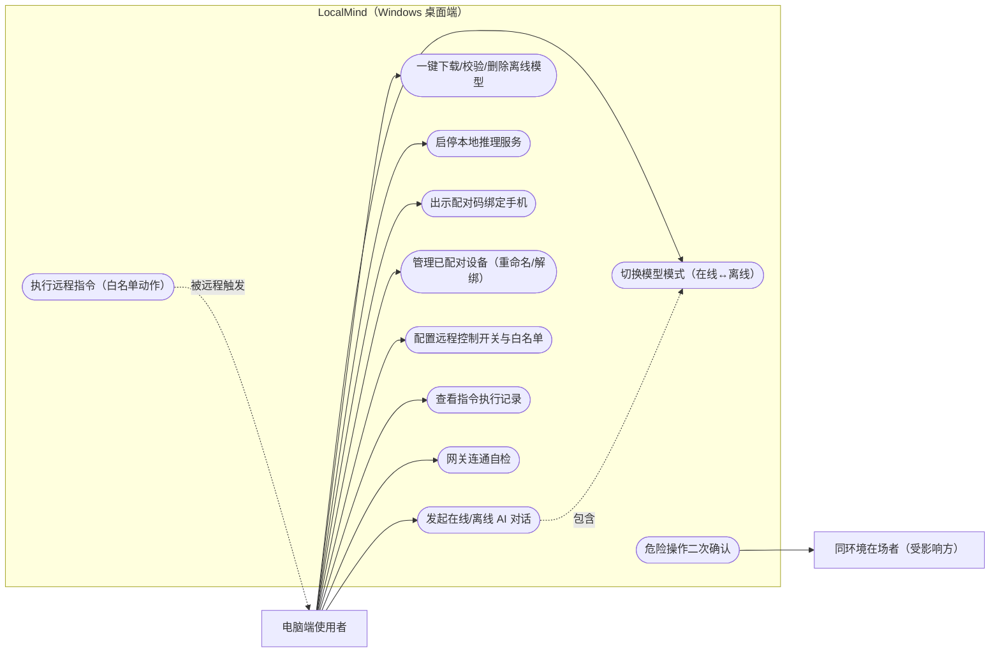
```mermaid
flowchart LR
    actor1["电脑端使用者"]
    actor2["同环境在场者（受影响方）"]
    subgraph sys["LocalMind（Windows 桌面端）"]
        uc1(["发起在线/离线 AI 对话"])
        uc2(["切换模型模式（在线↔离线）"])
        uc3(["一键下载/校验/删除离线模型"])
        uc4(["启停本地推理服务"])
        uc5(["出示配对码绑定手机"])
        uc6(["管理已配对设备（重命名/解绑）"])
        uc7(["配置远程控制开关与白名单"])
        uc8(["执行远程指令（白名单动作）"])
        uc9(["危险操作二次确认"])
        uc10(["查看指令执行记录"])
        uc11(["网关连通自检"])
    end
    actor1 --> uc1 & uc2 & uc3 & uc4 & uc5 & uc6 & uc7 & uc10 & uc11
    uc8 -.被远程触发.-> actor1
    uc9 --> actor2
    uc1 -.包含.-> uc2
```

**UC-02 LocalFile 手机文件处理与遥控用例**：

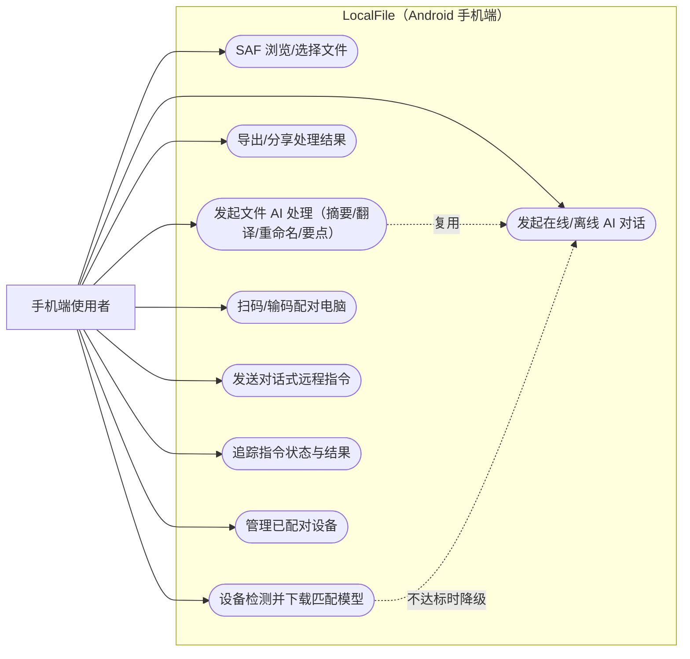
```mermaid
flowchart LR
    actor1["手机端使用者"]
    subgraph sys["LocalFile（Android 手机端）"]
        uc1(["SAF 浏览/选择文件"])
        uc2(["发起文件 AI 处理（摘要/翻译/重命名/要点）"])
        uc3(["导出/分享处理结果"])
        uc4(["发起在线/离线 AI 对话"])
        uc5(["设备检测并下载匹配模型"])
        uc6(["扫码/输码配对电脑"])
        uc7(["发送对话式远程指令"])
        uc8(["追踪指令状态与结果"])
        uc9(["管理已配对设备"])
    end
    actor1 --> uc1 & uc2 & uc3 & uc4 & uc5 & uc6 & uc7 & uc8 & uc9
    uc2 -.复用.-> uc4
    uc5 -.不达标时降级.-> uc4
```

**UC-03 RelayCloud 云端运营用例**：

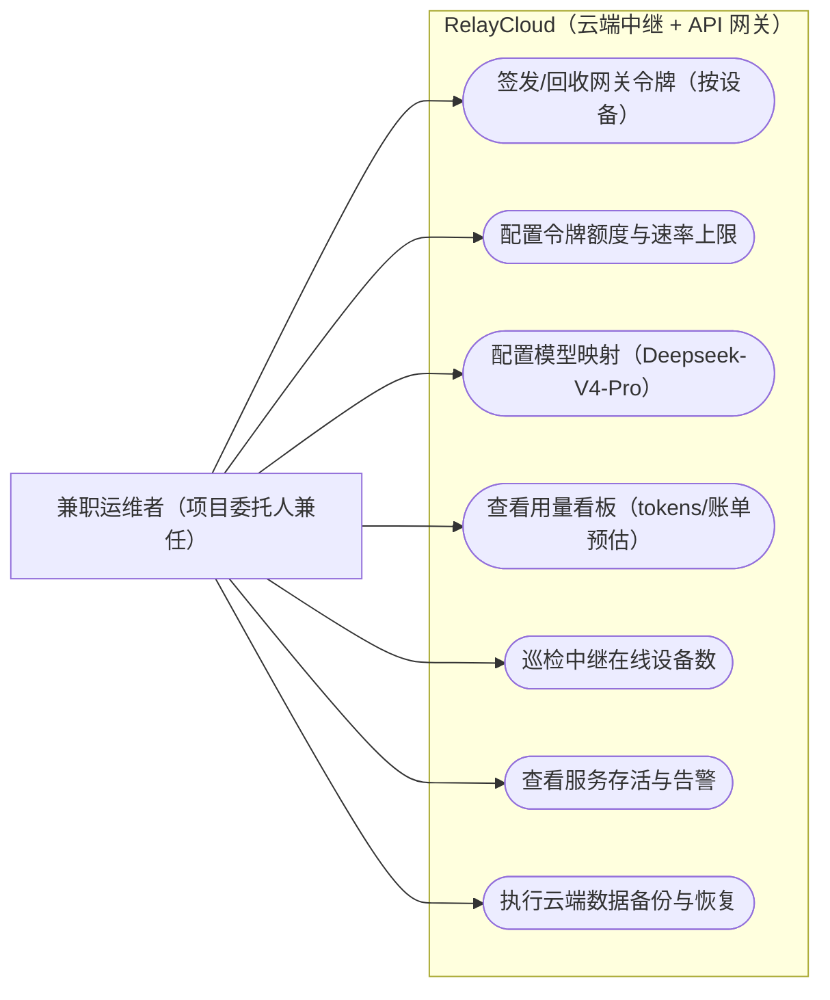
```mermaid
flowchart LR
    actor1["兼职运维者（项目委托人兼任）"]
    subgraph sys["RelayCloud（云端中继 + API 网关）"]
        uc1(["签发/回收网关令牌（按设备）"])
        uc2(["配置令牌额度与速率上限"])
        uc3(["配置模型映射（Deepseek-V4-Pro）"])
        uc4(["查看用量看板（tokens/账单预估）"])
        uc5(["巡检中继在线设备数"])
        uc6(["查看服务存活与告警"])
        uc7(["执行云端数据备份与恢复"])
    end
    actor1 --> uc1 & uc2 & uc3 & uc4 & uc5 & uc6 & uc7
```

#### 2.3.2 业务流程图

**关键流程清单**（核心业务覆盖度 ≥ 80%）：

| 流程编号 | 流程名 | 起点 | 终点 | 涉及业务域 | 源文件位置 |
| --- | --- | --- | --- | --- | --- |
| BF-01 | 双端 AI 对话主流程（在线/离线双模） | 用户输入消息 | 流式结果渲染完成 | 会话域 / 模型资产域 / 网关运营域 | 本节内嵌 Mermaid |
| BF-02 | 手机文件 AI 处理流程 | 用户选择文件 | 结果导出/分享 | 文件处理域 / 会话域 / 模型资产域 | 本节内嵌 Mermaid |
| BF-03 | 设备配对流程 | 电脑端生成配对码 | 双向绑定完成或失败提示 | 远程协同域 | 本节内嵌 + `pic/pairing-flow/pairing-flow.png` 泳道图 |
| BF-04 | 远程指令执行流程（含危险确认） | 手机端发送指令 | 结果回传/失败原因提示 | 远程协同域 / 会话域 | 本节内嵌 Mermaid |
| BF-05 | 离线模型一键下载流程 | 用户点击一键下载 | 校验通过可离线对话 | 模型资产域 | 本节内嵌 Mermaid |

覆盖度核对：三大核心场景（桌面 AI 对话=BF-01、手机文件处理=BF-02、手机远程操控=BF-03+BF-04）+ 关键支撑流程（离线能力建立=BF-05）共 5 条，覆盖功能清单 F1~F11 全部 P0 功能与 D-1 打包交付 = 12 项，覆盖率 ≥ 80%。✅

**BF-01 双端 AI 对话主流程**（泳道：用户 / 双端 App / 网关运营域（new-api） / DeepSeek API / 端侧推理）：

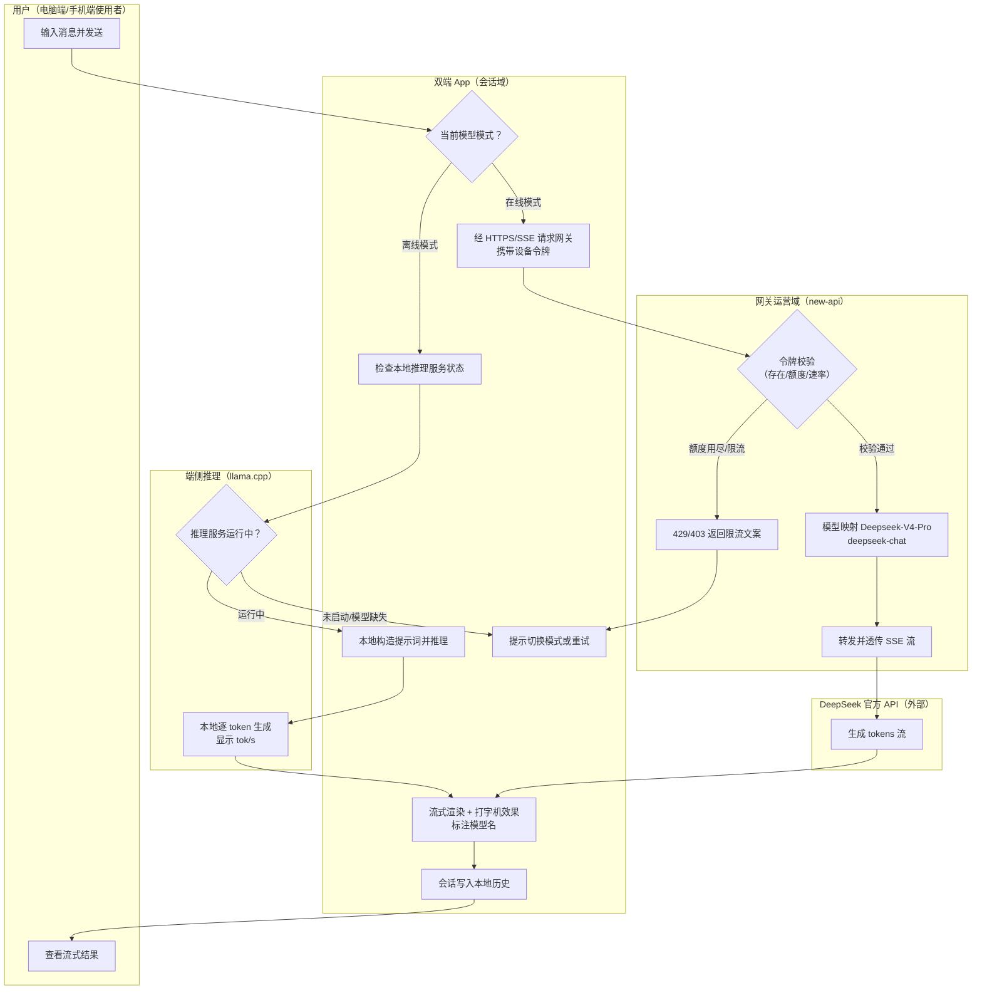
```mermaid
flowchart TB
    subgraph U["用户（电脑端/手机端使用者）"]
        u1["输入消息并发送"]
        u2["查看流式结果"]
    end
    subgraph APP["双端 App（会话域）"]
        a1{"当前模型模式？"}
        a2["经 HTTPS/SSE 请求网关\n携带设备令牌"]
        a3["检查本地推理服务状态"]
        a4["本地构造提示词并推理"]
        a5["流式渲染 + 打字机效果\n标注模型名"]
        a6["会话写入本地历史"]
        a7["提示切换模式或重试"]
    end
    subgraph GW["网关运营域（new-api）"]
        g1{"令牌校验\n（存在/额度/速率）"}
        g2["模型映射 Deepseek-V4-Pro\ndeepseek-chat"]
        g3["转发并透传 SSE 流"]
        g4["429/403 返回限流文案"]
    end
    subgraph DS["DeepSeek 官方 API（外部）"]
        d1["生成 tokens 流"]
    end
    subgraph LL["端侧推理（llama.cpp）"]
        l1{"推理服务运行中？"}
        l2["本地逐 token 生成\n显示 tok/s"]
    end
    u1 --> a1
    a1 -- "在线模式" --> a2 --> g1
    g1 -- "校验通过" --> g2 --> g3 --> d1 --> a5
    g1 -- "额度用尽/限流" --> g4 --> a7
    a1 -- "离线模式" --> a3 --> l1
    l1 -- "运行中" --> a4 --> l2 --> a5
    l1 -- "未启动/模型缺失" --> a7
    a5 --> a6 --> u2
```

**BF-02 手机文件 AI 处理流程**（泳道：用户 / LocalFile / 会话与模型能力 / 系统 SAF 与分享）：

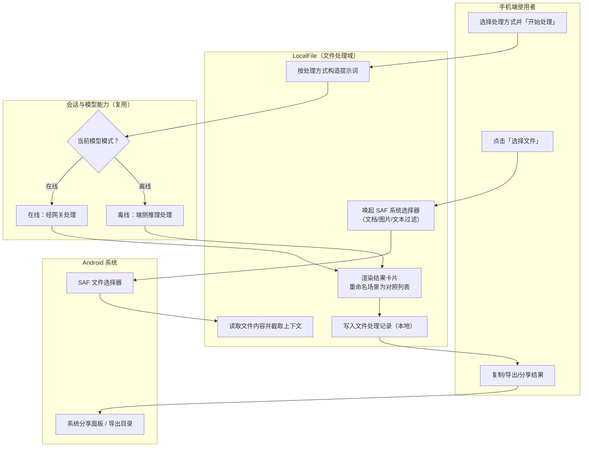
```mermaid
flowchart TB
    subgraph U["手机端使用者"]
        u1["点击「选择文件」"]
        u2["选择处理方式并「开始处理」"]
        u3["复制/导出/分享结果"]
    end
    subgraph LF["LocalFile（文件处理域）"]
        f1["唤起 SAF 系统选择器\n（文档/图片/文本过滤）"]
        f2["读取文件内容并截取上下文"]
        f3["按处理方式构造提示词"]
        f4["渲染结果卡片\n重命名场景为对照列表"]
        f5["写入文件处理记录（本地）"]
    end
    subgraph CM["会话与模型能力（复用）"]
        c1{"当前模型模式？"}
        c2["在线：经网关处理"]
        c3["离线：端侧推理处理"]
    end
    subgraph OS["Android 系统"]
        o1["SAF 文件选择器"]
        o2["系统分享面板 / 导出目录"]
    end
    u1 --> f1 --> o1 --> f2
    u2 --> f3 --> c1
    c1 -- "在线" --> c2
    c1 -- "离线" --> c3
    c2 --> f4
    c3 --> f4
    f4 --> f5 --> u3 --> o2
```

**BF-03 设备配对流程**：泳道渲染版见 `pic/pairing-flow/pairing-flow.png`（SVG 同名），关键约束：配对码 6 位、5 分钟有效、一次性原子核销；全流程 ≤ 60s（对齐高层架构 V2）。

**BF-04 远程指令执行流程（含危险确认）**（泳道：手机端使用者 / LocalFile / RelayCloud 中继 / LocalMind / 电脑端在场者）：

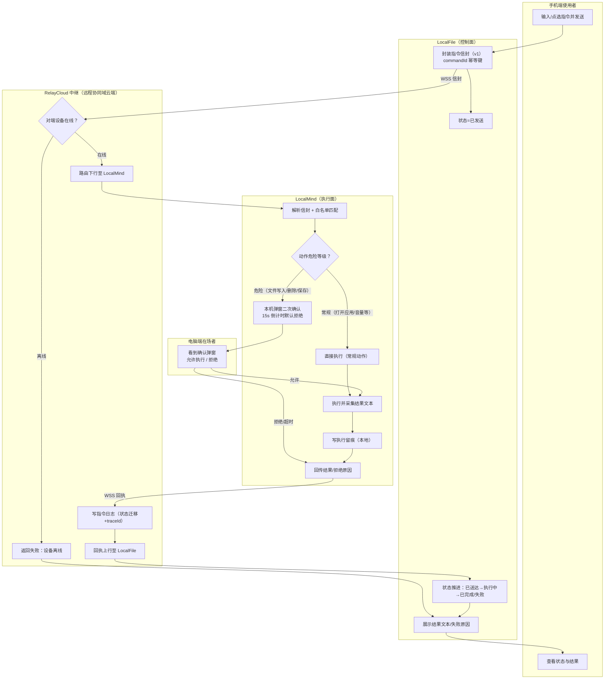
```mermaid
flowchart TB
    subgraph U1["手机端使用者"]
        u1["输入/点选指令并发送"]
        u2["查看状态与结果"]
    end
    subgraph LF["LocalFile（控制面）"]
        f1["封装指令信封（v1）\ncommandId 幂等键"]
        f2["状态=已发送"]
        f3["状态推进：已送达→执行中→已完成/失败"]
        f4["展示结果文本/失败原因"]
    end
    subgraph RC["RelayCloud 中继（远程协同域云端）"]
        r1{"对端设备在线？"}
        r2["路由下行至 LocalMind"]
        r3["写指令日志（状态迁移+traceId）"]
        r4["回执上行至 LocalFile"]
        r5["返回失败：设备离线"]
    end
    subgraph LM["LocalMind（执行面）"]
        m1["解析信封 + 白名单匹配"]
        m2{"动作危险等级？"}
        m3["直接执行（常规动作）"]
        m4["本机弹窗二次确认\n15s 倒计时默认拒绝"]
        m5["执行并采集结果文本"]
        m6["写执行留痕（本地）"]
        m7["回传结果/拒绝原因"]
    end
    subgraph U2["电脑端在场者"]
        p1["看到确认弹窗\n允许执行 / 拒绝"]
    end
    u1 --> f1 --> f2
    f1 -- "WSS 信封" --> r1
    r1 -- "在线" --> r2 --> m1 --> m2
    r1 -- "离线" --> r5 --> f4
    m2 -- "常规（打开应用/音量等）" --> m3 --> m5
    m2 -- "危险（文件写入/删除/保存）" --> m4 --> p1
    p1 -- "允许" --> m5
    p1 -- "拒绝/超时" --> m7
    m5 --> m6 --> m7
    m7 -- "WSS 回执" --> r3 --> r4 --> f3 --> f4 --> u2
```

**BF-05 离线模型一键下载流程**（泳道：用户 / 双端 App 模型管理 / 对象存储 CDN / 端侧推理）：

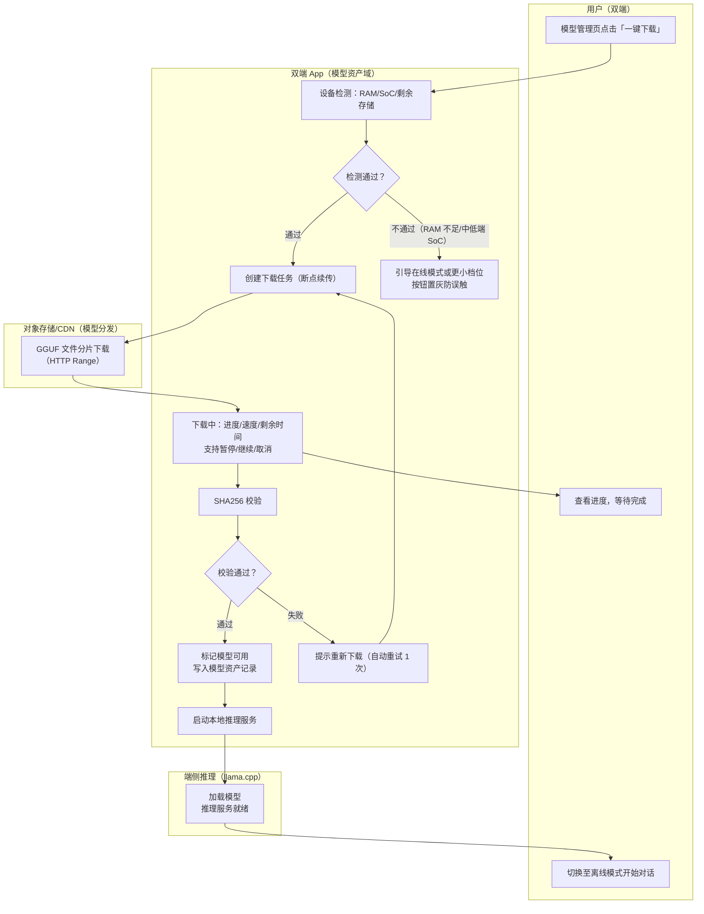
```mermaid
flowchart TB
    subgraph U["用户（双端）"]
        u1["模型管理页点击「一键下载」"]
        u2["查看进度，等待完成"]
        u3["切换至离线模式开始对话"]
    end
    subgraph APP["双端 App（模型资产域）"]
        a1["设备检测：RAM/SoC/剩余存储"]
        a2{"检测通过？"}
        a3["创建下载任务（断点续传）"]
        a4["下载中：进度/速度/剩余时间\n支持暂停/继续/取消"]
        a5["SHA256 校验"]
        a6{"校验通过？"}
        a7["标记模型可用\n写入模型资产记录"]
        a8["启动本地推理服务"]
        a9["引导在线模式或更小档位\n按钮置灰防误触"]
        a10["提示重新下载（自动重试 1 次）"]
    end
    subgraph CDN["对象存储/CDN（模型分发）"]
        s1["GGUF 文件分片下载\n（HTTP Range）"]
    end
    subgraph LL["端侧推理（llama.cpp）"]
        l1["加载模型\n推理服务就绪"]
    end
    u1 --> a1 --> a2
    a2 -- "通过" --> a3 --> s1 --> a4 --> a5 --> a6
    a2 -- "不通过（RAM 不足/中低端 SoC）" --> a9
    a6 -- "通过" --> a7 --> a8 --> l1 --> u3
    a6 -- "失败" --> a10 --> a3
    a4 --> u2
```

### 2.4 业务范围与边界

#### 2.4.1 功能模块清单

按"功能编号 → 子功能编号"两层组织，与 §2.1 业务域对应（本表 F1~F8 为模块级归并编号，与《高层架构设计》§6.3 的功能粒度 F1~F14 不同；子功能为本设计细化）。

| 编号 | 一级功能名 | 子功能描述 | 对应业务域 | 实现状态 |
| --- | --- | --- | --- | --- |
| F1 | 对话引擎（双端） | — | 会话域 | — |
| F1.1 | — | 在线对话：经网关 SSE 流式，仅显示"Deepseek-V4-Pro" | 会话域 | 完整实现 |
| F1.2 | — | 离线对话：llama.cpp 本地推理，实时 tok/s 指示 | 会话域 | 完整实现 |
| F1.3 | — | 多会话管理：新建/重命名/删除/搜索/历史持久化 | 会话域 | 完整实现 |
| F2 | 模型管理（双端） | — | 模型资产域 | — |
| F2.1 | — | 模型一键下载：内置直链、断点续传、SHA256 校验、进度可视 | 模型资产域 | 完整实现 |
| F2.2 | — | 模式切换：在线↔离线一键切换，会话不丢失 | 模型资产域 | 完整实现 |
| F2.3 | — | 推理服务生命周期：启动/停止/端口与参数配置 | 模型资产域 | 完整实现 |
| F2.4 | — | 设备检测：RAM/SoC/存储检测与档位匹配（Android 不达标置灰引导） | 模型资产域 | 完整实现 |
| F3 | 文件处理（LocalFile） | — | 文件处理域 | — |
| F3.1 | — | SAF 文件浏览选择：分类过滤、最近列表、多选 | 文件处理域 | 完整实现 |
| F3.2 | — | 文件 AI 处理：摘要/翻译/智能重命名/提取要点 | 文件处理域 | 完整实现 |
| F3.3 | — | 结果导出：复制/导出 txt/系统分享/重命名对照应用 | 文件处理域 | 完整实现 |
| F4 | 远程控制（双端+云端） | — | 远程协同域 | — |
| F4.1 | — | 设备配对：6 位配对码（5 分钟一次性）+ 二维码 + 绑定管理 | 远程协同域 | 完整实现 |
| F4.2 | — | 指令通道：WSS 信封传输、五态状态机、结果文本回传 | 远程协同域 | 完整实现 |
| F4.3 | — | 白名单执行器：动作注册表、危险动作二次确认（15s 默认拒绝）、执行留痕 | 远程协同域 | 完整实现 |
| F4.4 | — | 桌面截图单帧回传 | 远程协同域 | `[完整版]`（F14，MVP 不做；信封已预留 resultType=screenshot 扩展位，完整版叠加实现不改协议） |
| F5 | RelayCloud 云端服务 | — | 远程协同域（云端部分）/ 网关运营域 | — |
| F5.1 | — | 中继服务：WSS 长连接网关、设备在线状态、配对码签发、指令路由 | 远程协同域 | 完整实现 |
| F5.2 | — | API 网关：new-api 部署、模型映射、令牌额度与速率封顶 | 网关运营域 | 完整实现 |
| F5.3 | — | 用量看板与巡检：tokens/账单预估、在线设备数 | 网关运营域 | 完整实现 |
| F6 | 双端打包交付 | — | 跨域（交付） | — |
| F6.1 | — | Windows exe 安装包（含 WebView2 引导，≤80MB） | 跨域 | 完整实现 |
| F6.2 | — | Android apk 安装包（≤60MB） | 跨域 | 完整实现 |
| F7 | 多档模型推荐与测速 | 按设备画像推荐 1.5B~8B 档位 + 基准测速页 | 模型资产域 | `[完整版]`（F13） |
| F8 | P2P 通道 | WebRTC DataChannel（STUN/TURN，中继兜底） | 远程协同域 | `[完整版]`（F14，WSS 中继保留为兜底路径） |

**编号规则**：

| 规则项 | 取值 |
| --- | --- |
| 一级编号 | `F1 / F2 / ...`，与一级业务域对应（交付类 F6 为跨域） |
| 子功能编号 | `F1.1 / F1.2 / ...`，互不重叠 |
| Mock / 简化标注 | 必须显式标注 `[MOCK]` 或 `[简化]` 或 `[完整版]`，并附"完整版替换路径" |

**In-Scope（本期范围内，≤ 15 条）**：

| 编号 | 本期必做的事项 |
| --- | --- |
| F1 | 对话引擎双端实现（在线+离线+会话管理） |
| F2 | 模型管理双端实现（下载+切换+启停+设备检测） |
| F3 | LocalFile 文件处理（SAF+AI 处理+导出） |
| F4 | 远程控制 MVP（配对+指令通道+白名单执行+文本回传） |
| F5 | RelayCloud 云端服务（WSS 中继+new-api 网关+看板） |
| F6 | 双端安装包交付（exe+apk） |
| N1 | 非功能：安装包 exe ≤80MB、apk ≤60MB、冷启动 ≤3s（均不含模型） |
| N2 | 非功能：远程指令端到端时延 P95 ≤3s（不含模型生成）、配对建立 ≤60s |
| N3 | 非功能：离线推理吞吐 PC ≥5 tok/s、Android ≥8 tok/s（基准设备） |
| N4 | 非功能：真实 API key 零入包，100% 令牌带额度与速率上限 |

**Out-of-Scope（本期不做）**：

| 编号 | 不做的事项 | 不做的原因 | 未来归属 |
| --- | --- | --- | --- |
| O1 | 远程控制的桌面画面实时回传（视频流） | 进入屏幕采集/编码传输领域（RustDesk 级工程量），与"对话式控制"诉求不符（继承高层架构 O1） | 永不做（完整版仅截图单帧 F4.4） |
| O2 | 多模型市场 / 角色社区 / 测速排行榜 | 依赖内容运营，超出校级项目边界（继承高层架构 O2） | 完整版仅多档推荐 F7 |
| O3 | 用户账号体系、注册登录、付费计费 | 非商业化项目，设备配对即身份；账号体系放大合规面（继承高层架构 O3） | 永不做 |
| O4 | iOS / macOS / Linux 客户端 | 用户诉求明确限定 Windows + Android 双端（继承高层架构 O4） | 永不做 |
| O5 | 生成式 AI 服务备案与企业级合规审计 | 小范围私有分发（≤50 人），不构成向公众提供服务；上架公开渠道前必须重启评估（继承高层架构 O5） | 待业务确认 |
| O6 | WebRTC P2P 打洞通道 | MVP 纯 WSS 中继已满足时延指标；打洞增加 NAT 适配工作量（继承高层架构 O6） | 完整版 F8 |
| O7 | 云端消息队列 / 独立缓存中间件 | 云端指令为"在线即时转发"语义，离线即失败返回，无堆积重放需求；单实例 SQLite 足够 | 永不做（若改离线投递语义需重评） |

### 2.5 质量与柔性可用

#### 2.5.1 服务质量目标

**质量目标 Top 3-5**（按优先级排序）：

| 优先级 | 质量目标 | 业务驱动 | 受影响的关键章节 |
| --- | --- | --- | --- |
| Q1 | 安全可信：真实 API key 零暴露 + 危险远程操作可当场拦截 | 财产与合规底线（高层架构 P3、受影响方关注点）；一旦 key 泄露账单无上限 | §3.5 / §7.2 / §3.2.M4 |
| Q2 | 断网可用性：离线模式端侧推理可用且可读 | 核心卖点（高层架构 P1/V1）：断网可用率从 0% 到可用 | §3.2.M2 / §3.2.M1 |
| Q3 | 远程链路低时延：指令端到端 P95 ≤ 3s（不含模型生成） | 演示可信与用户体验（高层架构 V2）；超过 3s 对话式操控失去"对话感" | §3.2.M5 / §5.3 / §6.2 |
| Q4 | 成本可封顶：云端月账单 ≤ 150 元 | 学生可负担（高层架构价值主张）；令牌额度+单台 2C4G 硬封顶 | §5.5 / §8.4 |
| Q5 | 可维护性：1~5 人团队可运维，新人 1 周上手 | 校级项目人力约束（高层架构 P5）；组件全部开源、单实例部署 | §3.1 / §3.2 / §5.1 |

**可验证质量场景**（参考 SEI ATAM 方法）：

| 场景编号 | 关联目标 | 触发源 | 触发条件 | 期望响应 | 度量指标 |
| --- | --- | --- | --- | --- | --- |
| QS-01 | Q1 | 安装包逆向分析 | 对 exe/apk 做字符串与内存扫描 | 扫描不到真实 DeepSeek key；仅存在网关地址与设备令牌 | 可提取 key 数 = 0；令牌均带额度上限 |
| QS-02 | Q1 | 远程危险指令 | 手机端发起"删除下载文件夹文件"类指令 | 本机弹窗 15s 倒计时，无操作默认拒绝；留痕可查 | 拦截弹窗到达率 100%；默认拒绝生效；日志含指令全文与来源设备 |
| QS-03 | Q2 | 用户拔掉网线 | 断网状态下发起对话 | 自动/手动切离线模式，本地推理持续输出 | PC ≥ 5 tok/s；Android ≥ 8 tok/s；切换 ≤ 2 次点击且会话不丢 |
| QS-04 | Q3 | 手机端发送远程指令 | 已配对在线状态连续发送 20 条常规指令 | WSS 中继转发 + ACK + 回执全链路完成 | P95 ≤ 3s（不含模型生成）；状态机五态迁移完整可见 |
| QS-05 | Q4 | 月度账单结算 | 小范围分发 ≤ 50 用户运行 1 个月 | 云主机+对象存储+API 三项合计不超阈值 | 合计 ≤ 150 元；令牌额度消耗 ≥80% 有告警 |
| QS-06 | Q3 | 云端单点故障 | 云主机宕机/容器退出 | 端侧离线模式不受影响；在线与远程功能明确报错并提示；恢复后自动重连 | RTO ≤ 240min；离线功能可用率 100% 不受云端影响 |

#### 2.5.2 业务柔性可用策略

**业务功能优先级分层**（§2.4.1 中每个一级功能 F-x 必须显式标注一个层级）：

| 层级 | 含义 | 故障态下的处置方向 | 用户感知 |
| --- | --- | --- | --- |
| L0 核心业务 | 系统的生命线，挂掉等于业务停摆 | 不降级；优先消耗所有资源保障 | 无 / 极轻微 |
| L1 重要业务 | 不影响主链路但用户高频使用 | 限流 + 排队 + 异步化 | 变慢 / 排队提示 |
| L2 辅助业务 | 提升体验但非必要 | 关闭 / 返回兜底数据 | 部分功能不可用 + 友好提示 |
| L3 附加业务 | 长尾 / 数据类 / 统计类 | 直接关闭 + 异步补偿 | 通常无感 |

**一级功能分层映射**：F1 对话引擎 = L0（其中在线子链路 L1、离线子链路 L0）；F2 模型管理 = L0（模式切换）/ L1（下载）；F3 文件处理 = L1；F4 远程控制 = L1；F5 云端服务 = L1；F6 打包交付 = L2（交付后无运行时影响）；F7 多档推荐 = L3；F8 P2P 通道 = L2（有 WSS 兜底）。L0 一级功能 2/8 = 25% ≤ 30%。✅

**业务降级清单**：

| 编号 | 关联功能（F-xx） | 触发条件 | 降级动作 | 用户感知 | 决策类型 |
| --- | --- | --- | --- | --- | --- |
| BD-01 | F1.1 在线对话 | 网关连续 3 次请求失败或返回 5xx | 切换提示用户转离线模式；保留会话上下文 | 看到"云端连接异常，可切换离线模式继续对话"提示 | 自动检测 + 手动确认 |
| BD-02 | F1.1 / F3.2 在线链路 | 网关返回 429（令牌额度用尽或触发速率上限） | 停止重试，展示额度说明与重置时间 | 看到"本月额度已用尽/请求太频繁"文案 | 自动 |
| BD-03 | F1.2 离线对话 | 本地推理吞吐低于 3 tok/s 持续 10s | 提示可切换在线模式或缩短上下文 | 看到速度偏慢提示与一键切换入口 | 自动 |
| BD-04 | F2.1 模型下载 | CDN 下载失败重试 3 次仍失败 | 保留断点，提示切换网络后手动续传 | 看到下载失败原因与"继续下载"按钮，进度不丢 | 自动 + 手动恢复 |
| BD-05 | F4 远程控制 | WSS 连接断开或对端设备离线 | 指令不发送，状态列表标记"设备离线"；后台指数退避自动重连 | 看到设备离线灰态与重连中指示 | 自动 |
| BD-06 | F4.3 白名单执行 | 执行器动作执行抛异常 | 回传失败原因文本，留痕记录完整堆栈（本机侧） | 手机端看到失败原因红字 | 自动 |
| BD-07 | F5.2 网关 | new-api 容器异常退出 | docker-compose 自动重启（restart: always）；重启失败时云端告警 | 双端在线对话短暂不可用，离线模式无感 | 自动 |
| BD-08 | F5.3 用量看板 | new-api 看板不可用 | 运维者改查云控制台基础指标，账单以云厂商账单为准 | 运维巡检体验下降，不影响终端用户 | 手动 |

---

## 3. 应用架构

> **本章回答**：系统由哪些模块组成、模块与外部系统怎么集成、每个模块的内部交互链路是什么。
> **本章是系统设计的核心**，章节下应当占整个文档篇幅的 40%~50%。

### 3.1 应用架构概览

#### 3.1.1 系统上下文

本系统作为**中心节点**，周围辐射出"用户角色 + 外部业务系统 + 上游 / 下游平台"关系。


> SVG 矢量版：`pic/system-context/system-context.svg`；绘图源码：`pic/diagram-source/system-context.py`。

**系统上下文要素清单**：

| 节点类型 | 节点名 | 与本系统的关系 | 关系语义 |
| --- | --- | --- | --- |
| 角色 | 电脑端使用者 | 使用 | 桌面 AI 对话、模型管理、配对码出示、危险操作确认 |
| 角色 | 手机端使用者 | 使用 | 文件 AI 处理、AI 对话、对话式远程控制 |
| 角色 | 兼职运维者（项目委托人兼任） | 使用 + 运维 | 云端部署、令牌签发与额度封顶、用量巡检、备份恢复 |
| 角色 | 同环境在场者 | 被动受影响 | 远程危险操作执行前的本机可见确认 |
| 上游平台 | E-01 DeepSeek 官方 API | 本系统 → 调用 | 在线大模型供应（HTTPS/SSE，经 new-api 中转，客户端零接触真实 key） |
| 上游平台 | E-02 模型权重源（HF 镜像 / ModelScope） | 本系统 → 拉取 | GGUF 模型权重，先同步至自建对象存储再对客户端分发 |
| 上游平台 | E-03 云厂商 VPS + 对象存储 | 本系统 → 使用其基础设施 | 中继与网关运行载体（2C4G）、模型 CDN 分发、备份存放 |
| 下游平台 | 无 | — | 产品为终态交付，exe/apk 直接面向最终用户，无下游业务系统 |

**填写核对**：本系统在上图中为单一节点，内部组件未展开（归 §3.1.2）；周围节点取自 §3.1.3 外部依赖清单（E-01~E-03）与 §2.3 用例图角色；每条边已标注关系语义。✅

#### 3.1.2 系统模块图


> SVG 矢量版：`pic/module-architecture/module-architecture.svg`；绘图源码：`pic/diagram-source/module-architecture.py`。

**分层组件清单**：

| 层次 | 内容 | 数据来源 |
| --- | --- | --- |
| 接入层 | LocalMind 桌面端（Tauri 2.x + React/TS，exe）/ LocalFile 手机端（Kotlin + Compose，apk）/ 运维触点（云控制台 + new-api 看板） | §2.3 用例图角色 |
| 应用层 | M1 对话引擎模块（双端）/ M2 模型管理模块（双端）/ M3 文件处理模块（Android）/ M4 远程控制模块（双端：控制面+执行面）/ M5 中继调度模块（云端自建）/ M6 API代理模块（云端）——与 §3.2 一一对应 | §2.1 / §3.2 |
| 中间件层 | C-01 SQLite（云端中继库）/ C-02 端侧本地存储 / C-03 对象存储+CDN / C-04 llama.cpp 推理引擎 / C-05 云主机 2C4G / C-06 new-api 网关 / C-07 云厂商自带监控 | §3.1.3 云组件清单 |
| 集成对接层 | E-01 DeepSeek 官方 API / E-02 模型权重源 / E-03 云厂商基础设施 | §3.1.3 外部依赖清单 |

**协议标注核对**：图中每条连线已标注协议——GUI↔端侧后端为本地 IPC/FFI；端↔云为 WSS（指令）与 HTTPS/SSE（在线对话、模型下载）；M6→E-01 为 HTTPS/SSE；E-02→C-03 为 HTTPS 同步；M5→C-01 为 SQL。✅

#### 3.1.3 集成架构

> **核心区分**：
> - **外部依赖（E-xx）**：跟别人协作，本系统通过 API / SDK / 消息与之集成的业务系统、第三方平台、内部友邻系统；
> - **云组件（C-xx）**：自己用的资源，本系统运行所需的中间件与云资源。

##### 外部依赖清单

| ID | 外部系统 | 归属团队 / 供应商 | 类别 | 使用方式 | 集成方式 | 协议 / 版本 | 功能定位（≤ 30 字） | 联系人 |
| --- | --- | --- | --- | --- | --- | --- | --- | --- |
| E-01 | DeepSeek 官方 API（deepseek-chat） | DeepSeek（深度求索） | 第三方业务平台 | 消费 | REST API（OpenAI 兼容） | HTTPS + SSE；OpenAI v1 兼容 | 在线大模型对话供应 | `@项目委托人` |
| E-02 | 模型权重源（HF 镜像 / ModelScope） | 开源模型社区 | 第三方业务平台 | 消费 | HTTPS 文件同步（运维手动/脚本） | HTTPS；GGUF（llama.cpp Q4_K_M） | 离线模型权重获取源 | `@项目委托人` |
| E-03 | 云厂商 VPS + 对象存储 | 云厂商（境内 Region） | 第三方业务平台 | 消费 | 控制台 + OpenAPI | 控制台 / S3 兼容 API | 云主机、模型 CDN、备份桶 | `@项目委托人` |

##### 云组件 / 基础设施清单

| ID | 组件类别 | 选型 | 部署形态 | 规格量级 | 容量预估 | 提供方 / SLA | 用途 |
| --- | --- | --- | --- | --- | --- | --- | --- |
| C-01 | 嵌入式关系库 | SQLite 3.45（WAL 模式） | 单实例文件库（云主机本地卷） | 单文件，预期 200MB 以内 | 设备 ≤ 100 行、指令日志 ≤ 3 万行/月 | 自运维（随云主机） | 中继侧设备/配对/指令/令牌索引 |
| C-02 | 端侧本地存储 | SQLite 3.45（Windows/Android 内嵌）+ SharedPreferences/DataStore | 随 App 安装 | 单端 500MB 以内（不含模型） | 会话 ≤ 500 个、消息 ≤ 5 万行/端 | 端侧自管 | 会话历史/模型资产/文件记录/白名单配置 |
| C-03 | 对象存储 / CDN | 云厂商对象存储（S3 兼容）+ CDN 直链 | 多副本托管 | 模型桶 ≈ 10GB（2~3 个 GGUF）+ 备份桶 ≈ 5GB | 月下载流量 ≤ 200GB（≤50 用户 × 4~5GB） | 云厂商；SLA 99.9% | 模型分发直链 + SQLite 备份 |
| C-04 | 端侧推理引擎 | llama.cpp（b4xxx 稳定 tag，编译期锁定版本） | 库嵌入双端（Windows 进程内 FFI / Android JNI .so） | PC：8B Q4_K_M ≈ 5.2GB 内存；Android：4B Q4 ≈ 3GB 内存 | PC ≥ 5 tok/s；Android ≥ 8 tok/s（基准设备） | 开源 MIT；无 SLA | 离线模式 LLM 推理 |
| C-05 | 云主机 | 云厂商 VPS 2C4G | 单台单 AZ（境内 Region） | 2 vCPU / 4GB / 60GB SSD / 5Mbps 带宽 | WSS 长连接 ≤ 100 并发、HTTPS ≤ 5 QPS | 云厂商；SLA 99.9% | 中继与网关运行载体 |
| C-06 | API 网关 | new-api（one-api 系，Docker 镜像 v0.8.x 稳定版，部署时锁 digest） | Docker 单容器（docker-compose 编排） | 内存 ≤ 512MB | ≤ 5 QPS、≤ 50 令牌 | 开源（社区维护）；无 SLA | key 隐藏、模型映射、令牌额度/速率、用量看板 |
| C-07 | 监控告警 | 云厂商主机监控 + new-api 内置看板 + relay-server 内嵌 /metrics | 托管 + 进程内嵌 | — | 主机指标分钟级 | 云厂商 / 自研 | 存活、资源水位、用量、告警 |

**填写核对**：选型均含具体产品 + 版本号；规格量级 / 容量预估均有数字；不使用的组件（消息队列、缓存、搜索引擎、K8s、任务调度、ELK、Prometheus、链路追踪平台、KMS）已整行删除而非填"不适用"——理由见 §5.1 环境划分与高层架构"云端零运维负担"定位（O7 已声明不引入 MQ/缓存中间件）。✅

##### 组件依赖关系

| 业务模块（§3.2） | 依赖的外部系统（E-xx） | 依赖的云组件（C-xx） | 故障传导风险 |
| --- | --- | --- | --- |
| M1 对话引擎模块 | E-01（在线链路） | C-02（会话持久化）、C-04（离线推理）、C-06（在线转发） | E-01 不可用 → 在线对话失败 → 降级引导离线模式（BD-01）；C-04 异常 → 离线对话不可用 → 引导在线模式（BD-03） |
| M2 模型管理模块 | E-03（对象存储 CDN） | C-02（模型元数据）、C-03（模型文件）、C-04（推理启停） | C-03 下载失败 → 断点保留 + 重试 + 手动续传（BD-04）；E-03 故障 → 新下载不可用，已下载模型不受影响 |
| M3 文件处理模块 | E-01（在线链路） | C-02（处理记录）、C-04（离线处理）、C-06（在线转发） | 同 M1：在线失败可切离线处理；SAF 权限被拒 → 引导用户授权 |
| M4 远程控制模块 | — | C-02（白名单配置/留痕）、C-05（中继链路载体） | C-05 宕机 → 远程功能整体不可用（BD-05），本机桌面助手功能不受影响 |
| M5 中继调度模块 | E-03（云主机） | C-01（设备/配对/指令）、C-05（运行载体） | C-01 损坏 → 配对关系丢失需重新配对（备份恢复 RPO ≤ 24h）；C-05 宕机 → 远程功能中断，RTO ≤ 240min |
| M6 API代理模块 | E-01 | C-05、C-06 | C-06 容器异常 → docker 自动重启（BD-07）；E-01 故障 → 全站在线对话失败，离线模式兜底 |

#### 3.1.4 工程结构

- 明确项目的物理组织方式
- 公共模块（`common` / `shared`）与业务模块的依赖方向必须清晰：**业务模块依赖公共模块，禁止反向**

```
LocalAITools/
├── localmind/                       # LocalMind Windows 桌面端（Tauri 2.x）
│   ├── src/                         # React 18 + TypeScript 前端（GUI）
│   │   ├── api/                     # 接口封装（网关 HTTPS 客户端、WSS 客户端）
│   │   ├── stores/                  # 全局状态（Zustand：会话/模式/设备/下载）
│   │   ├── pages/                   # 页面：chat/ models/ remote/ settings（对应 P-W1~P-W4）
│   │   ├── components/              # 通用组件：MessageBubble/ ModeSwitch/ ProgressBar/ ConfirmDialog
│   │   ├── hooks/                   # 自定义 Hooks（useStreamChat/ useDownload/ useRelay）
│   │   ├── types/                   # TS 类型（与 shared-contract 对齐生成）
│   │   ├── utils/                   # 工具函数
│   │   └── routes.tsx               # 路由配置
│   ├── src-tauri/                   # Rust 后端核心（端侧业务逻辑）
│   │   ├── src/chat/                # M1 对话引擎：模式路由、流式会话
│   │   ├── src/model/               # M2 模型管理：下载/校验/推理服务启停
│   │   ├── src/remote/              # M4 执行面：WSS 客户端、白名单执行器、确认弹窗
│   │   ├── src/storage/             # C-02 端侧 SQLite 访问层
│   │   ├── src/inference/           # C-04 llama.cpp FFI 封装（llama-cpp-2 binding）
│   │   └── src/common/              # 端内公共：错误码/日志/信封类型（引用 shared-contract）
│   └── package.json / Cargo.toml
├── localfile/                       # LocalFile Android 端（Kotlin + Compose）
│   ├── app/src/main/java/com/localmind/localfile/
│   │   ├── ui/                      # Compose 页面：files/ chat/ remote/ settings（对应 P-A1~P-A5）
│   │   ├── chat/                    # M1 对话引擎（在线 SSE 客户端 + 离线推理桥接）
│   │   ├── files/                   # M3 文件处理：SAF 访问、处理任务、导出分享
│   │   ├── model/                   # M2 模型管理：设备检测、DownloadManager 下载、校验
│   │   ├── remote/                  # M4 控制面：配对、指令发送、状态追踪
│   │   ├── inference/               # C-04 llama.cpp JNI 桥接（libllama.so）
│   │   ├── storage/                 # C-02 Room/SQLite + DataStore
│   │   └── common/                  # 端内公共：错误码/日志/信封类型（引用 shared-contract）
│   └── build.gradle.kts
├── relay-cloud/                     # RelayCloud 云端（后端工程根目录）
│   ├── common/                      # 公共模块：DTO/Enum/Exception/Constants + 信封 Schema 校验
│   ├── relay-server/                # M5 中继服务（Rust + tokio + axum/tungstenite）
│   │   ├── src/ws/                  # WSS 连接管理、心跳、在线状态表
│   │   ├── src/pairing/             # 配对码签发/校验/核销
│   │   ├── src/router/              # 指令路由与 ACK 中转
│   │   ├── src/store/               # C-01 SQLite 访问层（sqlx）
│   │   └── src/observability/       # /healthz /readyz /metrics、结构化日志
│   ├── gateway-config/              # M6 new-api 部署配置（docker-compose.yml、渠道/映射/令牌初始化脚本）
│   └── ops/                         # 备份脚本（sqlite .backup + rclone）、恢复 SOP
├── shared-contract/                 # 三方共享契约（Shared Kernel，C-03 落点）
│   ├── envelope/v1/                 # 指令信封 JSON Schema + TS/Rust/Kotlin 类型（由 Schema 生成）
│   ├── error-code/                  # 全局错误码注册表（单一来源，三端引用）
│   └── whitelist/                   # 白名单动作枚举与危险等级定义
└── docs/                            # 开发文档与图示源
```

#### 3.1.5 技术选型（版本约束）

| 技术分类 | 选型 | 版本 | 备注 / 选型理由 |
| --- | --- | --- | --- |
| Windows 端框架 | Tauri + React + TypeScript | Tauri 2.x；React 18.3；TS 5.5 | 选 Tauri 不选 Electron：安装包目标 ≤80MB，Tauri 复用系统 WebView2（包体约 10~20MB 级）而 Electron 捆绑 Chromium（100MB+ 起步）；继承高层架构 D2 与 Jan（B3）验证的技术栈 |
| Windows 端语言（后端核心） | Rust | 1.80+（stable） | Tauri 原生语言；llama.cpp FFI、WSS 客户端、文件操作均有成熟 crate；与云端 relay-server 同语言降低团队上下文切换 |
| Android 端框架 | Kotlin + Jetpack Compose | Kotlin 2.0；Compose BOM 2024.09 | 选 Compose 不选 React Native：原生性能与 SAF/DownloadManager 等系统能力零桥接损耗，llama.cpp JNI 直接集成；RN 的 JSI 桥（PocketPal 方案）对 1~5 人团队调试成本高 |
| 端侧推理引擎 | llama.cpp | b4xxx 稳定 tag（编译期锁定，Q4_K_M 量化） | 选 llama.cpp 不选 MLC/ExecuTorch：GGUF 生态最大、Windows/Android 双端可编译、MIT 许可；继承高层架构 D2 |
| 端侧本地数据库 | SQLite（sqlx/Room） | 3.45 | 端侧零服务依赖；Rust sqlx 与 Android Room 均为生态首选；不选 Realm：减少原生库体积与许可评估 |
| 云端中继服务 | Rust + tokio + axum + tokio-tungstenite | Rust 1.80+；axum 0.7；tokio 1.40 | 选 Rust/axum 不选 Node/ws 或 Go：单实例 2C4G 内存受限，Rust 常驻内存低（100MB 以内）且 WSS 长连接性能稳定；与端侧 Rust 复用信封类型（shared-contract） |
| 云端数据库 | SQLite（WAL 模式） | 3.45 | 选 SQLite 不选 MySQL/PostgreSQL：云端数据极小（≤100 设备、≤3 万指令/月），独立数据库进程超出 2C4G 预算且违背"云端零运维"定位；WAL 支持读写并发足够单实例 |
| API 网关 | new-api（Docker 镜像） | v0.8.x 稳定版（部署锁 digest） | 选 new-api 不选自研代理：多渠道 key 管理、模型映射、令牌额度/速率、用量看板开箱即用，恰好覆盖"隐藏 key + 品牌化显示名 + 额度封顶"三诉求；继承高层架构 §2.4 |
| 云端容器编排 | Docker + docker-compose | Docker 24+；compose v2 | 单机双容器（relay-server + new-api），compose 足够；不引入 K8s（校级项目单机无编排需求） |
| API 通信（端↔云） | WSS（指令） + HTTPS/SSE（在线对话） | WebSocket RFC 6455；OpenAI v1 SSE | 指令通道选 WSS 不选 HTTP 轮询：双向实时 + 状态推进即时可见，P95 ≤3s 指标的前提（高层架构演进纪律禁止轮询）；对话沿用 OpenAI SSE 生态 |
| 前端状态管理 | Zustand（LocalMind） / ViewModel+StateFlow（LocalFile） | Zustand 4.5 | 选 Zustand 不选 Redux：模板代码少、TS 友好、包体小；Android 侧 Compose 官方状态方案 |
| 前端构建 | Vite | 5.x | Tauri 官方推荐；选 Vite 不选 Webpack：冷启动与 HMR 速度快一个量级 |
| 认证方案 | 设备配对关系（远程）+ new-api 令牌（在线 API） | — | 无账号体系（O3）：设备即身份；配对码为绑定期凭证，令牌为 API 访问凭证；详见 §7.2.1 |
| 对象存储 SDK | rclone（备份）/ HTTPS 直链（下载） | rclone 1.67 | 备份走 rclone 脚本化；客户端下载走 CDN 直链 + HTTP Range，不引入重型 SDK |
| 三方共享契约 | JSON Schema + 代码生成（quicktype / schemars） | Schema draft 2020-12 | 信封/错误码/白名单枚举三端一致性的工程保障（C-03 Shared Kernel 落点） |

### 3.2 模块详细设计

> **核心方法论**：模块详细设计要画的是**业务逻辑在角色和系统之间流动的过程**，不是接口实现细节。
> **组织原则**：先在 §3.2.1 / §3.2.2 给出跨模块共享约束与模块清单；§3.2.3 给出"单模块设计模板（五段式）"；之后每个模块在 §3.2.M{N} 下独立成节，按模板展开。

#### 3.2.1 模块公共约束（Common）

**通信方式约束**：

| 约束项 | 取值 |
| --- | --- |
| 接口路径风格 | RESTful（HTTP 接口）+ WSS 消息协议（指令通道，类型化信封）——双协议锁定：查询/管理类走 RESTful，实时双向类走 WSS |
| 协议 | HTTPS + SSE（在线对话/模型下载）/ WSS（远程指令）/ 本地 IPC-FFI（端内 GUI↔核心） |
| 数据格式 | JSON（信封与 REST 均为 JSON；信封遵循 shared-contract/envelope/v1 Schema） |
| 字符编码 | UTF-8 |

**通用基础结构**：

| 基类 / 结构 | 用途 | 包路径 |
| --- | --- | --- |
| `Result_T` | 统一返回结构（含 code / msg / data / traceId） | `shared-contract/error-code`（三端各自实现同构类型） |
| `CommandEnvelope` | WSS 指令信封统一结构（O-06，v1 Schema） | `shared-contract/envelope/v1` |
| `WhitelistAction` | 白名单动作共享枚举（含危险等级） | `shared-contract/whitelist` |
| `ErrorCode` | 全局错误码注册表类型（§3.5.1 单一来源） | `shared-contract/error-code` |
| `PageRequest` / `PageResponse_T` | 分页请求/响应（会话历史、指令记录、文件记录列表） | 各端 `common` 包（结构同构：page/pageSize/total/items） |

#### 3.2.2 模块清单与编号规则

**模块清单**：

| 编号 | 模块名 | 业务域（§2.1） | 模块负责人 | 关联子领域 |
| --- | --- | --- | --- | --- |
| M1 | 对话引擎模块 | 会话域 | `@双端开发` | 在线对话 / 离线对话 / 会话管理 |
| M2 | 模型管理模块 | 模型资产域 | `@双端开发` | 模型下载 / 设备检测 / 推理服务生命周期 |
| M3 | 文件处理模块 | 文件处理域 | `@Android开发` | SAF 访问 / AI 处理 / 结果导出 |
| M4 | 远程控制模块 | 远程协同域 | `@双端开发` | 配对 / 指令通道端侧 / 白名单执行器 |
| M5 | 中继调度模块 | 远程协同域（云端部分） | `@云端开发` | WSS 网关 / 在线状态 / 配对签发 / 指令路由 |
| M6 | API代理模块 | 网关运营域 | `@云端开发（兼运维）` | 模型映射 / 令牌管控 / 用量看板 |

**编号规则**：
- 模块编号 `M{N}` 全局唯一，与 §2.1 业务域名一致；
- 每个模块在 §3.2 下独立成节，编号 `§3.2.M{N}`；
- 节内五段式编号 `§3.2.M{N}.1` ~ `§3.2.M{N}.5`，顺序与 §3.2.3 模板一致。

#### 3.2.3 单模块设计模板（五段式）

> ⚠️ 本节为规范说明占位。本项目共 6 个模块，均已在下方 §3.2.M1 ~ §3.2.M6 按五段式模板（模块概述 / 接口清单 / 关键结构定义 / 模块逻辑时序图 / 关键流程逻辑）逐一展开；五段共性硬性要求（接口字段约束、DTO 分块注释、时序图异常分支、状态机迁移表格式等）作为项目级规范在各模块中**只体现、不重复声明**。简单 CRUD 子域的 `.5` 段已按模板纪律显式注明省略理由。

#### 3.2.M1 对话引擎模块

##### §3.2.M1.1 模块概述

对话引擎模块覆盖"双端 AI 对话（在线/离线）"与"会话历史管理"业务流程，业务逻辑在**电脑端使用者 / 手机端使用者**与**双端 App** 之间流动，同时涉及 **M6 API代理模块（new-api 网关）**、**E-01 DeepSeek 官方 API**（在线链路）、**C-04 llama.cpp 推理引擎**（离线链路）、**C-02 端侧本地存储**（会话持久化）等内外部系统的数据流动。该模块是远程协同域"指令触发对话任务"能力的被复用方（经 §2.2 P-02 解耦，仅接收任务 ID 与提示词）。

##### §3.2.M1.2 接口清单

> 本模块接口为**端内接口**（GUI ↔ 端侧 Rust/Kotlin 核心，经本地 IPC/FFI 调用，不走网络）；对外网络请求由端侧核心代理发出（在线链路：App → new-api，见 §3.2.M6）。鉴权要求：端内接口均为"本机用户"隐式身份，无额外角色标签；在线链路的令牌鉴权在 M6 侧执行（§7.2.1）。

| 子领域 | 方法 | 路径 | 用途（≤ 20 字） | 请求 DTO | 响应 VO | 幂等 |
| --- | --- | --- | --- | --- | --- | --- |
| 会话管理 | GET | `ipc://chat/sessions?page=&size=` | 会话列表（分页倒序） | — | `ChatSessionListVO` | 天然 |
| 会话管理 | POST | `ipc://chat/sessions` | 新建会话 | `ChatSessionCreateRequest` | `ChatSessionVO` | 是（client_req_id） |
| 会话管理 | PUT | `ipc://chat/sessions/{id}` | 重命名会话 | `ChatSessionRenameRequest` | `ChatSessionVO` | 是（id+title 重复提交无副作用） |
| 会话管理 | DELETE | `ipc://chat/sessions/{id}` | 删除会话（软删） | — | `Result_null` | 天然 |
| 会话管理 | GET | `ipc://chat/sessions/{id}/messages` | 会话消息全量加载 | — | `ChatMessageListVO` | 天然 |
| 对话执行 | POST | `ipc://chat/messages:send` | 发送消息（流式回推） | `ChatSendRequest` | `ChatStreamEvent`（事件流） | 是（client_msg_id） |
| 对话执行 | POST | `ipc://chat/messages:stop` | 停止当前生成 | `ChatStopRequest` | `Result_null` | 是（generation_id） |
| 对话执行 | POST | `ipc://chat/messages:regenerate` | 重新生成末条回答 | `ChatRegenerateRequest` | `ChatStreamEvent`（事件流） | 是（client_msg_id） |
| 模式与状态 | GET | `ipc://chat/mode` | 查询当前模式与健康 | — | `ChatModeVO` | 天然 |
| 模式与状态 | PUT | `ipc://chat/mode` | 切换在线/离线模式 | `ChatModeSwitchRequest` | `ChatModeVO` | 是（重复切同态无副作用） |

**在线链路（端→云，由端侧核心代理发出，实际为 HTTPS）**：

| 子领域 | 方法 | 路径 | 用途（≤ 20 字） | 请求 DTO | 响应 VO | 幂等 |
| --- | --- | --- | --- | --- | --- | --- |
| 在线对话 | POST | `https://{gateway}/v1/chat/completions` | OpenAI 兼容流式对话 | `OpenAiChatRequest`（model=Deepseek-V4-Pro） | SSE `OpenAiChatChunk` | 是（客户端生成 client_msg_id 入 extra，重发去重） |

##### §3.2.M1.3 关键结构定义（DTO）

```typescript
// ===== 会话管理 =====
export interface ChatSessionCreateRequest {
  // ===== 可选字段 =====
  title?: string;                 // 会话标题；缺省由首条消息自动摘要
  // ===== 扩展字段 =====
  clientReqId: string;            // 幂等键：客户端 UUID，重复提交返回同一会话
}

export interface ChatSessionVO {
  // ===== 基本信息 =====
  id: string;                     // 会话 ID（UUID）
  title: string;                  // 标题
  messageCount: number;           // 消息数
  // ===== 状态字段 =====
  mode: "online" | "offline";     // 会话创建时模式（中途切换不打断）
  // ===== 时间字段 =====
  createdAt: string;              // ISO8601 UTC
  updatedAt: string;
}

export interface ChatSendRequest {
  // ===== 必填字段 =====
  sessionId: string;              // 目标会话
  content: string;                // 用户消息正文；长度 ≤ 8000 字
  // ===== 可选字段 =====
  modeOverride?: "online" | "offline";  // 本条消息强制模式；缺省跟随当前模式
  // ===== 扩展字段 =====
  clientMsgId: string;            // 幂等键：消息级 UUID，重发去重
}

export interface ChatStreamEvent {
  // ===== 基本信息 =====
  generationId: string;           // 本轮生成 ID（停止/再生的幂等锚点）
  // ===== 状态字段 =====
  type: "delta" | "done" | "error"; // 流式事件类型
  delta?: string;                 // type=delta 时的增量文本
  modelLabel: "Deepseek-V4-Pro" | "本地模型"; // UI 标注用，唯一对外显示口径
  speedTokPerSec?: number;        // 离线模式实时速度
  // ===== 错误扩展 =====
  errorCode?: string;             // type=error 时的全局错误码（§3.5.1）
  errorMsg?: string;              // 用户文案
}

export interface ChatModeVO {
  // ===== 状态字段 =====
  mode: "online" | "offline";
  gatewayHealth: "ok" | "degraded" | "down";  // 在线链路健康（指示灯数据源）
  inferenceState: "running" | "stopped" | "not_installed"; // 离线链路状态
  currentModelLabel: "Deepseek-V4-Pro" | "本地模型";
}
```

| DTO / VO 名 | 字段名 | 类型 | 必填 | 业务含义 | 约束 / 默认值 |
| --- | --- | --- | --- | --- | --- |
| `ChatSendRequest` | `sessionId` | String(UUID) | 是 | 目标会话 ID | 必须存在且未删除 |
| `ChatSendRequest` | `content` | String | 是 | 用户消息正文 | 长度 1~8000 |
| `ChatSendRequest` | `modeOverride` | String | 否 | 本条强制模式 | 枚举：online / offline；缺省跟随当前 |
| `ChatSendRequest` | `clientMsgId` | String(UUID) | 是 | 消息幂等键 | 同键重发返回已受理，不重复生成 |
| `ChatStreamEvent` | `type` | String | 是 | 流式事件类型 | 枚举：delta / done / error |
| `ChatStreamEvent` | `modelLabel` | String | 是 | 对外模型显示名 | 枚举：Deepseek-V4-Pro / 本地模型 |
| `ChatModeVO` | `gatewayHealth` | String | 是 | 在线链路健康度 | 枚举：ok / degraded / down |
| `ChatModeVO` | `inferenceState` | String | 是 | 离线推理状态 | 枚举：running / stopped / not_installed |

##### §3.2.M1.4 模块逻辑时序图

**时序图清单**：

| 编号 | 标题（模块名 - 场景名） | 场景类别 | 是否包含异常分支 |
| --- | --- | --- | --- |
| SQ-M1-01 | 对话引擎 - 在线流式对话（含网关失败降级） | 核心动作的执行 | 是 |
| SQ-M1-02 | 对话引擎 - 离线对话与模式切换 | 核心动作的执行 | 是 |

**SQ-M1-01 对话引擎 - 在线流式对话（含网关失败降级）**：

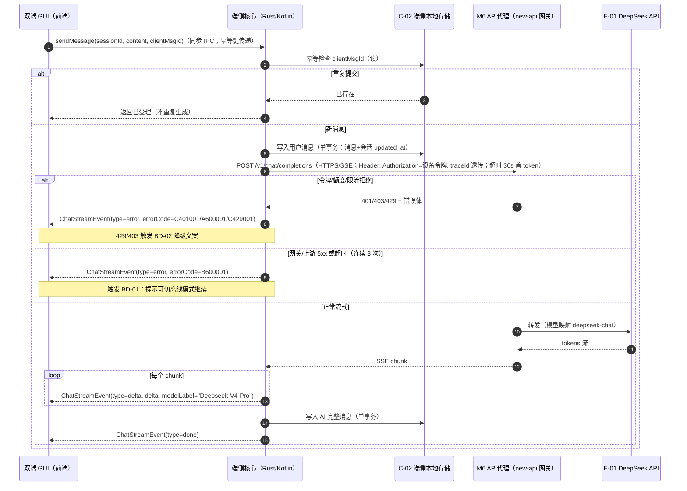
```mermaid
sequenceDiagram
    autonumber
    participant FE as 双端 GUI（前端）
    participant CORE as 端侧核心（Rust/Kotlin）
    participant DB as C-02 端侧本地存储
    participant GW as M6 API代理（new-api 网关）
    participant DS as E-01 DeepSeek API
    FE->>CORE: sendMessage(sessionId, content, clientMsgId)（同步 IPC；幂等键传递）
    CORE->>DB: 幂等检查 clientMsgId（读）
    alt 重复提交
        DB-->>CORE: 已存在
        CORE-->>FE: 返回已受理（不重复生成）
    else 新消息
        CORE->>DB: 写入用户消息（单事务：消息+会话 updated_at）
        CORE->>GW: POST /v1/chat/completions（HTTPS/SSE；Header: Authorization=设备令牌, traceId 透传；超时 30s 首 token）
        alt 令牌/额度/限流拒绝
            GW-->>CORE: 401/403/429 + 错误体
            CORE-->>FE: ChatStreamEvent(type=error, errorCode=C401001/A600001/C429001)
            Note over CORE,FE: 429/403 触发 BD-02 降级文案
        else 网关/上游 5xx 或超时（连续 3 次）
            CORE-->>FE: ChatStreamEvent(type=error, errorCode=B600001)
            Note over CORE,FE: 触发 BD-01：提示可切离线模式继续
        else 正常流式
            GW->>DS: 转发（模型映射 deepseek-chat）
            DS-->>GW: tokens 流
            GW-->>CORE: SSE chunk
            loop 每个 chunk
                CORE-->>FE: ChatStreamEvent(type=delta, delta, modelLabel="Deepseek-V4-Pro")
            end
            CORE->>DB: 写入 AI 完整消息（单事务）
            CORE-->>FE: ChatStreamEvent(type=done)
        end
    end
```

**SQ-M1-02 对话引擎 - 离线对话与模式切换**：

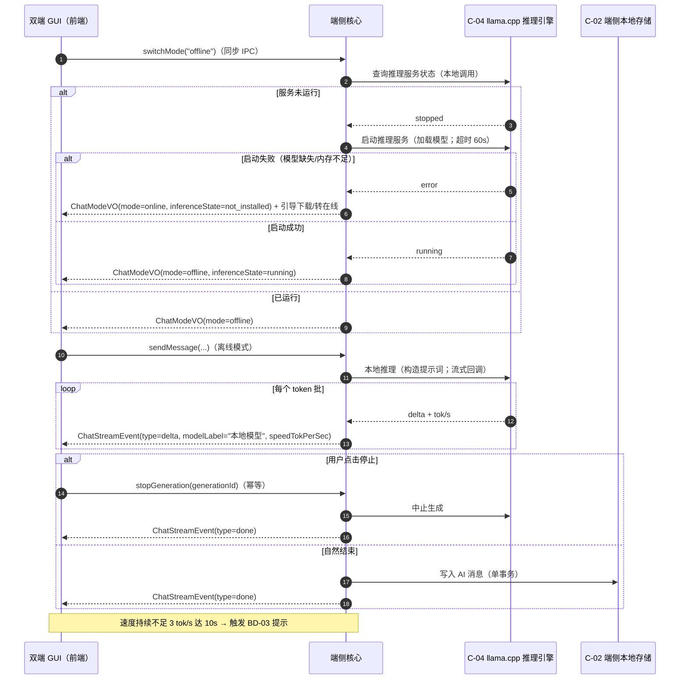
```mermaid
sequenceDiagram
    autonumber
    participant FE as 双端 GUI（前端）
    participant CORE as 端侧核心
    participant INF as C-04 llama.cpp 推理引擎
    participant DB as C-02 端侧本地存储
    FE->>CORE: switchMode("offline")（同步 IPC）
    CORE->>INF: 查询推理服务状态（本地调用）
    alt 服务未运行
        INF-->>CORE: stopped
        CORE->>INF: 启动推理服务（加载模型；超时 60s）
        alt 启动失败（模型缺失/内存不足）
            INF-->>CORE: error
            CORE-->>FE: ChatModeVO(mode=online, inferenceState=not_installed) + 引导下载/转在线
        else 启动成功
            INF-->>CORE: running
            CORE-->>FE: ChatModeVO(mode=offline, inferenceState=running)
        end
    else 已运行
        CORE-->>FE: ChatModeVO(mode=offline)
    end
    FE->>CORE: sendMessage(...)（离线模式）
    CORE->>INF: 本地推理（构造提示词；流式回调）
    loop 每个 token 批
        INF-->>CORE: delta + tok/s
        CORE-->>FE: ChatStreamEvent(type=delta, modelLabel="本地模型", speedTokPerSec)
    end
    alt 用户点击停止
        FE->>CORE: stopGeneration(generationId)（幂等）
        CORE->>INF: 中止生成
        CORE-->>FE: ChatStreamEvent(type=done)
    else 自然结束
        CORE->>DB: 写入 AI 消息（单事务）
        CORE-->>FE: ChatStreamEvent(type=done)
    end
    Note over CORE,FE: 速度持续不足 3 tok/s 达 10s → 触发 BD-03 提示
```

##### §3.2.M1.5 关键流程逻辑

**模式切换与上下文保持流程**（双端一致）：

```
触发：用户点击"模型模式切换器"（在线 ↔ 离线）

Step 1: 目标模式可用性检查（同步）
  ├── 目标=离线：检查模型已下载且校验通过 + 推理服务可启动
  │     ├── 模型缺失 → 拒绝切换，引导跳转模型管理页（错误码 A020001）
  │     └── 内存不足（剩余低于 模型需求×1.3）→ 拒绝切换（错误码 A020002），建议转在线
  ├── 目标=在线：检查网关健康（gatewayHealth != down）
  │     └── down → 拒绝切换并提示（错误码 B600001），建议留在离线
  └── 状态变更：ChatModeVO.mode → 目标模式；当前会话不销毁（会话与模式解耦，历史保留）

Step 2: 切换生效（同步）
  ├── 会话区顶部模型标注即时更新（Deepseek-V4-Pro ↔ 本地模型）
  ├── 状态栏更新：在线显示网关延迟 / 离线显示内存占用与 tok/s
  └── 写本地配置：last_mode 持久化（下次启动恢复）
```

**状态机迁移表（ChatModeVO.inferenceState 离线推理状态机）**：

| 起始状态 | 触发事件 | 终止状态 | 触发条件 / 校验 | 副作用 |
| --- | --- | --- | --- | --- |
| not_installed | download_verified | stopped | 模型下载且 SHA256 校验通过 | 模型资产记录 available=true |
| stopped | start_inference | starting | 剩余内存 ≥ 模型需求 ×1.3 | 推理进程拉起，端口绑定 |
| starting | ready | running | 首次推理预热成功 | 状态栏显示就绪 |
| starting | start_failed | stopped | 进程退出码非 0 / 超时 60s | 错误码 A020003 + 日志 |
| running | stop_inference | stopped | 用户手动停止 | 进程优雅退出（先完成在飞生成） |
| running | crash | stopped | 推理进程异常退出 | 告警日志 + 下次发送时自动尝试重启 1 次 |
| running | low_speed | running | tok/s 不足 3 持续 10s | BD-03 提示（状态不变，仅 UI 提示） |

#### 3.2.M2 模型管理模块

##### §3.2.M2.1 模块概述

模型管理模块覆盖"离线能力建立"全流程——模型一键下载（断点续传+校验）、设备检测与档位匹配、本地推理服务启停、在线↔离线模式开关，业务逻辑在**双端使用者**与**双端 App** 之间流动，同时涉及 **E-03 云厂商对象存储/CDN**（模型分发直链）、**C-04 llama.cpp 推理引擎**（服务生命周期）、**C-02 端侧本地存储**（模型资产记录）、**M1 对话引擎模块**（模式切换的消费方，C-01 Customer/Supplier 关系）等内外部系统的数据流动。

##### §3.2.M2.2 接口清单

> 均为端内接口（IPC/FFI）；网络面仅为模型文件下载（HTTPS 直链，GET + Range，无需鉴权但带防盗链签名 URL，由运维在对象存储侧配置）。

| 子领域 | 方法 | 路径 | 用途（≤ 20 字） | 请求 DTO | 响应 VO | 幂等 |
| --- | --- | --- | --- | --- | --- | --- |
| 模型资产 | GET | `ipc://model/assets` | 模型资产列表与状态 | — | `ModelAssetListVO` | 天然 |
| 模型资产 | GET | `ipc://model/device-check` | 设备 RAM/SoC/存储检测 | — | `DeviceCheckVO` | 天然 |
| 下载管理 | POST | `ipc://model/download:start` | 开始/续传下载 | `ModelDownloadRequest` | `DownloadTaskVO` | 是（asset_id 单任务去重） |
| 下载管理 | POST | `ipc://model/download:pause` | 暂停下载 | `DownloadTaskIdRequest` | `DownloadTaskVO` | 是（重复暂停无副作用） |
| 下载管理 | POST | `ipc://model/download:resume` | 继续下载 | `DownloadTaskIdRequest` | `DownloadTaskVO` | 是（重复继续无副作用） |
| 下载管理 | POST | `ipc://model/download:cancel` | 取消并清理分片 | `DownloadTaskIdRequest` | `Result_null` | 是（重复取消无副作用） |
| 模型资产 | POST | `ipc://model/assets/{id}:verify` | SHA256 重新校验 | — | `ModelVerifyVO` | 天然（只读校验） |
| 模型资产 | DELETE | `ipc://model/assets/{id}` | 删除模型文件 | — | `Result_null` | 天然 |
| 推理服务 | POST | `ipc://model/inference:start` | 启动本地推理 | `InferenceStartRequest` | `InferenceStateVO` | 是（重复启动返回现状） |
| 推理服务 | POST | `ipc://model/inference:stop` | 停止本地推理 | — | `InferenceStateVO` | 是（重复停止无副作用） |
| 推理服务 | GET | `ipc://model/inference:state` | 推理服务状态 | — | `InferenceStateVO` | 天然 |

##### §3.2.M2.3 关键结构定义（DTO）

```typescript
// ===== 模型资产 =====
export interface ModelAssetVO {
  // ===== 基本信息 =====
  id: string;                    // 资产 ID（model_release 清单 key）
  name: string;                  // 实例—"DeepSeek-R1-0528-Qwen3-8B Q4_K_M"
  sizeBytes: number;             // 文件大小（PC ≈ 5.2GB / Android ≈ 4GB）
  license: "MIT" | "Apache-2.0"; // 许可标识（应用内需展示）
  platform: "windows" | "android";
  // ===== 状态字段 =====
  status: "not_downloaded" | "downloading" | "paused" | "verifying" | "available" | "corrupted";
  downloadedBytes: number;       // 已下载字节（断点依据）
  // ===== 时间字段 =====
  updatedAt: string;
}

export interface DeviceCheckVO {
  // ===== 基本信息 =====
  ramMB: number;                 // 物理内存
  socModel: string;              // SoC/CPU 型号，实例—"骁龙 8 Gen2"
  freeStorageMB: number;         // 剩余存储
  // ===== 状态字段 =====
  recommendedTier: "1.5B" | "3B" | "4B" | "7B" | "8B" | "online_only";
  checkPassed: boolean;          // 是否允许下载当前档位
  reason: string;                // 检测结论文案（实例—"6GB RAM，建议使用在线模式"）
}

export interface DownloadTaskVO {
  // ===== 基本信息 =====
  assetId: string;
  // ===== 状态字段 =====
  state: "running" | "paused" | "failed" | "verifying" | "done";
  percent: number;               // 0~100
  speedBytesPerSec: number;
  etaSeconds: number;            // 预计剩余秒
  errorCode?: string;            // failed 时的错误码
}

export interface InferenceStartRequest {
  // ===== 可选字段 =====
  threads?: number;              // 线程数；缺省 = CPU 核数-1（上限 8）
  contextLength?: 2048 | 4096 | 8192; // 上下文长度；缺省 4096
}

export interface InferenceStateVO {
  // ===== 状态字段 =====
  state: "running" | "starting" | "stopped" | "not_installed";
  port?: number;                 // 本地回环端口（127.0.0.1 仅端内）
  memoryMB?: number;             // 当前占用
  loadedModelId?: string;
}
```

| DTO / VO 名 | 字段名 | 类型 | 必填 | 业务含义 | 约束 / 默认值 |
| --- | --- | --- | --- | --- | --- |
| `ModelAssetVO` | `status` | String | 是 | 模型资产状态 | 枚举：not_downloaded / downloading / paused / verifying / available / corrupted |
| `DeviceCheckVO` | `recommendedTier` | String | 是 | 推荐模型档位 | 枚举：1.5B / 3B / 4B / 7B / 8B / online_only |
| `DeviceCheckVO` | `checkPassed` | Boolean | 是 | 是否允许下载 | false 时下载按钮置灰 |
| `DownloadTaskVO` | `state` | String | 是 | 下载任务状态 | 枚举：running / paused / failed / verifying / done |
| `InferenceStartRequest` | `contextLength` | Number | 否 | 上下文长度 | 枚举：2048 / 4096 / 8192；默认 4096 |
| `InferenceStateVO` | `state` | String | 是 | 推理服务状态 | 枚举：running / starting / stopped / not_installed |

##### §3.2.M2.4 模块逻辑时序图

**时序图清单**：

| 编号 | 标题（模块名 - 场景名） | 场景类别 | 是否包含异常分支 |
| --- | --- | --- | --- |
| SQ-M2-01 | 模型管理 - 一键下载与校验（含失败续传） | 核心实体的创建 | 是 |
| SQ-M2-02 | 模型管理 - Android 设备检测与降级引导 | 前置校验 | 是 |

**SQ-M2-01 模型管理 - 一键下载与校验（含失败续传）**：

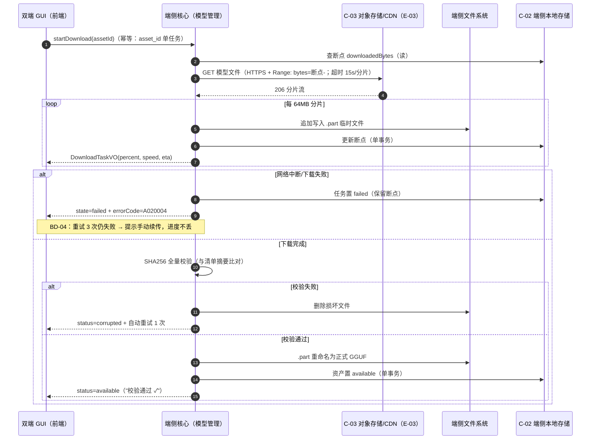
```mermaid
sequenceDiagram
    autonumber
    participant FE as 双端 GUI（前端）
    participant CORE as 端侧核心（模型管理）
    participant CDN as C-03 对象存储/CDN（E-03）
    participant FS as 端侧文件系统
    participant DB as C-02 端侧本地存储
    FE->>CORE: startDownload(assetId)（幂等：asset_id 单任务）
    CORE->>DB: 查断点 downloadedBytes（读）
    CORE->>CDN: GET 模型文件（HTTPS + Range: bytes=断点-；超时 15s/分片）
    CDN-->>CORE: 206 分片流
    loop 每 64MB 分片
        CORE->>FS: 追加写入 .part 临时文件
        CORE->>DB: 更新断点（单事务）
        CORE-->>FE: DownloadTaskVO(percent, speed, eta)
    end
    alt 网络中断/下载失败
        CORE->>DB: 任务置 failed（保留断点）
        CORE-->>FE: state=failed + errorCode=A020004
        Note over CORE,FE: BD-04：重试 3 次仍失败 → 提示手动续传，进度不丢
    else 下载完成
        CORE->>CORE: SHA256 全量校验（与清单摘要比对）
        alt 校验失败
            CORE->>FS: 删除损坏文件
            CORE-->>FE: status=corrupted + 自动重试 1 次
        else 校验通过
            CORE->>FS: .part 重命名为正式 GGUF
            CORE->>DB: 资产置 available（单事务）
            CORE-->>FE: status=available（"校验通过 ✓"）
        end
    end
```

**SQ-M2-02 模型管理 - Android 设备检测与降级引导**：

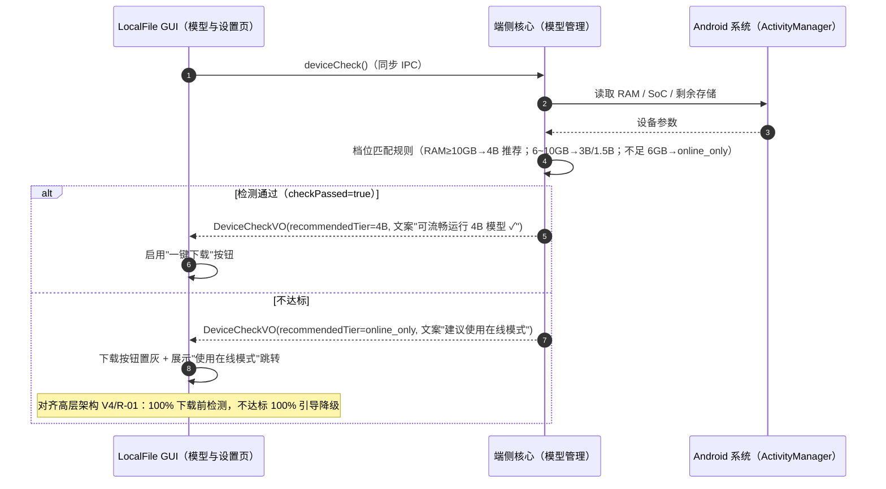
```mermaid
sequenceDiagram
    autonumber
    participant FE as LocalFile GUI（模型与设置页）
    participant CORE as 端侧核心（模型管理）
    participant OS as Android 系统（ActivityManager）
    FE->>CORE: deviceCheck()（同步 IPC）
    CORE->>OS: 读取 RAM / SoC / 剩余存储
    OS-->>CORE: 设备参数
    CORE->>CORE: 档位匹配规则（RAM≥10GB→4B 推荐；6~10GB→3B/1.5B；不足 6GB→online_only）
    alt 检测通过（checkPassed=true）
        CORE-->>FE: DeviceCheckVO(recommendedTier=4B, 文案"可流畅运行 4B 模型 ✓")
        FE->>FE: 启用"一键下载"按钮
    else 不达标
        CORE-->>FE: DeviceCheckVO(recommendedTier=online_only, 文案"建议使用在线模式")
        FE->>FE: 下载按钮置灰 + 展示"使用在线模式"跳转
        Note over FE: 对齐高层架构 V4/R-01：100% 下载前检测，不达标 100% 引导降级
    end
```

##### §3.2.M2.5 关键流程逻辑

**状态机迁移表（ModelAssetVO.status 模型资产生命周期）**：

| 起始状态 | 触发事件 | 终止状态 | 触发条件 / 校验 | 副作用 |
| --- | --- | --- | --- | --- |
| not_downloaded | start_download | downloading | 设备检测通过 + 存储 ≥ 文件×1.1 | 创建 .part 文件与下载任务记录 |
| downloading | pause | paused | 用户暂停 | 释放网络连接，断点保留 |
| paused | resume | downloading | 用户继续 | 从断点 Range 续传 |
| downloading | network_fail | paused（可恢复） | 网络错误自动重试 3 次失败 | BD-04 提示；state 展示 failed 文案 |
| downloading | cancel | not_downloaded | 用户取消 | 删除 .part 与任务记录 |
| downloading | download_complete | verifying | 字节数 = 清单大小 | 开始 SHA256 全量校验 |
| verifying | verify_ok | available | 摘要与清单一致 | .part→正式文件；available=true |
| verifying | verify_fail | corrupted | 摘要不一致 | 删除文件；自动重试下载 1 次 |
| corrupted | retry_download | downloading | 自动/手动重试 | 重新走下载流程 |
| available | delete | not_downloaded | 用户删除（确认弹窗） | 删除 GGUF 文件；若推理运行中先停止 |

#### 3.2.M3 文件处理模块

##### §3.2.M3.1 模块概述

文件处理模块覆盖"手机文件 AI 处理"业务流程——SAF 文件浏览选择、摘要/翻译/智能重命名/提取要点、结果导出与系统分享，业务逻辑在**手机端使用者**与 **LocalFile App** 之间流动，同时涉及 **Android 系统 SAF 与分享面板**（系统能力）、**M1 对话引擎模块**（处理提示词经会话通道执行，复用在线/离线双链路）、**C-02 端侧本地存储**（处理记录）等内外部系统的数据流动。

##### §3.2.M3.2 接口清单

> 均为端内接口（Kotlin 内部调用，ViewModel → 处理层）；AI 执行复用 M1 会话通道（`OpenAiChatRequest` / 本地推理），本模块不新增网络接口。

| 子领域 | 方法 | 路径 | 用途（≤ 20 字） | 请求 DTO | 响应 VO | 幂等 |
| --- | --- | --- | --- | --- | --- | --- |
| 文件访问 | GET | `local://files/recent` | 最近文件列表 | — | `RecentFileListVO` | 天然 |
| 文件访问 | POST | `local://files:pick` | 唤起 SAF 选择并载入 | `FilePickRequest`（分类过滤） | `PickedFileVO` | 天然（只读系统调用） |
| 处理执行 | POST | `local://files/process:start` | 发起 AI 处理任务 | `FileProcessRequest` | `FileProcessEvent`（事件流） | 是（client_task_id） |
| 处理执行 | POST | `local://files/process:cancel` | 取消处理中任务 | `FileTaskIdRequest` | `Result_null` | 是（重复取消无副作用） |
| 处理记录 | GET | `local://files/records?page=&size=` | 处理记录分页 | — | `FileRecordListVO` | 天然 |
| 结果导出 | POST | `local://files/result:export` | 导出 txt 到用户目录 | `FileExportRequest` | `FileExportVO` | 是（重名自动追加序号） |
| 结果导出 | POST | `local://files/result:share` | 调起系统分享面板 | `FileShareRequest` | `Result_null` | 天然 |
| 重命名 | POST | `local://files/rename:apply` | 应用批量重命名 | `FileRenameApplyRequest` | `FileRenameResultVO` | 是（batch_id 去重，失败项不入库重放） |

##### §3.2.M3.3 关键结构定义（DTO）

```kotlin
// ===== 文件访问 =====
data class PickedFileVO(
  // ===== 基本信息 =====
  val uri: String,               // SAF 内容 URI（仅运行时授权，不持久化权限外路径）
  val name: String,              // 文件名
  val sizeBytes: Long,           // 大小
  val mimeType: String,          // text/plain、application/pdf 等
  // ===== 状态字段 =====
  val textExtracted: Boolean,    // 文本是否成功抽取（图片/PDF 走解析，失败给引导）
  val excerptChars: Int          // 已抽取字符数（超长截断提示）
)

// ===== 处理执行 =====
data class FileProcessRequest(
  // ===== 必填字段 =====
  val fileUris: List_String,    // 1~20 个文件 URI（重命名场景支持批量）
  val processType: ProcessType,  // 处理方式
  // ===== 扩展字段 =====
  val clientTaskId: String       // 幂等键：客户端 UUID
)

enum class ProcessType { SUMMARIZE, TRANSLATE, RENAME_SUGGEST, EXTRACT_POINTS }

data class FileProcessEvent(
  // ===== 基本信息 =====
  val taskId: String,
  // ===== 状态字段 =====
  val type: EventType,           // progress / result / error
  val percent: Int = 0,
  val resultText: String? = null,         // type=result：摘要/翻译/要点文本
  val renamePairs: List_RenamePair? = null, // type=result（RENAME_SUGGEST）：旧名→新名对照
  val errorCode: String? = null,
  val errorMsg: String? = null
) { enum class EventType { PROGRESS, RESULT, ERROR } }

data class RenamePair(val oldName: String, val newName: String)

// ===== 重命名应用 =====
data class FileRenameApplyRequest(
  // ===== 必填字段 =====
  val batchId: String,           // 幂等键：同一对照列表仅应用一次
  val pairs: List_RenamePair
)

data class FileRenameResultVO(
  // ===== 状态字段 =====
  val successCount: Int,
  val failedItems: List_RenameFailItem  // 失败项含原因（占用/权限/重名）
)
data class RenameFailItem(val pair: RenamePair, val reason: String)
```

| DTO / VO 名 | 字段名 | 类型 | 必填 | 业务含义 | 约束 / 默认值 |
| --- | --- | --- | --- | --- | --- |
| `FileProcessRequest` | `processType` | Enum | 是 | 处理方式 | 枚举：SUMMARIZE / TRANSLATE / RENAME_SUGGEST / EXTRACT_POINTS |
| `FileProcessRequest` | `fileUris` | List | 是 | 目标文件 | 1~20 个；总大小 ≤ 50MB |
| `FileProcessEvent` | `type` | Enum | 是 | 事件类型 | 枚举：PROGRESS / RESULT / ERROR |
| `RenamePair` | `newName` | String | 是 | 建议新文件名 | 长度 ≤ 120；过滤非法字符 `\/:*?"<>\|` |
| `FileRenameApplyRequest` | `batchId` | String(UUID) | 是 | 批量幂等键 | 同 batchId 重复提交直接返回上次结果 |

##### §3.2.M3.4 模块逻辑时序图

**时序图清单**：

| 编号 | 标题（模块名 - 场景名） | 场景类别 | 是否包含异常分支 |
| --- | --- | --- | --- |
| SQ-M3-01 | 文件处理 - 摘要/翻译处理流程（复用对话链路） | 核心动作的执行 | 是 |
| SQ-M3-02 | 文件处理 - 批量重命名建议与应用 | 核心动作的执行 + 写操作 | 是 |

**SQ-M3-01 文件处理 - 摘要/翻译处理流程（复用对话链路）**：

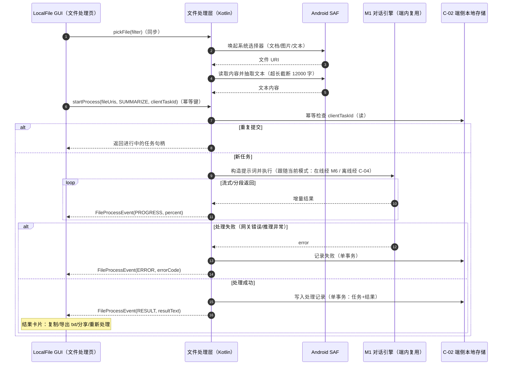
```mermaid
sequenceDiagram
    autonumber
    participant FE as LocalFile GUI（文件处理页）
    participant FP as 文件处理层（Kotlin）
    participant SAF as Android SAF
    participant CHAT as M1 对话引擎（端内复用）
    participant DB as C-02 端侧本地存储
    FE->>FP: pickFile(filter)（同步）
    FP->>SAF: 唤起系统选择器（文档/图片/文本）
    SAF-->>FP: 文件 URI
    FP->>SAF: 读取内容并抽取文本（超长截断 12000 字）
    SAF-->>FP: 文本内容
    FE->>FP: startProcess(fileUris, SUMMARIZE, clientTaskId)（幂等键）
    FP->>DB: 幂等检查 clientTaskId（读）
    alt 重复提交
        FP-->>FE: 返回进行中的任务句柄
    else 新任务
        FP->>CHAT: 构造提示词并执行（跟随当前模式：在线经 M6 / 离线经 C-04）
        loop 流式/分段返回
            CHAT-->>FP: 增量结果
            FP-->>FE: FileProcessEvent(PROGRESS, percent)
        end
        alt 处理失败（网关错误/推理异常）
            CHAT-->>FP: error
            FP->>DB: 记录失败（单事务）
            FP-->>FE: FileProcessEvent(ERROR, errorCode)
        else 处理成功
            FP->>DB: 写入处理记录（单事务：任务+结果）
            FP-->>FE: FileProcessEvent(RESULT, resultText)
            Note over FE: 结果卡片：复制/导出 txt/分享/重新处理
        end
    end
```

**SQ-M3-02 文件处理 - 批量重命名建议与应用**：

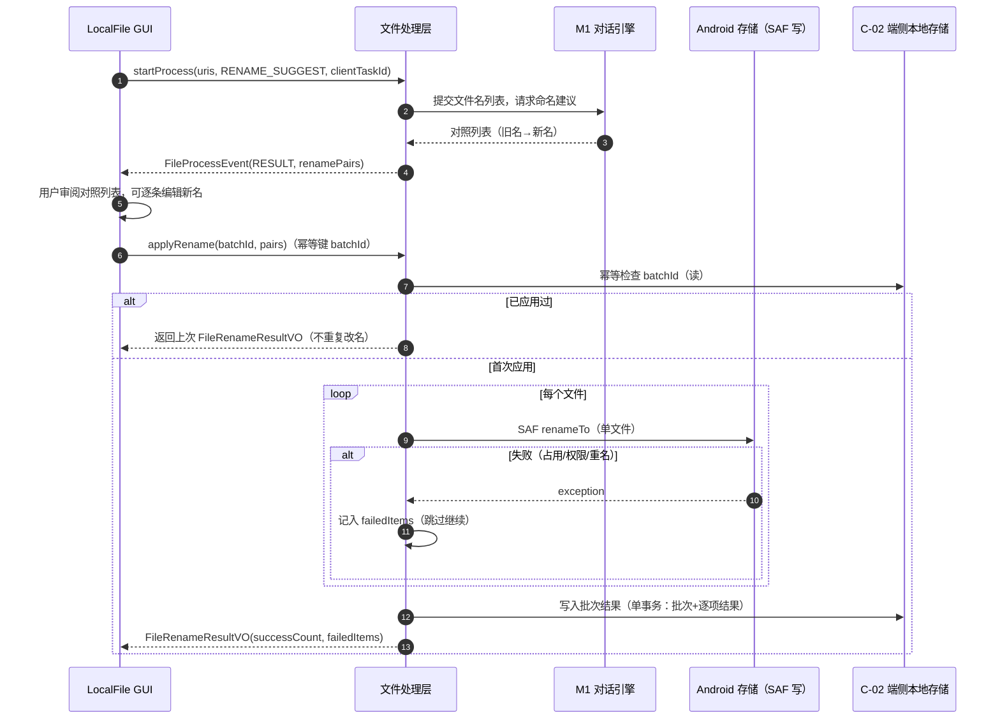
```mermaid
sequenceDiagram
    autonumber
    participant FE as LocalFile GUI
    participant FP as 文件处理层
    participant CHAT as M1 对话引擎
    participant FS as Android 存储（SAF 写）
    participant DB as C-02 端侧本地存储
    FE->>FP: startProcess(uris, RENAME_SUGGEST, clientTaskId)
    FP->>CHAT: 提交文件名列表，请求命名建议
    CHAT-->>FP: 对照列表（旧名→新名）
    FP-->>FE: FileProcessEvent(RESULT, renamePairs)
    FE->>FE: 用户审阅对照列表，可逐条编辑新名
    FE->>FP: applyRename(batchId, pairs)（幂等键 batchId）
    FP->>DB: 幂等检查 batchId（读）
    alt 已应用过
        FP-->>FE: 返回上次 FileRenameResultVO（不重复改名）
    else 首次应用
        loop 每个文件
            FP->>FS: SAF renameTo（单文件）
            alt 失败（占用/权限/重名）
                FS-->>FP: exception
                FP->>FP: 记入 failedItems（跳过继续）
            end
        end
        FP->>DB: 写入批次结果（单事务：批次+逐项结果）
        FP-->>FE: FileRenameResultVO(successCount, failedItems)
    end
```

##### §3.2.M3.5 关键流程逻辑

无复杂状态机/事务/跨多步异步需要展开——处理任务为单次请求-响应式流程（进度事件无状态迁移分支），重命名批次已通过 `batchId` 幂等与逐项容错在时序图 SQ-M3-02 中完整表达；本段按模板纪律显式注明：**本段省略**（任务状态仅 running/done/failed 三态线性流转，无回滚与补偿场景；文件文本抽取超长截断、图片 OCR 走系统 ML Kit 识别的细节属实现层，不构成本设计的跨模块契约）。

#### 3.2.M4 远程控制模块（双端：控制面 + 执行面）

##### §3.2.M4.1 模块概述

远程控制模块覆盖"设备配对"与"对话式指令通道"业务流程，业务逻辑在**手机端使用者（控制面）**、**电脑端使用者/在场者（执行面确认方）**之间流动，同时涉及 **M5 中继调度模块**（WSS 传输与配对签发，C-05 Open Host/Published Language 关系）、**M1 对话引擎模块**（指令触发对话任务，C-03 Shared Kernel 共享信封与枚举）、**C-02 端侧本地存储**（白名单配置、绑定信息、执行留痕）等内外部系统的数据流动。本模块是高层架构 V2（配对 ≤60s、指令 P95 ≤3s）与安全红线（危险操作本机拦截）的直接承载者。

##### §3.2.M4.2 接口清单

> 本模块对外协议为 **WSS 指令信封**（非 REST），信封结构见 §3.2.M4.3；下表按消息类型列出。信封 `type` 字段即"路径"语义。鉴权要求：配对建立前仅 `pair.*` 类型放行；建立后所有 `cmd.*` 必须携带已绑定 deviceId 对（§7.2.1）。

| 子领域 | 方向 | 信封 type | 用途（≤ 20 字） | 请求 payload | 响应/回执 payload | 幂等 |
| --- | --- | --- | --- | --- | --- | --- |
| 配对 | LocalMind→M5 | `pair.code.create` | 申请生成配对码 | `PairCodeCreatePayload` | `PairCodeVO` | 是（同设备并发请求去重） |
| 配对 | LocalFile→M5 | `pair.code.submit` | 提交配对码绑定 | `PairCodeSubmitPayload` | `PairBindResultVO` | 是（配对码一次性原子核销） |
| 配对 | 双端→M5 | `pair.unbind` | 解除绑定关系 | `UnbindPayload` | `Result_null` | 天然（重复解绑无副作用） |
| 设备管理 | 端内 IPC | `ipc://remote/devices` 系列 | 设备列表/重命名/解绑 | 见端内 DTO | `PairedDeviceListVO` 等 | 重命名幂等（id+name） |
| 指令通道 | LocalFile→M5→LocalMind | `cmd.send` | 发送远程指令 | `CmdSendPayload` | `CmdAckPayload`（已送达回执） | 是（commandId 客户端生成） |
| 指令通道 | LocalMind→M5→LocalFile | `cmd.status` | 状态推进通知 | `CmdStatusPayload` | — | 是（commandId+status 去重） |
| 指令通道 | LocalMind→M5→LocalFile | `cmd.result` | 执行结果回传 | `CmdResultPayload` | — | 是（commandId 终态唯一） |
| 执行确认 | 端内 IPC | `ipc://remote/confirm:reply` | 本机确认允许/拒绝 | `ConfirmReplyRequest` | `Result_null` | 是（commandId 单决议） |
| 白名单 | 端内 IPC | `ipc://remote/whitelist` 系列 | 白名单配置查询/更新 | `WhitelistUpdateRequest` | `WhitelistConfigVO` | 是（整体覆盖式更新） |

##### §3.2.M4.3 关键结构定义（DTO）

```typescript
// ===== 指令信封（Shared Kernel：shared-contract/envelope/v1，三端一致） =====
export interface CommandEnvelope_T {
  // ===== 协议头（必填） =====
  version: "v1";                       // 协议版本（Published Language 版本化）
  type: string;                        // 消息类型，实例—"cmd.send"
  envelopeId: string;                  // 信封 ID（UUID，链路日志锚点）
  traceId: string;                     // 全链路追踪（W3C，§8.3）
  timestamp: string;                   // ISO8601 UTC
  // ===== 路由信息 =====
  fromDeviceId: string;                // 发送设备
  toDeviceId: string;                  // 目标设备（中继依此路由）
  tenantId: string;                    // 数据归属 = 配对关系 ID（§4.1 隔离字段）
  // ===== 载荷 =====
  payload: T;
}

// ===== 配对 =====
export interface PairCodeCreatePayload {
  // ===== 基本信息 =====
  deviceName: string;                  // 电脑端设备名，实例—"DESKTOP-宿舍PC"
  platform: "windows";
}
export interface PairCodeVO {
  code: string;                        // 6 位数字配对码
  ttlSeconds: 300;                     // 固定 5 分钟
  qrContent: string;                   // 二维码内容（含 code 的短串）
}
export interface PairCodeSubmitPayload {
  code: string;                        // 用户输入/扫码所得
  deviceName: string;                  // 手机设备名
  platform: "android";
  deviceFingerprint: string;           // 设备指纹（机型+首次安装随机 ID）
}
export interface PairBindResultVO {
  // ===== 状态字段 =====
  result: "bound" | "invalid_code" | "expired" | "already_used";
  pairingId?: string;                  // 绑定成功后的配对关系 ID（=tenantId）
  peerDeviceName?: string;
}

// ===== 指令通道 =====
export interface CmdSendPayload {
  // ===== 必填字段 =====
  commandId: string;                   // 幂等键：客户端 UUID
  text: string;                        // 自然语言指令或快捷指令文本，≤ 500 字
  // ===== 可选字段 =====
  actionHint?: string;                 // 快捷指令的动作提示（whitelist action key）
}
export interface CmdAckPayload {
  commandId: string;
  relayReceivedAt: string;             // 中继收到时间（时延度量点 1）
  deliveredAt?: string;                // 下行送达时间（时延度量点 2）
}
export type CmdStatus = "sent" | "delivered" | "running" | "done" | "failed" | "rejected" | "offline_failed";
export interface CmdStatusPayload {
  commandId: string;
  status: CmdStatus;
  reason?: string;                     // failed/rejected/offline_failed 的原因文案
}
export interface CmdResultPayload {
  commandId: string;
  resultType: "text";                  // MVP 仅文本；完整版扩展 "screenshot"（F4.4 预留）
  resultText: string;                  // 执行结果（≤ 2000 字）
  durationMs: number;
}

// ===== 白名单与确认 =====
export interface WhitelistActionDef {   // 来自 shared-contract/whitelist（三端一致）
  key: string;                         // 实例—"open_app" / "file_write" / "volume_set"
  label: string;                       // 实例—"打开应用"
  dangerLevel: "normal" | "dangerous"; // dangerous 强制本机二次确认
  enabled: boolean;                    // 用户在白名单勾选状态
}
export interface ConfirmReplyRequest {
  commandId: string;
  decision: "allow" | "deny";
}
```

| DTO / VO 名 | 字段名 | 类型 | 必填 | 业务含义 | 约束 / 默认值 |
| --- | --- | --- | --- | --- | --- |
| `CommandEnvelope` | `version` | String | 是 | 协议版本 | 枚举：v1（完整版向后兼容扩展） |
| `CommandEnvelope` | `type` | String | 是 | 消息类型 | 枚举：pair.code.create / pair.code.submit / pair.unbind / cmd.send / cmd.status / cmd.result / ping / pong |
| `CommandEnvelope` | `tenantId` | String | 是 | 数据归属标识 | = 配对关系 pairingId；配对流程中=配对码临时会话 ID |
| `PairCodeVO` | `ttlSeconds` | Number | 是 | 配对码有效期 | 固定 300 |
| `CmdSendPayload` | `commandId` | String(UUID) | 是 | 指令幂等键 | 中继与执行面依此去重 |
| `CmdSendPayload` | `text` | String | 是 | 指令文本 | 长度 1~500 |
| `CmdStatusPayload` | `status` | String | 是 | 指令状态 | 枚举：sent / delivered / running / done / failed / rejected / offline_failed |
| `CmdResultPayload` | `resultType` | String | 是 | 结果类型 | 枚举：text（MVP）；完整版预留 screenshot |
| `WhitelistActionDef` | `dangerLevel` | String | 是 | 危险等级 | 枚举：normal / dangerous |

##### §3.2.M4.4 模块逻辑时序图

**时序图清单**：

| 编号 | 标题（模块名 - 场景名） | 场景类别 | 是否包含异常分支 |
| --- | --- | --- | --- |
| SQ-M4-01 | 远程控制 - 配对建立（配对码核销） | 核心实体的创建 | 是 |
| SQ-M4-02 | 远程控制 - 指令下发/确认/回执全链路 | 核心动作的执行 | 是 |

**SQ-M4-01 远程控制 - 配对建立（配对码核销）**（泳道渲染版另见 `pic/pairing-flow/pairing-flow.png`，Mermaid 为权威源）：

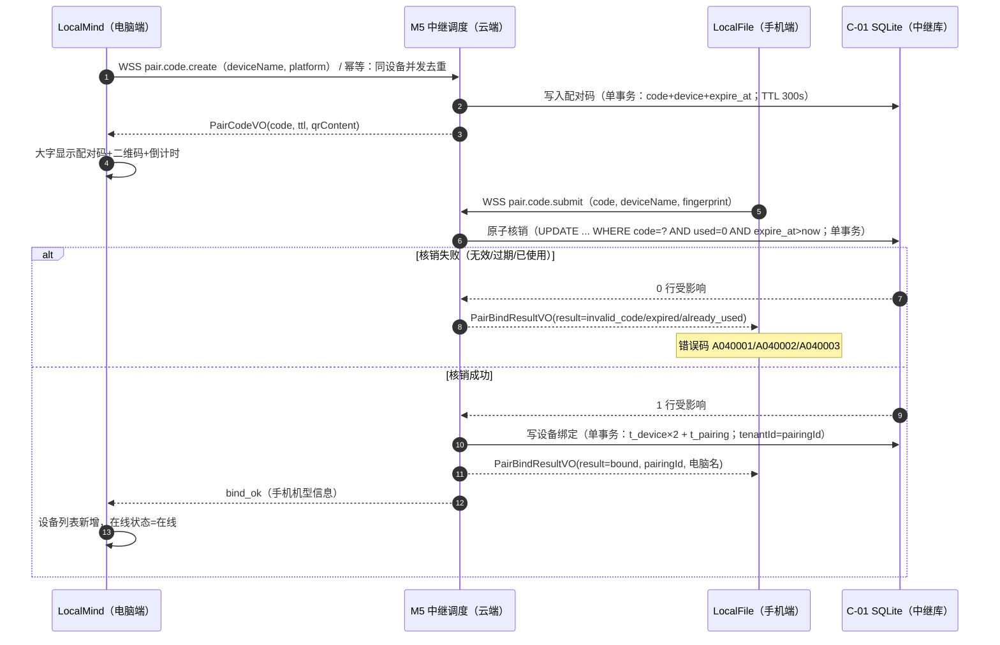
```mermaid
sequenceDiagram
    autonumber
    participant LM as LocalMind（电脑端）
    participant M5 as M5 中继调度（云端）
    participant LF as LocalFile（手机端）
    participant DB as C-01 SQLite（中继库）
    LM->>M5: WSS pair.code.create（deviceName, platform） / 幂等：同设备并发去重
    M5->>DB: 写入配对码（单事务：code+device+expire_at；TTL 300s）
    M5-->>LM: PairCodeVO(code, ttl, qrContent)
    LM->>LM: 大字显示配对码+二维码+倒计时
    LF->>M5: WSS pair.code.submit（code, deviceName, fingerprint）
    M5->>DB: 原子核销（UPDATE ... WHERE code=? AND used=0 AND expire_at>now；单事务）
    alt 核销失败（无效/过期/已使用）
        DB-->>M5: 0 行受影响
        M5-->>LF: PairBindResultVO(result=invalid_code/expired/already_used)
        Note over LF: 错误码 A040001/A040002/A040003
    else 核销成功
        DB-->>M5: 1 行受影响
        M5->>DB: 写设备绑定（单事务：t_device×2 + t_pairing；tenantId=pairingId）
        M5-->>LF: PairBindResultVO(result=bound, pairingId, 电脑名)
        M5-->>LM: bind_ok（手机机型信息）
        LM->>LM: 设备列表新增，在线状态=在线
    end
```

**SQ-M4-02 远程控制 - 指令下发/确认/回执全链路**：

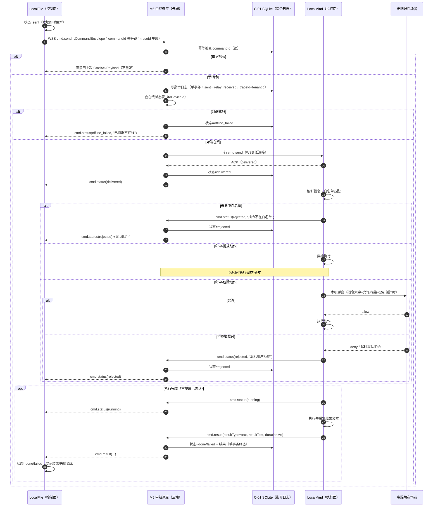
```mermaid
sequenceDiagram
    autonumber
    participant LF as LocalFile（控制面）
    participant M5 as M5 中继调度（云端）
    participant DB as C-01 SQLite（指令日志）
    participant LM as LocalMind（执行面）
    participant HUMAN as 电脑端在场者
    LF->>LF: 状态=sent（本地即时更新）
    LF->>M5: WSS cmd.send（CommandEnvelope；commandId 幂等键；traceId 生成）
    M5->>DB: 幂等检查 commandId（读）
    alt 重复指令
        M5-->>LF: 直接回上次 CmdAckPayload（不重发）
    else 新指令
        M5->>DB: 写指令日志（单事务：sent→relay_received，traceId+tenantId）
        M5->>M5: 查在线状态表（toDeviceId）
        alt 对端离线
            M5->>DB: 状态=offline_failed
            M5-->>LF: cmd.status(offline_failed, "电脑端不在线")
        else 对端在线
            M5->>LM: 下行 cmd.send（WSS 长连接）
            LM-->>M5: ACK（delivered）
            M5->>DB: 状态=delivered
            M5-->>LF: cmd.status(delivered)
            LM->>LM: 解析指令→白名单匹配
            alt 未命中白名单
                LM->>M5: cmd.status(rejected, "指令不在白名单")
                M5->>DB: 状态=rejected
                M5-->>LF: cmd.status(rejected) + 原因红字
            else 命中-常规动作
                LM->>LM: 直接执行
                Note over LM,M5: 后续同"执行完成"分支
            else 命中-危险动作
                LM->>HUMAN: 本机弹窗（指令大字+允许/拒绝+15s 倒计时）
                alt 允许
                    HUMAN-->>LM: allow
                    LM->>LM: 执行动作
                else 拒绝或超时
                    HUMAN-->>LM: deny / 超时默认拒绝
                    LM->>M5: cmd.status(rejected, "本机用户拒绝")
                    M5->>DB: 状态=rejected
                    M5-->>LF: cmd.status(rejected)
                end
            end
            opt 执行完成（常规或已确认）
                LM->>M5: cmd.status(running)
                M5-->>LF: cmd.status(running)
                LM->>LM: 执行并采集结果文本
                LM->>M5: cmd.result(resultType=text, resultText, durationMs)
                M5->>DB: 状态=done/failed + 结果（单事务终态）
                M5-->>LF: cmd.result(...)
                LF->>LF: 状态=done/failed，展示结果/失败原因
            end
        end
    end
```

##### §3.2.M4.5 关键流程逻辑

**白名单执行器调度流程（LocalMind 执行面）**：

```
触发：收到下行 cmd.send 信封

Step 1: 信封校验（同步）
  ├── 校验：version == v1 → 不支持版本回 cmd.status(failed, "协议版本不兼容")
  ├── 校验：tenantId 在本机绑定表中 → 未绑定回 cmd.status(rejected, "设备未配对")
  ├── 校验：远程控制总开关 == 开 → 关闭时全部回 cmd.status(rejected, "远程控制已停用")
  └── 幂等：commandId 在执行留痕表中已存在 → 直接回传上次结果（不重复执行）

Step 2: 指令解析与白名单匹配（同步）
  ├── 快捷指令：actionHint 直接映射白名单 key
  ├── 自然语言：本地规则解析器（关键词+模板，MVP 不走大模型解析）映射候选动作
  │     └── [简化] MVP 采用模板匹配（实例—"打开浏览器"→open_app:browser、"音量调到50"→volume_set:50）；
  │         未命中模板 → cmd.status(rejected, "暂不支持该指令，可试试快捷指令")
  │         [完整版替换点] 接入 M1 对话引擎做 NLU 解析（信封已含 text 原文，无需改协议）
  ├── 动作参数校验：实例—音量 0~100、应用名在注册表内
  └── 未启用（用户取消勾选）→ cmd.status(rejected, "该动作已被本机停用")

Step 3: 危险分级与确认（异步等待人）
  ├── dangerLevel=normal → 直接执行
  └── dangerLevel=dangerous 且"危险操作需本机确认"开关=开
        ├── 弹窗 15s 倒计时；allow → 执行；deny/超时 → rejected
        └── 确认决议写执行留痕（谁、何时、允许与否）

Step 4: 执行与回传（同步执行，异步回传）
  ├── 执行动作（超时 30s）；采集结果文本（stdout/操作摘要）
  ├── 写执行留痕（本地 t_execution_log：指令全文、来源设备、决议、结果、耗时）
  └── 回传 cmd.status(running) → cmd.result(done/failed)
```

**状态机迁移表（CmdStatus 指令状态机，手机端可见）**：

| 起始状态 | 触发事件 | 终止状态 | 触发条件 / 校验 | 副作用 |
| --- | --- | --- | --- | --- |
| （无） | user_send | sent | 本地封装信封完成 | 手机端列表插入指令卡片 |
| sent | relay_received | sent | 中继写日志（状态值不变，记录 relay_received_at） | 时延度量点 1 |
| sent | delivered | delivered | 对端 ACK | 状态徽标推进 |
| sent | peer_offline | offline_failed | 中继查在线表=离线 | 失败红字"电脑端不在线" |
| delivered | whitelist_reject | rejected | 未配对/总开关关/未命中白名单/动作被停用 | 原因文案 |
| delivered | confirm_timeout_or_deny | rejected | 本机拒绝或 15s 超时 | "本机用户拒绝/未确认" |
| delivered | exec_start | running | 白名单执行器开始执行 | 状态徽标"执行中" |
| running | exec_done | done | 执行成功，结果回传 | 结果文本折叠区可展开 |
| running | exec_fail | failed | 执行抛异常/超时 30s | 失败原因红字 + 本机留痕堆栈 |
| done / failed / rejected / offline_failed | — | （终态） | 终态不可逆 | 仅支持查看与清空记录 |

**终态幂等约定**：中继对 `cmd.status` / `cmd.result` 按 `commandId` 去重，终态（done/failed/rejected/offline_failed）首次写入后忽略后续同键消息；LocalMind 重连补发未确认回执时不会产生重复执行（执行面以 commandId 判重）。

#### 3.2.M5 中继调度模块（云端）

##### §3.2.M5.1 模块概述

中继调度模块覆盖"双端协同连接建立与指令中转"业务流程，业务逻辑在 **LocalFile 控制面** 与 **LocalMind 执行面** 之间经云端流动，同时涉及 **C-01 SQLite（中继库）**（设备/配对/指令日志持久化）、**C-05 云主机**（运行载体）、**M4 远程控制模块**（双端协议消费方，C-05 Open Host/Published Language 关系）等内外部系统的数据流动。本模块坚守"中继零内容理解"原则：只做信封路由、状态记账与在线状态管理，不解析指令语义。

##### §3.2.M5.2 接口清单

> 对外暴露 WSS 接入点 + 少量 REST 管理/健康接口。WSS 信封复用 §3.2.M4.3 结构（本模块为信封的中转与签发方）。

| 子领域 | 方法 | 路径 / 信封 type | 用途（≤ 20 字） | 请求 DTO | 响应 VO | 幂等 |
| --- | --- | --- | --- | --- | --- | --- |
| 连接接入 | GET(Upgrade) | `wss://{host}/ws?deviceId=&role=` | 双端长连接接入 | Query（deviceId/role/authTicket） | WSS 通道 | — |
| 心跳 | WSS | `ping` / `pong` | 保活与在线状态维护 | `PingPayload` | `PongPayload` | 天然 |
| 配对 | WSS | `pair.code.create` | 签发配对码 | `PairCodeCreatePayload` | `PairCodeVO` | 是（同 deviceId 未过期码复用） |
| 配对 | WSS | `pair.code.submit` | 校验核销配对码 | `PairCodeSubmitPayload` | `PairBindResultVO` | 是（原子核销） |
| 配对 | WSS | `pair.unbind` | 解绑并通知对端 | `UnbindPayload` | `Result_null` | 天然 |
| 路由中转 | WSS | `cmd.send` | 指令下行路由 | `CmdSendPayload` | `CmdAckPayload` | 是（commandId） |
| 路由中转 | WSS | `cmd.status` / `cmd.result` | 回执上行中转 | 对应 Payload | — | 是（commandId 终态去重） |
| 健康检查 | GET | `/healthz` | 进程存活探针 | — | `HealthVO` | 天然 |
| 健康检查 | GET | `/readyz` | 依赖就绪探针（SQLite 可写） | — | `HealthVO` | 天然 |
| 指标 | GET | `/metrics` | 在线设备数/信封吞吐/时延分位 | — | Prometheus 文本格式 | 天然 |

##### §3.2.M5.3 关键结构定义（DTO）

```rust
// ===== 连接接入 =====
pub struct WsConnectQuery {
    // ===== 必填字段 =====
    pub device_id: String,        // 设备 ID（首次启动生成的持久 UUID）
    pub role: Role,               // desktop | android
    // ===== 鉴权字段 =====
    pub auth_ticket: String,      // 接入票据：pairingId + HMAC（配对后由中继下发并轮换）
}
pub enum Role { Desktop, Android }

// ===== 健康与指标 =====
pub struct HealthVO {
    // ===== 状态字段 =====
    pub status: String,           // ok / fail
    pub uptime_seconds: u64,
    pub db_writable: Option_bool,// /readyz 附加
}

// ===== 配对码内部记录（不直接对外，见 §4.2 t_pairing） =====
pub struct PairingCodeRecord {
    pub code: String,             // 6 位数字
    pub desktop_device_id: String,
    pub expire_at: i64,           // epoch 秒（now+300）
    pub used: bool,               // 原子核销标记
    pub session_id: String,       // 配对流程临时 tenantId
}

// ===== 在线状态表（内存为主，SQLite 兜底） =====
pub struct PresenceEntry {
    pub device_id: String,
    pub pairing_id: String,       // tenantId
    pub connected_at: i64,
    pub last_pong_at: i64,        // >45s 未 pong 判定掉线
}
```

| DTO / VO 名 | 字段名 | 类型 | 必填 | 业务含义 | 约束 / 默认值 |
| --- | --- | --- | --- | --- | --- |
| `WsConnectQuery` | `role` | Enum | 是 | 接入端角色 | 枚举：desktop / android |
| `WsConnectQuery` | `auth_ticket` | String | 是 | 接入票据 | HMAC-SHA256(pairingId+deviceId+expire, 服务端密钥)；有效期 7 天，连接时校验 |
| `HealthVO` | `status` | String | 是 | 健康状态 | 枚举：ok / fail |
| `PairingCodeRecord` | `expire_at` | i64 | 是 | 过期时间 | 签发时刻 +300s |
| `PresenceEntry` | `last_pong_at` | i64 | 是 | 最近心跳 | 45s 无 pong 标记 offline |

##### §3.2.M5.4 模块逻辑时序图

**时序图清单**：

| 编号 | 标题（模块名 - 场景名） | 场景类别 | 是否包含异常分支 |
| --- | --- | --- | --- |
| SQ-M5-01 | 中继调度 - 长连接接入与心跳保活 | 连接生命周期 | 是 |
| SQ-M5-02 | 中继调度 - 断线重连与回执补发 | 异常 / 补偿 | 是 |

**SQ-M5-01 中继调度 - 长连接接入与心跳保活**：

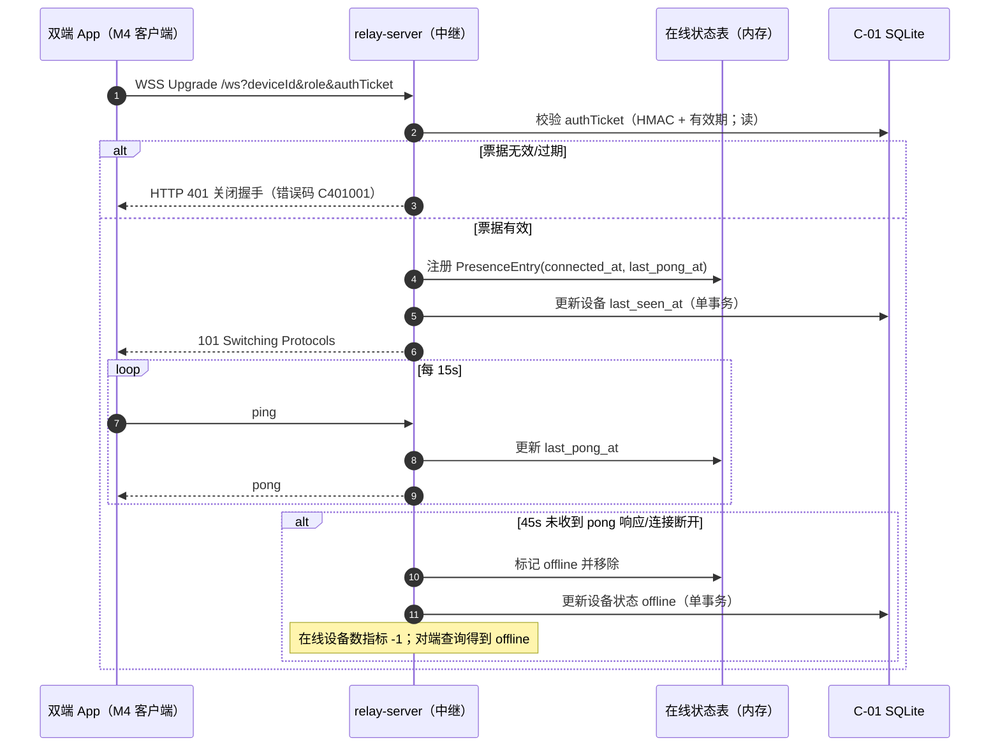
```mermaid
sequenceDiagram
    autonumber
    participant APP as 双端 App（M4 客户端）
    participant M5 as relay-server（中继）
    participant MEM as 在线状态表（内存）
    participant DB as C-01 SQLite
    APP->>M5: WSS Upgrade /ws?deviceId&role&authTicket
    M5->>DB: 校验 authTicket（HMAC + 有效期；读）
    alt 票据无效/过期
        M5-->>APP: HTTP 401 关闭握手（错误码 C401001）
    else 票据有效
        M5->>MEM: 注册 PresenceEntry(connected_at, last_pong_at)
        M5->>DB: 更新设备 last_seen_at（单事务）
        M5-->>APP: 101 Switching Protocols
        loop 每 15s
            APP->>M5: ping
            M5->>MEM: 更新 last_pong_at
            M5-->>APP: pong
        end
        alt 45s 未收到 pong 响应/连接断开
            M5->>MEM: 标记 offline 并移除
            M5->>DB: 更新设备状态 offline（单事务）
            Note over M5: 在线设备数指标 -1；对端查询得到 offline
        end
    end
```

**SQ-M5-02 中继调度 - 断线重连与回执补发**：

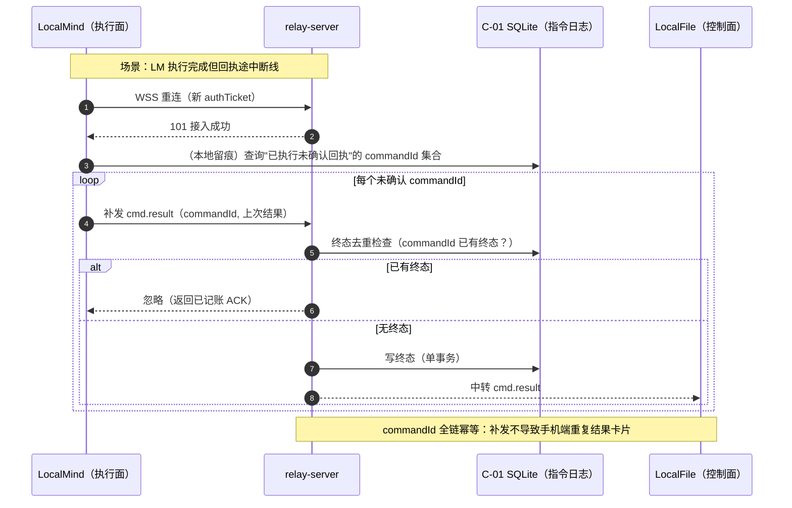
```mermaid
sequenceDiagram
    autonumber
    participant LM as LocalMind（执行面）
    participant M5 as relay-server
    participant DB as C-01 SQLite（指令日志）
    participant LF as LocalFile（控制面）
    Note over LM,M5: 场景：LM 执行完成但回执途中断线
    LM->>M5: WSS 重连（新 authTicket）
    M5-->>LM: 101 接入成功
    LM->>DB: （本地留痕）查询"已执行未确认回执"的 commandId 集合
    loop 每个未确认 commandId
        LM->>M5: 补发 cmd.result（commandId, 上次结果）
        M5->>DB: 终态去重检查（commandId 已有终态？）
        alt 已有终态
            M5-->>LM: 忽略（返回已记账 ACK）
        else 无终态
            M5->>DB: 写终态（单事务）
            M5-->>LF: 中转 cmd.result
        end
    end
    Note over M5,LF: commandId 全链幂等：补发不导致手机端重复结果卡片
```

##### §3.2.M5.5 关键流程逻辑

**配对码签发与核销流程**：

```
触发：pair.code.create

Step 1: 签发（同步）
  ├── 校验：fromDevice 角色 == desktop → 否则错误码 C400001
  ├── 幂等：同 deviceId 存在未过期且未使用配对码 → 直接复用返回（防连点）
  ├── 生成：6 位数字（CSPRNG），冲突时重生成 ≤ 3 次
  └── 写库（单事务）：code + desktop_device_id + expire_at(+300s) + session_id

触发：pair.code.submit

Step 2: 核销与绑定（同步，原子）
  ├── 原子核销：UPDATE t_pairing SET used=1 WHERE code=? AND used=0 AND expire_at>now
  │     └── 影响 0 行 → 区分原因返回 invalid_code / expired / already_used（A040001~A040003）
  ├── 写绑定（单事务）：UPSERT 两台 t_device + INSERT t_pairing（pairingId=UUID，即后续 tenantId）
  ├── 签发双向 authTicket（HMAC，7 天）随 bind_ok 下发
  └── 通知桌面端 bind_ok（对端在线时实时；不在线则上线后首条同步）

Step 3: 过期清理（异步定时）
  ├── 每 10 分钟物理删除 expire_at 早于 now-1h 的配对码记录（§4.2 t_pairing 清理机制）
  └── 指标：active_pairing_codes 计数维护
```

**状态机迁移表（PresenceEntry 设备在线状态机）**：

| 起始状态 | 触发事件 | 终止状态 | 触发条件 / 校验 | 副作用 |
| --- | --- | --- | --- | --- |
| offline | ws_connect_ok | online | authTicket 校验通过 | 注册 PresenceEntry；更新 last_seen_at；对端可见"在线" |
| online | pong_timeout | offline | 45s 无 pong | 移除在线表项；指令路由返回 offline_failed |
| online | ws_close | offline | 连接正常/异常关闭 | 同上 |
| online | kick | offline | 同 deviceId 新连接接入（单点登录策略：后连接踢前连接） | 旧连接收到 close(4009, "他处登录") |

#### 3.2.M6 API代理模块（云端）

##### §3.2.M6.1 模块概述

API代理模块覆盖"在线大模型流量的统一入口与管控"业务流程——OpenAI 兼容转发、模型显示名映射（Deepseek-V4-Pro→deepseek-chat）、设备令牌签发与额度/速率封顶、用量看板，业务逻辑在**双端使用者（透明经过）**与**兼职运维者（配置与巡检）**之间流动，同时涉及 **C-06 new-api 网关**（开源底座，C-02 ACL 防腐关系）、**E-01 DeepSeek 官方 API**（真实上游，C-04 Conformist 关系）、**M1 对话引擎模块 / M3 文件处理模块**（在线流量来源方）等内外部系统的数据流动。本模块是高层架构 V3（key 零暴露、额度 100% 封顶）的直接承载者。

##### §3.2.M6.2 接口清单

> 分为**流量面**（双端 App 消费，new-api 原生 OpenAI 兼容协议）与**管理面**（运维者消费，经 ACL 薄封装，防止 new-api 管理模型外泄到业务域）。

| 子领域 | 方法 | 路径 | 用途（≤ 20 字） | 请求 DTO | 响应 VO | 幂等 |
| --- | --- | --- | --- | --- | --- | --- |
| 流量面-对话 | POST | `/v1/chat/completions` | OpenAI 兼容流式对话 | `OpenAiChatRequest` | SSE `OpenAiChatChunk` | 是（透传客户端 client_msg_id 入 user 字段去重日志） |
| 流量面-模型 | GET | `/v1/models` | 可用模型列表（仅显示名） | — | `OpenAiModelListVO` | 天然 |
| 管理面-令牌 | POST | `/api/token/` | 签发设备令牌（额度+速率） | `TokenCreateRequest` | `TokenVO` | 是（name 唯一约束） |
| 管理面-令牌 | PUT | `/api/token/` | 调整令牌额度/速率 | `TokenUpdateRequest` | `TokenVO` | 是（整体覆盖式更新） |
| 管理面-令牌 | DELETE | `/api/token/{id}` | 回收令牌 | — | `Result_null` | 天然 |
| 管理面-渠道 | POST | `/api/channel/` | 配置 DeepSeek 渠道与模型映射 | `ChannelConfigRequest` | `ChannelVO` | 是（模型映射 upsert） |
| 管理面-用量 | GET | `/api/usage/` | 用量与账单预估查询 | — | `UsageVO` | 天然 |
| 管理面-日志 | GET | `/api/log/` | 调用日志（按令牌/时间） | Query | `LogListVO` | 天然 |

##### §3.2.M6.3 关键结构定义（DTO）

```json
// ===== 流量面（OpenAI 兼容，仅列关键字段） =====
{
  "OpenAiChatRequest": {
    "model": "Deepseek-V4-Pro",
    "messages": [{"role": "user", "content": "..."}],
    "stream": true,
    "max_tokens": 2048,
    "user": "client_msg_id（幂等/日志锚点）"
  },
  "OpenAiChatChunk": {
    "id": "chatcmpl-...",
    "choices": [{"delta": {"content": "增量文本"}, "finish_reason": null}],
    "model": "Deepseek-V4-Pro"
  }
}
```

```typescript
// ===== 管理面（ACL 封装后的本域模型） =====
export interface TokenCreateRequest {
  // ===== 必填字段 =====
  name: string;              // 令牌名 = 设备标识，实例—"localmind-desktop-01"
  remainQuota: number;       // 初始额度（单位：千 tokens），实例—500000
  // ===== 可选字段 =====
  expiredTime?: number;      // 过期时间；缺省 -1 = 永不过期（校级项目按学期手动回收）
  rateLimitPerMin?: number;  // 每分钟请求上限；默认 20
}
export interface TokenVO {
  id: number;
  key: string;               // sk-...（仅此一次完整返回，随后脱敏显示）
  name: string;
  remainQuota: number;
  usedQuota: number;
  status: "enabled" | "disabled" | "exhausted" | "expired";
}
export interface ChannelConfigRequest {
  // ===== 必填字段 =====
  type: "deepseek";
  baseUrl: "https://api.deepseek.com";
  // ===== 映射配置 =====
  modelMapping: Record_string_string; // {"Deepseek-V4-Pro": "deepseek-chat"}
}
export interface UsageVO {
  // ===== 基本信息 =====
  period: string;            // 统计周期，实例—"2026-07"
  totalTokens: number;
  estimatedCostCny: number;  // 按 DeepSeek 刊例价估算
  quotaUsedPercent: number;  // 全令牌合计额度消耗百分比
  byToken: Array_of_{ name: string; tokens: number; percent: number };
}
```

| DTO / VO 名 | 字段名 | 类型 | 必填 | 业务含义 | 约束 / 默认值 |
| --- | --- | --- | --- | --- | --- |
| `OpenAiChatRequest` | `model` | String | 是 | 模型显示名 | 枚举：Deepseek-V4-Pro（唯一对客户端可见值） |
| `TokenCreateRequest` | `remainQuota` | Number | 是 | 令牌初始额度 | 单位千 tokens；>0；月度手动重置 |
| `TokenVO` | `status` | String | 是 | 令牌状态 | 枚举：enabled / disabled / exhausted / expired |
| `ChannelConfigRequest` | `modelMapping` | Object | 是 | 显示名→真实模型映射 | 键必须 = Deepseek-V4-Pro；值 = deepseek-chat |
| `UsageVO` | `quotaUsedPercent` | Number | 是 | 额度消耗百分比 | ≥80% 触发运维告警（§8.4 AL-06） |

##### §3.2.M6.4 模块逻辑时序图

**时序图清单**：

| 编号 | 标题（模块名 - 场景名） | 场景类别 | 是否包含异常分支 |
| --- | --- | --- | --- |
| SQ-M6-01 | API代理 - 在线对话转发（令牌校验+模型映射+流式透传） | 核心动作的执行 | 是 |

**SQ-M6-01 API代理 - 在线对话转发（令牌校验+模型映射+流式透传）**：

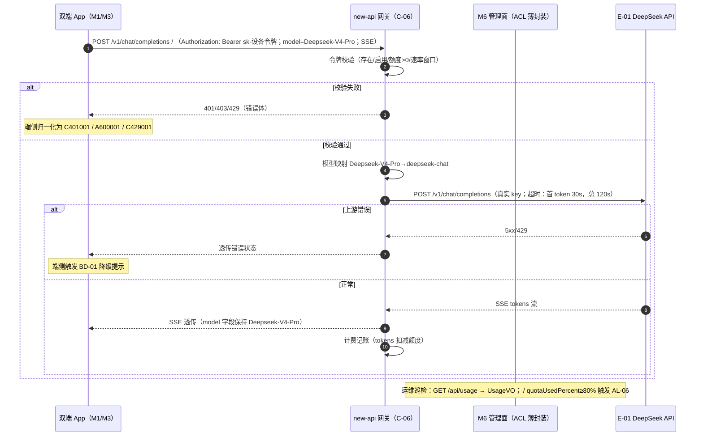
```mermaid
sequenceDiagram
    autonumber
    participant APP as 双端 App（M1/M3）
    participant GW as new-api 网关（C-06）
    participant ACL as M6 管理面（ACL 薄封装）
    participant DS as E-01 DeepSeek API
    APP->>GW: POST /v1/chat/completions / （Authorization: Bearer sk-设备令牌；model=Deepseek-V4-Pro；SSE）
    GW->>GW: 令牌校验（存在/启用/额度>0/速率窗口）
    alt 校验失败
        GW-->>APP: 401/403/429（错误体）
        Note over APP: 端侧归一化为 C401001 / A600001 / C429001
    else 校验通过
        GW->>GW: 模型映射 Deepseek-V4-Pro→deepseek-chat
        GW->>DS: POST /v1/chat/completions（真实 key；超时：首 token 30s，总 120s）
        alt 上游错误
            DS-->>GW: 5xx/429
            GW-->>APP: 透传错误状态
            Note over APP: 端侧触发 BD-01 降级提示
        else 正常
            DS-->>GW: SSE tokens 流
            GW-->>APP: SSE 透传（model 字段保持 Deepseek-V4-Pro）
            GW->>GW: 计费记账（tokens 扣减额度）
        end
    end
    Note over ACL: 运维巡检：GET /api/usage → UsageVO； / quotaUsedPercent≥80% 触发 AL-06
```

##### §3.2.M6.5 关键流程逻辑

无复杂状态机/事务/跨多步异步需要展开——流量面为单次请求转发（new-api 原生能力），管理面为常规 CRUD；令牌状态机（enabled→exhausted/disabled）由 new-api 内部维护且不在本域模型中暴露迁移分支。本段按模板纪律显式注明：**本段省略**。需研发注意的契约级约束已在 §3.2.M6.3 字段表与 SQ-M6-01 中固化：① 客户端可见模型名仅 "Deepseek-V4-Pro"；② 错误体由端侧归一化进全局错误码（§3.5.1 映射表）；③ 额度消耗 ≥80% 是运维告警阈值。

### 3.3 核心业务对象清单

#### 3.3.1 对象定义

| 编号 | 对象名（代码类名） | 对象类型 | 包路径 | 模块归属 | 被哪些模块复用 | 实例化策略 | 序列化约定 | 持久化策略 |
| --- | --- | --- | --- | --- | --- | --- | --- | --- |
| O-01 | `Device` | 聚合根 | `relay-cloud/common/src/domain`（云端）；端侧镜像类型 | M5 | M4 / M5 | 工厂方法 `Device.register()` | JSON | 落表 → `t_device` |
| O-02 | `Pairing` | 聚合根 | `relay-cloud/common/src/domain` | M5 | M4 / M5 | 工厂方法 `Pairing.bind()` | JSON | 落表 → `t_pairing` |
| O-03 | `PairingCode` | 实体（归属 Pairing 聚合） | `relay-cloud/relay-server/src/pairing` | M5 | M5 | 由聚合根签发 | JSON | 落表 → `t_pairing`（code 字段组） |
| O-04 | `RemoteCommand` | 聚合根 | `shared-contract/envelope/v1` + `relay-cloud/relay-server/src/router` | M4 / M5 | M4 / M5 | Builder | JSON | 落表 → `t_command_log` |
| O-05 | `ModelAsset` | 聚合根（端侧） | `localmind/src-tauri/src/model`；`localfile/model/` | M2 | M1 / M2 / M3 | 工厂方法 `ModelAsset.discover()` | JSON | 落表 → 端侧 `t_model_asset`；云端清单 `t_model_release` |
| O-06 | `CommandEnvelope` | 共享 DTO（Shared Kernel，C-03） | `shared-contract/envelope/v1` | 三端共用 | M4 / M5 / M1（指令触发对话时） | 构造器 + Schema 校验 | JSON（Schema 版本化 v1） | 不落表（传输结构） |
| O-07 | `WhitelistAction` | 共享枚举（Shared Kernel，C-03） | `shared-contract/whitelist` | 三端共用 | M4 | — | String | 落表 → 端侧 `t_whitelist_config`（key + enabled） |
| O-08 | `ApiToken` | 实体（网关运营域 ACL 模型） | `relay-cloud/gateway-config/acl` | M6 | M6 | ACL 适配自 new-api Token | JSON | 索引冗余 → `t_api_token`；本体在 new-api 库 |
| O-09 | `ChatSession` / `ChatMessage` | 聚合根 + 实体（端侧） | `localmind/src-tauri/src/chat`；`localfile/chat/` | M1 | M1 / M3 | 工厂方法 | JSON | 落表 → 端侧 `t_chat_session` + `t_chat_message` |
| O-10 | `FileProcessRecord` | 聚合根（端侧） | `localfile/files/` | M3 | M3 | Builder | JSON | 落表 → 端侧 `t_file_record` |
| O-11 | `DeepSeekAclAdapter` | 防腐层 ACL | `relay-cloud/gateway-config/acl`（错误归一化在端侧 common） | M6 | M1 / M3（端侧消费归一化错误） | new + 适配 | — | 不落表，瞬时转换（C-02/C-04 关系落点） |

**填写核对**：O-xx 全局唯一；对象名为代码类名（PascalCase）并与包路径一致；防腐层对象 O-11 已显式标注，与 §2.2.2 上下文映射 C-02（new-api ACL）/ C-04（DeepSeek Conformist，其错误经 O-11 归一化）呼应。✅

#### 3.3.2 命名漂移登记表

| 业务实体（§2） | 代码类名（§3.3.1） | 数据表名（§4.2） | 漂移原因 |
| --- | --- | --- | --- |
| 远程指令 | `RemoteCommand`（领域对象）+ `CommandEnvelope`（传输信封） | `t_command_log` | 业务单一概念在传输层为信封、在持久层为日志记录，三者职责不同 |
| 配对关系 + 配对码 | `Pairing`（聚合根）+ `PairingCode`（实体） | 共表 `t_pairing` | 配对码短生命周期（300s），作为聚合内字段组随主表存储，避免单表碎片化 |
| 模型显示名 | 网关配置项（new-api modelMapping） | 不落表 | 业务概念"Deepseek-V4-Pro"仅存在于网关映射配置与端侧 UI 常量，无独立对象与表 |

### 3.4 跨模块公共能力

**公共能力清单**：

| 公共能力 | 简述 | 提供方（SDK / 切面 / Bean） | 被哪些模块复用 | 接入方式 |
| --- | --- | --- | --- | --- |
| 结构化日志 | 统一 JSON 日志（含 traceId/tenantId/deviceId，§8.2.2） | 云端：`relay-server/src/observability/logging.rs`（tracing crate）；端侧：`common/log`（Rust tracing / Kotlin Timber 封装） | M1~M6 全部 | 端内直接调用 logger；traceId 在信封与 HTTP Header 透传（§8.3） |
| 全局错误码 | 错误码注册表单一来源 + 三端同构类型 | `shared-contract/error-code/`（注册表 JSON + 代码生成） | M1~M6 全部 | 三端引用生成的类型；新增错误码必须先登记注册表（§3.5.1） |
| WSS 信封协议 | 指令信封 Schema + 白名单枚举（Shared Kernel，C-03） | `shared-contract/envelope/v1` + `shared-contract/whitelist` | M4 / M5 /（M1 指令触发对话时） | 由 JSON Schema 生成 TS/Rust/Kotlin 类型；版本字段协商 |

**填写核对**：提供方均为具体包/文件名；"接入方式"已说明研发如何使用；未登记项（业务模块、云组件、命名规范）已按模板归位到 §3.2 / §3.1.3 / §3.2.1。✅

### 3.5 接口契约

> 本系统对外暴露的接口（含同步 API、WSS 消息）在错误码、幂等、限流、超时上的全局约定。**所有接口必须遵守，不在每个接口下重复声明**。

#### 3.5.1 全局错误码体系

**错误码格式**：

| 项 | 取值 |
| --- | --- |
| 错误码格式 | **6 位**：1 位类别字母 + 2 位模块号 + 3 位错误序号，实例—`A040001` |
| 分段规则 | 类别（1）+ 模块（2）+ 序号（3） |
| 类别取值 | `A` = 业务错误（HTTP 200/WSS 正常响应，业务语义失败）/ `B` = 系统错误（HTTP 5xx）/ `C` = 客户端错误（HTTP 4xx） |
| 模块号取值 | 01=会话域(M1) / 02=模型资产域(M2) / 03=文件处理域(M3) / 04=远程协同域(M4/M5) / 06=网关运营域(M6) / 99=全局通用 |

**错误响应统一结构**（HTTP 与 WSS error 载荷同构）：

```json
{
  "code": "A040001",
  "msg": "配对码无效",
  "msgI18n": { "zh-CN": "配对码无效，请核对后重试", "en-US": "Invalid pairing code" },
  "data": null,
  "traceId": "3fa85f64-5717-4562-b3fc-2c963f66afa6",
  "timestamp": "2026-07-21T10:00:00.000Z"
}
```

**错误码注册表**：

| 错误码 | HTTP 状态 | 所属模块 | 含义 | 重试建议 | 用户文案 |
| --- | --- | --- | --- | --- | --- |
| A010001 | 200 | M1 | 会话不存在或已删除 | 不重试 | 会话不存在，可能已被删除 |
| A010002 | 200 | M1 | 消息内容超长（>8000 字） | 不重试 | 消息太长了，请分段发送 |
| A010003 | 200 | M1 | 生成已被用户停止 | 不重试 | 已停止生成 |
| A020001 | 200 | M2 | 离线模型未下载 | 不重试（引导下载） | 尚未下载离线模型，请先前往模型管理页下载 |
| A020002 | 200 | M2 | 设备资源不足（内存/存储不达标） | 不重试 | 当前设备资源不足，建议使用在线模式 |
| A020003 | 200 | M2 | 本地推理服务启动失败 | 可重试 1 次 | 本地推理启动失败，请重试或切换在线模式 |
| A020004 | 200 | M2 | 模型下载失败（网络原因） | 断点续传重试 | 下载中断，点击继续可从断点续传 |
| A020005 | 200 | M2 | 模型文件校验失败 | 自动重试 1 次后人工 | 模型文件校验未通过，正在重新下载 |
| A030001 | 200 | M3 | 文件类型不支持 | 不重试 | 暂不支持该类型文件 |
| A030002 | 200 | M3 | 文件读取失败（权限/损坏） | 不重试 | 文件读取失败，请检查文件是否可访问 |
| A030003 | 200 | M3 | 部分文件重命名失败 | 不重试（看明细） | 部分文件重命名失败，请查看失败原因 |
| A040001 | 200 | M4/M5 | 配对码无效 | 不重试 | 配对码无效，请核对后重试 |
| A040002 | 200 | M4/M5 | 配对码已过期 | 重新生成后重试 | 配对码已过期，请让电脑端重新生成 |
| A040003 | 200 | M4/M5 | 配对码已被使用 | 重新生成后重试 | 配对码已被使用，请让电脑端重新生成 |
| A040004 | 200 | M4/M5 | 对端设备离线 | 对端上线后重试 | 电脑端不在线，请确认电脑端已启动并联网 |
| A040005 | 200 | M4/M5 | 指令未命中白名单/已被停用 | 不重试 | 该指令不在可执行范围内 |
| A040006 | 200 | M4/M5 | 远程控制总开关已关闭 | 不重试 | 电脑端已停用远程控制 |
| A040007 | 200 | M4/M5 | 本机用户拒绝/确认超时 | 重发需用户再次确认 | 电脑端未确认该操作 |
| A600001 | 200 | M6 | 令牌额度已用尽 | 下周期或联系运维 | 本月使用额度已用尽，请联系管理员 |
| B600001 | 502 | M6 | 网关/上游服务异常 | 退避后重试（≤2 次） | 云端服务暂时异常，可切换离线模式继续使用 |
| B050001 | 500 | M5 | 中继内部错误 | 退避后重试（≤2 次） | 连接服务异常，正在自动重连 |
| B999001 | 500 | 全局 | 系统内部错误 | 可重试 | 系统繁忙，请稍后再试 |
| C400001 | 400 | 全局 | 参数校验失败 | 不重试 | 参数错误 |
| C401001 | 401 | 全局 | 未认证/票据失效 | 重新配对或重连 | 连接凭证已失效，请重新连接 |
| C403001 | 403 | 全局 | 无权限（设备未配对/越权访问他端） | 不重试 | 无权访问该设备 |
| C429001 | 429 | 全局 | 触发限流 | 按 Retry-After 退避重试 | 操作太频繁，请稍后再试 |

**上游错误归一化映射**（O-11 防腐层落点）：DeepSeek 401 → C401001（网关侧 key 异常，运维告警 AL-07）；DeepSeek 429 → C429001；DeepSeek 5xx/超时 → B600001；new-api 原生错误码不透传给端侧，统一按上表归一化。

#### 3.5.2 幂等性约定

| 接口类型 | 是否要求幂等 | 幂等键来源（建议） |
| --- | --- | --- |
| 写入类（POST 创建：会话/下载任务/处理任务/配对） | 必须幂等（重复执行有副作用） | 客户端生成 UUID：`client_req_id` / `client_task_id` / `client_msg_id`；配对码核销走 DB 原子 UPDATE（used=0→1）天然幂等 |
| 更新类（PUT/PATCH：重命名会话/白名单配置/令牌调整） | 必须幂等 | 资源 ID + 整体覆盖式更新（同内容重复提交结果一致） |
| 删除类（DELETE：会话/模型/令牌/解绑） | 天然幂等 | — |
| 查询类（GET） | 天然幂等 | — |
| WSS 指令类（cmd.send / cmd.status / cmd.result） | **强制幂等**（中继转发与端侧重连补发场景必现重复） | `commandId`（客户端 UUID）全链去重；终态仅写一次 |
| 资金 / 扣款类 | 本项目无资金操作 | 额度扣减由 new-api 内部按请求记账，重试请求由端侧 client_msg_id 防重 |

**幂等设计需考虑的问题**（各模块已按此回答）：

| 问题维度 | 本系统答案 |
| --- | --- |
| 幂等键的生命周期 | 端侧 client_* 键随业务实体生命周期（会话/任务删除即失效）；commandId 在 `t_command_log` 保留 90 天（短期防抖+演示期对账） |
| 重复请求的语义 | 返回首次相同响应（实例—cmd.send 重复提交直接回上次 ACK；applyRename 重复提交回上次批次结果），不返回"重复提交"错误 |
| 执行中态的处理 | 第一个请求未完结时重复提交：指令类返回当前状态（不新建）；任务类返回进行中句柄 |
| 失败请求的可重试性 | 业务失败（A 类）允许同键重试（状态未落终态）；系统失败（B 类）端侧退避重试 ≤2 次 |
| 存储兜底 | `t_command_log.command_id` 唯一索引、`t_pairing.code` 唯一索引、端侧 `t_chat_message.client_msg_id` 唯一索引作为最终防线 |

#### 3.5.3 限流约定

| 维度 | 默认值 | 触发动作 | 调整方式 |
| --- | --- | --- | --- |
| 全局 QPS（云端 HTTPS+WSS 合计） | 60 | 返回 C429001 | 云主机 Nginx limit_req + relay-server 令牌桶 |
| 单租户 QPS（= 单配对关系 tenantId） | 10 | 返回 C429001 | relay-server 按 tenantId 计数 |
| 单 IP QPS | 30 | 返回 C429001 + Nginx 日志标记 | Nginx limit_req_zone |
| 单设备 QPS（deviceId） | 5 | 返回 C429001 | relay-server 按 deviceId 计数 |
| 重保接口 | 配对提交 `pair.code.submit`：单 IP 10 次/分钟，失败计数 5 次锁定 15 分钟 | 锁定 + 错误码 C429001 | relay-server 内存计数器（防配对码爆破） |

**降级策略**：

| 策略项 | 内容 |
| --- | --- |
| 前端退避 | 触发限流后，端侧必须按 `Retry-After` Header 退避重试；WSS 信封限流错误按 reason 字段提示间隔 |
| 后端记录 | 限流事件写入中继结构化日志（event=rate_limited，含维度与键） |
| 红线联动 | 限流红线值与 §5.5.4 容量水位线"红线"一致（全局 60 QPS = 红线 95% 推导值：单实例设计容量约 63 QPS） |

#### 3.5.4 默认超时与重试基线

| 调用类型 | 默认超时 | 默认重试 | 重试条件 |
| --- | --- | --- | --- |
| 端内 IPC（GUI↔端侧核心） | 5s（推理启停/下载等长操作除外，显式标注 60s/无上限+进度） | 0 次 | — |
| 同步 API（端→云 HTTPS 非流式） | 10s | 2 次（指数退避 1s/2s） | 仅网络错误 / 5xx |
| 流式对话（端→网关→DeepSeek） | 首 token 30s；总时长 120s（可用户停止） | 0 次（流式不自动重试，失败后用户手动重发） | — |
| WSS 信封投递 | 单跳 ACK 3s（端→中继）、3s（中继→对端） | 中继侧 0 次重发（离线即失败返回）；端侧重连后补发未确认回执 | 仅断线重连补偿 |
| 模型文件下载 | 分片 15s 无进展判定失败 | 3 次（指数退避 2s/4s/8s），断点续传 | 网络错误 / HTTP 5xx |
| 定时任务（配对码清理/备份） | 5min | 3 次 | 失败告警（AL-08） |

**填写核对**：超时值无"无限"（下载为分片级 15s 无进展判失败）；所有重试有上限；重试均配合 §3.5.2 幂等键。✅

#### 3.5.5 路由设计规范

**API 路由规范**：

| 维度 | 取值 |
| --- | --- |
| 风格 | RESTful（HTTP 管理类接口）；WSS 通道走类型化信封（type 字段即路由） |
| 版本控制 | HTTP：`/api/v1/...`（网关管理面经 ACL 封装后的内部约定）；流量面 `/v1/...` 遵循 OpenAI 兼容不可改；信封：`version: "v1"` 字段 |
| 命名 | 小写 + 中划线（kebab-case） |
| 资源命名 | 名词复数（实例—`/api/token/` 为 new-api 原生路径，ACL 层对外文档化时按 `/api/v1/tokens` 语义引用） |
| 子资源 | `/api/v1/{resources}/{id}/{sub-resources}` |
| 动作类接口 | 端内 IPC 采用 `{resource}:{action}` 风格（实例—`ipc://model/inference:start`），与 HTTP REST 区分 |

**前端页面路由清单**：

| 路径 | 页面 / 功能 | 入口角色（§2.3） | 鉴权要求 | 关联模块（§3.2.M{N}） |
| --- | --- | --- | --- | --- |
| LocalMind：`/chat` | P-W1 主对话页 | 电脑端使用者 | 本机用户（无账号体系） | M1 |
| LocalMind：`/models` | P-W2 模型管理页 | 电脑端使用者 | 本机用户 | M2 |
| LocalMind：`/remote` | P-W3 远程控制面板页 | 电脑端使用者 | 本机用户 | M4 |
| LocalMind：`/settings` | P-W4 设置页 | 电脑端使用者 | 本机用户 | M1/M2 |
| LocalFile：`/files` | P-A2 文件处理页（底部 Tab） | 手机端使用者 | 本机用户 + SAF 授权 | M3 |
| LocalFile：`/chat` | P-A3 对话页（底部 Tab） | 手机端使用者 | 本机用户 | M1 |
| LocalFile：`/remote` | P-A4 远程控制页（底部 Tab） | 手机端使用者 | 本机用户 + 已配对设备 | M4 |
| LocalFile：`/settings` | P-A5 模型与设置页 | 手机端使用者 | 本机用户 | M2 |
| 运维：`/panel`（new-api） | 网关用量看板 | 兼职运维者 | 网关管理账号（仅运维者持有，部署时初始化） | M6 |

**前端路由约定**（项目级一次性决策）：

| 维度 | 取值 |
| --- | --- |
| 路由模式 | LocalMind：Hash（Tauri 打包无服务端，避免 History 刷新 404）；LocalFile：Compose Navigation 声明式路由 |
| 命名风格 | 小写 + 中划线（kebab-case） |
| 动态参数 | `/{resource}/:id`（实例—会话详情 `/chat/:sessionId`） |
| 鉴权方式 | 无账号体系：端内路由无登录守卫；LocalFile `/remote` 进入时校验"存在已配对设备"，否则展示未配对态（扫码/输码入口） |
| 嵌套路由 | 对话列表 → 对话详情；远程控制 → 设备管理子页 |

---

## 4. 数据库设计

> **本章回答**：每个模块的状态用什么表存、表怎么建、数据怎么清理、缓存怎么用。
> **核心方法论**：**数据库按业务域组织**，业务域与第 2 章 / 第 3 章保持一致。
> **本项目数据分布总览**（P-04 端云数据归属原则的落点）：

| 存储位置 | 库 | 表 | 归属业务域 | 规模预估 |
| --- | --- | --- | --- | --- |
| 云端 SQLite（`relay.db`，C-01） | relay | `t_device` / `t_pairing` / `t_command_log` | 远程协同域 | ≤100 设备；≤50 配对；指令日志 ≤3 万行/月 |
| 云端 SQLite（`relay.db`，C-01） | relay | `t_api_token` / `t_model_release` | 网关运营域 / 模型资产域（分发清单） | ≤50 令牌；≤10 模型版本 |
| 端侧 SQLite（LocalMind `localmind.db`，C-02） | localmind | `t_chat_session` / `t_chat_message` | 会话域 | ≤500 会话；≤5 万消息 |
| 端侧 SQLite（LocalMind `localmind.db`，C-02） | localmind | `t_model_asset` / `t_whitelist_config` / `t_execution_log` | 模型资产域 / 远程协同域（执行面） | ≤5 模型；≤20 白名单项；执行留痕 ≤1 万行 |
| 端侧 SQLite（LocalFile `localfile.db`，C-02） | localfile | `t_chat_session` / `t_chat_message` / `t_model_asset` / `t_file_record` | 会话域 / 模型资产域 / 文件处理域 | 会话同 LocalMind；处理记录 ≤1 万行 |
| new-api 内部库（C-06 自带） | new-api | 令牌/渠道/日志本体 | 网关运营域（ACL 隔离，不直接设计） | 由 new-api 管理 |

> 下文按"云端 5 表 + 端侧代表表"逐表五段式展开。端侧双端的 `t_chat_session`/`t_chat_message`/`t_model_asset` 结构完全一致（同一份 shared schema），以 LocalMind 为例展开一次并在元信息中注明双端适用。

### 4.1 全局数据约定

| 约定项 | 取值 | 说明 |
| --- | --- | --- |
| 命名规范（表名） | `t_` + 实体名（snake_case）业务主表；本项目无 N:N 关联表与扩展表 | 全项目统一前缀 `t_` |
| 命名规范（字段名） | 小写 + 下划线（snake_case） | 禁止驼峰 |
| 主键类型 | **UUID（TEXT，36 字符）**，云端与端侧统一 | 双端离线创建场景下 UUID 无中心化发号依赖；SQLite 无 AUTO_INCREMENT 跨端冲突问题，全项目统一禁止混用 |
| 字符集 / 排序 | SQLite 固定 UTF-8；`COLLATE NOCASE` 仅用于设备名搜索 | SQLite 无字符集配置项，UTF-8 为默认且唯一 |
| 时间字段类型 | `INTEGER`（epoch 毫秒，UTC） | SQLite 无 DATETIME 原生校验；统一 epoch 毫秒整型，展示层转 ISO8601 |
| 软删除字段 | `deleted INTEGER NOT NULL DEFAULT 0`（0：存在，1：已删除） | 全项目统一锁定 |
| 审计字段 | `created_time / updated_time`（epoch 毫秒）；**省略 created_by/updated_by**（无账号体系，操作者即本机设备，由 `device_id` 字段承载归属） | 无账号体系下的务实裁剪 |
| 隔离字段（多租户） | `tenant_id TEXT NOT NULL` = 配对关系 ID（pairing_id） | 本项目多租户语义=配对关系隔离；云端表强制携带；端侧纯本机表（会话/模型/文件记录）无此字段 |
| 业务唯一标识 | `biz_id` 语义无；以 `command_id` / `code` / `client_msg_id` 等领域键承担 | 见各表唯一索引 |
| 状态枚举 | `TEXT` 字符串（DDL 注释列出全部取值） | 与 §3.2 DTO 枚举逐字一致 |
| 金额字段 | 本项目无金额字段（用量额度为整数千 tokens，`INTEGER`） | 禁止使用 FLOAT 存额度 |
| 手机号存储 | 本项目无手机号字段 | — |

### 4.2.A 单表设计（云端中继库 relay.db）

#### 表 1：t_device（远程协同域）

##### 4.2.1 库表元信息

| 字段 | 取值 |
| --- | --- |
| 数据库类型 | SQLite 3.45（WAL 模式） |
| 库名 | `relay`（文件 `relay.db`） |
| 表名 | `t_device` |
| 业务含义（≤ 50 字） | 已注册的双端设备档案（电脑/手机），配对与路由的身份基座 |
| 模块归属（§3.2） | M5 中继调度模块 |
| 对应核心对象（§3.3） | O-01 `Device` |

##### 4.2.2 库表结构定义

| 列名 | 数据类型 | 可为空 | 约束 | 默认值 | 备注 |
| --- | --- | --- | --- | --- | --- |
| id | TEXT(36) | NOT NULL | PRIMARY KEY | — | 设备 ID（UUID，端侧首启生成） |
| tenant_id | TEXT(36) | NOT NULL | — | — | 配对关系 ID；未配对设备存临时会话 ID |
| role | TEXT(10) | NOT NULL | — | — | 端角色：desktop / android |
| device_name | TEXT(64) | NOT NULL | — | — | 设备名，实例—"DESKTOP-宿舍PC" |
| device_fingerprint | TEXT(64) | NOT NULL | — | — | 设备指纹（机型+首启随机 ID） |
| platform_version | TEXT(32) | NULL | — | NULL | 系统版本，实例—"Windows 11 23H2" |
| app_version | TEXT(16) | NOT NULL | — | — | App 版本号 |
| status | TEXT(10) | NOT NULL | — | 'offline' | 在线状态：online / offline |
| last_seen_at | INTEGER | NULL | — | NULL | 最近在线时间（epoch 毫秒） |
| created_time | INTEGER | NOT NULL | — | — | 创建时间（epoch 毫秒） |
| updated_time | INTEGER | NOT NULL | — | — | 更新时间（epoch 毫秒） |
| deleted | INTEGER | NOT NULL | — | 0 | 删除标志（0：存在，1：已删除） |

##### 4.2.3 索引设计

| 索引名 | 索引类型 | 字段（含顺序） | 设计目的 | 关联查询场景 |
| --- | --- | --- | --- | --- |
| `PRIMARY` | 主键 | `id` | 唯一标识 | 按 deviceId 查在线状态/路由 |
| `uk_fingerprint` | 唯一索引 | `device_fingerprint` | 同一物理设备重复安装去重 | 配对提交时 UPSERT 判定 |
| `idx_tenant_status` | 普通索引 | `tenant_id, status` | 配对关系内设备在线查询 | 路由前查对端在线状态（SQ-M5-01） |

##### 4.2.4 DDL

```sql
CREATE TABLE `t_device` (
  `id` TEXT(36) NOT NULL COMMENT '设备 ID（UUID）',
  `tenant_id` TEXT(36) NOT NULL COMMENT '隔离字段：配对关系 ID',
  `role` TEXT(10) NOT NULL COMMENT '端角色：desktop/android',
  `device_name` TEXT(64) NOT NULL COMMENT '设备名',
  `device_fingerprint` TEXT(64) NOT NULL COMMENT '设备指纹',
  `platform_version` TEXT(32) DEFAULT NULL COMMENT '系统版本',
  `app_version` TEXT(16) NOT NULL COMMENT 'App 版本号',
  `status` TEXT(10) NOT NULL DEFAULT 'offline' COMMENT '在线状态：online/offline',
  `last_seen_at` INTEGER DEFAULT NULL COMMENT '最近在线时间（epoch 毫秒）',
  `created_time` INTEGER NOT NULL COMMENT '创建时间（epoch 毫秒）',
  `updated_time` INTEGER NOT NULL COMMENT '更新时间（epoch 毫秒）',
  `deleted` INTEGER NOT NULL DEFAULT 0 COMMENT '删除标志（0：存在，1：已删除）',
  PRIMARY KEY (`id`),
  UNIQUE KEY `uk_fingerprint` (`device_fingerprint`),
  KEY `idx_tenant_status` (`tenant_id`, `status`)
);
```

##### 4.2.5 扩展逻辑（数据清理机制）

| 清理机制 | 适用场景 | 配置 |
| --- | --- | --- |
| 软删 + 定期物理清理 | 解绑的设备保留 30 天可追溯（重新配对可复活） | 解绑置 `deleted=1`；每日定时任务物理删除 `deleted=1 AND updated_time 早于 now-30d` 的记录 |

#### 表 2：t_pairing（远程协同域）

##### 4.2.1 库表元信息

| 字段 | 取值 |
| --- | --- |
| 数据库类型 | SQLite 3.45（WAL 模式） |
| 库名 | `relay`（文件 `relay.db`） |
| 表名 | `t_pairing` |
| 业务含义（≤ 50 字） | 配对关系主表：含进行中的配对码（短生命周期）与已成立的设备绑定 |
| 模块归属（§3.2） | M5 中继调度模块 |
| 对应核心对象（§3.3） | O-02 `Pairing`（聚合根）+ O-03 `PairingCode`（聚合内实体，字段组承载） |

##### 4.2.2 库表结构定义

| 列名 | 数据类型 | 可为空 | 约束 | 默认值 | 备注 |
| --- | --- | --- | --- | --- | --- |
| id | TEXT(36) | NOT NULL | PRIMARY KEY | — | 配对关系 ID（UUID，即 tenantId 来源） |
| code | TEXT(6) | NULL | UNIQUE | NULL | 6 位配对码；绑定成立后置 NULL（核销语义） |
| desktop_device_id | TEXT(36) | NOT NULL | — | — | 电脑端设备 ID |
| android_device_id | TEXT(36) | NULL | — | NULL | 手机端设备 ID；绑定成功时回填 |
| code_expire_at | INTEGER | NULL | — | NULL | 配对码过期时间（epoch 毫秒，签发+300s） |
| code_used | INTEGER | NOT NULL | — | 0 | 配对码核销标记（0：未用，1：已核销，原子 UPDATE 防并发复用） |
| status | TEXT(12) | NOT NULL | — | 'pending' | 状态：pending（待绑定）/ bound（已绑定）/ unbound（已解绑） |
| created_time | INTEGER | NOT NULL | — | — | 创建时间（epoch 毫秒） |
| updated_time | INTEGER | NOT NULL | — | — | 更新时间（epoch 毫秒） |
| deleted | INTEGER | NOT NULL | — | 0 | 删除标志（0：存在，1：已删除） |

##### 4.2.3 索引设计

| 索引名 | 索引类型 | 字段（含顺序） | 设计目的 | 关联查询场景 |
| --- | --- | --- | --- | --- |
| `PRIMARY` | 主键 | `id` | 唯一标识（tenantId） | 全部按配对关系查询 |
| `uk_code` | 唯一索引 | `code` | 配对码全局唯一 + 原子核销条件 | `UPDATE ... WHERE code=? AND code_used=0 AND code_expire_at>now` |
| `idx_desktop_status` | 普通索引 | `desktop_device_id, status` | 电脑端设备列表/同设备未过期码复用 | 配对码签发幂等（§3.2.M5.5） |
| `idx_android_status` | 普通索引 | `android_device_id, status` | 手机端已配对设备列表 | LocalFile 设备列表查询 |

##### 4.2.4 DDL

```sql
CREATE TABLE `t_pairing` (
  `id` TEXT(36) NOT NULL COMMENT '配对关系 ID（UUID，即 tenantId）',
  `code` TEXT(6) DEFAULT NULL COMMENT '6 位配对码，绑定成立后置 NULL',
  `desktop_device_id` TEXT(36) NOT NULL COMMENT '电脑端设备 ID',
  `android_device_id` TEXT(36) DEFAULT NULL COMMENT '手机端设备 ID',
  `code_expire_at` INTEGER DEFAULT NULL COMMENT '配对码过期时间（epoch 毫秒）',
  `code_used` INTEGER NOT NULL DEFAULT 0 COMMENT '核销标记（0：未用，1：已用）',
  `status` TEXT(12) NOT NULL DEFAULT 'pending' COMMENT '状态：pending/bound/unbound',
  `created_time` INTEGER NOT NULL COMMENT '创建时间（epoch 毫秒）',
  `updated_time` INTEGER NOT NULL COMMENT '更新时间（epoch 毫秒）',
  `deleted` INTEGER NOT NULL DEFAULT 0 COMMENT '删除标志（0：存在，1：已删除）',
  PRIMARY KEY (`id`),
  UNIQUE KEY `uk_code` (`code`),
  KEY `idx_desktop_status` (`desktop_device_id`, `status`),
  KEY `idx_android_status` (`android_device_id`, `status`)
);
```

##### 4.2.5 扩展逻辑（数据清理机制）

| 清理机制 | 适用场景 | 配置 |
| --- | --- | --- |
| 物理删除 | 过期未使用的配对码（pending 态） | 每 10 分钟任务删除 `status='pending' AND code_expire_at 早于 now-1h`（§3.2.M5.5 Step 3） |
| 软删 | 解绑的配对关系（留痕追溯） | 解绑置 `status='unbound'` + `deleted=1`；每 90 天物理清理 |

#### 表 3：t_command_log（远程协同域）

##### 4.2.1 库表元信息

| 字段 | 取值 |
| --- | --- |
| 数据库类型 | SQLite 3.45（WAL 模式） |
| 库名 | `relay`（文件 `relay.db`） |
| 表名 | `t_command_log` |
| 业务含义（≤ 50 字） | 远程指令全生命周期日志：信封路由、状态迁移、终态结果与失败原因 |
| 模块归属（§3.2） | M5 中继调度模块 |
| 对应核心对象（§3.3） | O-04 `RemoteCommand` |

##### 4.2.2 库表结构定义

| 列名 | 数据类型 | 可为空 | 约束 | 默认值 | 备注 |
| --- | --- | --- | --- | --- | --- |
| id | TEXT(36) | NOT NULL | PRIMARY KEY | — | 日志行 ID（UUID） |
| tenant_id | TEXT(36) | NOT NULL | — | — | 配对关系 ID |
| command_id | TEXT(36) | NOT NULL | UNIQUE | — | 指令幂等键（客户端生成，全链去重锚点） |
| envelope_id | TEXT(36) | NOT NULL | — | — | 信封 ID（链路日志锚点） |
| trace_id | TEXT(36) | NOT NULL | — | — | 全链路追踪 ID |
| from_device_id | TEXT(36) | NOT NULL | — | — | 发送设备（手机端） |
| to_device_id | TEXT(36) | NOT NULL | — | — | 目标设备（电脑端） |
| cmd_text | TEXT(500) | NOT NULL | — | — | 指令文本 |
| status | TEXT(16) | NOT NULL | — | 'sent' | 状态：sent / delivered / running / done / failed / rejected / offline_failed |
| result_text | TEXT(2000) | NULL | — | NULL | 执行结果文本（终态回填） |
| fail_reason | TEXT(200) | NULL | — | NULL | 失败/拒绝原因 |
| relay_received_at | INTEGER | NULL | — | NULL | 中继收到时间（时延度量点 1，epoch 毫秒） |
| delivered_at | INTEGER | NULL | — | NULL | 下行送达时间（时延度量点 2，epoch 毫秒） |
| finished_at | INTEGER | NULL | — | NULL | 终态时间（epoch 毫秒） |
| created_time | INTEGER | NOT NULL | — | — | 创建时间（epoch 毫秒） |
| updated_time | INTEGER | NOT NULL | — | — | 更新时间（epoch 毫秒） |
| deleted | INTEGER | NOT NULL | — | 0 | 删除标志（0：存在，1：已删除） |

##### 4.2.3 索引设计

| 索引名 | 索引类型 | 字段（含顺序） | 设计目的 | 关联查询场景 |
| --- | --- | --- | --- | --- |
| `PRIMARY` | 主键 | `id` | 唯一标识 | 日志行定位 |
| `uk_command_id` | 唯一索引 | `command_id` | 指令幂等最终防线 | 重复指令/补发回执去重（SQ-M5-02） |
| `idx_tenant_time` | 普通索引 | `tenant_id, created_time` | 配对关系内指令历史倒序 | 双端指令记录页（本设计为云端留痕，端侧另存本地副本） |
| `idx_status_time` | 普通索引 | `status, updated_time` | 非终态指令巡检/超时兜底 | 运维排查"卡在执行中"的指令 |

##### 4.2.4 DDL

```sql
CREATE TABLE `t_command_log` (
  `id` TEXT(36) NOT NULL COMMENT '日志行 ID（UUID）',
  `tenant_id` TEXT(36) NOT NULL COMMENT '隔离字段：配对关系 ID',
  `command_id` TEXT(36) NOT NULL COMMENT '指令幂等键（客户端生成）',
  `envelope_id` TEXT(36) NOT NULL COMMENT '信封 ID',
  `trace_id` TEXT(36) NOT NULL COMMENT '全链路追踪 ID',
  `from_device_id` TEXT(36) NOT NULL COMMENT '发送设备 ID',
  `to_device_id` TEXT(36) NOT NULL COMMENT '目标设备 ID',
  `cmd_text` TEXT(500) NOT NULL COMMENT '指令文本',
  `status` TEXT(16) NOT NULL DEFAULT 'sent' COMMENT '状态：sent/delivered/running/done/failed/rejected/offline_failed',
  `result_text` TEXT(2000) DEFAULT NULL COMMENT '执行结果文本',
  `fail_reason` TEXT(200) DEFAULT NULL COMMENT '失败/拒绝原因',
  `relay_received_at` INTEGER DEFAULT NULL COMMENT '中继收到时间（epoch 毫秒）',
  `delivered_at` INTEGER DEFAULT NULL COMMENT '下行送达时间（epoch 毫秒）',
  `finished_at` INTEGER DEFAULT NULL COMMENT '终态时间（epoch 毫秒）',
  `created_time` INTEGER NOT NULL COMMENT '创建时间（epoch 毫秒）',
  `updated_time` INTEGER NOT NULL COMMENT '更新时间（epoch 毫秒）',
  `deleted` INTEGER NOT NULL DEFAULT 0 COMMENT '删除标志（0：存在，1：已删除）',
  PRIMARY KEY (`id`),
  UNIQUE KEY `uk_command_id` (`command_id`),
  KEY `idx_tenant_time` (`tenant_id`, `created_time`),
  KEY `idx_status_time` (`status`, `updated_time`)
);
```

##### 4.2.5 扩展逻辑（数据清理机制）

| 清理机制 | 适用场景 | 配置 |
| --- | --- | --- |
| 物理删除 | 指令日志滚动保留 90 天（覆盖演示期对账） | 每日 03:00 任务删除 `created_time 早于 now-90d`；删除前后各执行一次 `PRAGMA wal_checkpoint` 控制文件体积 |

#### 表 4：t_api_token（网关运营域）

##### 4.2.1 库表元信息

| 字段 | 取值 |
| --- | --- |
| 数据库类型 | SQLite 3.45（WAL 模式） |
| 库名 | `relay`（文件 `relay.db`） |
| 表名 | `t_api_token` |
| 业务含义（≤ 50 字） | 网关令牌的发放索引与归属登记（令牌本体与额度在 new-api 库，本表为 ACL 侧索引） |
| 模块归属（§3.2） | M6 API代理模块 |
| 对应核心对象（§3.3） | O-08 `ApiToken` |

##### 4.2.2 库表结构定义

| 列名 | 数据类型 | 可为空 | 约束 | 默认值 | 备注 |
| --- | --- | --- | --- | --- | --- |
| id | TEXT(36) | NOT NULL | PRIMARY KEY | — | 索引记录 ID（UUID） |
| tenant_id | TEXT(36) | NOT NULL | — | — | 配对关系 ID（令牌按配对组发放） |
| device_id | TEXT(36) | NOT NULL | — | — | 持有令牌的设备 ID |
| token_name | TEXT(64) | NOT NULL | UNIQUE | — | 令牌名（= new-api name），实例—"localmind-desktop-01" |
| newapi_token_id | INTEGER | NOT NULL | — | — | new-api 内部令牌 ID（ACL 映射键，不落 sk- 明文） |
| initial_quota_k | INTEGER | NOT NULL | — | — | 初始额度（千 tokens），整数 |
| status | TEXT(10) | NOT NULL | — | 'enabled' | 状态：enabled / disabled / exhausted / expired |
| created_time | INTEGER | NOT NULL | — | — | 创建时间（epoch 毫秒） |
| updated_time | INTEGER | NOT NULL | — | — | 更新时间（epoch 毫秒） |
| deleted | INTEGER | NOT NULL | — | 0 | 删除标志（0：存在，1：已删除） |

##### 4.2.3 索引设计

| 索引名 | 索引类型 | 字段（含顺序） | 设计目的 | 关联查询场景 |
| --- | --- | --- | --- | --- |
| `PRIMARY` | 主键 | `id` | 唯一标识 | 记录定位 |
| `uk_token_name` | 唯一索引 | `token_name` | 令牌名唯一（签发幂等约束） | 重复签发同设备令牌时 UPSERT |
| `idx_tenant_device` | 普通索引 | `tenant_id, device_id` | 按配对关系/设备查令牌 | 解绑时联动回收令牌 |

##### 4.2.4 DDL

```sql
CREATE TABLE `t_api_token` (
  `id` TEXT(36) NOT NULL COMMENT '索引记录 ID（UUID）',
  `tenant_id` TEXT(36) NOT NULL COMMENT '隔离字段：配对关系 ID',
  `device_id` TEXT(36) NOT NULL COMMENT '持有设备 ID',
  `token_name` TEXT(64) NOT NULL COMMENT '令牌名（new-api name）',
  `newapi_token_id` INTEGER NOT NULL COMMENT 'new-api 内部令牌 ID（ACL 映射键）',
  `initial_quota_k` INTEGER NOT NULL COMMENT '初始额度（千 tokens）',
  `status` TEXT(10) NOT NULL DEFAULT 'enabled' COMMENT '状态：enabled/disabled/exhausted/expired',
  `created_time` INTEGER NOT NULL COMMENT '创建时间（epoch 毫秒）',
  `updated_time` INTEGER NOT NULL COMMENT '更新时间（epoch 毫秒）',
  `deleted` INTEGER NOT NULL DEFAULT 0 COMMENT '删除标志（0：存在，1：已删除）',
  PRIMARY KEY (`id`),
  UNIQUE KEY `uk_token_name` (`token_name`),
  KEY `idx_tenant_device` (`tenant_id`, `device_id`)
);
```

##### 4.2.5 扩展逻辑（数据清理机制）

| 清理机制 | 适用场景 | 配置 |
| --- | --- | --- |
| 无 | 令牌索引永久保留（量极小，≤50 行；回收置 disabled 不删行） | — |

#### 表 5：t_model_release（模型资产域·云端分发清单）

##### 4.2.1 库表元信息

| 字段 | 取值 |
| --- | --- |
| 数据库类型 | SQLite 3.45（WAL 模式） |
| 库名 | `relay`（文件 `relay.db`） |
| 表名 | `t_model_release` |
| 业务含义（≤ 50 字） | 离线模型发布清单：文件名、大小、SHA256、CDN 直链、适用平台与档位 |
| 模块归属（§3.2） | M2 模型管理模块（端侧下载时经中继 HTTP 只读拉取清单；运维脚本维护） |
| 对应核心对象（§3.3） | O-05 `ModelAsset`（云端清单侧） |

##### 4.2.2 库表结构定义

| 列名 | 数据类型 | 可为空 | 约束 | 默认值 | 备注 |
| --- | --- | --- | --- | --- | --- |
| id | TEXT(36) | NOT NULL | PRIMARY KEY | — | 发布 ID（UUID） |
| model_name | TEXT(128) | NOT NULL | — | — | 模型名，实例—"DeepSeek-R1-0528-Qwen3-8B" |
| quant | TEXT(16) | NOT NULL | — | — | 量化档：Q4_K_M / Q4_0 |
| tier | TEXT(6) | NOT NULL | — | — | 档位：1.5B / 3B / 4B / 7B / 8B |
| platform | TEXT(10) | NOT NULL | — | — | 适用平台：windows / android |
| file_name | TEXT(128) | NOT NULL | — | — | GGUF 文件名 |
| size_bytes | INTEGER | NOT NULL | — | — | 文件大小（字节，整数） |
| sha256 | TEXT(64) | NOT NULL | — | — | SHA256 摘要（64 位十六进制） |
| download_url | TEXT(256) | NOT NULL | — | — | CDN 直链（含防盗链签名规则前缀） |
| license | TEXT(16) | NOT NULL | — | — | 许可：MIT / Apache-2.0 |
| status | TEXT(10) | NOT NULL | — | 'active' | 状态：active / deprecated |
| created_time | INTEGER | NOT NULL | — | — | 创建时间（epoch 毫秒） |
| updated_time | INTEGER | NOT NULL | — | — | 更新时间（epoch 毫秒） |
| deleted | INTEGER | NOT NULL | — | 0 | 删除标志（0：存在，1：已删除） |

##### 4.2.3 索引设计

| 索引名 | 索引类型 | 字段（含顺序） | 设计目的 | 关联查询场景 |
| --- | --- | --- | --- | --- |
| `PRIMARY` | 主键 | `id` | 唯一标识 | 记录定位 |
| `idx_platform_status` | 普通索引 | `platform, status` | 按平台拉取可用清单 | 端侧模型管理页初始化（每平台 1~2 行） |

##### 4.2.4 DDL

```sql
CREATE TABLE `t_model_release` (
  `id` TEXT(36) NOT NULL COMMENT '发布 ID（UUID）',
  `model_name` TEXT(128) NOT NULL COMMENT '模型名',
  `quant` TEXT(16) NOT NULL COMMENT '量化档：Q4_K_M/Q4_0',
  `tier` TEXT(6) NOT NULL COMMENT '档位：1.5B/3B/4B/7B/8B',
  `platform` TEXT(10) NOT NULL COMMENT '适用平台：windows/android',
  `file_name` TEXT(128) NOT NULL COMMENT 'GGUF 文件名',
  `size_bytes` INTEGER NOT NULL COMMENT '文件大小（字节）',
  `sha256` TEXT(64) NOT NULL COMMENT 'SHA256 摘要',
  `download_url` TEXT(256) NOT NULL COMMENT 'CDN 直链',
  `license` TEXT(16) NOT NULL COMMENT '许可：MIT/Apache-2.0',
  `status` TEXT(10) NOT NULL DEFAULT 'active' COMMENT '状态：active/deprecated',
  `created_time` INTEGER NOT NULL COMMENT '创建时间（epoch 毫秒）',
  `updated_time` INTEGER NOT NULL COMMENT '更新时间（epoch 毫秒）',
  `deleted` INTEGER NOT NULL DEFAULT 0 COMMENT '删除标志（0：存在，1：已删除）',
  PRIMARY KEY (`id`),
  KEY `idx_platform_status` (`platform`, `status`)
);
```

##### 4.2.5 扩展逻辑（数据清理机制）

| 清理机制 | 适用场景 | 配置 |
| --- | --- | --- |
| 无 | 发布清单永久保留（≤10 行）；旧版本置 deprecated 不删 | — |

### 4.2.B 单表设计（端侧本地库 · LocalMind `localmind.db`，双端同构表以本端为例）

#### 表 6：t_chat_session（会话域，双端同构）

##### 4.2.1 库表元信息

| 字段 | 取值 |
| --- | --- |
| 数据库类型 | SQLite 3.45 |
| 库名 | `localmind`（LocalFile 为 `localfile`，结构完全一致） |
| 表名 | `t_chat_session` |
| 业务含义（≤ 50 字） | AI 对话会话主表（标题、模式、消息计数） |
| 模块归属（§3.2） | M1 对话引擎模块 |
| 对应核心对象（§3.3） | O-09 `ChatSession` |

##### 4.2.2 库表结构定义

| 列名 | 数据类型 | 可为空 | 约束 | 默认值 | 备注 |
| --- | --- | --- | --- | --- | --- |
| id | TEXT(36) | NOT NULL | PRIMARY KEY | — | 会话 ID（UUID） |
| title | TEXT(100) | NOT NULL | — | '新对话' | 会话标题（首条消息自动摘要或手动重命名） |
| mode | TEXT(8) | NOT NULL | — | 'online' | 创建时模式：online / offline |
| message_count | INTEGER | NOT NULL | — | 0 | 消息数（列表页展示，避免 COUNT 全表） |
| created_time | INTEGER | NOT NULL | — | — | 创建时间（epoch 毫秒） |
| updated_time | INTEGER | NOT NULL | — | — | 更新时间（列表倒序键） |
| deleted | INTEGER | NOT NULL | — | 0 | 删除标志（0：存在，1：已删除） |

##### 4.2.3 索引设计

| 索引名 | 索引类型 | 字段（含顺序） | 设计目的 | 关联查询场景 |
| --- | --- | --- | --- | --- |
| `PRIMARY` | 主键 | `id` | 唯一标识 | 会话详情加载 |
| `idx_updated_time` | 普通索引 | `updated_time`（配合 deleted 过滤） | 会话列表时间倒序分页 | `GET ipc://chat/sessions?page=` |

##### 4.2.4 DDL

```sql
CREATE TABLE `t_chat_session` (
  `id` TEXT(36) NOT NULL COMMENT '会话 ID（UUID）',
  `title` TEXT(100) NOT NULL DEFAULT '新对话' COMMENT '会话标题',
  `mode` TEXT(8) NOT NULL DEFAULT 'online' COMMENT '创建时模式：online/offline',
  `message_count` INTEGER NOT NULL DEFAULT 0 COMMENT '消息数',
  `created_time` INTEGER NOT NULL COMMENT '创建时间（epoch 毫秒）',
  `updated_time` INTEGER NOT NULL COMMENT '更新时间（epoch 毫秒）',
  `deleted` INTEGER NOT NULL DEFAULT 0 COMMENT '删除标志（0：存在，1：已删除）',
  PRIMARY KEY (`id`),
  KEY `idx_updated_time` (`updated_time`)
);
```

##### 4.2.5 扩展逻辑（数据清理机制）

| 清理机制 | 适用场景 | 配置 |
| --- | --- | --- |
| 软删 + 用户手动清空 | 会话删除为软删（可恢复体验）；设置页提供"清空全部历史"物理删除入口 | 物理删除时级联清理 `t_chat_message` 对应行 |

#### 表 7：t_chat_message（会话域，双端同构）

##### 4.2.1 库表元信息

| 字段 | 取值 |
| --- | --- |
| 数据库类型 | SQLite 3.45 |
| 库名 | `localmind`（LocalFile 为 `localfile`，结构完全一致） |
| 表名 | `t_chat_message` |
| 业务含义（≤ 50 字） | 会话消息明细（用户/AI 双角色、模型标注、幂等键） |
| 模块归属（§3.2） | M1 对话引擎模块 |
| 对应核心对象（§3.3） | O-09 `ChatMessage` |

##### 4.2.2 库表结构定义

| 列名 | 数据类型 | 可为空 | 约束 | 默认值 | 备注 |
| --- | --- | --- | --- | --- | --- |
| id | TEXT(36) | NOT NULL | PRIMARY KEY | — | 消息 ID（UUID） |
| session_id | TEXT(36) | NOT NULL | — | — | 所属会话 ID |
| role | TEXT(10) | NOT NULL | — | — | 角色：user / assistant |
| content | TEXT | NOT NULL | — | — | 消息正文（SQLite TEXT 无长度上限，应用层限制 ≤ 8000） |
| model_label | TEXT(20) | NULL | — | NULL | 模型显示名：Deepseek-V4-Pro / 本地模型（assistant 消息必填） |
| client_msg_id | TEXT(36) | NOT NULL | UNIQUE | — | 消息幂等键（发送端生成） |
| trace_id | TEXT(36) | NULL | — | NULL | 追踪 ID（在线链路生成） |
| created_time | INTEGER | NOT NULL | — | — | 创建时间（epoch 毫秒） |
| deleted | INTEGER | NOT NULL | — | 0 | 删除标志（0：存在，1：已删除） |

##### 4.2.3 索引设计

| 索引名 | 索引类型 | 字段（含顺序） | 设计目的 | 关联查询场景 |
| --- | --- | --- | --- | --- |
| `PRIMARY` | 主键 | `id` | 唯一标识 | 消息定位 |
| `uk_client_msg_id` | 唯一索引 | `client_msg_id` | 消息幂等最终防线 | 重发去重（§3.5.2） |
| `idx_session_time` | 普通索引 | `session_id, created_time` | 会话内消息按时间正序加载 | 会话详情页消息列表 |

##### 4.2.4 DDL

```sql
CREATE TABLE `t_chat_message` (
  `id` TEXT(36) NOT NULL COMMENT '消息 ID（UUID）',
  `session_id` TEXT(36) NOT NULL COMMENT '所属会话 ID',
  `role` TEXT(10) NOT NULL COMMENT '角色：user/assistant',
  `content` TEXT NOT NULL COMMENT '消息正文',
  `model_label` TEXT(20) DEFAULT NULL COMMENT '模型显示名：Deepseek-V4-Pro/本地模型',
  `client_msg_id` TEXT(36) NOT NULL COMMENT '消息幂等键',
  `trace_id` TEXT(36) DEFAULT NULL COMMENT '追踪 ID',
  `created_time` INTEGER NOT NULL COMMENT '创建时间（epoch 毫秒）',
  `deleted` INTEGER NOT NULL DEFAULT 0 COMMENT '删除标志（0：存在，1：已删除）',
  PRIMARY KEY (`id`),
  UNIQUE KEY `uk_client_msg_id` (`client_msg_id`),
  KEY `idx_session_time` (`session_id`, `created_time`)
);
```

##### 4.2.5 扩展逻辑（数据清理机制）

| 清理机制 | 适用场景 | 配置 |
| --- | --- | --- |
| 软删 + 级联物理清理 | 随会话删除软删；用户"清空历史"时随会话物理删除 | 物理删除以 `session_id` 级联执行 |

#### 表 8：t_model_asset（模型资产域，双端同构）

##### 4.2.1 库表元信息

| 字段 | 取值 |
| --- | --- |
| 数据库类型 | SQLite 3.45 |
| 库名 | `localmind`（LocalFile 为 `localfile`，结构完全一致） |
| 表名 | `t_model_asset` |
| 业务含义（≤ 50 字） | 端侧模型资产：下载状态、断点、校验结果、存储路径 |
| 模块归属（§3.2） | M2 模型管理模块 |
| 对应核心对象（§3.3） | O-05 `ModelAsset` |

##### 4.2.2 库表结构定义

| 列名 | 数据类型 | 可为空 | 约束 | 默认值 | 备注 |
| --- | --- | --- | --- | --- | --- |
| id | TEXT(36) | NOT NULL | PRIMARY KEY | — | 资产 ID（= t_model_release.id 对应项） |
| model_name | TEXT(128) | NOT NULL | — | — | 模型名 |
| tier | TEXT(6) | NOT NULL | — | — | 档位：1.5B / 3B / 4B / 7B / 8B |
| file_path | TEXT(256) | NULL | — | NULL | 本地 GGUF 完整路径（下载完成回填） |
| size_bytes | INTEGER | NOT NULL | — | — | 文件总大小（字节） |
| downloaded_bytes | INTEGER | NOT NULL | — | 0 | 已下载字节（断点依据） |
| sha256 | TEXT(64) | NOT NULL | — | — | 期望摘要（来自发布清单） |
| status | TEXT(16) | NOT NULL | — | 'not_downloaded' | 状态：not_downloaded / downloading / paused / verifying / available / corrupted |
| created_time | INTEGER | NOT NULL | — | — | 创建时间（epoch 毫秒） |
| updated_time | INTEGER | NOT NULL | — | — | 更新时间（epoch 毫秒） |
| deleted | INTEGER | NOT NULL | — | 0 | 删除标志（0：存在，1：已删除） |

##### 4.2.3 索引设计

| 索引名 | 索引类型 | 字段（含顺序） | 设计目的 | 关联查询场景 |
| --- | --- | --- | --- | --- |
| `PRIMARY` | 主键 | `id` | 唯一标识 | 资产详情/下载任务恢复 |
| `idx_status` | 普通索引 | `status` | 启动时扫描未完成下载任务 | App 启动恢复下载（断点续传） |

##### 4.2.4 DDL

```sql
CREATE TABLE `t_model_asset` (
  `id` TEXT(36) NOT NULL COMMENT '资产 ID',
  `model_name` TEXT(128) NOT NULL COMMENT '模型名',
  `tier` TEXT(6) NOT NULL COMMENT '档位：1.5B/3B/4B/7B/8B',
  `file_path` TEXT(256) DEFAULT NULL COMMENT '本地 GGUF 路径',
  `size_bytes` INTEGER NOT NULL COMMENT '文件总大小（字节）',
  `downloaded_bytes` INTEGER NOT NULL DEFAULT 0 COMMENT '已下载字节（断点）',
  `sha256` TEXT(64) NOT NULL COMMENT '期望 SHA256',
  `status` TEXT(16) NOT NULL DEFAULT 'not_downloaded' COMMENT '状态：not_downloaded/downloading/paused/verifying/available/corrupted',
  `created_time` INTEGER NOT NULL COMMENT '创建时间（epoch 毫秒）',
  `updated_time` INTEGER NOT NULL COMMENT '更新时间（epoch 毫秒）',
  `deleted` INTEGER NOT NULL DEFAULT 0 COMMENT '删除标志（0：存在，1：已删除）',
  PRIMARY KEY (`id`),
  KEY `idx_status` (`status`)
);
```

##### 4.2.5 扩展逻辑（数据清理机制）

| 清理机制 | 适用场景 | 配置 |
| --- | --- | --- |
| 软删 + 文件联动 | 删除模型时置 deleted=1 并删除磁盘 GGUF 与 .part | 物理清理由用户"删除模型"动作同步完成，无后台任务 |

#### 表 9：t_whitelist_config（远程协同域·执行面，LocalMind 专有）

##### 4.2.1 库表元信息

| 字段 | 取值 |
| --- | --- |
| 数据库类型 | SQLite 3.45 |
| 库名 | `localmind` |
| 表名 | `t_whitelist_config` |
| 业务含义（≤ 50 字） | 白名单动作的本机启用配置（总开关、逐项勾选、危险确认开关） |
| 模块归属（§3.2） | M4 远程控制模块（执行面） |
| 对应核心对象（§3.3） | O-07 `WhitelistAction`（枚举的启用态持久化） |

##### 4.2.2 库表结构定义

| 列名 | 数据类型 | 可为空 | 约束 | 默认值 | 备注 |
| --- | --- | --- | --- | --- | --- |
| action_key | TEXT(32) | NOT NULL | PRIMARY KEY | — | 白名单动作 key（与 shared-contract/whitelist 一致），实例—"open_app" |
| enabled | INTEGER | NOT NULL | — | 1 | 启用标记（0：停用，1：启用） |
| updated_time | INTEGER | NOT NULL | — | — | 更新时间（epoch 毫秒） |

> 说明：两个全局开关（`remote_master_switch` 远程总开关、`danger_confirm_switch` 危险确认开关）以同样结构入库（action_key 取保留值），保证配置单表可查；默认均为开启（1）。

##### 4.2.3 索引设计

| 索引名 | 索引类型 | 字段（含顺序） | 设计目的 | 关联查询场景 |
| --- | --- | --- | --- | --- |
| `PRIMARY` | 主键 | `action_key` | 唯一标识 + 全表扫描成本可忽略（≤20 行） | 执行器匹配时全量读入内存缓存 |

##### 4.2.4 DDL

```sql
CREATE TABLE `t_whitelist_config` (
  `action_key` TEXT(32) NOT NULL COMMENT '白名单动作 key（含 remote_master_switch / danger_confirm_switch 两个保留开关）',
  `enabled` INTEGER NOT NULL DEFAULT 1 COMMENT '启用标记（0：停用，1：启用）',
  `updated_time` INTEGER NOT NULL COMMENT '更新时间（epoch 毫秒）',
  PRIMARY KEY (`action_key`)
);
```

##### 4.2.5 扩展逻辑（数据清理机制）

| 清理机制 | 适用场景 | 配置 |
| --- | --- | --- |
| 无 | 配置表永久保留；新动作随 App 升级 INSERT OR IGNORE 预置行 | — |

#### 表 10：t_execution_log（远程协同域·执行面，LocalMind 专有）

##### 4.2.1 库表元信息

| 字段 | 取值 |
| --- | --- |
| 数据库类型 | SQLite 3.45 |
| 库名 | `localmind` |
| 表名 | `t_execution_log` |
| 业务含义（≤ 50 字） | 远程指令本机执行留痕：指令全文、来源设备、确认决议、结果与异常堆栈 |
| 模块归属（§3.2） | M4 远程控制模块（执行面） |
| 对应核心对象（§3.3） | O-04 `RemoteCommand`（本机留痕侧） |

##### 4.2.2 库表结构定义

| 列名 | 数据类型 | 可为空 | 约束 | 默认值 | 备注 |
| --- | --- | --- | --- | --- | --- |
| id | TEXT(36) | NOT NULL | PRIMARY KEY | — | 留痕行 ID（UUID） |
| command_id | TEXT(36) | NOT NULL | UNIQUE | — | 指令幂等键（执行判重依据） |
| from_device_id | TEXT(36) | NOT NULL | — | — | 来源设备（手机端） |
| cmd_text | TEXT(500) | NOT NULL | — | — | 指令全文 |
| action_key | TEXT(32) | NULL | — | NULL | 命中的白名单动作 key；未命中为 NULL |
| confirm_decision | TEXT(10) | NULL | — | NULL | 本机确认决议：allow / deny / timeout / not_required |
| status | TEXT(16) | NOT NULL | — | — | 终态：done / failed / rejected |
| result_text | TEXT(2000) | NULL | — | NULL | 执行结果文本 |
| error_stack | TEXT | NULL | — | NULL | 异常堆栈（failed 时，仅本机可见不上传） |
| trace_id | TEXT(36) | NOT NULL | — | — | 追踪 ID（与云端 t_command_log 同值串联） |
| created_time | INTEGER | NOT NULL | — | — | 创建时间（epoch 毫秒） |

##### 4.2.3 索引设计

| 索引名 | 索引类型 | 字段（含顺序） | 设计目的 | 关联查询场景 |
| --- | --- | --- | --- | --- |
| `PRIMARY` | 主键 | `id` | 唯一标识 | 留痕定位 |
| `uk_command_id` | 唯一索引 | `command_id` | 执行幂等最终防线 | 重连补发/重复指令判重（§3.2.M4.5 Step 1） |
| `idx_created_time` | 普通索引 | `created_time` | 执行记录页时间倒序 | P-W3 指令执行记录列表 |

##### 4.2.4 DDL

```sql
CREATE TABLE `t_execution_log` (
  `id` TEXT(36) NOT NULL COMMENT '留痕行 ID（UUID）',
  `command_id` TEXT(36) NOT NULL COMMENT '指令幂等键',
  `from_device_id` TEXT(36) NOT NULL COMMENT '来源设备 ID',
  `cmd_text` TEXT(500) NOT NULL COMMENT '指令全文',
  `action_key` TEXT(32) DEFAULT NULL COMMENT '命中的白名单动作 key',
  `confirm_decision` TEXT(10) DEFAULT NULL COMMENT '确认决议：allow/deny/timeout/not_required',
  `status` TEXT(16) NOT NULL COMMENT '终态：done/failed/rejected',
  `result_text` TEXT(2000) DEFAULT NULL COMMENT '执行结果文本',
  `error_stack` TEXT DEFAULT NULL COMMENT '异常堆栈（仅本机）',
  `trace_id` TEXT(36) NOT NULL COMMENT '追踪 ID',
  `created_time` INTEGER NOT NULL COMMENT '创建时间（epoch 毫秒）',
  PRIMARY KEY (`id`),
  UNIQUE KEY `uk_command_id` (`command_id`),
  KEY `idx_created_time` (`created_time`)
);
```

##### 4.2.5 扩展逻辑（数据清理机制）

| 清理机制 | 适用场景 | 配置 |
| --- | --- | --- |
| 物理删除 + 用户手动清空 | 留痕滚动保留 180 天；P-W3 提供"清空记录"按钮即时物理删除 | App 启动任务删除 `created_time 早于 now-180d` |

#### 表 11：t_file_record（文件处理域，LocalFile 专有）

##### 4.2.1 库表元信息

| 字段 | 取值 |
| --- | --- |
| 数据库类型 | SQLite 3.45 |
| 库名 | `localfile` |
| 表名 | `t_file_record` |
| 业务含义（≤ 50 字） | 文件 AI 处理记录：文件名、处理方式、结果摘要、导出状态 |
| 模块归属（§3.2） | M3 文件处理模块 |
| 对应核心对象（§3.3） | O-10 `FileProcessRecord` |

##### 4.2.2 库表结构定义

| 列名 | 数据类型 | 可为空 | 约束 | 默认值 | 备注 |
| --- | --- | --- | --- | --- | --- |
| id | TEXT(36) | NOT NULL | PRIMARY KEY | — | 记录 ID（UUID） |
| client_task_id | TEXT(36) | NOT NULL | UNIQUE | — | 任务幂等键 |
| file_name | TEXT(256) | NOT NULL | — | — | 源文件名（多文件时为首文件名+数量） |
| process_type | TEXT(16) | NOT NULL | — | — | 处理方式：SUMMARIZE / TRANSLATE / RENAME_SUGGEST / EXTRACT_POINTS |
| status | TEXT(10) | NOT NULL | — | 'done' | 状态：done / failed |
| result_excerpt | TEXT(500) | NULL | — | NULL | 结果摘要（记录页预览；完整结果不长期留存） |
| fail_reason | TEXT(200) | NULL | — | NULL | 失败原因 |
| created_time | INTEGER | NOT NULL | — | — | 创建时间（epoch 毫秒） |
| deleted | INTEGER | NOT NULL | — | 0 | 删除标志（0：存在，1：已删除） |

##### 4.2.3 索引设计

| 索引名 | 索引类型 | 字段（含顺序） | 设计目的 | 关联查询场景 |
| --- | --- | --- | --- | --- |
| `PRIMARY` | 主键 | `id` | 唯一标识 | 记录定位 |
| `uk_client_task_id` | 唯一索引 | `client_task_id` | 任务幂等最终防线 | 重复提交去重（§3.2.M3.2） |
| `idx_created_time` | 普通索引 | `created_time` | 记录页时间倒序分页 | 处理记录列表 |

##### 4.2.4 DDL

```sql
CREATE TABLE `t_file_record` (
  `id` TEXT(36) NOT NULL COMMENT '记录 ID（UUID）',
  `client_task_id` TEXT(36) NOT NULL COMMENT '任务幂等键',
  `file_name` TEXT(256) NOT NULL COMMENT '源文件名',
  `process_type` TEXT(16) NOT NULL COMMENT '处理方式：SUMMARIZE/TRANSLATE/RENAME_SUGGEST/EXTRACT_POINTS',
  `status` TEXT(10) NOT NULL DEFAULT 'done' COMMENT '状态：done/failed',
  `result_excerpt` TEXT(500) DEFAULT NULL COMMENT '结果摘要',
  `fail_reason` TEXT(200) DEFAULT NULL COMMENT '失败原因',
  `created_time` INTEGER NOT NULL COMMENT '创建时间（epoch 毫秒）',
  `deleted` INTEGER NOT NULL DEFAULT 0 COMMENT '删除标志（0：存在，1：已删除）',
  PRIMARY KEY (`id`),
  UNIQUE KEY `uk_client_task_id` (`client_task_id`),
  KEY `idx_created_time` (`created_time`)
);
```

##### 4.2.5 扩展逻辑（数据清理机制）

| 清理机制 | 适用场景 | 配置 |
| --- | --- | --- |
| 软删 + 滚动物理清理 | 记录滚动保留 90 天，超限物理删除 | App 启动任务删除 `created_time 早于 now-90d AND deleted=1` 及 `created_time 早于 now-90d` 记录 |

### 4.3 数据部署与备份

#### 4.3.1 存储清单

| 存储类型 | 用途 | 部署模式 | HA 方案 | 备份策略 | 日志 / 审计去向 |
| --- | --- | --- | --- | --- | --- |
| 嵌入式关系库（SQLite，云端 C-01） | 中继侧业务主数据（设备/配对/指令/令牌索引/模型清单） | 单实例文件库（WAL 模式） | 无数据库级 HA（单实例）；HA 由"备份+快速重建"承担（§5.2.3 容灾级别） | 每日 02:00 `sqlite3 .backup` 全量快照 → gzip → rclone 上传备份桶；保留 30 天滚动 | 备份任务日志写云端结构化日志（event=backup_done / backup_failed），失败触发 AL-08 |
| 嵌入式关系库（SQLite，端侧 C-02） | 端侧本地数据（会话/模型/记录/留痕） | 随 App 安装 | 端侧无 HA（数据可重建：会话历史为用户本地数据，丢失影响限于本地） | 不自动备份（隐私优先：对话不出设备）；用户在设置页可手动导出会话为 JSON | 无（端侧日志本地滚动） |
| new-api 内部库（C-06 自带 SQLite/MySQL） | 令牌/渠道/用量日志本体 | 随容器 | 随容器重启 | 纳入每日备份同一脚本（备份其数据卷） | new-api 看板 + 调用日志页 |
| 对象存储（C-03） | 模型 GGUF 分发 + 备份桶 | 云厂商多副本托管 | 云厂商内置冗余（SLA 99.9%） | 模型桶无备份需求（可从 E-02 权重源重新同步）；备份桶即备份本体 | 云控制台访问日志 |

#### 4.3.2 备份与恢复

| 维度 | 取值 |
| --- | --- |
| 备份方式 | 云端：每日全量快照（SQLite .backup 热备，无需停机）；端侧：不自动备份（隐私优先） |
| 备份位置 | 与云主机**物理隔离**的对象存储备份桶（同 Region 不同服务实例） |
| 保留策略 | 云端全量快照保留 30 天滚动；new-api 数据卷同策略；模型桶永久保留当前版本 |
| RPO（数据丢失容忍） | ≤ **1440 分钟**（24 小时，每日一备）；可接受依据：云端数据为协同最小集，最坏情况 = 丢失当天新建配对与指令日志，重新配对即可恢复功能 |
| RTO（恢复时间目标） | ≤ **240 分钟**（4 小时）：含云主机重建/修复（≤120min）+ 备份恢复与服务拉起（≤60min）+ 验证（≤60min）；校级项目无值守承诺，与 §5.3 SLA 自洽 |
| 恢复演练 | 频率：每学期 1 次（开学第 2 周）；负责人：`@项目委托人`；演练内容：从备份桶拉取最近快照 → 新容器挂载恢复 → 双端重新配对连通验证 |

### 4.4 缓存与 Key 规范

> 本项目**不引入独立缓存中间件**（O7 已声明）：单实例 SQLite + 内存结构已满足容量（§5.5）。本节按"凡用缓存语义处必填"的原则，登记**进程内缓存**（中继在线状态表、执行面白名单缓存）与**内存计数器**（限流），Key 规范统一约定如下。

#### 4.4.1 Key 命名规范

| 规则项 | 取值 |
| --- | --- |
| 统一前缀 | 每个业务领域统一前缀：`presence:`（在线状态）/ `pair:`（配对）/ `cmd:`（指令）/ `wl:`（白名单）/ `rl:`（限流） |
| 多级分隔符 | 用冒号 `:` 分层，禁止用下划线、点号 |
| 变量占位 | 用 `{}` 表示变量部分，实例—`presence:{deviceId}` |
| 环境隔离 | 禁止用 Key 前缀做环境隔离（dev/prod 用不同进程与数据库文件隔离） |

#### 4.4.2 缓存策略与一致性

| 维度 | 本系统取值 |
| --- | --- |
| 读写策略 | 在线状态表：**Write-Through**（连接/断开事件同步写内存表 + SQLite last_seen_at 异步落盘）；白名单配置：**Cache-Aside**（执行器启动全量读入内存，配置更新时先写 DB 再失效重建）——两场景均无并发双写竞争（单实例 + 单端） |
| 一致性级别 | 在线状态：容忍秒级不一致（心跳 15s 周期决定）；白名单：本机强一致（更新即时生效） |
| 更新顺序 | 白名单：先更新 DB 再失效缓存（单进程内无延迟双删需求） |
| 失效防护 | 无热点穿透/雪崩场景（数据规模 ≤ 百级）；限流计数器用固定窗口，窗口过期即重置 |
| 降级策略 | 在线状态内存表丢失（进程重启）→ 以连接注册重建，SQLite 仅兜底 last_seen_at；白名单缓存构建失败 → 执行器 fail-closed 拒绝全部远程指令并告警（安全优先） |

#### 4.4.3 Key 清单

| Key 模式 | 类型 | TTL | 用途 | 写入位置 | 删除时机 |
| --- | --- | --- | --- | --- | --- |
| `presence:{deviceId}` | Hash（内存） | 无（连接生命周期） | 在线状态表：pairingId/connected_at/last_pong_at | `relay-server ws::on_connect` | 断开/45s 无 pong（SQ-M5-01） |
| `pair:code:{code}` | 内存索引 → DB 指针 | 300s（与 DB expire_at 一致） | 配对码快速校验入口 | `pairing::issue_code` | 核销或过期清理任务 |
| `cmd:inflight:{commandId}` | Hash（内存） | 120s | 在飞指令的跳数与 ACK 跟踪 | `router::dispatch` | 终态到达或 TTL 超时 |
| `wl:actions` | 全量 Hash（内存） | 无（变更即重建） | 白名单动作启用态缓存（执行面） | `executor::load_whitelist` | 配置更新后重建 |
| `rl:{dim}:{key}` | Counter（内存） | 60s（固定窗口） | 限流计数（dim=global/tenant/ip/device/pair_submit） | `middleware::rate_limit` | 窗口过期自动重置 |

**填写核对**：每条 Key 有 TTL 数字（无 TTL 的两类已注明生命周期语义）；用途列说明了为什么用内存结构而不直查 DB（在线状态高频读写、配对码热路径校验、白名单每指令匹配）；写入位置到方法级。✅

> **未启用说明**：§4.5 数据迁移与兼容性整节略过（全新系统，无存量数据；理由已登记 §0 修订记录）。

---

## 5. 部署架构

> **本章定位**：本章只承载**对开发产生约束的部署结论**——开发要据此设计容错、降级、限流、分片、连接池、外部访问。具体节点规格、CICD 流水线阶段、回滚 SOP 等施工细节见后续《部署设计》文档（Phase 5，platform-architect）。

### 5.1 环境与集群划分

| 环境名称 | 环境定位 | 集群隔离 | 集群规格 |
| --- | --- | --- | --- |
| dev | 开发自测（双端开发机本地：relay-server 本地进程 + new-api 本地容器） | 与其他系统共用（开发机） | 复用开发机资源，无独立规格 |
| prod | 生产（小范围分发 ≤50 用户） | 独立（单台云主机全部资源专用） | 单台 2C4G 云主机（C-05）+ 对象存储（C-03） |

**环境说明**：校级项目设 dev / prod 两物理环境；int/uat 以逻辑隔离（独立容器命名空间 + 独立 SQLite 文件 + 独立令牌分组）运行于 prod 云主机，不额外占用云端成本（对齐 Q4 成本封顶目标）。详见《部署设计》§2.1。

**配置策略**：

| 配置层级 | 存放位置 | 适用内容 | 变更生效 | 对开发的约束 |
| --- | --- | --- | --- | --- |
| L1 代码内 | 代码仓库（含默认值） | 枚举、协议版本、白名单默认动作集、模型档位表 | 重新构建/部署 | 禁止写入：环境差异、密钥、网关域名 |
| L2 配置文件 | 端侧：应用配置目录（`config.json`）；云端：`relay-cloud/.env` + `docker-compose.yml` | 业务开关（远程总开关默认值、限流阈值、心跳间隔）、环境差异（网关域名、CDN 前缀） | 端侧重启生效；云端重启容器 | 端侧配置变更必须向后兼容（旧版本可读）；禁止热改后破坏信封协议 |
| L3 环境变量 | 云端：compose `environment` / `.env` | 环境差异（SQLite 路径、监听端口、日志级别） | 重启容器 | 启动失败 fail-fast（必填变量缺失即退出，禁止跑默认值） |
| L4 Secret | 云端：`.env`（权限 600，不入 git）+ new-api 管理面初始化密钥 | DeepSeek 真实 API key、HMAC 服务端密钥、new-api 管理账号、对象存储 AKSK（rclone 用） | 重启容器 | 禁止落日志、禁止入代码仓库、禁止进客户端安装包；端侧仅持有设备令牌与配对 authTicket（§7.2.3） |

### 5.2 运行时高可用与弹性

#### 5.2.1 负载均衡

| 维度 | 取值 |
| --- | --- |
| 类型 | 单实例无负载均衡；云主机 Nginx 1.24 承担 TLS 终结与反向代理（:443 → relay-server:8080、new-api:3000） |
| 健康检查路径 | relay-server：`/healthz`（Liveness）/ `/readyz`（Readiness）；new-api：`/api/status`（原生） |
| 健康检查频率 | docker-compose `healthcheck`：interval 30s |
| 失败阈值 | 连续 3 次失败标记 unhealthy → 触发 docker 重启策略 |
| 恢复阈值 | 连续 2 次成功标记 healthy |
| 会话保持 | 是（WSS 长连接天然会话绑定）；策略：单实例无需调度算法；重启期间端侧按 §3.5.4 重连 |

#### 5.2.2 弹性伸缩

| 维度 | 取值 |
| --- | --- |
| 触发指标 | 无自动伸缩（单机固定容量）；人工升配触发指标见 §5.5.4 水位线 |
| 扩容阈值 | 人工：CPU 超 70% 持续 7 天 → 评审升配云主机 |
| 缩容阈值 | 不适用（已是最小规格 2C4G） |
| 副本区间 | min 1 / max 1（单实例锁定） |
| 冷却时间 | 不适用 |

#### 5.2.3 容灾级别

| 维度 | 取值 |
| --- | --- |
| 容灾级别 | **单实例 + 备份恢复**（非多活/主备）：单云主机单 AZ；故障域 = 整台云主机 |
| 故障切换 RTO | ≤ **240 分钟**（与 §4.3.2 自洽：云主机重建/修复 ≤120min + 备份恢复 ≤60min + 验证 ≤60min） |
| 跨 Region 数据同步策略 | 无跨 Region；备份同 Region 对象存储（物理服务隔离） |
| 端侧兜底 | 云端故障期间：离线对话 100% 可用（端侧推理不依赖云端）；在线对话与远程控制明确报错（BD-01/BD-05），无级联故障 |

#### 5.2.4 可用性来源拆分

| 可用性来源 | 范围 | 责任方 |
| --- | --- | --- |
| 云厂商 SLA 兜底 | IaaS（云主机/网络/对象存储，SLA 99.9%） | 云厂商 |
| 本系统自身保障 | 容器自动重启（restart: always + healthcheck）、端侧断线重连（指数退避）、离线模式兜底、白名单 fail-closed | 研发团队（本项目组） |
| 强依赖外部（E-xx）故障策略 | E-01 故障 → BD-01 降级离线模式 + 错误归一化；E-02 故障 → 已同步模型不受影响，新模型发布暂停；E-03 故障 → 远程/在线不可用，离线兜底 | 研发团队（本项目组） |

**对开发的约束**：

| 契约项 | 本系统取值 | 开发实现要求 |
| --- | --- | --- |
| 无状态化 | relay-server：内存态仅限在线表/在飞指令（可重建），持久态全在 SQLite；new-api：配置与数据在数据卷 | relay-server 重启后在线表由客户端重连注册重建，禁止依赖进程内存恢复业务 |
| 优雅停机 | SIGTERM → 停止接受新连接 → 在飞 WSS 信封完成 ACK → 退出；超时上限 30s | relay-server 实现 shutdown hook；退出前对在线客户端发 close(1001) 触发端侧重连 |
| Liveness | `/healthz`，仅判进程存活 | 失败 → docker 重启容器 |
| Readiness | `/readyz`，判 SQLite 可写 | 失败 → 标记 unhealthy（docker 层面摘流语义，单实例下等效重启） |
| 幂等性范围 | 全部写接口与 WSS 指令必须幂等（见 §3.5.2）；commandId 全链去重 | 幂等键来源、存储、有效期见 §3.5.2 与各模块设计 |
| 超时与重试基线 | 默认值见 §3.5.4 | 跨进程调用必须显式设置超时；任何重试必须配合幂等键 |

### 5.3 服务级别（SLA）

| SLA 指标项 | 指标定义 | 目标值 | 度量方式 |
| --- | --- | --- | --- |
| 系统开放时间 | 对外提供服务的时间窗口 | 7×24（无值守承诺，故障次日处理） | 项目约定 |
| 系统可用性 | 月度可用时长 / 月度总时长（云端在线对话+远程控制两项） | ≥ **99.0%**（月停机 ≤ 7.2h，含计划维护；依据：单实例+云厂商 IaaS 99.9% 扣减人工恢复因素） | 云控制台监控月报 |
| 单接口分位响应时延 | 远程指令端到端（端→中继→端→回执，不含模型生成） | P95 ≤ **3000ms**；P99 ≤ 5000ms（网络正常条件下） | t_command_log 时延度量点统计（relay_received→finished） |
| 故障恢复目标（RTO、RPO） | 故障到恢复的时间 / 数据丢失容忍 | RTO ≤ **240 分钟**；RPO ≤ **1440 分钟** | 演练验证（§4.3.2） |
| 计划内停机窗口 | 升级 / 维护窗口 | 每月 ≤ 1 次、单次 ≤ 30 分钟、提前 24h 在双端用户群通知 | 公告 |
| 不可用界定 | 何为"不可用" | WSS+HTTPS 连续 5 分钟全部失败（健康检查连续 10 次失败） | 告警规则（AL-01） |

**判定合格核对**：可用性 99.0% / RTO 240min / RPO 1440min / P99 5000ms 四项均有数字，且与 §4.3.2 备份恢复（同值）、§5.2.3 容灾级别（同值）自洽。✅

### 5.4 部署拓扑图

#### 5.4.1 物理拓扑图


> SVG 矢量版：`pic/deploy-topology/deploy-topology.svg`；绘图源码：`pic/diagram-source/deploy-topology.py`。

#### 5.4.2 拓扑要素清单

| 要素 | 取值 |
| --- | --- |
| 跨 Region 部署 | 否；Region 数量 1（境内单 Region） |
| 跨 AZ 部署 | 否；AZ 数量 1 |
| 流量入口路径 | DNS → 云主机 Nginx(:443/TLS 终结) → relay-server(:8080/WSS) 与 new-api(:3000/REST) → E-01 DeepSeek（出向 HTTPS） |
| 内部调用路径 | 单机内：容器间经 docker 桥接网络（relay-server ↔ new-api 仅管理面初始化脚本调用）；服务发现 = 静态容器名 |
| 数据库访问路径 | relay-server → SQLite 本地卷（WAL，连接池 4 连接）；无主从切换（单实例+备份恢复） |

#### 5.4.3 故障域划分

| 故障域 | 影响范围 | 容错机制 | 预期 RTO |
| --- | --- | --- | --- |
| 单容器（relay-server 或 new-api） | 对应功能不可用（远程/在线） | docker restart: always + healthcheck 自动拉起；端侧重连 | 2 分钟内 |
| 单云主机（整机宕机/网络中断） | 云端功能全部不可用（远程+在线）；端侧离线不受影响 | 人工重建 + 备份恢复（§4.3.2 SOP） | ≤ 240min |
| SQLite 数据损坏 | 配对关系与日志丢失 | 最近快照恢复 + 用户重新配对 | ≤ 240min（RPO ≤ 24h） |
| 对象存储不可用 | 模型新下载中断、备份暂停 | 已下载模型不受影响；下载失败 BD-04 断点保留 | 云厂商恢复后自动可用 |
| DeepSeek API 故障 | 在线对话不可用 | BD-01 降级引导离线模式 | 外部依赖，无本侧 RTO |

### 5.5 容量规划

#### 5.5.1 业务量预估

| 业务指标 | 当前值 | MVP 阶段值（W1~W10） | 生产阶段值（分发后 1 学期） | 备注 |
| --- | --- | --- | --- | --- |
| 分发用户数 | 0 | 5（项目组自测） | 50（小范围分发上限，高层架构 D5 假设） | 用户诉求"小范围同学用户" |
| 配对关系数 | 0 | 5 | 50 | 1 用户 ≈ 1 对（手机+电脑） |
| 日均远程指令 | 0 | 50 | 500（50 用户 × 10 条/日） | 对话式遥控为高频演示动作 |
| 峰值 QPS（云端合计） | 0 | 2 | 5（WSS 信封+HTTPS；并发演示场景按 3 组同时遥控计） | 推算：用户数 × 同时活跃率 20% × 人均 0.5 QPS |
| WSS 长连接并发 | 0 | 10 | 100（50 对设备双端） | 每对设备 2 条连接 |
| 云端数据写入量 / 天 | 0 | ≈ 500 行 | ≈ 5000 行（指令日志为主） | 推算 |
| 云端数据存量 | 0 | 10MB 以内 | 200MB 以内（90 天滚动清理） | §4.2 清理机制 |
| 模型下载流量 / 月 | 0 | 50GB | 200GB（50 用户 × 4~5GB，CDN 承载不经云主机带宽） | 对象存储出流量 |

#### 5.5.2 资源容量推算

| 资源 | 推算公式 | 当前配置 | 生产阶段配置 |
| --- | --- | --- | --- |
| relay-server 内存 | 基础 50MB + 100 连接 × 0.5MB + 在飞指令缓冲 | — | ≤ 200MB（实测校核） |
| new-api 内存 | 官方基线 | — | ≤ 512MB |
| 云主机总内存 | relay + new-api + Nginx + 系统 ≈ 1.2GB（4GB 以内） | 2C4G | 2C4G（余量 ≥ 2.5GB） |
| 云主机带宽 | 信令流量：500 指令/日 × 2KB ≈ 1MB/日（可忽略）；对话 SSE：50 用户 × 20 轮/日 × 10KB ≈ 10MB/日 | 5Mbps | 5Mbps（峰值 5 QPS × 10KB × 8 ≈ 0.4Mbps，余量 12 倍；模型下载走 CDN 不占本机带宽） |
| SQLite 磁盘 | 指令日志 5000 行/日 × 1KB × 90 天 ≈ 450MB 上限（清理前） | 60GB SSD | 60GB SSD（余量充足） |
| 对象存储 | 模型桶 10GB + 备份桶 30 天 × 50MB ≈ 1.5GB | — | ≈ 12GB |
| 端侧存储 | PC：App 80MB + 模型 5.2GB；Android：App 60MB + 模型 4GB | — | 同左（N1 指标） |

#### 5.5.3 扩容触发与路径

| 资源 | 扩容触发指标 | 扩容方式 | 扩容耗时 |
| --- | --- | --- | --- |
| 云主机 | CPU 超 70% 持续 7 天 或 内存超 80% | 升配（2C4G → 4C8G，云控制台变配，需重启） | 30 分钟内（含重启） |
| 带宽 | 出向流量超 4Mbps 持续 1h | 云控制台升带宽 | 10 分钟内 |
| 对象存储 | 容量 > 40GB | 自动扩展（按量计费无需操作） | 即时 |
| SQLite | 文件超 2GB | 检查清理任务执行；VACUUM 压缩 | 10 分钟内（低峰执行） |

#### 5.5.4 容量水位线

| 水位 | 阈值 | 动作 | 对开发的约束 |
| --- | --- | --- | --- |
| 健康水位 | CPU 不足 60% 且 QPS 不足 38 | 无动作 | — |
| 预警水位 | CPU 60~80% 或 QPS 38~50 | 云监控告警，启动升配评审 | — |
| 危险水位 | CPU 超 80% 或 QPS 50~60 | 人工紧急升配；核查异常流量来源 | — |
| 红线 | QPS > 60（= 全局限流值）或 CPU > 95% | 触发限流（§3.5.3 全局 60 QPS）/ 容器 OOM 保护重启 | 限流红线值与本表一致；端侧已内置 C429001 退避处理（§3.5.3） |

**判定合格核对**：业务量预估含 MVP/生产两阶段与来源；红线水位（60 QPS）→ §3.5.3 限流默认值（全局 60 QPS）→ §8.4 告警规则（AL-05 QPS 阈值 50 预警/60 限流）数值一致。✅

---

## 6. 网络架构

> **本章定位**：本章只承载**对开发产生约束的网络结论**。VPC / 子网 / CIDR 划分等运维施工细节见后续《部署设计》文档。

### 6.1 网络环境规划

| 网络环境 | 用途 | 说明 / 访问策略 |
| --- | --- | --- |
| 公网暴露面 | 云主机唯一入口（:443） | 安全组仅放行 443（入）+ 22（限运维者固定 IP 段）；其余端口全部拒绝 |
| 容器内网 | docker 桥接网络（relay-server / new-api / Nginx） | 仅 Nginx 暴露 443；relay:8080 与 new-api:3000 不直接暴露公网 |
| DEV 开发环境 | 双端开发机 | 与 prod 完全隔离（不同网关域名、不同 SQLite 文件、不同令牌）；不允许使用生产令牌与备份数据 |
| 端侧网络 | 用户设备所在任意网络（校园网/家庭/热点） | 仅出向连接（WSS/HTTPS 客户端），无入向监听；离线模式全程无网络依赖 |

### 6.2 流量入口与南北向流量

#### 6.2.1 入口流量链路

| 组件 | 作用 | 部署位置 |
| --- | --- | --- |
| DNS | 域名解析（relay.example.com → 云主机 IP） | 公网 |
| 云主机安全组 | 网络层访问控制（仅 443/22） | 云厂商网络 |
| Nginx 1.24 | TLS 终结 / 反向代理 / 初筛限流 | 云主机（容器同机部署） |
| relay-server :8080 | WSS 接入 / 业务鉴权 / 业务限流 | 容器内网 |
| new-api :3000 | REST 接入 / 令牌鉴权 / 额度限流 | 容器内网 |

**入口决策（对开发的约束）**：

| 决策项 | 取值 | 对开发的约束 |
| --- | --- | --- |
| TLS 终结点 | **云主机 Nginx**（:443） | 终结后为容器内网明文（单机内网，不二次加密）；端侧必须校验证书链（禁止忽略 TLS 错误）；业务侧经 `X-Forwarded-*` 头感知真实客户端 |
| 限流位置 | **双层**：Nginx 做 IP 层初筛（30 QPS/IP），业务层（relay-server/new-api）做 §3.5.3 五维限流 | 业务限流阈值必须 ≤ Nginx 阈值总量；限流错误格式遵循 §3.5.1 |
| 鉴权位置 | **业务层各自鉴权**：relay-server 校验 authTicket（WSS 接入）；new-api 校验设备令牌（REST） | Nginx 不做业务鉴权；鉴权失败响应遵循 §3.5.1（C401001/C403001） |
| 真实客户端 IP 获取 | `X-Forwarded-For`（Nginx 注入） | 业务获取客户端 IP 必须用本字段，不能直接用 socket 远端 IP（限流与日志场景） |

#### 6.2.2 出口流量

| 决策项 | 取值 | 对开发的约束 |
| --- | --- | --- |
| 出口方式 | 云主机默认公网出口（无 NAT 网关，单机直连） | 出向调用仅限白名单域名 |
| 是否需要固定出口 IP | 是（云主机弹性 IP 固定） | DeepSeek 侧如需 IP 白名单可配置；当前 E-01 按 key 鉴权无此要求 |
| 出口白名单 | `api.deepseek.com`（E-01 对话）；对象存储/CDN 域名（备份上传、模型清单）；HF 镜像/ModelScope 域名（E-02 权重同步，仅运维窗口期放行） | 新增出向域名必须先登记本表；relay-server/new-api 运行时禁止访问白名单外域名 |
| 跨地域 / 跨云出口 | 公网 HTTPS（单云单 Region 无跨域需求） | — |

### 6.3 内部互联（东西向流量）

| 决策项 | 取值 | 对开发的约束 |
| --- | --- | --- |
| 服务发现 | 静态容器名（docker 桥接网络 DNS，实例—`http://new-api:3000`） | 禁止硬编码 IP；容器名变更需同步 compose 与初始化脚本 |
| 服务间通信协议 | 容器间仅管理面初始化/巡检脚本经 HTTP 调用 new-api API；relay-server 与 new-api 运行时无相互调用（职责分离） | 与 §3.5.4 超时重试基线对齐（10s/2 次） |
| 内部 mTLS | 不启用（单机容器内网，边界由安全组+Nginx 承担） | 若未来多机拆分需重评 |
| 跨 VPC 互联 | 无（单 VPC） | — |
| 跨账号互联 | 无（单云账号） | — |
| 跨地域互联 | 无 | — |
| 跨服务调用幂等性 | 遵循 §3.5.2 幂等键传递；信封与 HTTP Header 必须透传 traceId（§8.3） | 端→云所有请求必须携带/生成 traceId；WSS 信封 traceId 字段必填（§3.2.M4.3） |

**判定合格核对**：§6.1 / §6.2 / §6.3 所有决策项 100% 已锁定；TLS 终结点（Nginx）、限流位置（双层，阈值与 §3.5.3 一致）、鉴权位置（业务层，与 §7.2.1 一致）三项与 §3.5 / §7 数值与位置一致；服务发现（静态容器名）与服务间通信协议（HTTP，运行时无互调）已锁定。✅

---

## 7. 安全设计

> **本章回答**：本系统在安全维度做了哪些选择、对应到哪些安全产品 / 能力域、关键机制如何落地。
> 本章承载"机制选择 + 关键参数基线"；完整威胁模型（STRIDE）、OWASP 防御对照、IAM 策略片段等由 Phase 5《安全设计》（security-architect）深化，本章与之接口对齐。

### 7.1 架构安全全景

| 能力域 | 选用产品 / 机制 | 作用范围 | 是否启用 |
| --- | --- | --- | --- |
| 抗 DDoS | 云厂商基础防护（免费默认额度） | 公网入口 | 是（云厂商默认提供；触发上限时接受短暂不可用，单实例无清洗预算） |
| WAF | 不启用独立 WAF 产品；由 Nginx 层做基础防护（请求体大小限制、慢连接超时、限流） | Web 应用层 | 否（不适用：WSS/REST 双协议 + 无公开注册面，攻击面极小；独立 WAF 成本超校级预算） |
| 防火墙 / 安全组 | 云厂商安全组（仅 443/22 入站）+ 宿主机 ufw 兜底 | 网络 / 主机两级 | 是 |
| 主机安全 | 最小化安装 + SSH 密钥登录（禁用密码）+ fail2ban（SSH 防爆破）+ 自动安全更新 | 云主机 | 是 |
| 容器安全 | 容器以非 root 用户运行（relay-server 镜像内 USER 指令）+ 只读根文件系统（relay-server）+ 镜像 digest 锁定 | 双容器 | 是 |
| 数据安全审计 | 不启用独立审计产品；以云端 t_command_log + 本机 t_execution_log 双留痕承担 | 关键操作 | 是（自建留痕机制） |
| 密钥管理（KMS） | 不启用云 KMS；采用 §5.1 L4 层 .env（600 权限）+ new-api 密钥托管 | 敏感凭证 | 否（不适用：校级项目单密钥量级，KMS 成本与复杂度不匹配；红线规则见 §7.2.3） |
| 安全运营中心（SOC） | 不启用；以 §8.4 告警体系 + 周度人工巡检承担 | 安全事件监控 | 否（由 §8 可观测体系 + 人工巡检覆盖） |
| 堡垒机 | 不启用；SSH 密钥 + 安全组 IP 白名单 + 云控制台操作日志 | 运维通道 | 否（单人运维，云控制台自带操作审计足够） |

**填写核对**：每个能力域已出现；不启用项均注明"不适用 + 理由 + 替代保障"，无留空。✅

### 7.2 业务安全架构

#### 7.2.1 用户认证

| 维度 | 取值 |
| --- | --- |
| 账号体系 | **无账号体系**（O3）：设备即身份。双端 App 首次启动生成设备 UUID（deviceId）+ 设备指纹，作为唯一身份 |
| 登录方式 | 端侧：免登录（本机用户）；远程协同：**配对码绑定**（6 位、300s 有效、一次性原子核销、单 IP 10 次/分钟 + 5 次失败锁 15 分钟防爆破，§3.5.3 重保接口）；云端 API：设备令牌（new-api 签发 sk- 令牌，按设备发放） |
| 多因素认证（MFA） | 不启用（无账号体系）；配对场景以"电脑端屏幕可见配对码"作为物理在场因子 |
| 密码强度 | 唯一口令型凭证 = new-api 管理账号：最小长度 16，大小写+数字+符号，仅运维者持有 |
| 登录失败锁定 | 配对码提交：5 次失败锁 15 分钟；new-api 管理登录：原生失败锁定策略；SSH：fail2ban 5 次封禁 1h |
| Token 有效期 | 配对 authTicket：7 天（WSS 接入票据，HMAC 签发，到期由中继自动续签）；设备 API 令牌：不过期 + 额度耗尽即失效（校级项目按学期手动回收）；配对码：300 秒 |
| 会话管理 | 单点登录策略（同 deviceId 新 WSS 连接踢旧连接，close 4009）；Session 无（WSS 连接即会话）；注销 = 解绑（双端任一方可发起，令牌联动回收） |

#### 7.2.2 数据安全

| 维度 | 取值 |
| --- | --- |
| 数据分级 | 三级简化分级：L1 公开（模型发布清单）/ L2 内部（设备名、配对关系、用量数据）/ L3 敏感（对话内容、指令文本、执行结果、设备指纹）；L4 无（本项目不采集证件/支付类数据） |
| 传输加密 | 公网传输 TLS 强制（WSS/HTTPS，TLS ≥ 1.2，端侧校验证书链）；容器内网明文（单机边界内）；端侧推理与端内 IPC 不出本机 |
| 存储加密 | 云端 SQLite 不启用 TDE（数据为 L2 级，主机层安全组+SSH 管控承担）；**端侧对话内容依赖 OS 用户目录权限**（Windows 用户目录 / Android 应用沙盒），不额外加解密（校级项目务实取舍，已在 QS-02 由"对话不出设备"原则兜底） |
| 敏感字段清单 | 指令文本与执行结果（L3）：仅存云端 t_command_log（90 天滚动删除）与本机 t_execution_log（180 天滚动删除，堆栈仅本机）；设备指纹（L3）：仅存云端 t_device，日志中脱敏（前 8 位） |
| 数据导出与共享 | 端侧会话导出（JSON）为用户自主行为，无需审批；云端数据无导出接口；共享 = 无（无第三方数据共享） |

**敏感字段处理策略表**：

| 字段 | 分级 | 存储策略 | 展示策略（脱敏） | 导出策略 |
| --- | --- | --- | --- | --- |
| 指令文本 / 执行结果 | L3 | 云端 90 天滚动删除 + 本机 180 天滚动删除 | 双端记录页完整展示给绑定双方（即数据属主） | 无导出接口 |
| 对话内容 | L3 | 仅端侧本地（不出设备） | 仅本机完整展示 | 用户手动导出 JSON（自主行为） |
| 设备指纹 | L3 | 云端明文存储（用于重复设备去重） | 运维日志仅前 8 位 | 禁止导出 |
| 设备名 | L2 | 云端存储 | 完整展示（用户自命名） | 不限制 |
| 令牌 sk- 明文 | L3 | new-api 库（哈希展示）；中继侧 t_api_token 仅存 newapi_token_id 不落明文 | 管理面仅签发时完整返回一次，此后脱敏 `sk-****` | 禁止导出 |

#### 7.2.3 密钥与凭证

| 维度 | 取值 |
| --- | --- |
| 存储方式 | 云端：`.env` 文件（权限 600，属主 root，**禁止入 git**，`.gitignore` 强制）；客户端：设备令牌与 authTicket 存 OS 安全存储（Windows DPAPI 加密存储 / Android Keystore 加密的 SharedPreferences） |
| 下发方式 | DeepSeek 真实 key：**仅存在于云主机 .env**，永不离开服务器（V3 红线）；设备令牌：运维者在 new-api 管理面签发后一次性写入端侧配置（演示期）；authTicket：配对成功时由中继 HMAC 签发自动下发 |
| 轮换策略 | DeepSeek key：泄露即轮换（DeepSeek 控制台吊销重发）；HMAC 服务端密钥：每学期轮换 1 次（轮换导致全部设备重新配对，选择假期窗口）；new-api 管理密码：每学期轮换 |
| 红线 | 禁止密钥入库（t_api_token 不落 sk- 明文）/ 入代码 / 入配置文件明文提交 / 入客户端安装包（QS-01 验证：安装包逆向扫描 0 key）；禁止跨环境共用密钥（dev/prod 分离）；禁止密钥写入日志（日志中间件对 Authorization/sk-/key 字段自动打码） |

#### 7.2.4 审计日志

| 维度 | 取值 |
| --- | --- |
| 启用的日志类型 | 业务操作日志（远程指令双留痕：云端 t_command_log + 本机 t_execution_log）；云端应用日志（结构化 JSON，§8.2）；云控制台操作日志（云厂商自带） |
| 审计内容 | 必须包含"谁（deviceId/设备名）、何时（epoch 毫秒）、对什么资源（commandId/配对关系）、做了什么（指令全文/确认决议）、结果如何（终态+原因）、来源（连接 IP，经 X-Forwarded-For）" |
| 不可篡改保障 | 本机执行留痕（t_execution_log）不上传云端、不被远程指令修改（白名单无日志写动作）；云端日志仅存云主机（单人运维即审计人）；校级项目无独立防篡改桶需求（已在 §7.1 声明不启用独立审计产品） |
| 保留期 | 远程指令留痕：云端 90 天 / 本机 180 天；应用日志：云端 30 天（§8.2.1）；云控制台操作日志：云厂商默认 90 天 |

#### 7.2.5 访问控制

| 维度 | 取值 |
| --- | --- |
| 权限模型 | 简化为**绑定关系 ACL**（设备对设备的授权）：无角色体系，权限 = "两台设备存在 bound 配对关系"；选择理由：无账号体系下 RBAC 无主体可挂，配对关系即最小授权单元（与高层架构"设备配对即身份"一致） |
| 多租户隔离 | 逻辑隔离：tenant_id = 配对关系 ID（§4.1），云端所有查询强制携带（中继路由只查同 tenant 的对端设备） |
| 越权防护 | 横向越权：中继校验信封 fromDeviceId/toDeviceId 必须属于同一 tenantId，否则 C403001 并断开连接；纵向越权：无角色层级，唯一特权操作（令牌签发/渠道配置）仅经 new-api 管理面（独立口令，不对外开放端口） |
| 接口级权限 | 与 §3.5 契约对齐：WSS `pair.*` 仅未绑定态放行、`cmd.*` 必须已绑定；REST 流量面必须持设备令牌；管理面仅运维者（§3.5.5 路由清单鉴权列） |

**判定合格核对**：§7.1 安全能力全景表无空白（不启用项均有理由与替代保障）；§7.2 五项维度均给出"本系统的选择 + 关键基线"，无"待定"。✅

---

## 8. 可观测设计

> **本章回答**：系统跑起来之后，怎么知道它健康、出问题怎么定位、用户体验是否达标。
> **三大支柱**：Metrics（指标）/ Logs（日志）/ Traces（链路追踪）。本项目采用轻量栈（云监控 + 内嵌 metrics + 结构化日志 + traceId 透传），不引入 Prometheus/ELK/APM 平台（§3.1.3 已声明）。

### 8.1 Metrics

#### 8.1.1 指标分层

| 指标层 | 示例 | 工具 |
| --- | --- | --- |
| 业务指标 | 配对成功数/失败数、远程指令各状态计数与端到端时延分位（P50/P95/P99）、在线对话请求数与错误率、模型下载成功率 | relay-server 内嵌 `/metrics`（Prometheus 文本格式，供云监控自定义采集或人工拉取）+ t_command_log SQL 周报 |
| 应用指标 | RED：WSS 信封 Rate / 错误率 / ACK Duration；REST QPS / 5xx 率 / 时延 | relay-server 内嵌 metrics + Nginx 访问日志统计 |
| 中间件指标 | SQLite 文件大小、WAL 检查点耗时、慢查询（>100ms）计数；new-api 令牌额度消耗百分比 | relay-server 内嵌 metrics + new-api 看板 |
| 资源指标 | USE：CPU / 内存 / 磁盘 / 网络带宽（云主机维度） | 云厂商主机监控（C-07） |

#### 8.1.2 关键指标 Dashboard 清单

| Dashboard 名 | 受众 | 核心指标 | 刷新频率 |
| --- | --- | --- | --- |
| D1 云端服务健康盘 | 运维者 | 双容器存活状态、/healthz 结果、CPU/内存/磁盘/带宽 | 1min（云监控） |
| D2 远程协同大盘 | 运维者 / 答辩演示 | 在线设备数、配对成功/失败数、指令状态分布、指令端到端时延 P50/P95/P99 | 30s（/metrics） |
| D3 在线对话与额度盘 | 运维者 | 对话请求数、错误率、令牌额度消耗百分比、账单预估 | 准实时（new-api 看板） |
| D4 容量水位盘 | 运维者 | §5.5.4 四档水位（CPU/QPS/磁盘/带宽）当前位置 | 1min（云监控） |
| D5 告警与事件盘 | 运维者 | 当前活跃告警（AL-01~AL-08）、最近备份结果、限流事件计数 | 实时（云监控告警 + 日志查询） |
| D6 端侧离线体验盘（端内页面） | 双端用户 / 答辩演示 | 离线推理实时 tok/s、模型资产状态、下载进度与成功率（本机统计） | 实时（App 内） |

**Dashboard 数量核对**：6 个 ≥ 5。✅

### 8.2 Logs

#### 8.2.1 日志分级与去向

| 日志类型 | 级别 | 保存时间 | 日志去向 |
| --- | --- | --- | --- |
| 云端应用日志（relay-server） | INFO+ | 30 天（云主机本地滚动文件，logrotate 每日切割） | 结构化 JSON 文件（无集中日志服务，grep/jq 检索） |
| 云端应用日志（异常） | ERROR+ | 90 天 | 同上 + 触发告警（AL-01 关联） |
| 接入日志（Nginx） | INFO+ | 30 天 | Nginx access log（JSON 格式定制） |
| 审计日志（远程指令） | INFO+ | 云端 90 天 / 本机 180 天 | t_command_log + t_execution_log（§7.2.4，数据库即去向） |
| 端侧应用日志 | INFO+ | 7 天（App 内滚动，≤20MB） | 端侧本地文件；设置页"导出日志"供排障（用户主动） |
| 慢查询日志 | — | 30 天 | relay-server 内嵌记录（>100ms SQL） |

#### 8.2.2 结构化日志规范

```json
{
  "timestamp": "2026-07-21T10:00:00.000Z",
  "level": "INFO",
  "service": "relay-server",
  "instance": "relay-cloud-prod-01",
  "traceId": "3fa85f64-5717-4562-b3fc-2c963f66afa6",
  "spanId": "b7ad6b7169203331",
  "tenantId": "9b2f8c10-....",
  "deviceId": "5c3a....",
  "module": "router",
  "event": "cmd_dispatched",
  "msg": "command delivered to desktop",
  "extra": { "commandId": "...", "durationMs": 42 }
}
```

**硬性要求**：

| 要求项 | 内容 |
| --- | --- |
| 必含字段 | 所有日志必须含 `traceId` + `tenantId`（配对流程中 tenantId 取配对码临时会话 ID；端侧本机日志 tenantId 取配对关系 ID 或 `local`） |
| 敏感字段 | 禁止打印：Authorization/sk- 令牌/authTicket/DeepSeek key/设备指纹全量（前 8 位）——日志中间件自动打码（§7.2.3 红线联动） |
| ERROR 级别 | 必须含完整堆栈 + 业务上下文（commandId / deviceId / pairingId 等） |

### 8.3 Traces

| 项 | 取值 |
| --- | --- |
| 协议标准 | W3C TraceContext（traceId 为 UUID v4 格式，兼容 OpenTelemetry 语义；不部署 OTel Collector，traceId 经日志串联） |
| 采样策略 | 默认 10% 采样（全量字段日志）；**错误请求 100% 采样**（ERROR 必全字段）；慢请求（指令端到端 > 3s / 对话首 token > 10s）100% 采样 |
| 透传方式 | HTTP Header `traceparent` / `X-Trace-Id`；WSS 信封 `traceId` 必填字段（§3.2.M4.3）；端内 IPC 调用透传 |
| 关键 Span 命名 | `relay.ws.dispatch` / `relay.pair.issue` / `gateway.chat.proxy` / `app.chat.stream` / `db.sqlite.select` / `db.sqlite.insert` / `db.sqlite.update` / `app.inference.generate` |
| 跨外部系统 | 调用 E-01 时记录 `peer.service=deepseek` 与上游 request id（DeepSeek 响应头）；E-01 不接收我方 traceId（记录映射即可） |

**与时序图的关联**：§3.2 各模块时序图已标注 traceId 生成/透传节点（SQ-M1-01 端侧生成、SQ-M4-02 信封携带全链、SQ-M6-01 网关透传），本节是其落地规范；端到端排查路径：手机端指令卡片（traceId）→ 云端 t_command_log.trace_id → relay-server 日志 → 本机 t_execution_log.trace_id。

### 8.4 告警体系

#### 8.4.1 告警分级

| 级别 | 适用场景 | 响应时间 | 通知方式 |
| --- | --- | --- | --- |
| P0 紧急 | 云端服务整体中断 / 数据损坏 / 密钥泄露 | ≤ 1 小时（无 5min 值守能力，校级项目务实分级） | 云监控短信 + 邮件 + 用户群公告 |
| P1 高 | 单项核心功能受损（远程或在线其一）/ 额度濒临耗尽 | ≤ 24 小时 | 邮件 + IM（用户群机器人 webhook） |
| P2 中 | 单容器异常重启 / 备份失败 / 资源水位预警 | ≤ 48 小时 | IM |
| P3 低 | 趋势性预警（容量慢增长、慢查询增多） | 周度巡检时处理 | 周报告 |

#### 8.4.2 告警规则编排

| 编号 | 级别 | 触发条件 | 维度 | Owner | Runbook |
| --- | --- | --- | --- | --- | --- |
| AL-01 | P0 | 健康检查连续 10 次失败（≈5min，WSS+HTTPS 双通道） | 接口可用性 | `@项目委托人` | `docs/runbook/AL-01.md`：①云控制台查主机状态→②重启容器→③无效则按 §4.3.2 恢复 SOP 重建→④双端用户群公告 |
| AL-02 | P0 | SQLite 数据库不可写（/readyz fail 持续 3min） | 数据健康 | `@项目委托人` | `docs/runbook/AL-02.md`：①查磁盘水位→②WAL checkpoint→③损坏则从最近快照恢复（RPO ≤24h）→④公告重新配对 |
| AL-03 | P0 | 疑似密钥泄露（云主机异常出向流量 > 10Mbps，或 DeepSeek 账单日环比 > 5 倍） | 安全 | `@项目委托人` | `docs/runbook/AL-03.md`：①DeepSeek 控制台立即吊销 key→②排查主机入侵痕迹→③重置全部密钥与令牌→④公告 |
| AL-04 | P1 | 指令端到端 P95 > 3s 持续 30min（不含模型生成） | 远程链路质量 | `@项目委托人` | `docs/runbook/AL-04.md`：①查主机 CPU/带宽水位→②查 Nginx 与 relay 日志慢点→③区域性网络问题则记录观察 |
| AL-05 | P1 | QPS > 50（预警线）持续 10min，或 CPU > 80% 持续 10min | 容量水位 | `@项目委托人` | `docs/runbook/AL-05.md`：①识别流量来源（正常增长/异常刷量）→②异常则触发限流红线 60 QPS→③正常则启动升配评审（§5.5.3） |
| AL-06 | P1 | 令牌额度消耗 ≥ 80%（全令牌合计） | 成本防线 | `@项目委托人` | `docs/runbook/AL-06.md`：①查 new-api 用量明细定位消耗大户→②收紧单令牌额度或速率→③引导错峰（DeepSeek 00:30-08:30 五折） |
| AL-07 | P2 | 单容器异常重启 ≥ 3 次/小时 | 应用稳定性 | `@项目委托人` | `docs/runbook/AL-07.md`：①查容器日志与 OOM 记录→②修复或回滚版本→③验证 healthcheck 恢复 |
| AL-08 | P2 | 每日备份任务失败（backup_failed 事件或 02:30 未见 backup_done） | 数据安全 | `@项目委托人` | `docs/runbook/AL-08.md`：①查备份脚本日志（磁盘/对象存储凭证）→②手动补跑→③连续 2 天失败升 P1 |

**判定合格核对**：
- 关键指标覆盖业务（AL-04/AL-06）/ 应用（AL-01/AL-07）/ 中间件（AL-02/AL-08）/ 资源（AL-05）四层；✅
- 全部告警（含 P0~P2）有 Owner 与 Runbook；✅
- 关键 Dashboard 6 个 ≥ 5（§8.1.2）；✅
- 日志必含 traceId + tenantId（§8.2.2 硬性要求）；✅
- 采样策略覆盖错误/慢请求 100% 兜底（§8.3）；✅
- §5.3 SLA（P95 ≤3s）、§2.5.1 质量目标（Q3）与本章告警阈值（AL-04 P95>3s）数值自洽；AL-05（50/60 QPS）与 §3.5.3 限流（60 QPS）、§5.5.4 水位线一致。✅

---

## 附录 A：中间确认自检报告

> 按公共协议 `intermediate_confirmation.md` §2.4，在 §2 / §3 / §4 / §5 完成后执行自检（先按 §2.1 判定，再按 §2.3 反向验证 3 问）。四次自检均判定**未命中触发标准**，故本阶段未发起 `[中间确认]` 消息；以下为逐节点的 3 问答案与证据。

**自检节点 1（§2 完成业务域划分 / DDD 限界上下文 / 上下文映射后）**

- §2.1 判定：业务域 5 个由高层架构已冻结的六大模块归并唯一确定（会话/模型/文件/远程 4 核心域 + 网关 1 支撑域）；上下文映射 5 种模式的落位由对接对象性质唯一决定（DeepSeek 强势上游=Conformist、new-api 外部开源=ACL、双端信封=Shared Kernel、中继对多端=Open Host+Published Language、模型→会话=Customer/Supplier）→ 未命中方案分歧。
- 反向验证 3 问：
  - Q1（返工成本）：若域划分被推翻（实例—网关运营域并入远程协同域），返工范围 = §2.1/§2.2 两张表 + §3.2.2 模块归属列 + §4.2 表分组注释 4 处，切换成本约 0.5 人日；下游 UserStory/部署/安全文档尚未启动，无连锁返工 → 可控。
  - Q2（可感知性）：域划分与映射关系为内部架构视图，不改变 F1~F14 任何用户可见功能与交互（功能外观由高层架构 §6.3/§6.4/§6.5 定义）→ 用户/客户/监管感知不到（依据：同一组功能在不同域划分下对外行为不变，无新增对外承诺）。
  - Q3（与原始诉求一致性）：用户原文"电脑端作为桌面助手，手机端作为文件处理器兼远程控制器，各自发挥所长""在线模式经预置 API 调云端大模型（API 对用户不可见）"——会话/模型/文件/远程 4 域对应双端职责划分，网关运营域承载"API 不可见"诉求；P-04 端云数据归属原则对应高层架构 §1.1"云端不承载业务数据与重计算"→ 一致。
- 结论：未命中，不发起中间确认。

**自检节点 2（§3 完成应用架构 / 模块设计 / 接口契约后）**

- §2.1 判定：§3.5 接口契约风格属高频决策点——但 WSS 指令通道 vs HTTP 轮询已由高层架构演进纪律显式冻结（原文"禁止 MVP 用 HTTP 轮询替代 WSS 长连接，否则完整版通道层需重写"）；在线对话走 OpenAI 兼容 SSE 由 new-api 网关选型唯一决定；模块拆分 M1~M6 与高层架构 §6.2 模块全景一一对应 → 未命中方案分歧。
- 反向验证 3 问：
  - Q1（返工成本）：若 WSS 信封 Schema（v1）被推翻，返工范围 = shared-contract/envelope 全部 + M4/M5 双端三处协议代码 + 本文档 §3.2.M4/M5 两节，切换成本约 2~3 人日（1 人月以内）；信封已版本化（version 字段）并预留扩展位（resultType=screenshot），被推翻概率低 → 可控。
  - Q2（可感知性）：指令五态状态机（已发送/已送达/执行中/已完成/失败+原因）直接来自高层架构 §6.3 F10 显式定义，属用户可见行为但由上游冻结承载；本设计未新增对外承诺（时延指标 P95 ≤3s 沿自高层架构 V2/N2）→ 感知点已上交，不命中 §2.2(2)。
  - Q3（与原始诉求一致性）：用户原文"对话式远程控制功能，可通过网络连接操控电脑端的 LocalMind 执行桌面助手操作"；高层架构 §6.3 F10"指令状态机…结果文本回传"、§6.4 P-W3"危险操作需本机确认…15 秒倒计时默认拒绝"——§3.2.M4 的信封、白名单、二次确认、状态机逐字对应 → 一致。
- 结论：未命中，不发起中间确认。

**自检节点 3（§4 完成数据库设计与数据部署备份后）**

- §2.1 判定：云端 SQLite vs MySQL 已由项目特性（云端数据极小 ≤5 表、单台 2C4G、零运维定位）与高层架构"不引入企业级组件"唯一确定；数据一致性等级（指令即时转发、离线即失败、无消息堆积）由 O7 声明与 F10 状态机直接推导；迁移路径=无存量（全新系统）→ 未命中方案分歧。
- 反向验证 3 问：
  - Q1（返工成本）：若云端 SQLite 升级 MySQL，返工范围 = relay-server store 层（sqlx 方言抽象）+ 备份脚本 + §4.2 DDL 方言转换 3 处，切换成本约 2~3 人日；11 张表结构本身不变 → 可控。
  - Q2（可感知性）：RPO=24h/RTO=4h 影响"配对关系丢失需重新配对"这一用户可见场景——但校级项目无 SLA 合同与监管义务，高层架构 §4.2 已声明 ≤50 人小范围分发且无云端可用性数字承诺；最坏场景用户动作=重新配对（≤60s，高层架构 V2 已度量）→ 感知轻微且无合同/合规边界跨越，不命中 §2.2(2)。
  - Q3（与原始诉求一致性）：用户原文"通过云端服务器实现跨平台协同"未要求云端持久化业务数据；高层架构 §1.1"云端不承载业务数据与重计算"——§4 设计（云端仅存协同最小集 5 表、对话不出设备、隐私优先不自动备份端侧数据）逐字对应 → 一致。
- 结论：未命中，不发起中间确认。

**自检节点 4（§5 完成部署架构概览与高可用设计后，最后一次完整复核）**

- §2.1 判定：高可用模式（单实例+备份恢复 vs 主备 vs 多活）——主备/多活与"单台 2C4G、月账单 ≤150 元"的上游冻结约束直接冲突，单实例为唯一满足成本红线的方案；§6 网络决策（TLS 终结于 Nginx、双层限流）由单机拓扑唯一推导 → 未命中方案分歧。
- 反向验证 3 问（针对"§5~§8 全部决策统一交由 G4 人工审核"这一元决策）：
  - Q1（返工成本）：若 G4 审核推翻任一运维指标（实例—RTO 收紧至 60min 需改主备），返工范围限于 §5.2/§5.3/§5.4 三节 + §8.4 告警阈值行，单条修订 1 人日以内；下游 Phase 5（部署/安全）尚未启动，无跨阶段连锁返工 → 可控。
  - Q2（可感知性）：用户可感知的运维承诺（可用性 99.0%、RTO 240min、RPO 24h、告警响应 P0 ≤1h）均已作为显式数字列在 §5.3 与 §8.4，G4 审核弹窗逐项可见 → 感知点已全部上交，未静默选择。
  - Q3（与原始诉求一致性）：逐条核对——"校级大学生项目，非商业化产品"对应单实例/无值守/无账号体系全部务实决策；"API 对用户不可见，仅显示模型名称'Deepseek-V4-Pro'"对应 §3.2.M6 模型映射与 §7.2.3 红线（key 零入包）；"断网可用"对应 §5.2.3 端侧兜底（云端故障离线 100% 可用）→ 全部一致。
- 结论：未命中 §2.1/§2.2"必须发起"标准；本阶段不发起 [中间确认]；本自检报告随最终回传一并提交，供 G4 审核弹窗追溯。

---

## 附录 B：硬指标自检汇总

| 硬指标项 | 要求 | 当前状态 |
| --- | --- | --- |
| 业务域数量 | 3~7 个，与数据库分组一致 | ✅ 5 个（§2.1），与 §4 表分组（远程协同/网关运营/会话/模型资产/文件处理）一致 |
| DDD 上下文映射 | 使用 5 种关系模式 | ✅ C-01 Customer/Supplier、C-02 ACL、C-03 Shared Kernel、C-04 Conformist、C-05 Open Host+Published Language（§2.2.2） |
| 模块设计五段式 | 每个模块完整（概述/接口/结构/时序/流程） | ✅ M1~M6 全部五段；M3/M6 的 .5 段按模板纪律显式注明省略理由（§3.2） |
| 技术选型表 | 每项有版本号 + 选型理由 | ✅ 15 项全部含版本号 + "选 A 不选 B"理由（§3.1.5） |
| 全局错误码 | 6 位格式 | ✅ 1 位类别 + 2 位模块 + 3 位序号，注册表 22 条（§3.5.1） |
| 数据库表设计五段式 | 表结构/索引/约束/数据量级/归档策略（元信息/结构/索引/DDL/清理五段） | ✅ 11 张表全部五段完整；数据量级在 §4 总览表与 §5.5.1（§4.2 各表） |
| RPO/RTO | 具体数字 | ✅ RPO ≤ 1440min（24h）、RTO ≤ 240min（4h）（§4.3.2 / §5.3） |
| Dashboard | ≥ 5 个 | ✅ 6 个（§8.1.2 D1~D6） |
| Logs 必含字段 | traceId + tenantId | ✅ §8.2.2 硬性要求 + 各表 trace_id/tenant_id 冗余 |
| 告警分级 | P0~P3 含 Owner + Runbook | ✅ AL-01~AL-08 全部含 Owner + Runbook 路径（§8.4.2） |
| 占位符残留 | 全文无模板占位符、无待定日期格式、无待填字样、无示例前缀、无案例前缀 | ✅ 全文已清除；引用实例统一用"实例—"写法 |
| 模板不可裁剪章节 | §1/§2/§3.1/§3.2/§4.1~§4.3/§5/§7 全保留 | ✅ 全部保留；仅 §4.5 按约定整节略过并已登记 §0 |

---

## 附录 C：图示清单与生成说明

| 图编号 | 图名 | 所在章节 | 权威源 | PNG/SVG 路径 | 绘图源码 |
| --- | --- | --- | --- | --- | --- |
| IMG-01 | 业务全景图 | §2.1.1 | 渲染图（matplotlib） | `pic/business-panorama/business-panorama.png` / `.svg` | `pic/diagram-source/business-panorama.py` |
| IMG-02 | 系统上下文图 | §3.1.1 | 渲染图（matplotlib） | `pic/system-context/system-context.png` / `.svg` | `pic/diagram-source/system-context.py` |
| IMG-03 | 系统模块图 | §3.1.2 | 渲染图（matplotlib） | `pic/module-architecture/module-architecture.png` / `.svg` | `pic/diagram-source/module-architecture.py` |
| IMG-04 | 部署物理拓扑图 | §5.4.1 | 渲染图（matplotlib） | `pic/deploy-topology/deploy-topology.png` / `.svg` | `pic/diagram-source/deploy-topology.py` |
| IMG-05 | 配对泳道流程图 | §2.3.2（BF-03） | Mermaid（SQ-M4-01）+ 渲染泳道图 | `pic/pairing-flow/pairing-flow.png` / `.svg` | `pic/diagram-source/pairing-flow.py` |
| IMG-06~IMG-08 | 用例图 UC-01~UC-03 | §2.3.1 | Mermaid 内嵌 | — | — |
| IMG-09~IMG-13 | 业务流程图 BF-01/BF-02/BF-04/BF-05 | §2.3.2 | Mermaid 内嵌 | — | — |
| IMG-14~IMG-21 | 模块时序图 SQ-M1-01/02、SQ-M2-01/02、SQ-M3-01/02、SQ-M4-01/02、SQ-M5-01/02、SQ-M6-01 | §3.2 | Mermaid 内嵌（含异常分支） | — | — |

**图示说明**：架构类图（全景/上下文/模块/拓扑/泳道）由 matplotlib 渲染 PNG+SVG 双格式，源码随图归档可复现；流程与时序类图以 Mermaid 为权威源内嵌文档，保证版本可维护（与高层架构设计文档"Mermaid 为权威源"纪律一致）。


