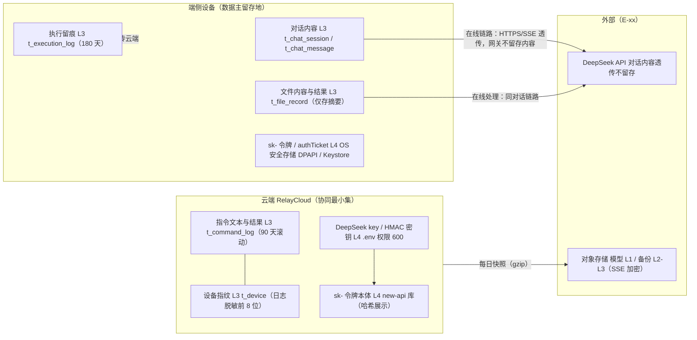

# AICoding 架构设计 · 安全设计

> 本文档为《AICoding 架构设计》核心产物之一，对应**安全架构设计模版**。
> 上游输入：《系统设计》（`.workbuddy/output/系统设计.md`，v1.0，G4 已冻结）的模块边界、数据流、接口契约、身份边界与运行形态；《高层架构设计》（`.workbuddy/output/高层架构设计.md`，v0.1，G3 已冻结）的风险登记（R-02 模型许可合规、R-03 远控通道被滥用）与边界决策（O3 无账号体系、O5 小范围分发暂缓备案）。
> 下游输出：与 platform-architect《部署设计》交叉对齐后进入 G5 审核，放行 Phase 6。

---

## 0. 元信息：修订记录与裁剪声明

| 文档版本 | 发布日期 | 修订人 | 修订说明 |
| --- | --- | --- | --- |
| v0.9 | 2026-07-21 | security-architect（严守正） | 骨架阶段：§1.1 安全总体架构图 + §5.1 网络分区 + §5.2 流量管控初步规则，待与部署侧拓扑对齐 |
| v1.0 | 2026-07-21 | security-architect（严守正） | 全稿：§1~§7 七章建立，继承《系统设计》v1.0 冻结边界，含硬指标自检与中间确认自检报告 |

**裁剪与顺延声明**（按模版"按需裁剪"约定，章节序号已重排并保持连续）：

| 模版章节 | 处理方式 | 理由 |
| --- | --- | --- |
| 模版 §2.3 云账号与云资源访问（子账号 / 主账号 / CAM 策略） | **裁剪保留为 §2.3 但内容重写** | 本项目为单云账号单人运维的校级项目，无主/子账号体系；权限分离诉求改写为"控制台账号 vs 服务凭证 vs 管理口令"三类主体分离（§2.3） |
| 模版 §3.3.4 文件存储安全（外链分享 / 预签名 URL / 病毒扫描） | **裁剪合并入 §3.3.3 对象存储安全** | 本项目对象存储仅承载模型分发与备份两类内部用途，无用户生成文件上传、无外链分享场景；上传病毒扫描不适用（模型入库走运维侧 SHA256 校验 + 许可审核，见 §4.4） |
| 模版 §4.3.3 防薅羊毛（风控规则 / 黑名单 / 行为分析） | **整节删除，相关防线并入 §4.3.2 防刷防爬与 §6 令牌管控** | 本项目无营销、积分、免费额度类被薅场景；令牌额度封顶（§6.2）已承担等价防线 |
| 模版 §5.3.2 容器 / K8s 安全 | **裁剪为 §5.3.2 容器安全（Docker 单机）** | 本项目不引入 K8s（《系统设计》§3.1.5 已冻结 docker-compose 单机编排）；保留容器维度全部控制点，删除 K8s RBAC / NetworkPolicy / Pod 安全策略条目 |
| 模版 §5.4 中间件安全（数据库 / Redis / MQ 强制鉴权与审计） | **裁剪为 §5.4 中间件与本地库安全** | 本项目无 Redis / MQ / 独立数据库中间件（《系统设计》O7 已声明）；中间件面收敛为 new-api 容器与 SQLite 文件库，按实际形态重写 |
| 模版 §6.2 AKSK 泄露防护（KMS 白盒密钥 / CAM 策略） | **裁剪为 §6.2 凭证泄露防护** | 不启用云 KMS（《系统设计》§7.1 已冻结：校级项目单密钥量级，KMS 成本与复杂度不匹配）；防护改写为"最小持有面 + 环境隔离 + 泄露轮换 SOP" |
| 模版中的 DDoS 高防 / WAF / 云防火墙 / 堡垒机 / SOC 独立产品 | **不启用，替代保障逐项登记（§1.1 组件清单）** | 继承《系统设计》§7.1 冻结决策：WSS/REST 双协议 + 无公开注册面，攻击面极小，独立安全产品成本超校级预算 |

---

## 1. 安全总体架构

### 1.1 安全总体架构图

> SVG 矢量版：`pic/security-overview/security-overview.svg`；绘图源码：`pic/diagram-source/security-overview.py`。

**信任边界说明**（与《系统设计》§3.1.1 系统上下文、§6.1 网络环境规划对齐）：

| 边界编号 | 边界 | 跨越协议 | 边界控制点 |
| --- | --- | --- | --- |
| TB-01 | 端侧 ↔ 公网接入域 | WSS / HTTPS（TLS ≥ 1.2） | 证书链校验（端侧强制，禁止忽略 TLS 错误）；authTicket / sk- 令牌鉴权 |
| TB-02 | 公网接入域 ↔ 云端安全域 | 容器内网 HTTP（docker bridge） | 安全组仅放 443/22；Nginx 限流初筛；relay:8080 与 new-api:3000 不直接暴露公网 |
| TB-03 | 云端安全域 ↔ 外部依赖（E-01/E-02/E-03） | HTTPS 出向 | 出向域名白名单（《系统设计》§6.2.2）；真实 key 仅存在于云主机 `.env` |
| TB-04 | 双端 ↔ 端侧本地存储 | 进程内 SQL / OS 文件 API | OS 用户目录权限 / Android 应用沙盒；凭证走 OS 安全存储（DPAPI / Keystore） |

**安全组件清单**（按本项目实际裁剪；不启用项均注明替代保障）：

| 组件 | 本项目形态 | 作用 | 启用状态 |
| --- | --- | --- | --- |
| DDoS 防护 | 云厂商基础防护（免费默认额度） | 抵御流量攻击；触发上限时接受短暂不可用，异常流量经 AL-03/AL-05 告警 | 启用（默认额度） |
| WAF | 不启用独立 WAF 产品；Nginx 层承担基础 Web 防护（请求体大小限制 ≤ 1MB、慢连接超时 15s、连接数与速率限制、安全响应头注入） | Web 应用层攻击缓解 | 裁剪替代（理由：WSS/REST 双协议 + 无公开注册面 + 成本约束，见《系统设计》§7.1） |
| 防火墙 / 安全组 | 云厂商安全组 + 宿主机 ufw 双兜底 | 南北向流量管控（仅 443/22 入站） | 启用 |
| 主机安全 | 最小化安装 + SSH 密钥登录（禁用密码）+ fail2ban + 自动安全更新 | 资产梳理、漏洞修补、入侵阻断 | 启用（自建基线） |
| 容器安全 | 非 root 运行 + 只读根文件系统（relay-server）+ 镜像 digest 锁定 | 容器逃逸与镜像投毒防护 | 启用（自建基线） |
| 数据安全审计 | 不启用独立审计产品；云端 `t_command_log` + 本机 `t_execution_log` 双留痕承担 | 关键操作可追溯 | 启用（自建留痕） |
| KMS | 不启用云 KMS；`.env`（权限 600）+ OS 安全存储 + new-api 密钥托管 | 敏感凭证保护 | 裁剪替代（理由与红线见 §6.1） |
| 堡垒机 | 不启用；SSH 密钥 + 安全组运维 IP 白名单 + 云控制台操作日志承担 | 运维通道保护 | 裁剪替代（单人运维，云控制台自带操作审计） |
| SOC | 不启用；§7.1 自建监控规则 + §7.2 审计日志 + AL-01~AL-08 告警承担 | 安全事件监控 | 裁剪替代（§8 可观测体系 + 周度人工巡检） |
| 构建红线扫描 | 打包管线 grep 级扫描（key 模式 + 真实模型名 + 网关内网地址） | key 零入包（V3 / QS-01） | 启用（自建管线步骤） |

### 1.2 威胁模型

> 方法：STRIDE 六类全覆盖。每条威胁映射到本文档后续章节的具体缓解措施，形成"威胁—缓解措施映射表"。
> 建模基线：《系统设计》六大模块（M1 对话引擎 / M2 模型管理 / M3 文件处理 / M4 远程控制 / M5 中继调度 / M6 API代理）、WSS 指令信封契约（§3.2.M4.3）、配对流程（SQ-M4-01）、五态状态机、接口鉴权（authTicket + sk- 令牌）、白名单执行器 + 本机二次确认、数据本地化原则、key 零入包红线。

#### 1.2.1 STRIDE 威胁清单与缓解映射表

| 编号 | STRIDE 类别 | 威胁描述（映射到系统模块 / 数据流） | 风险等级 | 缓解措施（映射章节） |
| --- | --- | --- | --- | --- |
| T-01 | 仿冒（Spoofing） | 攻击者伪造 WSS 接入：盗用或猜测 `authTicket` 冒充已配对设备接入 relay-server（M5，TB-01） | 高 | authTicket = HMAC-SHA256(pairingId+deviceId+expire, 服务端密钥)，7 天有效期，连接时校验（§2.1.3）；配对绑定校验（fromDeviceId/toDeviceId 必须同 tenantId，§2.2.4）；TLS 强制（§3.2.1） |
| T-02 | 仿冒（Spoofing） | 配对码爆破：攻击者对 6 位配对码发起穷举提交，抢在真实手机端之前完成绑定（M5 `pair.code.submit`） | 高 | 配对码 300 秒 TTL + 一次性原子核销（§2.1.1）；重保接口限流：单 IP 10 次/分钟、失败 5 次锁 15 分钟（§4.3.2）；电脑端大屏展示配对码限定物理在场可见（§2.1.1） |
| T-03 | 仿冒（Spoofing） | 设备令牌（sk-）泄露后被冒用调用在线对话，消耗 DeepSeek 额度（M6，E-01 链路） | 高 | 令牌按设备签发、额度与速率双封顶（§6.2.2）；泄露即回收轮换（§7.3.4）；客户端零真实 key，令牌泄露损失被额度硬顶限制（§6.1） |
| T-04 | 仿冒（Spoofing） | 运维身份仿冒：云控制台 / new-api 管理面 / SSH 被非法登录（TB-02、管理面） | 高 | 控制台强口令 16 位 + 云厂商 MFA；SSH 仅密钥登录 + 运维 IP 白名单 + fail2ban（§2.3.2、§5.3.1）；new-api 管理口令独立且不对外开放端口（§2.1.2、§5.4.1） |
| T-05 | 篡改（Tampering） | 指令信封在传输中被篡改：伪造 `toDeviceId` / `cmd_text` 诱导执行面动作（M4/M5 信封链路） | 高 | WSS over TLS 全链路加密（§3.2.1）；信封 Schema v1 校验（version/type/必填字段，§4.1）；执行面白名单二次校验（§4.3.1）；危险动作本机确认兜底（§4.3.5） |
| T-06 | 篡改（Tampering） | 模型文件在分发或存储中被替换为恶意 GGUF（M2 下载链路、E-03 对象存储） | 高 | 发布清单 SHA256 摘要云端登记、端侧下载后全量校验，不一致即删除重下（§3.3.3、SQ-M2-01）；对象存储私有桶 + 签名 URL 防盗链（§3.3.3）；模型入库前运维侧校验 + 许可审核（§4.4） |
| T-07 | 篡改（Tampering） | 云端 SQLite / 端侧本地库被直接改写（篡改配对关系、白名单配置、执行留痕） | 中 | 云端库文件权限 600 + 主机层安全组/SSH 管控（§3.3.3）；端侧白名单缓存构建失败时 fail-closed 拒绝全部远程指令（§4.3.1）；执行留痕不被远程指令修改（白名单无日志写动作，§7.2） |
| T-08 | 篡改（Tampering） | 安装包被二次打包植入恶意代码后传播（分发链路） | 中 | 安装包哈希（SHA256）随分发公告发布，用户可校验（§4.4）；构建红线扫描防止打包期植入 key（§6.3）；后续版本规划代码签名（待裁决项 §8） |
| T-09 | 否认（Repudiation） | 手机端否认发送过某条远程指令，或电脑端在场者否认做过确认决议（M4 指令链路） | 中 | 双留痕：云端 `t_command_log`（指令全文 + 来源设备 + 状态迁移 + traceId，90 天）+ 本机 `t_execution_log`（含 confirm_decision，180 天）（§7.2）；traceId 全链串联（§7.2） |
| T-10 | 否认（Repudiation） | 运维操作无记录（令牌签发/回收、渠道配置变更、控制台操作）无法追溯 | 中 | new-api 管理面调用日志（§7.2）；云控制台操作日志（云厂商默认 90 天）（§7.2）；周度巡检复核令牌与渠道清单（§7.1） |
| T-11 | 信息泄露（Information Disclosure） | DeepSeek 真实 API key 泄露（安装包逆向、代码仓库、日志、错误堆栈）→ 账单无上限 | 高 | key 零入包：构建管线扫描红线（QS-01，§6.3）；key 仅存云主机 `.env`（600 权限）永不离开服务器（§6.1）；日志中间件对 Authorization/sk-/key 自动打码（§4.2.2）；泄露应急 SOP（§7.3.4） |
| T-12 | 信息泄露（Information Disclosure） | 真实模型名（deepseek-chat）暴露给终端用户，破坏"Deepseek-V4-Pro"品牌显示约定 | 中 | 网关模型映射（new-api modelMapping，§3.2.5 传参约束）；端侧仅显示 Deepseek-V4-Pro / 本地模型（§4.2.1）；构建扫描含真实模型名红线（§6.3） |
| T-13 | 信息泄露（Information Disclosure） | 对话内容 / 文件内容离开用户设备（云端留存、日志夹带、备份夹带） | 高 | 数据本地化：会话/文件内容仅存端侧，云端不落地（§3.1 数据分级、§3.3.1）；日志 msg 字段禁止含对话/文件内容（§4.2.2）；端侧数据不自动备份（§3.3.6）；在线链路内容经网关透传不留存（new-api 日志仅元数据，§3.2.5） |
| T-14 | 信息泄露（Information Disclosure） | 设备指纹 / 指令文本 / 执行结果在日志或展示层超范围暴露 | 中 | 设备指纹日志仅前 8 位（§3.3.5 脱敏）；指令与结果仅向绑定双方展示（数据属主，§3.3.5）；云端无导出接口（§3.3.5） |
| T-15 | 信息泄露（Information Disclosure） | 备份桶 / 模型桶被公开读取（对象存储误配） | 中 | 私有桶 + 签名 URL 短有效期 + 服务端加密 SSE（§3.3.3）；备份上传走 rclone 专用 AKSK（最小权限）（§6.1）；每周巡检桶 ACL（§7.1） |
| T-16 | 拒绝服务（DoS） | 云端入口被打爆：WSS 连接洪泛 / HTTPS CC / 配对提交刷接口（TB-01，单机 2C4G 承载有限） | 高 | Nginx 限流初筛 30 QPS/IP + 连接数限制（§5.2.1）；业务五维限流（全局 60 / 租户 10 / IP 30 / 设备 5 QPS + 配对重保，§4.3.2）；云厂商基础 DDoS 防护（§5.2.1）；超限接受短暂不可用并告警（AL-05） |
| T-17 | 拒绝服务（DoS） | 慢连接 / 大包体耗尽 Nginx 与应用资源（Slowloris、超大请求体） | 中 | Nginx：client_body_timeout 15s、client_max_body_size 1MB、WSS 代理读超时与连接上限（§5.2.1）；指令文本 ≤ 500 字、消息 ≤ 8000 字应用层硬限（§4.1） |
| T-18 | 拒绝服务（DoS） | 端侧推理资源被远程指令耗尽（恶意指令触发长时间推理占用本机 CPU/内存） | 中 | 指令白名单仅含预置动作，MVP 不走大模型解析指令（模板匹配）（§4.3.1）；执行超时 30s 硬上限（§4.3.1）；推理服务仅响应本机用户（回环端口 127.0.0.1，§5.4.2） |
| T-19 | 权限提升（Elevation of Privilege） | 水平越权（IDOR）：未配对设备向他人电脑下发指令（跨 tenantId 路由） | 高 | 中继强制校验信封双端 deviceId 同属一个 tenantId，违规则 C403001 并断开连接（§2.2.4）；tenantId = 配对关系 ID 全链路携带（§2.2.3） |
| T-20 | 权限提升（Elevation of Privilege） | 垂直越权：普通设备获得管理能力（伪造管理面请求、调用令牌签发接口） | 高 | 管理面与流量面端口隔离：new-api 管理 API 不暴露公网（仅容器内网 + 本地回环），独立管理口令（§5.4.1）；令牌签发仅运维者经管理面执行（§2.2.2） |
| T-21 | 权限提升（Elevation of Privilege） | 远程指令越权执行危险桌面操作（文件写入/删除等）未经在场者同意（R-03 核心场景） | 高 | 白名单执行器：动作注册表 + dangerLevel 分级（§4.3.1）；危险动作本机弹窗 15s 倒计时默认拒绝（§4.3.5）；远程控制总开关 + 逐项启用勾选（§4.3.1）；执行留痕（§7.2） |
| T-22 | 权限提升（Elevation of Privilege） | 容器逃逸 / 宿主机提权：relay-server 或 new-api 容器被突破后控制云主机 | 中 | 容器非 root 运行 + relay-server 只读根文件系统（§5.3.2）；宿主机最小化安装 + SSH 密钥 + fail2ban（§5.3.1）；镜像 digest 锁定防供应链投毒（§4.4） |

#### 1.2.2 威胁—缓解映射链说明

- **最高威胁面（R-03 远控通道被滥用）**对应 T-01 / T-02 / T-05 / T-19 / T-21 五条威胁，缓解链为：配对绑定校验（§2.2.4）→ authTicket 接入鉴权（§2.1.3）→ 信封 Schema 校验（§4.1）→ 白名单执行器（§4.3.1）→ 危险操作本机二次确认（§4.3.5）→ 双留痕审计（§7.2），链路完整无断点。
- **key 泄露面（V3 / P3）**对应 T-03 / T-11 / T-12，缓解链为：客户端零 key（§6.1）→ 网关令牌额度/速率管控（§6.2.2）→ 模型映射隐藏真实模型名（§3.2.5）→ 构建红线扫描（§6.3）→ 泄露应急 SOP（§7.3.4）。
- **端侧数据面**对应 T-13 / T-14，缓解链为：数据本地化（§3.3.1）→ 日志内容红线（§4.2.2）→ 展示脱敏（§3.3.5）→ 端侧不自动备份（§3.3.6）。
- **信任边界图**：见 §1.1 架构图 TB-01~TB-04 标注；**敏感数据流图**：见 §3.1.1；**威胁—缓解映射图**：见本节映射表（表格为权威源，映射链说明为导读）。

---

## 2. 身份与访问管理（IAM）

> 本项目**无账号体系**（O3 冻结）：设备配对即身份。本章按"设备身份 + 配对授权 + 运维身份"三类主体重写 IAM，替代模版的用户账号体系章节。

### 2.1 身份认证（Authentication）

#### 2.1.1 设备身份与配对认证

| 项 | 取值 |
| --- | --- |
| 身份模型 | 设备即身份：双端 App 首次启动生成设备 UUID（deviceId）+ 设备指纹（机型 + 首启随机 ID），持久化于端侧安全存储 |
| 绑定认证（第一种认证方式） | **配对码绑定**：6 位数字（CSPRNG 生成，冲突重生成 ≤ 3 次）、300 秒 TTL、一次性原子核销（`UPDATE ... WHERE code=? AND code_used=0 AND code_expire_at>now`）；同设备未过期码复用防连点 |
| 在场因子 | 配对码仅显示在电脑端屏幕（大字 + 二维码 + 倒计时），构成"物理在场可见"因子，等效一次 MFA（无账号体系下的务实替代） |
| 接入认证（第二种认证方式） | **authTicket 接入票据**：配对成功时由中继签发，`HMAC-SHA256(pairingId + deviceId + expire, 服务端密钥)`，有效期 7 天，WSS 接入时校验；到期由中继自动续签轮换 |
| 第三种认证方式 | **设备 API 令牌**（sk- 设备级，new-api 签发）：在线对话链路的 Bearer 凭证，按设备发放，与配对关系联动回收（详见 §6.2.2） |
| 认证方式核对 | ≥ 2 种硬指标 ✅：配对码绑定（知识 + 在场因子）、authTicket（持有因子 + HMAC 签名）、sk- 令牌（持有因子）共 3 种 |

#### 2.1.2 口令策略（量化阈值）

> 本项目无用户口令；仅存两类管理口令，策略如下：

| 项 | new-api 管理口令 | 云控制台账号 |
| --- | --- | --- |
| 最小长度 | 16 位 | 16 位 |
| 复杂度 | 大小写字母 + 数字 + 符号四选三（强制） | 同左，且必须开启云厂商 MFA |
| 存储 | new-api 库内哈希（不导出、不回显） | 云厂商托管 |
| 更换周期 | 每学期 1 次 | 每学期 1 次 |
| 失败锁定 | new-api 原生失败锁定策略（连续失败递增延迟） | 云厂商原生锁定 |
| 持有范围 | 仅运维者 1 人，不入任何文档与聊天记录 | 仅运维者 1 人 |
| 注册策略 | 无自助注册：管理账号部署时初始化脚本创建，仅此一个 | 无子账号（单人运维，裁剪说明见 §0） |

#### 2.1.3 会话与票据管理

| 项 | 取值 |
| --- | --- |
| 票据类型 | authTicket（WSS 接入，HMAC 签发）；sk- 设备令牌（HTTPS/SSE 对话，new-api 签发）；配对码（绑定期一次性凭证，300 秒） |
| 有效期 | authTicket 7 天（自动续签）；sk- 令牌不过期 + 额度耗尽即失效（按学期手动回收）；配对码 300 秒 |
| 互踢机制 | 单点登录策略：同 deviceId 新 WSS 连接踢旧连接（close 4009 "他处登录"） |
| 注销机制 | 解绑 = 注销：双端任一方可发起 `pair.unbind`，中继置配对关系 unbound，联动回收该设备 sk- 令牌，authTicket 同步失效 |
| 风险接入检测 | 同 deviceId 短时间内多次重连（10 次/分钟）触发告警日志；配对提交失败 5 次锁 15 分钟（§4.3.2） |
| 传参禁忌 | authTicket / sk- 令牌禁止出现在 URL Query 之外长期留存——WSS 接入时 Query 携带 authTicket 属一次性握手（TLS 内），接入后不再传输；HTTPS 对话一律走 `Authorization: Bearer` Header，**禁止 URL 携带令牌**（§3.2.5） |

### 2.2 授权与权限控制（Authorization）

#### 2.2.1 权限模型

采用**绑定关系 ACL**（设备对设备的授权矩阵），而非 RBAC：无账号体系下 RBAC 无主体可挂，配对关系（pairingId = tenantId）即最小授权单元（继承《系统设计》§7.2.5 冻结决策）。等价于"以配对关系为角色的极简 RBAC0"，高敏操作（危险动作）叠加**属性条件**（dangerLevel + 本机确认开关 + 总开关），形成"绑定 ACL + 属性门控"双层模型。

#### 2.2.2 权限维度

| 维度 | 控制点 |
| --- | --- |
| 接口级 | WSS：配对建立前仅 `pair.*` 类型放行；建立后 `cmd.*` 必须持有效 authTicket 且通过绑定校验；REST 流量面：必须持 sk- 令牌（new-api 原生鉴权）；管理面：独立管理口令 + 端口不暴露公网 |
| 数据级 | 行级：云端所有查询强制携带 tenantId（中继路由只查同 tenant 的对端设备）；列级：设备指纹日志仅前 8 位（§3.3.5 脱敏） |
| 功能级 | 远程控制总开关（`remote_master_switch`）、危险确认开关（`danger_confirm_switch`）、白名单逐项启用勾选——三级功能门控均在执行面本机生效 |

#### 2.2.3 多租户（配对关系）隔离

**逻辑隔离**：tenantId = 配对关系 ID，云端表（`t_device` / `t_pairing` / `t_command_log` / `t_api_token`）强制携带；信封 `tenantId` 字段必填，中继校验信封双端 deviceId 同属一个 tenantId。不采用物理隔离的理由：校级项目单实例 SQLite，配对关系 ≤ 50，物理隔离成本与收益完全不匹配；隔离强度由"绑定校验 + 唯一索引 + 查询强制过滤"三重机制保证。

#### 2.2.4 越权防护

| 越权类型 | 防护措施 |
| --- | --- |
| 水平越权（IDOR） | 中继路由前校验 `fromDeviceId` / `toDeviceId` 必须属于同一 tenantId，否则返回 C403001 并断开连接；信封 `tenantId` 与连接注册 tenantId 不一致即拒绝；端侧资源（会话/文件）仅本机访问，无跨设备 IDOR 面 |
| 垂直越权 | 无角色层级；唯一特权操作（令牌签发 / 渠道配置 / 看板）仅经 new-api 管理面（独立口令 + 端口不暴露公网）；端侧无提权接口 |

### 2.3 云端主体与权限分离

#### 2.3.1 三类主体分离

| 主体 | 凭证形态 | 用途边界 |
| --- | --- | --- |
| 运维人员身份 | 云控制台账号（16 位口令 + MFA） | 主机 / 安全组 / 对象存储 / 账单管理 |
| 服务身份 | rclone 专用对象存储 AKSK（最小权限：仅备份桶读写） | 每日备份脚本上传快照 |
| 应用身份 | DeepSeek 真实 key（`.env`）+ HMAC 服务端密钥 + new-api 管理口令 | relay-server / new-api 运行时凭证 |

#### 2.3.2 高敏权限分离

- DeepSeek 真实 key 与 rclone AKSK **分文件、分用途**存放，互不通用；
- new-api 管理口令与云控制台口令**不同值**；
- 高敏操作（吊销 key、变更安全组、回收令牌）仅运维者本人执行，操作后周度巡检时复核（§7.1）。

---

## 3. 数据安全

### 3.1 数据分级

| 等级 | 类别 | 本项目数据实例 | 处理策略 |
| --- | --- | --- | --- |
| L1 | 公开 | 模型发布清单（`t_model_release` 非签名部分）、产品文档、开源许可文本 | 无特殊管控；CDN 分发内容本身即公开模型 |
| L2 | 内部 | 设备名、配对关系元数据、用量统计数据、错误码与日志元数据 | 需鉴权访问（authTicket / 管理口令）；日志本地留存滚动删除 |
| L3 | 敏感 | 对话内容、文件处理内容与结果、指令文本与执行结果、设备指纹、配对码、authTicket | 传输 TLS 强制；端侧本地化存储；展示限数据属主；日志脱敏（指纹前 8 位）；滚动删除（云端 90 天 / 端侧 90~180 天） |
| L4 | 高敏 | DeepSeek 真实 API key、new-api 管理口令、HMAC 服务端密钥、rclone AKSK、sk- 令牌明文 | 仅存云端 `.env`（600 权限）或 new-api 库（哈希）；禁止入代码 / 日志 / 安装包 / URL；泄露即轮换（§7.3.4） |

> 说明：本项目不采集手机号 / 身份证 / 银行卡 / 人脸等法定高敏个人信息（无账号体系），L4 级数据全部为系统凭证类。

#### 3.1.1 敏感数据流图

**数据流红线**：

| 红线 | 承载章节 |
| --- | --- |
| 对话 / 文件内容不落地云端（网关透传、日志不夹带、备份不含端侧数据） | §3.3.1、§4.2.2、§3.3.6 |
| L4 凭证不离开云主机（DeepSeek key）/ 不离开本设备（sk- 令牌、authTicket 明文仅端侧安全存储与传输期 TLS 内） | §6.1、§6.3 |
| 设备指纹不出日志全文（仅前 8 位） | §3.3.5 |

### 3.2 数据传输安全

#### 3.2.1 公网访问

| 项 | 取值 |
| --- | --- |
| 协议基线 | 全链路 TLS ≥ 1.2（WSS / HTTPS）；禁用 SSLv3、TLS 1.0 / 1.1 |
| 证书 | 云主机 Nginx 配置受信 CA 证书（Let's Encrypt 或云厂商免费证书），自动续期 |
| 端侧校验 | 双端强制校验证书链，**禁止忽略 TLS 错误**（不实现"跳过证书校验"调试开关进生产包） |
| 加密套件 | Nginx ssl_protocols 限定 TLSv1.2 TLSv1.3；禁用弱套件（RC4 / DES / 3DES / MD5） |

#### 3.2.2 服务内部访问

| 链路 | 协议与依据 |
| --- | --- |
| Nginx → relay-server / new-api（同机容器内网） | 明文 HTTP/WSS：单机 docker bridge 内网，边界由安全组 + Nginx 承担（《系统设计》§6.2.1 冻结）；若未来多机拆分必须重评并启用 mTLS |
| relay-server ↔ new-api | 运行时无相互调用（职责分离）；仅管理面初始化 / 巡检脚本经 HTTP 调用 |
| relay-server → SQLite | 本地文件访问（WAL），无网络协议 |

#### 3.2.3 数据库连接

SQLite 为进程内嵌入式库，无网络连接面；保护依赖库文件权限（600）与主机层管控（§3.3.3）。

#### 3.2.4 接口签名与防重放

| 场景 | 机制 |
| --- | --- |
| WSS 接入认证 | authTicket 本身即 HMAC-SHA256 签名票据（pairingId+deviceId+expire，服务端密钥）；握手时校验签名与有效期 |
| WSS 信封防重放 | `commandId`（客户端 UUID）全链幂等去重 + `envelopeId` 链路锚点 + `timestamp` 字段；中继对终态 commandId 去重（终态仅写一次）；端侧重连补发不产生重复执行 |
| HTTPS 对话防重放 | `client_msg_id` 幂等键（透传 new-api `user` 字段日志锚点）；令牌本身为持票人凭证，TLS 通道内防窃听 |
| 配对码防重放 | 一次性原子核销（DB UPDATE 条件原子性），同码第二次提交必然失败 |

#### 3.2.5 传参约束

| 约束 | 内容 |
| --- | --- |
| 禁止 URL 携带敏感参数 | sk- 令牌、authTicket（接入握手后）、配对码（仅提交信封 payload 内）禁止出现在日志可留存的 URL 中；模型显示名仅允许 `Deepseek-V4-Pro`，真实模型名 `deepseek-chat` 仅存在于网关映射配置，禁止出现在端侧任何请求与界面 |
| 请求体大小 | Nginx `client_max_body_size 1m`；应用层：指令文本 ≤ 500 字、对话消息 ≤ 8000 字、文件处理文本截断 12000 字 |
| 错误回传 | 上游错误经网关 / 端侧归一化为全局错误码（《系统设计》§3.5.1），不透传 DeepSeek / new-api 原生错误体（防渠道信息与真实模型名泄露） |

### 3.3 数据存储安全

#### 3.3.1 加密与本地化存储

| 存储位置 | 数据 | 加密策略 |
| --- | --- | --- |
| 端侧本地库（C-02） | 会话 / 消息 / 文件记录 / 执行留痕（L3） | MVP 依赖 OS 用户目录权限（Windows 用户目录 ACL / Android 应用沙盒），不额外加解密（《系统设计》§7.2.2 冻结取舍，"对话不出设备"原则兜底）；**完整版增强**：SQLCipher 全库加密（密钥派生自设备随机主密钥，存 OS 安全存储） |
| 端侧凭证 | sk- 令牌 / authTicket（L4） | Windows DPAPI 加密存储 / Android Keystore 加密的 SharedPreferences；禁止明文写配置文件 |
| 云端 SQLite（C-01） | 设备 / 配对 / 指令日志 / 令牌索引（L2-L3） | 不启用 TDE（L2 为主，主机层安全组 + SSH + 文件权限 600 承担，《系统设计》§7.2.2 冻结）；`t_api_token` 不落 sk- 明文（仅存 newapi_token_id） |
| new-api 库（C-06） | 令牌 / 渠道 key（L4） | new-api 原生存储（key 哈希展示，渠道 key 密文）；数据卷权限 600，纳入每日备份 |
| 对象存储（C-03） | 模型 GGUF（L1）/ 备份快照（L2-L3） | 服务端加密 SSE 开启；私有桶 |

#### 3.3.2 敏感字段单向哈希与脱敏存储

| 字段 | 策略 |
| --- | --- |
| new-api 管理口令 | new-api 原生哈希存储（不回显、不导出） |
| sk- 令牌 | new-api 库内完整存储（签发需要），管理面仅签发时完整返回一次，此后脱敏 `sk-****`；中继侧 `t_api_token` 仅存 `newapi_token_id` 索引，**不落明文** |
| 配对码 | 仅存 300 秒生命周期，绑定成立即置 NULL（核销语义），过期物理删除 |
| 设备指纹 | 云端明文存储（重复设备去重所需唯一索引），日志与展示层仅前 8 位 |

#### 3.3.3 本地库与对象存储安全

| 对象 | 控制点 |
| --- | --- |
| 云端 SQLite | 库文件权限 600（属主 relay 运行用户）；仅 relay-server 进程访问；备份经 gzip + rclone 加密通道上传；每日备份任务日志记录（backup_done / backup_failed） |
| 端侧 SQLite | 应用私有目录；Android 禁止 `allowBackup` 明文导出（Manifest `android:allowBackup="false"`）；Windows 侧存用户目录 AppData，禁止安装到共享目录 |
| 对象存储（模型桶） | 私有桶 + 预签名 URL（防盗链签名，短有效期 ≤ 24h，由运维在对象存储侧配置）；仅放行 GET；SHA256 摘要随发布清单登记，端侧下载后全量校验 |
| 对象存储（备份桶） | 私有桶，禁一切公网访问；SSE 加密；rclone 专用 AKSK 仅本桶读写权限 |

#### 3.3.4 数据使用安全

| 场景 | 控制点 |
| --- | --- |
| 展示脱敏 | 设备指纹：日志与管理视图仅前 8 位 + `…`；sk- 令牌：管理面 `sk-****`；设备名为用户自命名不做脱敏（L2，完整展示） |
| 展示授权 | 指令文本 / 执行结果仅向绑定双方展示（数据属主：控制面手机端 + 执行面电脑端记录页）；云端无对外查询接口 |
| 数据导出 | 端侧会话导出 JSON 为用户自主行为（设置页入口，无需审批）；云端数据无导出接口；禁止导出设备指纹与令牌 |
| 数据销毁 | 云端：指令日志 90 天滚动物理删除、配对关系解绑后 90 天物理清理、配对码过期每 10 分钟物理删除；端侧：执行留痕 180 天、文件记录 90 天滚动删除，会话软删 30 天后物理清理，用户可"清空全部历史"即时物理删除 |

#### 3.3.5 脱敏策略表（汇总）

| 字段 | 分级 | 存储策略 | 展示策略 | 导出策略 |
| --- | --- | --- | --- | --- |
| 指令文本 / 执行结果 | L3 | 云端 90 天 + 本机 180 天滚动删除 | 绑定双方完整展示 | 无导出接口 |
| 对话内容 | L3 | 仅端侧本地 | 仅本机完整展示 | 用户手动导出 JSON（自主） |
| 设备指纹 | L3 | 云端明文（去重索引） | 日志 / 运维视图仅前 8 位 | 禁止导出 |
| 设备名 | L2 | 云端存储 | 完整展示 | 不限制 |
| sk- 令牌 | L4 | new-api 库；中继侧仅存索引 | 签发时完整返回一次，此后 `sk-****` | 禁止导出 |
| authTicket | L4 | 端侧 OS 安全存储；云端仅存 HMAC 校验所需密钥 | 永不展示 | 禁止导出 |
| DeepSeek 真实 key | L4 | 云主机 `.env`（600） | 永不展示 | 禁止导出 |

#### 3.3.6 数据备份与容灾

| 存储类型 | 备份策略 | RPO / RTO |
| --- | --- | --- |
| 云端 SQLite（relay.db + new-api 数据卷） | 每日 02:00 cron 全量快照（`sqlite3 .backup` 热备）→ gzip → rclone 上传备份桶；保留 30 天滚动 | RPO ≤ 24h；RTO ≤ 4h（继承《系统设计》§4.3.2 冻结值） |
| 端侧数据 | 不自动备份（隐私优先：对话不出设备）；用户可手动导出会话 JSON | 端侧 RPO = 0（本地实时持久化） |
| 对象存储模型桶 | 无备份需求（可从 E-02 权重源重新同步）；备份桶即备份本体 | 云厂商多副本 SLA 99.9% |
| 恢复演练 | 每学期 1 次（开学第 2 周）：快照恢复 → 容器拉起 → 双端重新配对连通验证 | 负责人：项目委托人 |

#### 3.3.7 隐私合规

| 项 | 本项目结论 |
| --- | --- |
| 适用法规 | 《个人信息保护法》《数据安全法》为基线；**不适用 GDPR**（用户限定境内同学，无欧盟主体、无跨境提供） |
| 个人信息最小化 | 无账号体系（O3）：不采集姓名 / 手机号 / 邮箱 / 证件；唯一可识别信息为设备名（用户自命名）与设备指纹（去重用途） |
| 用户同意机制 | 首次启动展示隐私说明（数据本地化原则、在线链路内容经网关透传至 DeepSeek 的告知、远程控制留痕告知），用户明示同意后进入；远程控制默认总开关开启但危险确认开关默认开启，用户可在设置页关闭总开关 |
| 可被遗忘权 | 解绑即删除云端配对关系与设备记录（30 天追溯期后物理清理）；端侧"清空全部历史"即时物理删除；指令日志随 90 天滚动自然消亡 |
| 数据出境 | 无跨境：DeepSeek 为境内服务，云主机与对象存储均为境内 Region |
| 生成式 AI 备案 | 小范围私有分发（≤ 50 人）不构成向公众提供服务，暂缓备案评估（O5 冻结）；**上架公开渠道前必须重启评估**（登记 §8 待裁决项） |
| 模型许可合规 | 离线模型仅使用 MIT / Apache-2.0 许可权重（DeepSeek-R1-0528-Qwen3-8B / Qwen3-4B）；应用内"关于"页展示许可文本（R-02 防线）；许可台账见 §4.4 |

---

## 4. 应用安全

> 本章以 OWASP Top 10（2021）为对照框架，结合本项目"双端原生 App + WSS/REST 云端"的实际暴露面逐项给出防护措施。无浏览器渲染页面的传统 Web 面（Tauri WebView 仅加载本地打包资源，不加载远程页面），XSS/CSRF 风险面相应收窄，均给出本项目化防护而非泛化描述。

### 4.1 输入安全（OWASP Top 10 对照）

| OWASP 风险 | 本项目暴露面 | 防护措施（具体机制） |
| --- | --- | --- |
| A01 访问控制失效 | WSS 指令路由、设备/配对资源访问 | 绑定关系 ACL：信封双端 deviceId 必须同 tenantId（§2.2.4）；`pair.*` 仅未绑定态放行、`cmd.*` 必须已绑定；执行面 tenantId 在本机绑定表中校验（SQ-M4-02 Step 1） |
| A02 加密失效 | 传输与存储 | TLS ≥ 1.2 强制 + 端侧证书链校验（§3.2.1）；凭证走 OS 安全存储（§3.3.1）；口令哈希（§3.3.2）；完整版 SQLCipher 端侧库加密（§3.3.1） |
| A03 注入（SQL / 命令） | 云端 SQLite 全部 SQL；指令文本到动作映射 | SQL：relay-server 全部经 sqlx 参数化查询（编译期校验，禁止字符串拼接 SQL）；动态排序/过滤字段走枚举白名单映射。命令注入：白名单执行器**禁止动态命令执行**——动作注册表为预置代码分支（open_app 映射注册表内应用路径、volume_set 映射系统 API、file_write/file_delete 走参数化路径校验），指令文本只做模板匹配提取参数，绝不拼接 shell；文件路径参数必须规范化（拒绝 `..` 穿越与绝对路径逃逸，限制在白名单登记目录） |
| A04 不安全设计 | 远控通道（R-03） | 威胁建模驱动（§1.2）：白名单 + 二次确认 + 留痕三层纵深；fail-closed 默认值（白名单缓存构建失败即拒绝全部远程指令；确认超时默认拒绝） |
| A05 安全配置错误 | Nginx / 容器 / 主机 | 安全配置基线（§5.2、§5.3）：安全组最小放通、容器非 root、只读根文件系统、Nginx 安全头（X-Content-Type-Options / X-Frame-Options / Referrer-Policy）、关闭 server_tokens 隐藏版本；调试端点（/metrics）仅容器内网或经 Nginx 限流 + IP 白名单暴露 |
| A06 脆弱与过时组件 | 全部三方依赖 | 版本锁定：llama.cpp 编译期锁 tag、new-api 锁镜像 digest、Rust crate 经 Cargo.lock、前端经 package-lock；每学期一次依赖漏洞复核（OSV / cargo audit / npm audit）；镜像扫描红线（§4.4） |
| A07 身份认证失败 | WSS 接入 / 令牌 / 配对 | authTicket HMAC + 7 天轮换（§2.1.3）；配对码爆破防线（限流 + 锁定 + 短 TTL + 一次性，§2.1.1）；互踢机制（§2.1.3）；管理口令 16 位 + MFA（§2.1.2） |
| A08 软件与数据完整性失效 | 模型分发 / 安装包 / 信封 | 模型 SHA256 全量校验（§3.3.3）；安装包哈希公告（§4.4）；信封 Schema v1 校验（version/type/必填字段/长度上限）；指令幂等防重放（§3.2.4） |
| A09 日志与监控失效 | 双留痕与告警 | 双留痕（§7.2）；结构化日志必含 traceId/tenantId（§7.2）；AL-01~AL-08 告警 + 周度人工巡检（§7.1）；日志内容红线（§4.2.2） |
| A10 SSRF | 出向调用 | 云端出向域名白名单（api.deepseek.com / 对象存储与 CDN 域名 / E-02 域名仅运维窗口期放行）；relay-server 与 new-api 运行时禁止访问白名单外域名；端侧仅连预置网关域名与 CDN（配置内置，不开放用户自定义 URL 发起请求） |

**附加输入风险（模版对照项）**：

| 风险 | 防护措施 |
| --- | --- |
| XSS | 双端为原生渲染（React 于 Tauri WebView 加载本地打包资源 / Compose 原生）：不加载远程页面、不渲染远程 HTML；AI 生成文本与指令结果按纯文本渲染（Markdown 渲染器禁用 raw HTML 与 `javascript:` 链接）；Tauri CSP 限定 `default-src 'self'` |
| CSRF | 无浏览器 Cookie 会话（Bearer 凭证 + WSS），CSRF 攻击面不成立；管理面仅容器内网 + 独立口令，不依赖 Cookie |
| 反序列化 | 信封与 REST 均为 JSON（serde / kotlinx.serialization 强类型解析，禁用任意类型多态）；不引入 Java 原生序列化 / pickle 等危险机制 |
| 文件上传 | 无用户向云端上传文件的功能面；端侧文件处理经 SAF 只读授权（魔数 + MIME + 大小 ≤ 50MB + 文本截断 12000 字校验），处理后即释放不长期留存 |
| XXE | 全链路无 XML 解析面（JSON only）；若引入配置文件解析一律禁用外部实体（DTD） |
| 开放重定向 | 无端侧 URL 跳转面；Deep-link 不启用 |

### 4.2 输出安全

#### 4.2.1 统一异常处理

| 项 | 取值 |
| --- | --- |
| 错误结构 | 全局统一 `Result_T`（code / msg / msgI18n / data / traceId / timestamp），6 位错误码（《系统设计》§3.5.1） |
| 禁止暴露 | 堆栈、SQL、内部路径、容器名、真实模型名、渠道信息、DeepSeek / new-api 原生错误体；上游错误统一归一化映射（DeepSeek 401→C401001、429→C429001、5xx→B600001） |
| 用户文案 | 双语言（zh-CN / en-US）注册表管理，禁止动态拼接内部细节 |

#### 4.2.2 调试与日志信息管控

| 项 | 取值 |
| --- | --- |
| 生产调试信息 | release 构建剥离调试符号；端侧 `debug!` 级日志编译期裁剪；WSS/HTTP 响应不含任何 debug 字段 |
| 日志内容红线 | 禁止打印：Authorization / sk- 令牌 / authTicket / DeepSeek key / 设备指纹全量（仅前 8 位）/ 对话内容 / 文件内容；日志中间件对 `Authorization`、`sk-`、`key`、`ticket` 字段自动打码 |
| 异常堆栈 | 仅写本机 `t_execution_log.error_stack`（不上传）；云端 ERROR 日志含堆栈但不含业务内容 |

### 4.3 业务逻辑安全

#### 4.3.1 越权与白名单执行防护（R-03 核心）

| 层 | 机制 |
| --- | --- |
| 第一层：绑定校验 | 中继 + 执行面双重校验 tenantId 与配对关系（§2.2.4） |
| 第二层：总开关 | `remote_master_switch` 关闭时全部指令回 `rejected`（A040006） |
| 第三层：白名单执行器 | 动作注册表（shared-contract/whitelist 三端一致枚举）；逐项启用勾选（`t_whitelist_config`）；未命中或未启用即 `rejected`（A040005）；**fail-closed**：白名单缓存构建失败即拒绝全部远程指令并告警 |
| 第四层：危险分级确认 | `dangerLevel=dangerous` 且确认开关开启 → 本机弹窗 15s 倒计时默认拒绝（§4.3.5） |
| 第五层：执行约束 | 执行超时 30s 硬上限；动作参数枚举 / 区间校验（音量 0~100、应用名在注册表内、文件路径白名单目录内） |

#### 4.3.2 防刷防爬与限流

| 维度 | 阈值 | 触发动作 |
| --- | --- | --- |
| 全局 QPS（云端合计） | 60 | C429001（Nginx limit_req + relay-server 令牌桶） |
| 单 IP QPS | 30 | C429001 + Nginx 日志标记 |
| 单租户（配对关系）QPS | 10 | C429001（relay-server 按 tenantId 计数） |
| 单设备 QPS | 5 | C429001 |
| 配对提交重保 | 单 IP 10 次/分钟；失败 5 次锁 15 分钟 | 锁定 + C429001（防配对码爆破） |
| 对话额度 | 令牌月度额度 + 每分钟速率（默认 20 次/分钟） | 429 + BD-02 降级文案（new-api 原生） |

> 端侧配合：触发限流后按 `Retry-After` 退避；限流事件写结构化日志（event=rate_limited）；图形验证码 / 设备指纹人机识别不引入（无公开注册面，攻击面由配对在场因子覆盖）。

#### 4.3.3 幂等性

| 场景 | 机制 |
| --- | --- |
| 远程指令 | `commandId` 客户端 UUID 全链去重；终态仅写一次；重连补发不重复执行（执行面判重） |
| 消息发送 | `client_msg_id` 幂等键，重发去重 |
| 配对码核销 | DB 原子 UPDATE（`code_used=0→1`）天然幂等 |
| 批量重命名 | `batchId` 幂等，重复提交返回上次结果 |
| 存储兜底 | `t_command_log.command_id` / `t_pairing.code` / `t_chat_message.client_msg_id` / `t_execution_log.command_id` 唯一索引最终防线 |

#### 4.3.4 关键操作二次验证

| 关键操作 | 二次验证机制 |
| --- | --- |
| 危险远程动作（file_write / file_delete / save_as 等 dangerLevel=dangerous） | 本机弹窗大字展示指令全文 + 允许/拒绝按钮 + 15s 倒计时默认拒绝；决议写执行留痕（allow / deny / timeout） |
| 解绑设备 | 端侧确认弹窗（说明"解绑后需重新配对"） |
| 删除模型 / 清空会话历史 / 清空执行记录 | 端侧确认弹窗 |
| 令牌签发 / 回收 / 额度调整 | new-api 管理面操作（独立口令本身就是二次因子），操作后周度巡检复核 |

#### 4.3.5 远程危险操作拦截（与 QS-02 对齐）

拦截弹窗到达率 100%、默认拒绝生效、日志含指令全文与来源设备为 G4 已冻结质量场景；本节将其落为机制：弹窗由执行面独立 UI 线程拉起（不被对话渲染阻塞）、15s 倒计时、决议与指令全文、来源设备名同屏展示。

### 4.4 第三方与供应链安全

| 项 | 控制点 |
| --- | --- |
| 组件漏洞扫描 | Rust：`cargo audit` 入 CI；前端：`npm audit` 入 CI；镜像：构建后扫描（Trivy 或同类工具）红线高危漏洞；llama.cpp 锁稳定 tag，升级需重新评审 |
| 开源协议合规 | 许可台账：llama.cpp（MIT）、DeepSeek-R1-0528-Qwen3-8B（MIT）、Qwen3-4B（Apache-2.0）、new-api（Apache-2.0 系，部署期复核仓库 LICENSE）、Tauri（MIT/Apache-2.0）；**禁止引入 GPL/AGPL 组件**（RustDesk 为 AGPL-3.0，仅借鉴架构思想不引入代码，继承高层架构决策）；应用内"关于"页展示全部许可文本 |
| 模型权重供应链 | 仅从 HF 镜像 / ModelScope 官方渠道同步；入库前运维侧 SHA256 校验 + 许可复核 + 沙箱试加载；发布清单登记摘要 |
| 镜像与包仓库 | Docker 镜像锁 digest； crates.io / npm 使用官方源 + lock 文件；禁止从不可信镜像站拉取 |
| 安装包完整性 | 构建产物计算 SHA256 随分发公告发布；构建管线红线扫描（§6.3）；Tauri 侧后续版本评估代码签名（§8 待裁决项） |
| 第三方服务评估 | DeepSeek：按 key 鉴权、境内服务、对话内容透传（隐私说明已告知用户）；对象存储：境内 Region、私有桶；E-02 权重源：仅运维窗口期出向放行 |

---

## 5. 网络与基础设施安全

> **权威边界声明**：VPC / 子网 / CIDR 等网络拓扑骨架归 platform-architect 权威，本章 §5.1 按"信任域 + 等价分区"描述安全策略视角的网络分区，具体命名与 CIDR 以《部署设计》为准回填；安全组规则、WAF/DDoS 策略为本方权威，部署侧按本章规则配置资源。

### 5.1 网络分区（信任域划分）

> 本项目为单机云端 + 双端 App 的轻量形态，传统 DMZ VPC / 业务 VPC / DevOps VPC 三分区按"单机等价分区"落地：分区语义保留，物理形态收敛为单台云主机 + docker bridge 内网。

| 信任域 | 等价于 | 范围 | 边界控制 |
| --- | --- | --- | --- |
| 端侧信任域 | —（用户设备） | LocalMind / LocalFile 及其本地存储 | 仅出向连接，无入向监听；离线模式全程无网络依赖 |
| 公网接入域 | DMZ VPC（单机等价） | 云主机宿主机层：Nginx :443、安全组、ufw | 唯一公网入口 443；22 仅运维 IP 白名单；其余端口全拒 |
| 云端安全域 | 业务 VPC（单机等价：docker bridge 内网） | relay-server :8080、new-api :3000、SQLite 本地卷 | 不直接暴露公网；仅 Nginx 反代可达；运行时无跨容器调用 |
| 运维通道 | DevOps VPC（等价替代） | SSH（密钥 + IP 白名单）、云控制台、new-api 管理面（容器内网 / 回环） | 与业务流量分离：管理面端口不进 Nginx 反代表 |
| 外部依赖域 | — | E-01 DeepSeek / E-02 权重源 / E-03 对象存储 | 出向域名白名单（《系统设计》§6.2.2） |

**分区约束**：

| 约束项 | 取值 |
| --- | --- |
| CIDR 规划 | 归 platform-architect 权威（docker bridge 子网 + 云主机内网地址段）；安全侧要求：容器网段与云端任何管理面网段不混用，安全组规则按本文 §5.2 配置 |
| 生产与开发隔离 | dev / prod 完全隔离：不同网关域名、不同 SQLite 文件、不同令牌与密钥（§6.1）；dev 不允许使用生产令牌与备份数据 |
| 公网通路 | 云端仅经 Nginx :443 入公网；出向仅白名单域名；无 NAT 网关（单机直连，弹性 IP 固定） |

### 5.2 流量管控（南北向 + 东西向）

#### 5.2.1 公网入口防护（安全侧权威规则）

| 层 | 规则 |
| --- | --- |
| DDoS | 云厂商基础防护（默认额度）；异常出向流量 > 10Mbps 触发 AL-03（疑似泄露/入侵）；入向洪泛接受短暂不可用 + AL-05 告警（无清洗预算，校级取舍） |
| WAF 等价（Nginx 层） | ① `client_max_body_size 1m`；② `client_body_timeout 15s`、`client_header_timeout 15s`（防 Slowloris）；③ 每 IP 连接数限制 + 请求速率 30 QPS/IP；④ 安全响应头：`X-Content-Type-Options nosniff`、`X-Frame-Options DENY`、`Referrer-Policy no-referrer`、CSP（Tauri 本地页 `default-src 'self'`）；⑤ 关闭 `server_tokens`；⑥ 非预期路径（非 /ws、非 /v1/、非 /api/ 白名单前缀）直接 444 |
| 入口端口 | 仅 443（TLS）；80 不监听或强制跳 443；WSS 与 HTTPS 共用 443 经路径分流（/ws → relay-server，/v1 → new-api 流量面） |

#### 5.2.2 网络边界防护

| 层 | 规则 |
| --- | --- |
| 安全组（云厂商） | 入站：443/tcp from 0.0.0.0/0；22/tcp from 运维者固定 IP 段；其余全部拒绝。出站策略：默认放通 443/tcp 出向，白名单域名约束（api.deepseek.com / 对象存储与 CDN / E-02 权重源仅运维窗口期）由 relay-server 与 new-api 应用层出向白名单 + 巡检复核承担（单机形态云厂商安全组出站按 IP 管控，域名约束不落安全组，避免域名解析漂移误伤 DeepSeek 与 CDN 弹性 IP） |
| 宿主机 ufw | 双兜底：默认 deny incoming / allow outgoing；显式放通 443、22（同 IP 白名单）；docker 桥接流量仅本机回环与 bridge 网段 |
| 入侵防御 | fail2ban：SSH 5 次失败封禁 1h；Nginx 层 444 频次异常纳入巡检 |

#### 5.2.3 主机流量防护（安全组 + ACL 红线）

| 红线 | 内容 |
| --- | --- |
| 默认拒绝 | 安全组与 ufw 均为"默认拒绝 + 显式放通" |
| 禁止项 | 禁止 0.0.0.0/0 开放 22 / 23 / 3306 / 6379 / 8080 / 3000 等敏感端口；8080（relay）与 3000（new-api）仅绑定容器内网与回环，禁止直接绑定宿主机公网网卡 |
| 变更管控 | 安全组变更仅运维者经云控制台执行，变更后周度巡检复核（§7.1） |

#### 5.2.4 运维通道防护（堡垒机等价替代）

| 项 | 规则 |
| --- | --- |
| SSH | 仅密钥登录（`PasswordAuthentication no`、`PermitRootLogin no`）；独立运维账号（sudo 最小化）；端口 22 限运维 IP 白名单；fail2ban 防爆破 |
| 操作留痕 | 云控制台操作日志（云厂商默认 90 天）；SSH 会话落宿主机 auth.log（30 天滚动）；new-api 管理面调用日志 |
| 文件传输 | 备份上传仅 rclone 脚本化（专用 AKSK）；禁止运维侧手工 scp 业务数据出云主机 |

### 5.3 主机与容器安全

#### 5.3.1 主机安全基线

| 项 | 基线 |
| --- | --- |
| 最小化安装 | 仅安装 Docker / Nginx / rclone / fail2ban / ufw 必需组件；关闭并卸载非必要服务 |
| 补丁 | 自动安全更新（unattended-upgrades 安全源）；内核大版本更新纳入每月维护窗口（≤ 30 分钟，公告） |
| 账号 | 严禁 root 远程登录；运维独立账号 + sudo；SSH 密钥登录（密码登录禁用） |
| 主机防护 | fail2ban（SSH 防爆破）；自动安全更新；云厂商主机监控（CPU/内存/磁盘/带宽，分钟级）；磁盘 ≥ 85% 告警（AL-03 关联水位） |
| 时间同步 | chrony/systemd-timesyncd 开启（审计时间戳一致性依赖） |

#### 5.3.2 容器安全（Docker 单机）

| 项 | 基线 |
| --- | --- |
| 运行身份 | relay-server 镜像内 `USER` 非 root；new-api 按官方镜像默认非 root 复核确认 |
| 文件系统 | relay-server 只读根文件系统（`read_only: true` + tmpfs 挂载临时目录 + SQLite 卷独立可写）；new-api 数据卷最小挂载 |
| 能力裁剪 | `cap_drop: ALL`，按需 `cap_add`（relay-server 无需额外 capability）；`no-new-privileges:true` |
| 资源限额 | compose 层 `mem_limit`（relay ≤ 512MB、new-api ≤ 512MB）与 CPU 配额，防单容器耗尽宿主机 |
| 镜像完整性 | 全部镜像锁 digest；基础镜像仅官方源；构建后经漏洞扫描（高危阻断） |
| 密钥注入 | 密钥经 `.env`（600 权限）compose environment 注入，**不在镜像中打包密钥**，不进镜像层历史 |

### 5.4 中间件与本地库安全

#### 5.4.1 网络隔离

| 组件 | 隔离要求 |
| --- | --- |
| relay-server :8080 | 仅容器内网 + Nginx 反代可达；禁止直接暴露公网 |
| new-api :3000（流量面 /v1） | 仅容器内网 + Nginx 反代可达 |
| new-api 管理面（/api） | 不进 Nginx 公网反代表；仅容器内网与宿主机回环可达（运维经 SSH 本地端口转发访问） |
| /metrics、/healthz、/readyz | /healthz、/readyz 可经 Nginx（供云监控）；/metrics 仅回环 / 容器内网 |
| SQLite | 文件本地卷，无网络面；权限 600 |

#### 5.4.2 强制鉴权与端口约束

| 组件 | 要求 |
| --- | --- |
| new-api | 流量面 sk- 令牌强制鉴权（原生）；管理面独立口令（部署初始化创建，16 位）；默认账号全部修改/禁用 |
| relay-server | WSS 接入 authTicket 强制校验；配对前仅 `pair.*` 放行 |
| 端侧推理服务 | llama.cpp 仅绑定 127.0.0.1 回环端口（端内 IPC 语义），禁止局域网可达 |
| SQLite | 无鉴权概念（进程内嵌入式），以文件权限 + 主机管控承担（§3.3.3） |

#### 5.4.3 审计

| 组件 | 审计机制 |
| --- | --- |
| relay-server | 结构化 JSON 日志（event 级：连接接入/断开、配对签发/核销、指令路由、限流事件），30 天滚动；慢查询（>100ms）记录 |
| new-api | 调用日志（按令牌/时间）+ 管理面操作日志；看板留存 |
| SQLite | 无独立审计引擎；以 relay-server 应用层审计 + 慢查询日志承担；备份任务日志记录结果 |

---

## 6. 密钥与凭证管理

> **权威边界声明**：密钥分级、访问控制、轮转周期为本方（security）权威；KMS/Vault 类基础设施选型与部署归 platform-architect（本项目按《系统设计》§7.1 冻结决策不启用云 KMS/Vault，以 `.env` + OS 安全存储 + new-api 托管落地）。

### 6.1 密钥分级与存储（5 类全覆盖）

| 密钥类型 | 本项目实例 | 分级 | 存储 / 管理方式 | 访问控制 | 轮转周期 |
| --- | --- | --- | --- | --- | --- |
| 数据库密码 | 无独立数据库服务（SQLite 无口令）；等价物 = SQLite 库文件本身 | L2-L3 | 文件权限 600（云端）/ OS 沙盒（端侧）；完整版端侧 SQLCipher 密钥派生自设备随机主密钥 | 仅 relay-server 进程 / 本机 App | 文件随备份轮转（每日快照 30 天滚动） |
| 云 AKSK | rclone 专用对象存储 AKSK（备份桶读写） | L4 | 云端 `.env`（600 权限，属主 root，禁入 git） | 仅备份脚本读取；最小权限（仅备份桶读写，禁止其他桶与其他操作） | 每学期 1 次；泄露即禁用时轮换（§7.3.4） |
| 服务间密钥 | HMAC 服务端密钥（authTicket 签发）；DeepSeek 真实 API key | L4 | 云端 `.env`（600）；DeepSeek key 永不离开云主机 | 仅 relay-server / new-api 进程读取；禁止落日志与错误体 | HMAC 密钥每学期 1 次（轮换导致全部设备重新配对，选假期窗口）；DeepSeek key 泄露即轮换（控制台吊销重发） |
| 用户密码 | new-api 管理口令（唯一口令型凭证；无用户账号口令） | L4 | new-api 库内哈希（不导出、不回显） | 仅运维者 1 人持有；管理面端口不暴露公网 | 每学期 1 次 |
| API Key / Token | sk- 设备令牌；authTicket；配对码 | L4（sk-）/ L3（authTicket、配对码） | sk-：new-api 库 + 端侧 OS 安全存储（DPAPI / Keystore），中继侧仅存索引不落明文；authTicket：端侧 OS 安全存储，云端仅存 HMAC 密钥；配对码：内存 + DB 短存 300 秒 | sk- 按设备签发、额度/速率封顶、可撤销；authTicket 7 天；配对码一次性 | sk-：按学期手动回收，泄露即回收重签；authTicket：7 天自动续签轮换；配对码：300 秒自毁 |

### 6.2 凭证泄露防护

#### 6.2.1 key 零入包与最小持有面（V3 红线）

| 防线 | 机制 |
| --- | --- |
| 客户端零 key | 真实 DeepSeek key 仅存云主机 `.env`；客户端仅持有 sk- 设备令牌（额度封顶）与 authTicket，即使安装包被逆向也无法触及真实 key（QS-01 验证：可提取 key 数 = 0） |
| 构建管线扫描 | 打包步骤执行 grep 级红线扫描：DeepSeek key 模式（`sk-` 前缀长串）、真实模型名 `deepseek-chat`、内网地址、`.env` 文件名；命中即构建失败 |
| 仓库防护 | `.gitignore` 强制排除 `.env`；CI 提交扫描（gitleaks 或同类）防密钥入库；历史提交定期复核 |

#### 6.2.2 令牌额度与速率封顶（泄露减损）

| 机制 | 取值 |
| --- | --- |
| 按设备签发 | 一设备一令牌，令牌名 = 设备标识（实例—"localmind-desktop-01"），解绑联动回收 |
| 额度封顶 | 每令牌月度额度（千 tokens 整数）；全令牌合计额度消耗 ≥ 80% 触发 AL-06 |
| 速率封顶 | 默认 20 次/分钟（可调）；429 触发 BD-02 降级文案 |
| 泄露止损上限 | 单令牌泄露的最大损失 = 该令牌剩余额度（被速率封顶进一步摊薄），真实 key 不受影响 |

### 6.3 密钥使用红线

| 红线 | 内容 |
| --- | --- |
| 严禁硬编码 | AKSK / DeepSeek key / HMAC 密钥 / 管理口令 / sk- 令牌禁止出现在源码、Git 仓库、前端代码、安装包、日志、错误堆栈、URL、配置明文提交 |
| 禁止共用 | 禁止多业务共用同一对 AKSK / 同一 sk- 令牌；按设备签发、按用途隔离（rclone AKSK 仅备份桶） |
| 禁止跨环境 | dev / prod 密钥完全隔离；dev 禁止使用生产令牌与密钥 |
| 上线扫描 | 每次构建与发布前必须通过红线扫描（§6.2.1）+ 镜像扫描；发布 checklist 含"密钥扫描通过"项 |
| 泄露处置 | 疑似泄露即按 §7.3.4 应急预案执行（先吊销、后排查、再轮换、终公告） |
| 台账管理 | 每对凭证登记所有人、用途、存储位置、轮换日期（§6.1 表即台账） |

---

## 7. 运行时安全：监控、审计、应急

### 7.1 安全事件监控

| 监控类别 | 事件与检测规则 | 来源 | 告警联动 |
| --- | --- | --- | --- |
| 入侵与泄露痕迹 | 云主机异常出向流量 > 10Mbps；DeepSeek 账单日环比 > 5 倍；非白名单出向连接尝试 | 云厂商主机监控 + new-api 看板 + ufw/Nginx 日志 | AL-10（P0） |
| 配对与接入异常 | 配对失败率 5 分钟内 ≥ 50%（≥ 4 次样本）；单 IP 配对提交触发锁定；同 deviceId 高频重连（>10 次/分钟）；authTicket 校验失败突增 | relay-server 结构化日志 + /metrics | AL-04 关联（P1） |
| 敏感操作 | 令牌签发/回收/额度调整；危险远程动作确认决议（allow）；解绑；清空记录 | new-api 管理日志 + 双留痕 | 周度巡检必查项 |
| 权限异常 | 跨 tenantId 路由尝试（C403001 计数）；管理面登录失败；越权信封（tenantId 不匹配） | relay-server 日志 + new-api 日志 | C403001 计数突增 → 人工核查 |
| 可用性与资源 | 服务存活（AL-01/AL-02）、磁盘 ≥ 85%、QPS > 50 预警 / > 60 限流、带宽 ≥ 80% | 云监控 + relay-server /metrics | AL-01~AL-05（继承《系统设计》§8.4） |
| 端侧安全事件 | 白名单缓存构建失败（fail-closed 触发）；SHA256 校验失败（模型损坏） | 端侧日志（用户导出排障时可见）+ 错误码上报（仅错误码不含内容） | A020005 计数纳入巡检 |

### 7.2 审计日志

> **权威边界声明**：审计字段与保留期为本方（security）权威；日志收集管道与存储实现归 platform-architect。本项目不启用独立审计产品，以"数据库双留痕 + 结构化日志 + 云控制台日志"承担五维覆盖。

| 审计维度 | 本项目载体 | 必含字段 | 保留期 | 不可篡改保障 |
| --- | --- | --- | --- | --- |
| 云资源操作 | 云控制台操作日志（安全组/主机/对象存储/账单变更） | 事件名、区域、时间、事件源、源 IP、操作者 | 云厂商默认 90 天 | 云厂商托管，运维只读 |
| 业务操作 | 云端 `t_command_log`（指令全文、来源/目标设备、状态迁移、终态原因、traceId）+ 本机 `t_execution_log`（含 confirm_decision 决议、结果、异常堆栈） | 谁（deviceId/设备名）、何时（epoch 毫秒）、对什么资源（commandId/tenantId）、做了什么（指令全文/决议）、结果（终态+原因）、来源（连接 IP，经 X-Forwarded-For） | 云端 90 天滚动物理删除；本机 180 天滚动 | 本机留痕不上传云端、不被远程指令修改（白名单无日志写动作）；云端库文件 600 + 主机管控 |
| 数据库（本地库） | relay-server 慢查询日志（>100ms）+ 备份任务日志（backup_done/backup_failed）+ new-api 调用日志（按令牌/时间） | SQL 摘要、执行人（服务账户）、时间、影响行数（备份）、令牌、用量 | 30 天（应用日志滚动）；备份结果随巡检周报留存 | 与应用日志同管控 |
| 堡垒机（运维通道，等价替代） | SSH auth.log（登录/断开/来源 IP）+ 云控制台操作日志 + new-api 管理面操作日志 | 登录人（运维账号）、来源 IP、时间、操作（管理面） | auth.log 30 天滚动；云控制台 90 天 | 宿主机日志权限 600；云厂商托管 |
| WAF / 防火墙（Nginx + ufw 等价） | Nginx access/error 日志（444/429/限流标记、攻击特征请求）+ ufw 拒绝日志 + fail2ban 封禁记录 | 源 IP、时间、目标路径、动作（444/429/封禁）、触发规则 | 30 天滚动 | 宿主机日志权限 600 |

**审计追溯链**：手机端指令卡片（traceId）→ 云端 `t_command_log.trace_id` → relay-server 结构化日志 → 本机 `t_execution_log.trace_id`（《系统设计》§8.3 已冻结透传规范，本文继承）。

### 7.3 应急响应

> 五类预案全覆盖。通用原则：P0 ≤ 1 小时响应（校级无 5 分钟值守能力，《系统设计》§8.4.1 已冻结）；处置动作优先"止血"，再排查、再恢复、终复盘；每学期结合恢复演练（§3.3.6）验证预案可执行性。

#### 7.3.1 漏洞响应预案

| 阶段 | 动作 |
| --- | --- |
| 发现 | 依赖扫描高危告警（cargo audit / npm audit / Trivy）或社区公告（llama.cpp / new-api / Tauri / axum CVE） |
| 评估 | 判定影响面：是否触及远控通道（M4/M5）、鉴权（authTicket/令牌）、凭证层；触及即 P0 |
| 止血 | 触及远控：云端临时关闭指令路由（feature flag 或安全组摘流）；触及凭证：按 §7.3.4 先轮换 |
| 修复 | 升级锁定版本/digest → 回归核心链路（配对 + 指令 + 对话）→ 发布 |
| 复盘 | 记录漏洞、影响、处置时间线入运维周报；更新依赖台账 |

#### 7.3.2 数据泄露预案

| 阶段 | 动作 |
| --- | --- |
| 发现 | 异常出向流量告警（AL-03）、对象存储访问日志异常、用户反馈 |
| 止血 | 确认泄露面：若为备份桶/模型桶暴露 → 立即收紧桶 ACL 并轮换签名 URL 规则；若为云端主机数据外泄 → 按被攻击预案（§7.3.3）处理 |
| 评估 | 界定泄露数据等级（本项目云端最高 L3 指令文本；对话/文件内容因本地化原则不在云端，天然减损） |
| 处置 | 受影响配对关系强制解绑并通知用户重新配对；轮换全部相关凭证 |
| 通报 | 用户群公告事实、影响与补救（≤ 50 人小范围，直接触达） |

#### 7.3.3 被攻击（入侵）预案

| 阶段 | 动作 |
| --- | --- |
| 发现 | AL-03（异常流量）、fail2ban 高频封禁、Nginx 444/429 突增、主机监控异常进程 |
| 止血 | 安全组紧急收紧（仅保留运维 IP 全通，业务 443 视情摘流）；docker compose 停容器保留现场 |
| 取证 | 保全 Nginx/ufw/auth.log/relay 日志与磁盘快照（云控制台快照功能）后再操作 |
| 清除与重建 | 判定入侵成功即放弃原主机：新实例重建（compose + 备份恢复 §3.3.6），全部凭证轮换 |
| 恢复验证 | 双端重新配对连通 + 在线对话回归；公告用户 |

#### 7.3.4 密钥泄露预案（含 DeepSeek key / AKSK / 令牌）

| 阶段 | 动作 |
| --- | --- |
| 发现 | 账单日环比 > 5 倍（AL-10）、仓库扫描命中、安装包扫描命中、第三方通报 |
| 立即吊销 | DeepSeek 控制台吊销 key（第一动作，分钟级）；对象存储 AKSK 控制台禁用；new-api 回收涉事 sk- 令牌；HMAC 密钥泄露则签发新密钥（全部设备需重新配对） |
| 排查 | 定位泄露源（仓库历史 / 安装包 / 日志 / 主机入侵）；查 DeepSeek 用量明细与对象存储访问日志确认滥用窗口与损失 |
| 轮换 | 签发新 key/AKSK/令牌并更新 `.env` 与端侧配置；dev/prod 同步检查 |
| 复盘 | 更新红线扫描规则（把泄露模式加入）；发布 checklist 复核；用户群公告（涉及额度损失时说明） |

#### 7.3.5 勒索与数据损坏预案（含勒索病毒）

| 阶段 | 动作 |
| --- | --- |
| 发现 | SQLite 不可写（AL-02）、文件异常加密后缀、备份连续失败（AL-08） |
| 隔离 | 云主机安全组全断（防横向）；端侧指导用户断网（若端侧感染） |
| 判定 | 勒索场景不支付赎金：云端数据可经备份重建（RPO ≤ 24h），端侧数据为用户本地数据（不构成交付承诺，指导用户重装 + 重新配对 + 重新下载模型） |
| 恢复 | 新实例 + 最近快照恢复（SOP §3.3.6）；备份桶快照先于感染时间点校验可用性 |
| 验证 | 每学期演练覆盖本预案（备份恢复 + 重新配对连通） |

---

## 8. 待裁决项与边界声明

| 编号 | 事项 | 现状 | 触发条件 / 责任方 |
| --- | --- | --- | --- |
| D-01 | 安装包代码签名（Windows 代码签名证书 / Android 正式签名发布） | 校级分发以 SHA256 公告承担完整性（§4.4）；代码签名证书有成本且需主体资质 | 上架公开渠道或分发规模扩大前由业务方（项目委托人）决策；security 提供方案 |
| D-02 | 生成式 AI 服务备案评估 | O5 冻结：≤ 50 人小范围私有分发暂缓 | 上架公开渠道前必须重启评估（业务方牵头，security 配合材料） |
| D-03 | 完整版 E2E 加密（指令通道 TLS → E2E） | MVP 为 TLS + 中继可见信封文本（中继零内容理解但可见明文）；完整版规划 E2E 使中继零知识 | 完整版立项时由 system-architect 与 security 联合设计（信封已预留扩展位） |
| D-04 | 完整版 SQLCipher 端侧库加密 | MVP 依赖 OS 目录权限（§3.3.1 冻结取舍） | 完整版立项时实施；密钥派生方案归 security |
| D-05 | 安全组/WAF 等价规则与部署侧命名对齐 | 本文 §5.2 规则为安全侧权威；具体安全组实例名、docker 网段、主机名以《部署设计》为准 | 策略对齐阶段（Phase 5.2）回填，冲突经 `[中间确认]` 裁决 |

**与《系统设计》§7 安全设计衔接表的对账**：

| 衔接点 | 《系统设计》约定 | 本文落点 | 一致性 |
| --- | --- | --- | --- |
| 传输加密 | 端↔云全链路 TLS；完整版 P2P 叠加 E2E | §3.2.1 + D-03 | ✅ |
| 接口鉴权 | 在线 API 设备令牌 Bearer；远程指令配对绑定校验 | §2.1、§2.2 | ✅ |
| 指令执行防护 | 白名单 + 危险确认 + 执行留痕 | §4.3.1、§4.3.4、§7.2 | ✅ |
| 数据本地化 | 会话/文件内容仅存端侧 | §3.1、§3.3.1 | ✅ |
| key 零入包 | 构建管线扫描（V3/QS-01） | §6.2.1、§6.3 | ✅ |
| 配对码安全 | 6 位 / 5 分钟 TTL / 一次性 / 不含密钥材料 | §2.1.1、§6.1 | ✅ |

---

## 附录 A：中间确认自检报告

> 按公共协议 `intermediate_confirmation.md` §2.4，在 §1 / §2 / §3 / §6 完成后执行自检（先按 §2.1 判定，再按 §2.3 反向验证 3 问）。四次自检均判定**未命中触发标准**，故本阶段未发起 `[中间确认]` 消息；以下为逐节点的 3 问答案与证据。

**自检节点 1（§1 完成威胁建模与 STRIDE 映射后）**

- §2.1 判定：STRIDE 22 条威胁由《系统设计》已冻结的模块边界（M1~M6）、信封契约、配对流程、白名单执行器、key 零入包红线直接推导；每条威胁的缓解路径在已冻结契约内唯一（实例—配对码爆破 → 限流 + 短 TTL + 一次性，全部参数继承《系统设计》§3.5.3 / §7.2.1 冻结值）→ 未命中方案分歧。
- 反向验证 3 问：
  - Q1（返工成本）：若威胁清单某条被推翻（实例—移除 T-17 慢连接防护），返工范围 = §1.2.1 表对应行 + §5.2.1 Nginx 规则两行，切换成本不足 0.5 人日；缓解措施均落在已冻结机制上无新增组件 → 可控。
  - Q2（可感知性）：威胁模型本身为内部安全视图；用户可感知的派生行为（危险确认弹窗、限流文案、配对失败锁定）均已在《系统设计》QS-02 / §3.5.3 / 错误码表中冻结并展示 → 感知点已由上游承载，本文未新增对外承诺。
  - Q3（与原始诉求一致性）：用户原文"提供对话式远程控制功能，可通过网络连接操控电脑端"——T-01/T-19/T-21 直接保护该诉求不被滥用；高层架构 R-03"远控通道被滥用"与本文最高威胁面逐字对应 → 一致。
- 结论：未命中，不发起中间确认。

**自检节点 2（§2 完成 IAM 设计后）**

- §2.1 判定：权限模型选型（RBAC vs 绑定关系 ACL）已由《系统设计》§7.2.5 显式冻结（原文"简化为绑定关系 ACL……配对关系即最小授权单元"）；无账号体系为高层架构 O3 冻结 → 不存在 ≥2 种未裁决方案。
- 反向验证 3 问：
  - Q1（返工成本）：若未来引入账号体系（推翻 O3），返工范围 = §2 全章 + §2.2.3 隔离模型 + §6.1 凭证分级 + §3.3.7 合规节，约 3~5 人日；但 O3 在高层架构 G3 阶段已由人工审核冻结（标注"永不做"），推翻概率极低 → 可控。
  - Q2（可感知性）：认证方式（配对码 + authTicket + sk- 令牌）决定用户可见的配对交互与"免登录"体验——该交互已在高层架构 §6.4/§6.5（P-W3、P-A4 页面）与《系统设计》§2.3 用例中冻结展示 → 感知点已上交 G3/G4。
  - Q3（与原始诉求一致性）：高层架构 O3 原文"非商业化项目，设备配对即身份；引入账号体系会放大合规面"——本章绑定关系 ACL 与其逐字对应 → 一致。
- 结论：未命中，不发起中间确认。

**自检节点 3（§3 完成数据分级与隐私合规章节后）**

- §2.1 判定：数据分级 L1~L4 归属由数据类型客观属性唯一确定（凭证类必为 L4、内容类必为 L3）；合规框架取舍——GDPR 不适用（无欧盟主体）、备案暂缓（O5 冻结）均有上游明示 → 未命中方案分歧。
- 反向验证 3 问：
  - Q1（返工成本）：若 L3 数据加密强度升级（端侧启用 SQLCipher），返工范围 = §3.3.1 一行策略 + 端侧存储层实现，文档侧不足 0.5 人日；该路径已登记为完整版增强（D-04）→ 可控。
  - Q2（可感知性）：合规决策中"备案暂缓"绑定监管属性，但已由高层架构 O5 显式冻结并注明"上架前必须重启评估"（本文 D-02 继承）；GDPR 不适用的依据为用户限定境内（≤ 50 名同学），无跨境感知面 → 感知点已由 O5 承载上交。
  - Q3（与原始诉求一致性）：用户原文"校级大学生项目，非商业化产品""小范围同学用户"（高层架构 §6.1 D5 假设 ≤ 50 用户）——O5 暂缓与本文 §3.3.7 结论逐字对应 → 一致。
- 结论：未命中，不发起中间确认。

**自检节点 4（§6 完成密钥与凭证管理后，最后一次完整复核）**

- §2.1 判定：密钥管理方案（云 KMS vs `.env` + OS 安全存储）已由《系统设计》§7.1 显式冻结（"不启用云 KMS……校级项目单密钥量级，KMS 成本与复杂度不匹配"）；五类密钥的存储与轮转均由冻结边界唯一推导 → 未命中方案分歧。
- 反向验证 3 问（针对"全文决策统一交由 G5 人工审核"这一元决策）：
  - Q1（返工成本）：若 G5 审核推翻任一安全基线（实例—要求启用云 KMS），返工范围 = §6.1 表存储方式列 + §6.2 防护方案两节，文档侧约 1 人日；工程侧属部署演进，与 platform-architect 对齐后实施 → 可控。
  - Q2（可感知性）：用户可感知的安全承诺（key 零入包、危险操作可拦截、数据不出设备、配对防爆破）均以显式机制与量化参数列于 §1.2 映射表与 §4.3；G5 审核弹窗逐项可见 → 感知点已全部上交，未静默选择。
  - Q3（与原始诉求一致性）：逐条核对——"API 对用户不可见，仅显示 Deepseek-V4-Pro"对应 §3.2.5 / §6.2.1（key 零入包 + 模型映射）；"断网可用"对应 §5.1 端侧信任域（离线无网络依赖）与 §3.3.1 本地化；"操控电脑端执行桌面助手操作"对应 §4.3.1 五层防护 → 全部一致。
- 结论：未命中 §2.1/§2.2"必须发起"标准；本阶段不发起 `[中间确认]`；本自检报告随最终回传一并提交，供 G5 审核弹窗追溯。

---

## 附录 B：硬指标自检汇总

| 硬指标项 | 要求 | 当前状态 |
| --- | --- | --- |
| STRIDE 6 类全覆盖 | 仿冒/篡改/否认/信息泄露/DoS/权限提升，每条映射缓解措施，表格无空行 | ✅ 22 条威胁（§1.2.1）：仿冒 T-01~T-04、篡改 T-05~T-08、否认 T-09~T-10、信息泄露 T-11~T-15、DoS T-16~T-18、权限提升 T-19~T-22，全部映射到具体章节 |
| 认证方式 ≥ 2 种 | — | ✅ 3 种：配对码绑定（知识+在场因子）、authTicket（HMAC 持有因子）、sk- 设备令牌（持有因子）（§2.1.1） |
| 数据分级 L1~L4 齐全 | — | ✅ L1 模型清单 / L2 设备名与配对元数据 / L3 对话·指令·指纹 / L4 凭证类（§3.1） |
| OWASP Top 10 逐项防护 | 非泛化描述 | ✅ A01~A10 逐项给出本项目化机制（§4.1），含暴露面与具体参数；附加 XSS/CSRF/反序列化/文件上传/XXE/开放重定向 6 项 |
| 密钥分级 5 类 | 数据库密码、云 AKSK、服务间密钥、用户密码、API Key | ✅ §6.1 五类全覆盖（数据库密码以 SQLite 文件 + 完整版 SQLCipher 等价物承接并注明） |
| 审计日志 5 维度 | 云资源、业务操作、数据库、堡垒机、WAF | ✅ §7.2 五维覆盖（堡垒机/WAF 按单机等价替代形态承接并注明载体） |
| 应急响应 5 类事件 | 漏洞、数据泄露、被攻击、密钥泄露、勒索病毒 | ✅ §7.3.1~§7.3.5 五类预案，含阶段动作与告警联动 |
| 占位符残留 | 无尖括号占位、无待定日期格式、无待填字样、无示例前缀、无案例前缀 | ✅ 全文已清除；引用实例统一用"实例—"写法；数字比较用中文表述（"不超过/以内/超/不足"或符号约定） |

---

## 附录 C：图示清单与生成说明

| 图编号 | 图名 | 所在章节 | 权威源 | PNG/SVG 路径 | 绘图源码 |
| --- | --- | --- | --- | --- | --- |
| IMG-S01 | 安全总体架构图（含信任边界 TB-01~TB-04） | §1.1 | 渲染图（matplotlib） | `pic/security-overview/security-overview.png` / `.svg` | `pic/diagram-source/security-overview.py` |
| IMG-S02 | 敏感数据流图 | §3.1.1 | Mermaid 内嵌 | — | — |

**图示说明**：安全总体架构图由 matplotlib 渲染 PNG+SVG 双格式，源码随图归档可复现（与《系统设计》图示纪律一致）；敏感数据流图以 Mermaid 为权威源内嵌文档，保证版本可维护。信任边界在 IMG-S01 中以域划分 + TB 编号表双重标注，威胁—缓解映射以 §1.2.1 表格为权威源。
